# Sprawozdanie - Lab10

## Instalacja klastra Kubernetes:

Pobranie i instalacja minikube:

```bash
curl -LO https://github.com/kubernetes/minikube/releases/latest/download/minikube-linux-amd64
sudo install minikube-linux-amd64 /usr/local/bin/minikube && rm minikube-linux-amd64
```

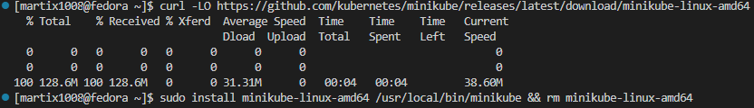

Konfiguracja polecenia `kubectl`:

```
echo "alias minikubctl='minikube kubectl --'" >> ~/.bashrc
source ~/.bashrc
```

Uruchomienie Kubernetes. Wskazano driver dockera, dzięki czemu utworzono maszynę wirtualną wewnątrz kontenera Docker. Należało przydzielić maszynie wirtualnej (Fedora) minimum 2 CPU, ponieważ są to minimalne wymagania do uruchomienia kubernetesa (kubernetes w tym przypadku używa 2 CPUs i 3GB ramu).

```bash
minikube start --driver=docker

minikubctl get nodes
minikube status
```

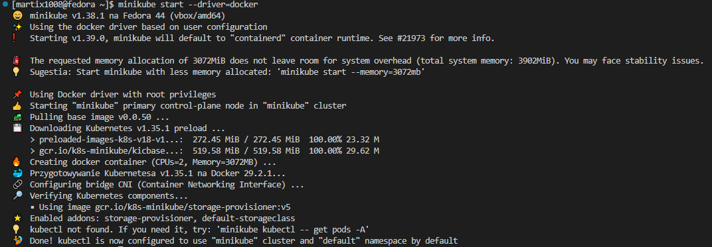
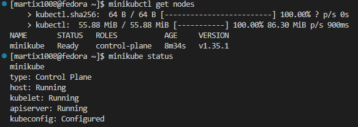

Uruchomienie dashboardu. Dzięki połączeniu ssh można było go uruchomić na maszynie hosta (Windows10).

```bash
minikube dashboard
```

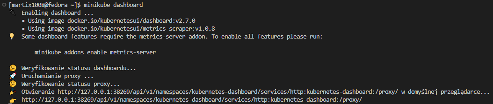
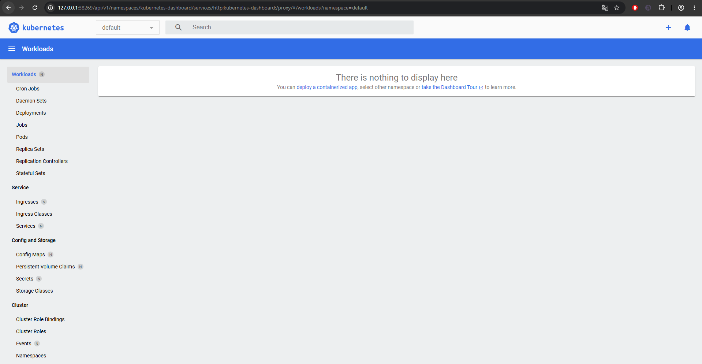

## Analiza posiadanego kontenera:

Poprzednia aplikacja utworzona w skutek pipeline nie nadaje się do tego zadania, gdyż po przejściu wszystkich testów od razu kończy działanie. W takim wypadku stoworzono prostą aplikację w Node.js nasłuchującą na porcie 8080, która uruchamia serwer WWW i wyświetla "Hello World".

```js
const http = require('http');

const PORT = 8080;

const server = http.createServer((req, res) => {
  res.writeHead(200, { 'Content-Type': 'text/plain; charset=utf-8' });
  res.end('Hello World\n');
});

server.listen(PORT, () => {
  console.log(`Serwer uruchomiony i nasłuchuje na porcie ${PORT}`);
});
```

Stworzono odpowiedni Dockerfile:

```dockerfile
FROM node:20-alpine

WORKDIR /app

COPY server.js .

EXPOSE 8080

CMD ["node", "server.js"]
```

Zbudowano obraz:

```bash
docker build -t hello-node:1.0 .
```

Testowe uruchomienie kontenera:

```bash
docker run -d -p 8080:8080 --name aplikacja hello-node:1.0
docker ps
curl http://localhost:8080
```

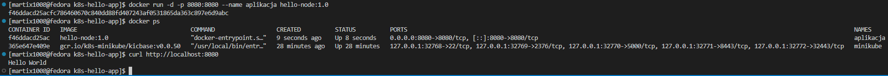

Przekazano obraz do minikube:

```bash
minikube image load hello-node:1.0
minikube image ls
```

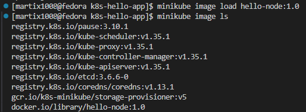

## Uruchamianie oprogramowania:

Uruchomienie poda i sprawdzenie działania:

```bash
minikubctl run hello-pod --image=hello-node:1.0 --port=8080 --labels app=hello-pod --image-pull-policy=Never

minikubctl get pods
minikubctl logs hello-pod
```

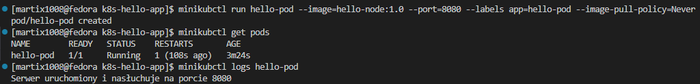
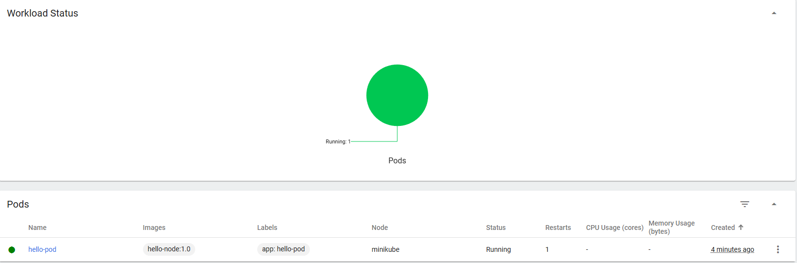

Wyprowadzenie portu i sprawdzenie działania:

```bash
minikubctl port-forward pod/hello-pod 8080:8080

#Osobny terminal:
curl http://localhost:8080
```

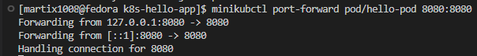


## Przekucie wdrożenia manualnego w plik wdrożenia:

Utworzenie pliku `deployment.yaml`:

```yaml
apiVersion: apps/v1
kind: Deployment
metadata:
  name: nginx-deployment
  labels:
    app: nginx

spec:
  replicas: 4
  
  selector:
    matchLabels:
      app: nginx
  
  template:
    metadata:
      labels:
        app: nginx
    
    spec:
      containers:
      - name: nginx
        image: nginx:alpine
        ports:
        - containerPort: 80
```

Wdrożenie:

```bash
minikubctl apply -f deployment.yaml
```

Zbadanie stanu wdrożenia:

```bash
minikubctl rollout status deployment/nginx-deployment
```

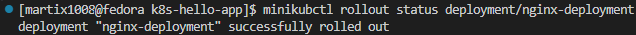

```bash
minikubctl get deployments
minikubctl get pods -l app=nginx
```

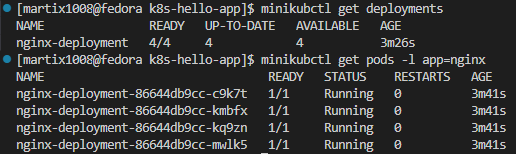

Wyeksponowanie wdrożenia jako Serwis i przekierowanie portu:

```bash
minikubctl expose deployment nginx-deployment --type=ClusterIP --name=nginx-service --port=80

minikubctl get service nginx-service

minikubctl port-forward service/nginx-service 8080:80

curl http://localhost:8080
```

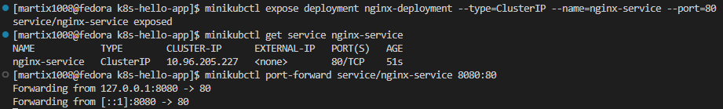
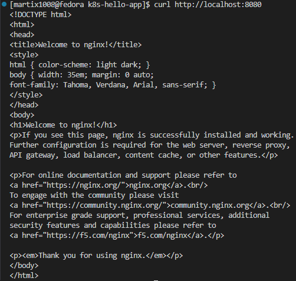