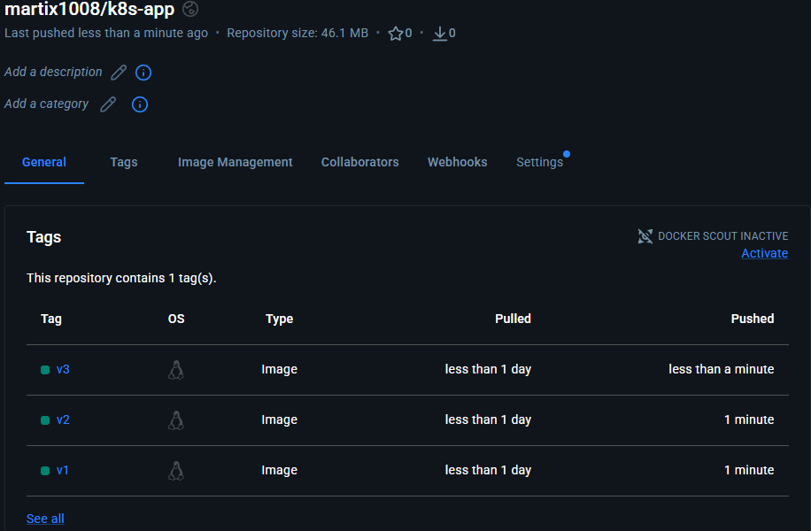
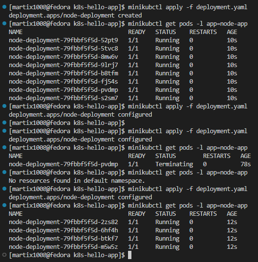
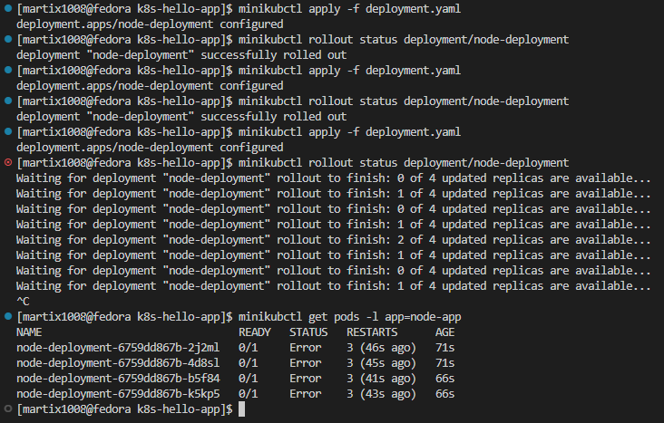
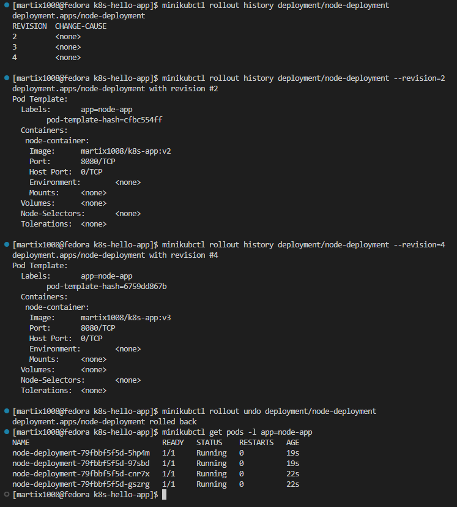
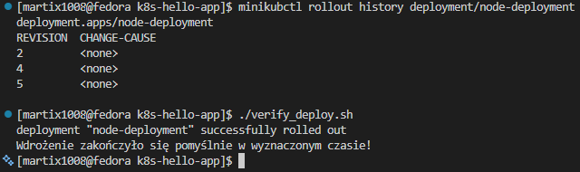
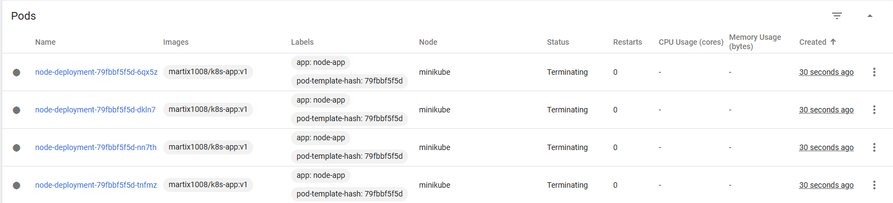
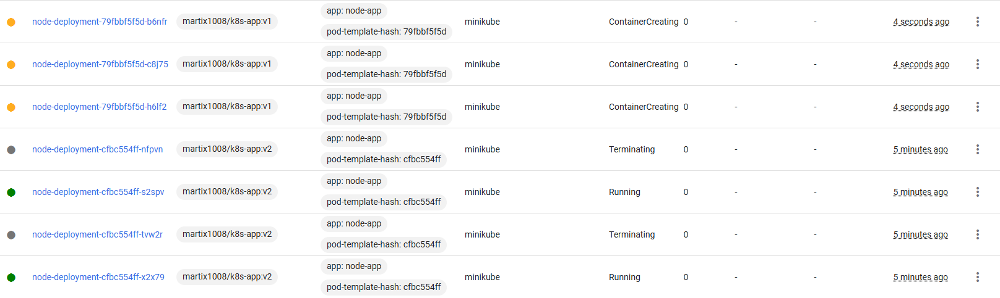
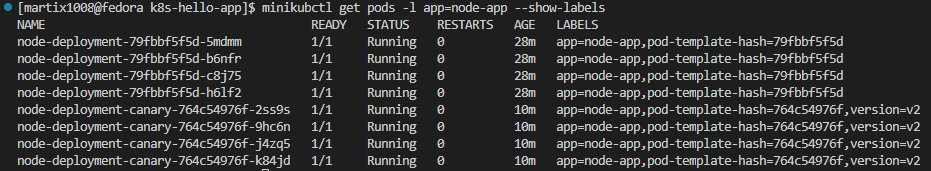

# Sprawozdanie - Lab11

## Przygotowanie nowego obrazu:

W celu wykonania tego kroku utworzono trzy wersje obrazu:
- v1 - opracowana na poprzednich zajęciach,
- v2 - nowa, zmodyfikowana wersja (inny napis w console.log),
- v3 - wadliwa wersja (wyjście programu za pomocą `process.exit(1)`).

Następnie zbudowano obrazy za pomocą poleceń:

```bash
docker build -t martix1008/k8s-app:v1 .
docker build -t martix1008/k8s-app:v2 .
docker build -t martix1008/k8s-app:v3 .
```

i użyto `docker push` aby wypchać kontenery na dockerhub.



## Zmiany w deploymencie:

Aktualizowano plik YAML w następujący sposób:
- zwiększenie replik do 8,
- zmniejszenie liczby replik do 1,
- zmniejszenie liczby replik do 0,
- ponowne przeskalowanie w górę do 4 replik.

Zmiany zastosowywano za pomocą polecenia:

```bash
minikubctl apply -f deployment.yaml
minikubctl get pods -l app=node-app
```



W kolejnych krokach zmieniano wersję aplikacji na te przygotowane wcześniej (podmiana wersji w `image: martix1008/k8s-app:v2`):



Po wdrożeniu wadliwej aplikacji sprawdzono listę wszystkich dotychczasowych wydań:

```bash
minikubctl rollout history deployment/node-deployment
```

oraz szczegóły konkretnych rewizji (wersja v2 i v3):

```bash
minikubctl rollout history deployment/node-deployment --revision=2
minikubctl rollout history deployment/node-deployment --revision=4
```

aby wycofać wadliwe wdrożenie użyto polecenia:

```bash
minikubctl rollout undo deployment/node-deployment
```



## Kontrola wdrożenia:

Stworzono prosty skrypt `verify_deploy.sh`, który sprawdza, czy wdrożenie zdążyło się wykonać w 60 sekund. Skrypt kończy działanie z kodem błędu, jeżeli wdrożenie nie zdążyło się wykonać poprawnie w wyznaczonym czasie.

```bash
#!/bin/bash

DEPLOYMENT_NAME="node-deployment"
TIMEOUT_SECONDS=60

if timeout ${TIMEOUT_SECONDS} minikube kubectl -- rollout status deployment/${DEPLOYMENT_NAME}; then
    echo "Wdrożenie zakończyło się pomyślnie w wyznaczonym czasie!"
    exit 0
else
    echo "Wdrożenie przekroczyło limit czasu ${TIMEOUT_SECONDS} sekund lub uległo awarii!"
    exit 1
fi
```



## Strategie wdrożenia:

Przygotowano różne wersje stosująć następujące strategie wdrożeń:

### Recreate - najpierw kończy działanie wszystkich starych podów, a dopiero potem tworzy nowe. Powoduje przerwę w działaniu aplikacji.

```yaml
apiVersion: apps/v1
kind: Deployment
metadata:
  name: node-deployment
  labels:
    app: node-app

spec:
  replicas: 4
  strategy:
    type: Recreate
  
  selector:
    matchLabels:
      app: node-app
  
  template:
    metadata:
      labels:
        app: node-app
    
    spec:
      containers:
      - name: node-container
        image: martix1008/k8s-app:v1
        ports:
        - containerPort: 8080
```

Diałanie można zobaczyć na zdjęciu poniżej (status `Terminating`):



### Rolling Update - domyślna strategia. Następuje podmiana podów jeden po drugim.

Ustawiono odpowiednie parametry, aby kontrolować płynne przejęcie ruchu. Na zdjęciu poniżej można zobaczyć trzy różne stany podów (ContainerCreating, Running, Terminating).

```yaml
apiVersion: apps/v1
kind: Deployment
metadata:
  name: node-deployment
  labels:
    app: node-app

spec:
  replicas: 4
  strategy:
    type: RollingUpdate
    rollingUpdate:
      maxUnavailable: 2
      maxSurge: 25%
  
  selector:
    matchLabels:
      app: node-app
  
  template:
    metadata:
      labels:
        app: node-app
    
    spec:
      containers:
      - name: node-container
        image: martix1008/k8s-app:v1
        ports:
        - containerPort: 8080
```



### Canary - polega na uruchomieniu dwóch oddzielnych wdrożeń i sterowaniu ruchu za pomocą etykiet w Serwisie.

```yaml
apiVersion: apps/v1
kind: Deployment
metadata:
  name: node-deployment-canary
  labels:
    app: node-app

spec:
  replicas: 4
  
  selector:
    matchLabels:
      app: node-app
  
  template:
    metadata:
      labels:
        app: node-app
        version: v2
    spec:
      containers:
      - name: node-container
        image: martix1008/k8s-app:v2
        ports:
        - containerPort: 8080
```

Utworzono również serwis przekierowywujący ruch:

```yaml
apiVersion: v1
kind: Service
metadata:
  name: node-service
spec:
  selector:
    app: node-app
  ports:
    - protocol: TCP
      port: 80
      targetPort: 8080
```

