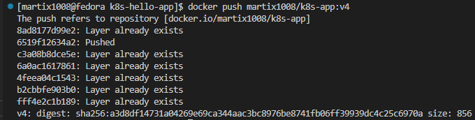
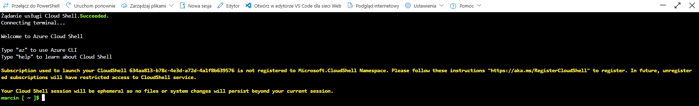
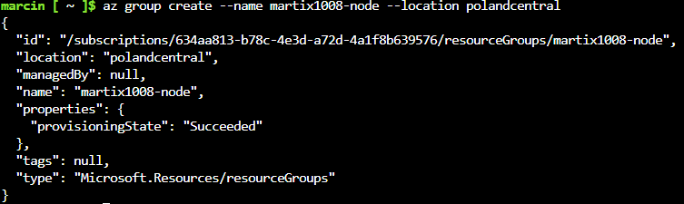
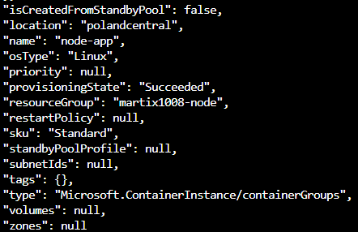
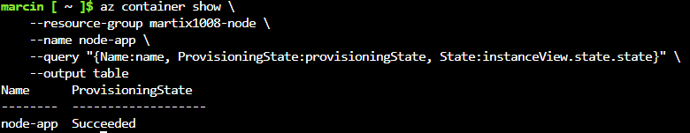
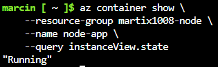
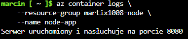
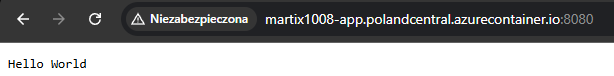
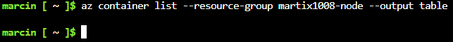
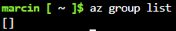

# Sprawozdanie - Lab12

## Przygotowanie obrazu:

Dla celów tego zadania, przygotowano nowy obraz aplikacji i otagowano go wersją `v4`. Następnie wypchnięto go na `dockerhub`:



## Konfiguracja Azure:

Zalogowano się do Azure i uruchomiono Azure Cloud Shell w trybie Bash.



Zarejestrowano dostawcę `Microsoft.ContainerInstance`, gdyż usługa ta nie była domyślnie aktywna

```bash
az provider register --namespace Microsoft.ContainerInstance
```

Stworzono grupę zasobów `martix1008-node`:

```bash
az group create --name martix1008-node --location polandcentral
```



## Wdrożenie kontenera:

Kontener wdrożono przy użyciu poniższego polecenia. Z powodu problemów należało również podać system operacyjny oraz limity zasobów:

```bash
az container create \
    --resource-group martix1008-node \
    --name node-app \
    --image martix1008/k8s-app:v4 \
    --cpu 1 \
    --memory 1 \
    --ports 8080 \
    --dns-name-label martix1008-app \
    --location polandcentral \
    --os-type Linux
```



## Weryfikacja działania oraz logi:

Po zakończeniu wdrażania sprawdzono działanie kontenera oraz jego logi:

```bash
az container show \
    --resource-group martix1008-node \
    --name node-app \
    --query "{Name:name, ProvisioningState:provisioningState, State:instanceView.state.state}" \
    --output table

az container show \
    --resource-group martix1008-node \
    --name node-app \
    --query instanceView.state
```





```bash
az container logs \
    --resource-group martix1008-node \
    --name node-app
```



Sprawdzono również dostęp do serwowanej usługi HTTP (serwowany przez publiczny adres FQDN `http://martix1008-app.polandcentral.azurecontainer.io`):



## Sprzątanie zasobów:

Na koniec usunięto kontener oraz grupę zasobów:

```bash
az container delete \
    --resource-group martix1008-node \
    --name node-app \
    --yes

az container list --resource-group martix1008-node --output table
```



```bash
az group delete --name martix1008-node --yes --no-wait

az group list
```

