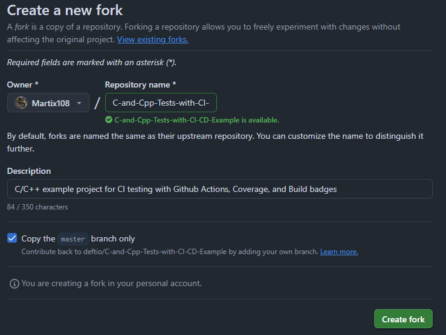
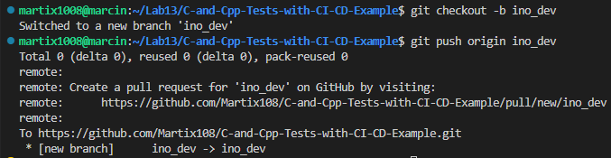
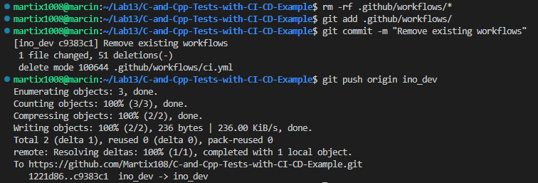
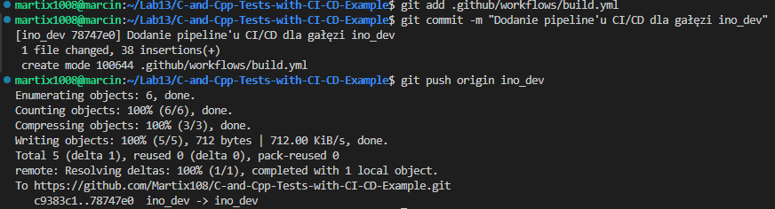
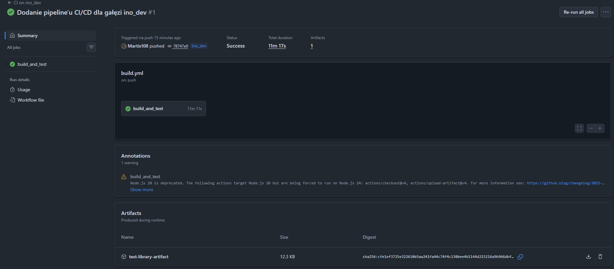
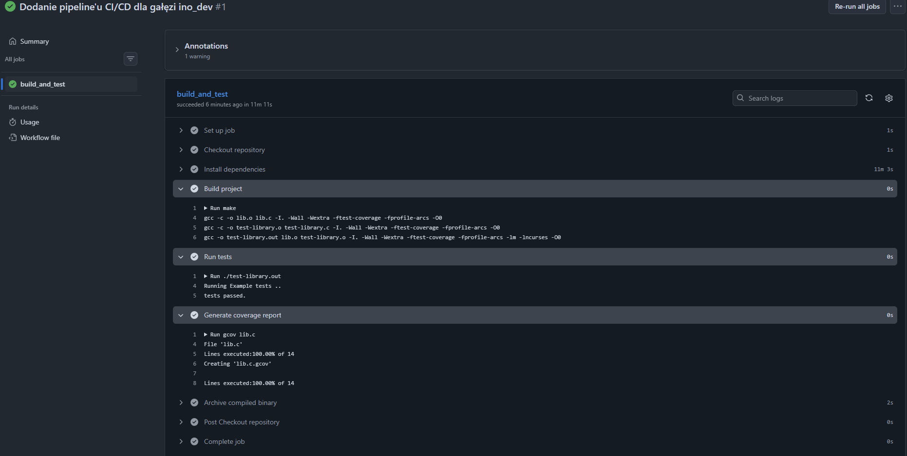

# Sprawozdanie - Lab13

## Wstęp:

Na początku zajęć zapoznano się z koncepcją `GitHub Actions` i zwrócono uwagę na trigger dla tworzonych akcji. Zapoznano się również z cennikiem oraz z limitami jakie posiada plan GitHub Free.

## Fork repozytorium:

Dla celów tego zadania wybrano repozytorium [C-and-Cpp-Tests-with-CI-CD-Example](https://github.com/deftio/C-and-Cpp-Tests-with-CI-CD-Example).

Sforkowano wymieniowe wyżej repozytorium:



## Przygotowanie:

Utworzono dedykowaną gałąź `ino_dev`, do definiowania workflow:

```bash
git checkout -b ino_dev
git push origin ino_dev
```



Usunięto obecne już w projekcie workflows:

```bash
rm -rf .github/workflows/*
git add .github/workflows/
git commit -m "Remove existing workflows"
git push origin ino_dev
```



## Definicja akcji:

Utworzono własną akcję `build.yml`, która reaguje na zdarzenie `push` oraz `pull_request`. W pliku znajduje się job `build_and_test` uruchamiany na `ubuntu-latest`, który składa się z kroków:
- `Checkout repository` - pobranie kodu,
- `Install dependencies` - instalacja zależności,
- `Build project` - kompilacja projektu,
- `Run tests` - uruchomienie testów,
- `Generate coverage report` - wygenerowanie raportu pokrycia,
- `Archive compiled binary` - archiwizacja zbudowanego artefaktu.

```yaml
name: CI on ino_dev

on:
  push:
    branches: [ ino_dev ]
  pull_request:
    branches: [ ino_dev ]

jobs:
  build_and_test:
    runs-on: ubuntu-latest

    steps:
    - name: Checkout repository
      uses: actions/checkout@v4

    - name: Install dependencies
      run: |
        sudo apt-get update
        sudo apt-get install -y gcc lcov libncurses5-dev

    - name: Build project
      run: |
        make

    - name: Run tests
      run: |
        ./test-library.out

    - name: Generate coverage report
      run: |
        gcov lib.c

    - name: Archive compiled binary
      uses: actions/upload-artifact@v4
      with:
        name: test-library-artifact
        path: ./test-library.out
```

Na koniec wypchnięto zmiany:



## Weryfikacja:

Po wypchnięciu zmian zweryfikowano, czy wybrany program buduje się wewnątrz akcji. Tak jak zakładano, workflow automatycznie uruchomiło się po pushu na gałąź ino_dev. Całość trwała 11m 11s (samo instalowanie dependencji (update) trwało 11 minut 3 sekundy). Na końcu poprawnie został opublikowany artefakt z całego procesu.


