# Sprawozdanie - Lab 2

## 1. Instalacja Docker w systemie linuksowym

```bash
sudo apt update
sudo apt install docker.io
sudo usermod -aG docker $USER
newgrp docker
docker --version
```

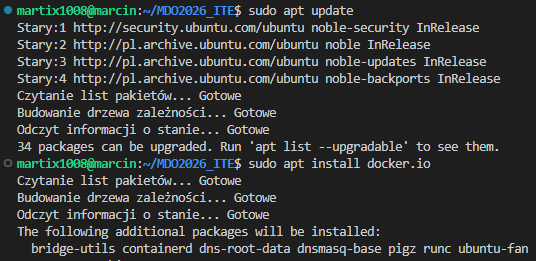
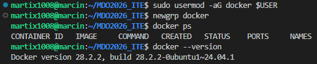


## 2. Rejestracja w Docker Hub

```bash
docker login
```

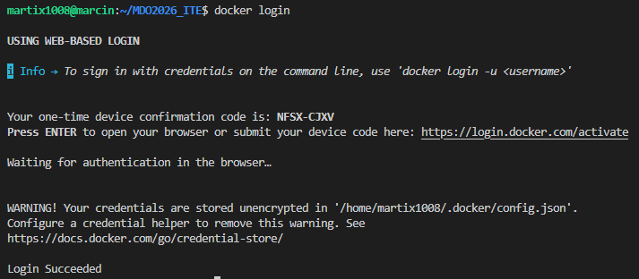
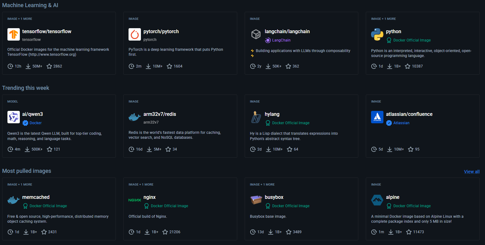


## 3. Zapoznanie z obrazami (uruchomienie, sprawdzenie rozmiaru i kodu wyjścia)

### a) hello-world

```bash
docker pull hello-world
docker run hello-world
docker images
docker ps -a
```

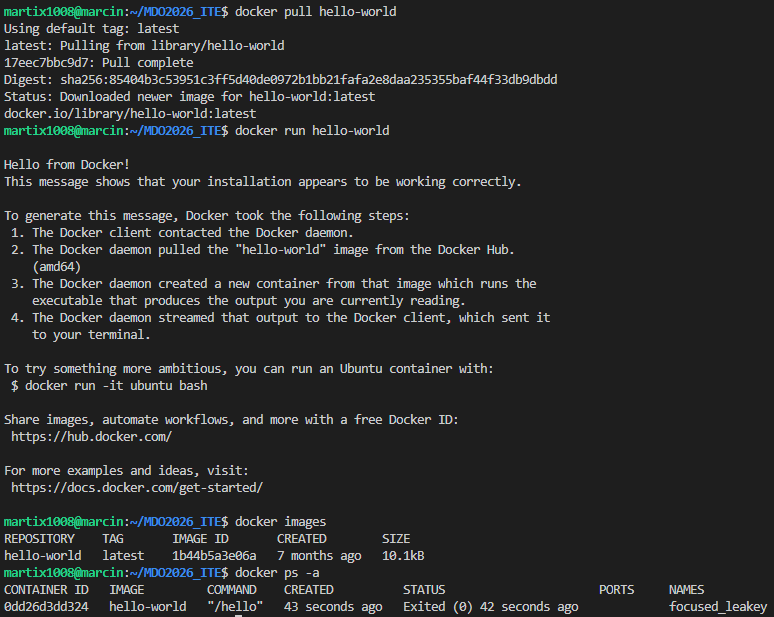

### b) busybox

```bash
docker pull busybox
docker run busybox echo "Hello World"
docker images | grep busybox
docker ps -a | grep busybox
```

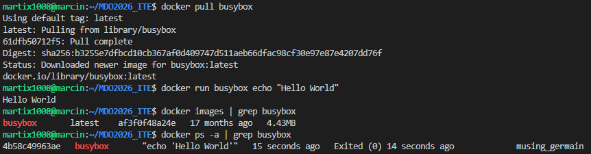

### c) ubuntu

```bash
docker pull ubuntu
docker run ubuntu echo "Hello World"
docker images | grep ubuntu
docker ps -a | grep ubuntu
```

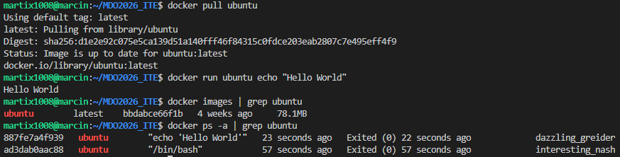

### d) mariadb

```bash
docker pull mariadb
docker run mariadb
docker images | grep mariadb
docker ps -a | grep mariadb
```

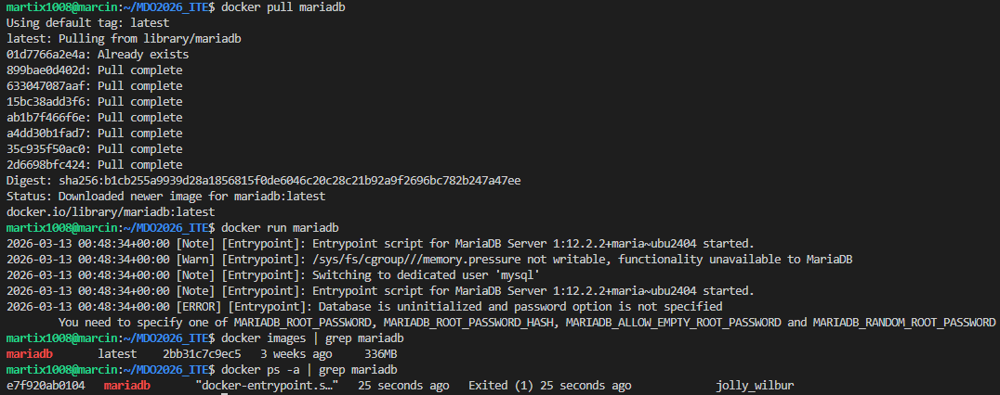

### e) runtime

```bash
docker pull mcr.microsoft.com/dotnet/runtime
docker run mcr.microsoft.com/dotnet/runtime
docker images | grep runtime
docker ps -a | grep runtime
```

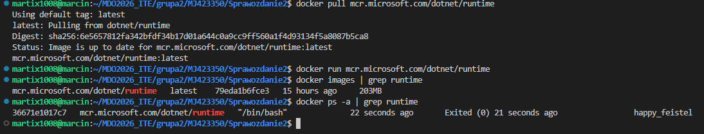

### f) aspnet

```bash
docker pull mcr.microsoft.com/dotnet/aspnet
docker run mcr.microsoft.com/dotnet/aspnet
docker images | grep aspnet
docker ps -a | grep aspnet
```

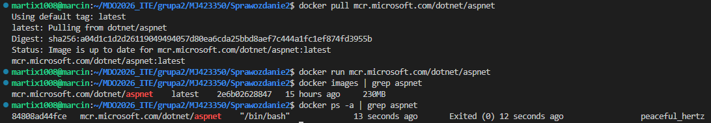

### g) sdk

```bash
docker pull mcr.microsoft.com/dotnet/sdk
docker run mcr.microsoft.com/dotnet/sdk
docker images | grep sdk
docker ps -a | grep sdk
```

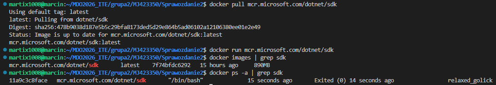


## 4. Uruchomienie konteneru z obrazu busybox

```bash
docker run -it busybox sh
busybox
exit
```

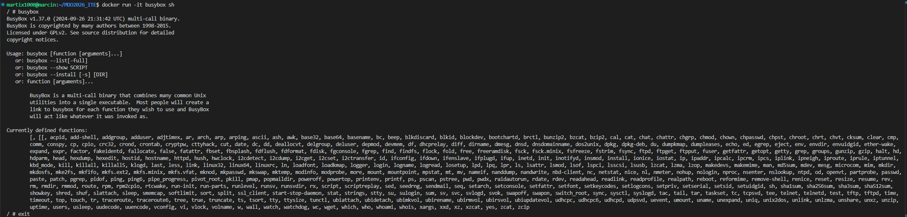

## 5. Uruchomienie "systemu w kontenerze"

Polecenia do uruchomienia w kontenerze:
```bash
docker run -it ubuntu bash
ps aux
apt update
exit
```

Polecenia do uruchomienia na hoście:
```bash
docker ps
ps aux | grep docker
```

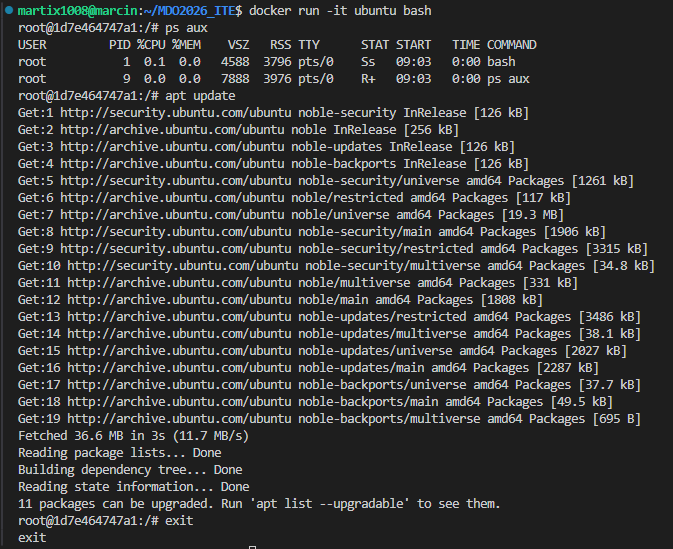
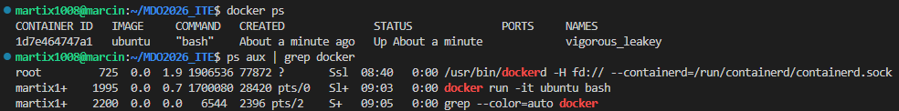

## 6. Plik Dockerfile

```dockerfile
FROM ubuntu:24.04

RUN apt-get update \
    && apt-get install -y git \
    && rm -rf /var/lib/apt/lists/*

WORKDIR /devops

RUN git clone https://github.com/InzynieriaOprogramowaniaAGH/MDO2026_ITE.git

CMD ["bash"]
```

```bash
docker build --no-cache -t devops .
docker run -it devops bash
ls
exit
```

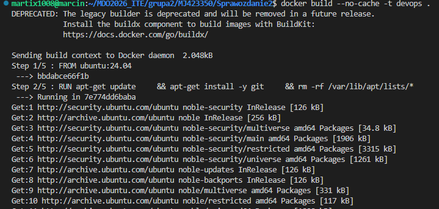
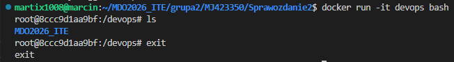

## 7. Uruchomione kontenery i czyszczenie zakończonych

```bash
docker ps -a
docker container prune
```

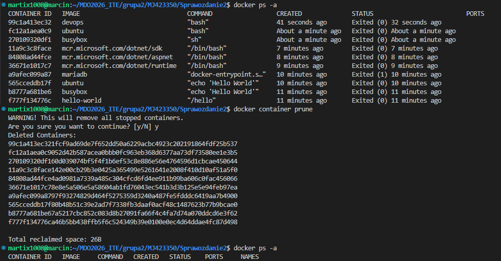

## 8. Czyszczenie obrazów przechowywanych w lokalnym magazynie

```bash
docker images
docker image prune
```

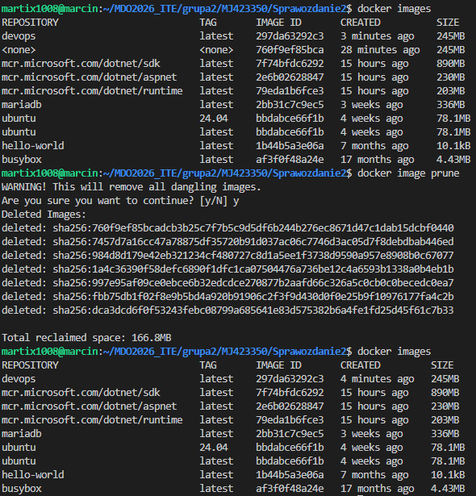