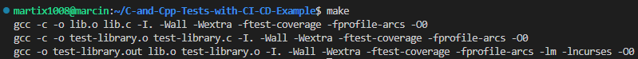
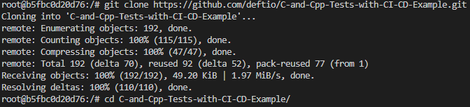
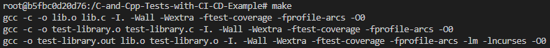
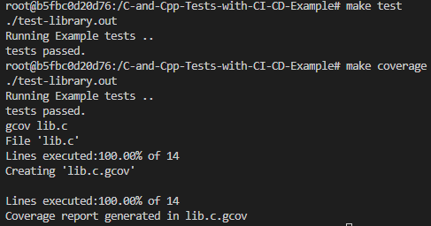
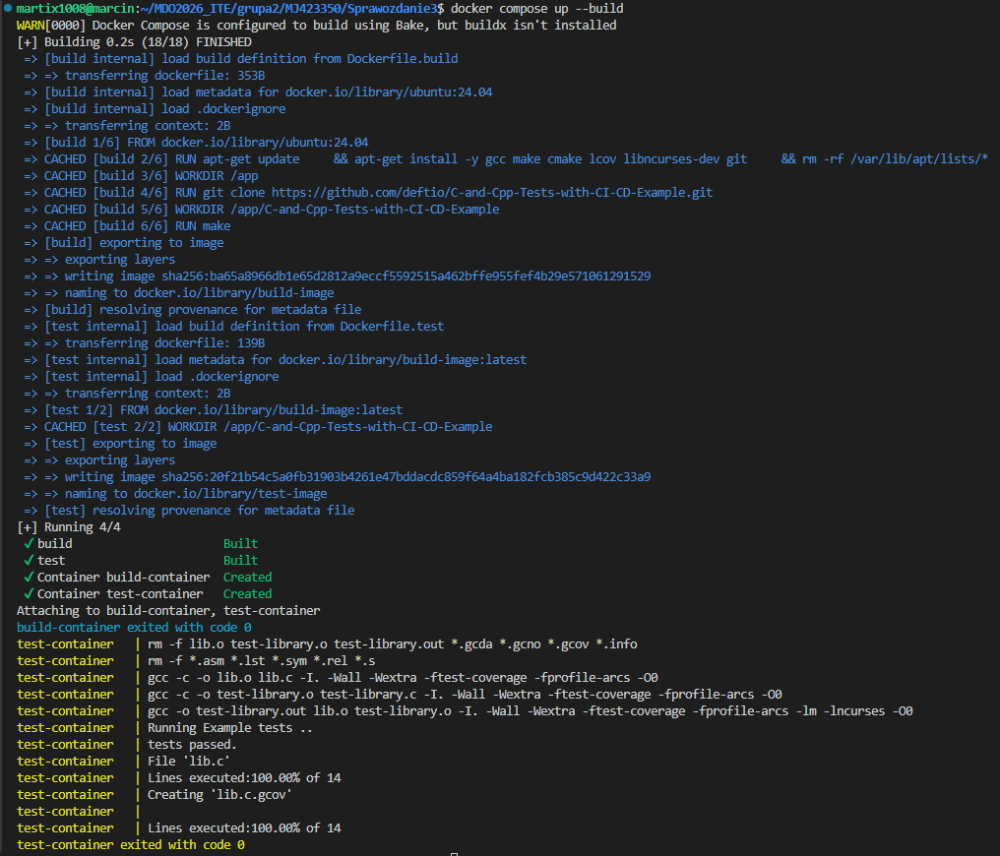

# Sprawozdanie - Lab 3


## 1. Wybór oprogramowania

Do przeprowadzenia zajęć wykorzystano repozytorium: https://github.com/deftio/C-and-Cpp-Tests-with-CI-CD-Example/tree/master?tab=readme-ov-file

Repozytorium to jest na licencji: `BSD 2-Clause`.

Ponieważ polecenie `make` nie chciało się na początku wykonać - otrzymywało się poniższy błąd:

```bash
gcc -c -o lib.o lib.c -I. -Wall -Wextra -ftest-coverage -fprofile-arcs -O0
make: gcc: No such file or directory
make: *** [makefile:30: lib.o] Error 127
```

zainstalowano odpowiednie pakiety poleceniem (polecenie to można było znaleźć w README repozytorium w sekcji platform installation - dodatkowo do tego należało zainstalować bibliotekę `ncurses`):

```bash
sudo apt install gcc make cmake lcov libncurses-dev
```

Ostatecznie można było przeprowadzić build programu - polecenie `make`.



Przeprowadzono również testy za pomocą polecenia:

```bash
make test
```

lub:

```bash
./run_coverage_test.sh
```


---
## 2. Build w kontenerze

Do wykonania tego zadania wykorzystano obraz kontenera `ubuntu` - pobrany z poprzednich zajęć.

Kontener uruchomiono za pomocą polecenia:

```bash
docker run -it ubuntu bash
```

Podobnie jak wcześniej zaopatrzono kontener w wymagania wstępne za pomocą:

```bash
apt update
apt install gcc make cmake lcov libncurses-dev
```

Następnie sklonowano repozytorium, skonfigurowano środowisko, wykonano build i uruchomiono testy.







---
## 3. Pliki Dockerfile

Stworzono dwa pliki `Dockerfile`, gdzie
- Kontener pierwszy przeprowadza wszystkie kroki aż do builda

```dockerfile
FROM ubuntu:24.04

RUN apt-get update \
    && apt-get install -y gcc make cmake lcov libncurses-dev git \
    && rm -rf /var/lib/apt/lists/*

WORKDIR /app

RUN git clone https://github.com/deftio/C-and-Cpp-Tests-with-CI-CD-Example.git

WORKDIR /app/C-and-Cpp-Tests-with-CI-CD-Example

RUN make

CMD ["bash"]
```

- Kontener drugi bazuje na pierwszym i wykonuje testy

```dockerfile
FROM build-image

WORKDIR /app/C-and-Cpp-Tests-with-CI-CD-Example

CMD ["./run_coverage_test.sh"]
```

Następnie zbudowano obrazy:

```bash
docker build -f Dockerfile.build -t build-image .
docker build -f Dockerfile.test -t test-image .
```

Poniżej można zobaczyć poprawnie pracujący kontener:

```bash
docker run test-image
```


---
## 4. Docker Compose

W celu wykonania tego zadania pobrano nowszą wersje docker compose poleceniem:

```bash
sudo apt install docker-compose-v2
```

Poniżej można zobaczyć całą zawartość pliku `docker-compose.yml`:

```yaml
services:
  build:
    build:
      context: .
      dockerfile: Dockerfile.build
    image: build-image
    container_name: build-container

  test:
    build:
      context: .
      dockerfile: Dockerfile.test
    image: test-image
    container_name: test-container
    depends_on:
      - build
```

Następnie uruchomiono tworzenie kontenerów wraz z wymuszeniem ponownego zbudowania obrazów:

```bash
docker compose up --build
```



---
## 5. Dyskusja

Projekt ten nie jest typową aplikacją produkcyjną, dlatego kontenery najlepiej wykorzystać do procesu budowania i testowania. W tym wypadku finalnym artefaktem powinien być skompilowany program albo pakiet systemowy, a nie cały kontener. Jeżeli byśmy chcieli wdrożyć ten projekt jako kontener to należało by usunąć zbędne elementy (takie jak narzędzia build) lub zastosować osobny etap - na przykład przez dodatkowy Dockerfile.