# Sprawozdanie - Lab 4

## 1. Zachowywanie stanu między kontenerami

### a) Klonowanie z zewnątrz kontenera

Do wykonania tego zadania użyto bind mount, gdyż repozytorium to zostało już sklonowane wcześniej na hoście, a dzięki tej metodzie mamy możliwość udostępnić katalog z hosta bezpośrednio w kontenerze.

Utowrzono woluminy:
```bash
docker volume create input-volume
docker volume create output-volume
```

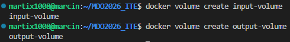

Podłączono wszystko do kontenera:
```bash
docker run -it \
  -v input-volume:/input \
  -v output-volume:/output \
  -v /home/martix1008/C-and-Cpp-Tests-with-CI-CD-Example:/input/code \
  ubuntu bash
```

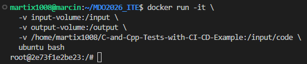

Zainstalowano niezbędne wymagania wstępne:

```bash
apt update
apt install -y gcc make cmake lcov libncurses-dev
```
Uruchomiono build w kontenerze

```
cd /input/code
./run-coverage_test.sh
```

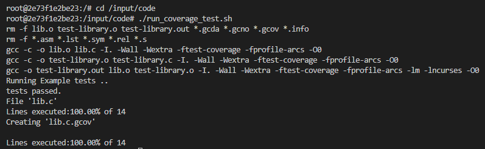

Zapisano wyniki na wolumin wyjściowy a następnie sprawdzono ich dostępność po wyłączeniu kontenera:

```bash
cp -r * /output/
```

```bash
docker run -it -v output-volume:/output ubuntu bash
ls /output/
```

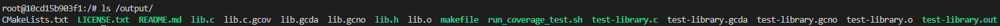

### b) Klonowanie wewnątrz kontenera:

Uruchomiono kontener z dostępem do wolumina:

```bash
docker run -it \
  -v input-volume:/input \
  -v output-volume:/output \
  ubuntu bash
```

```bash
apt update
apt install -y gcc make cmake lcov libncurses-dev git
cd /input/
git clone https://github.com/deftio/C-and-Cpp-Tests-with-CI-CD-Example.git
cd C-and-Cpp-Tests-with-CI-CD-Example/
./run_coverage_test.sh
cp -r * /output/
```

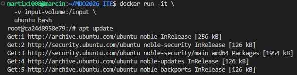

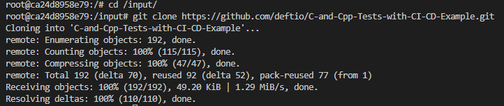

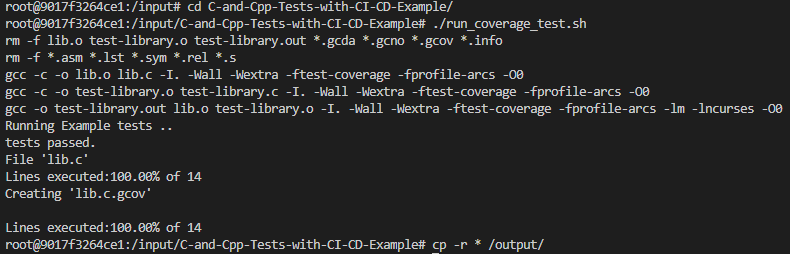

### 3) Możliwość wykonania za pomocą dockerfile

Kroki te można zautomatyzować w pliku Dockerfile przy użyciu instrukcji `RUN --mount`. Pozwala ona na tymczasowe połączenie danych tylko na czas wykonywania kroku build, bez zapisywania ich w finalnym obrazie.

---
## 2. Eksponowanie portu i łączność między kontenerami:

### a) Iperf:

Server:

```bash
docker run -it --name iperf-server ubuntu bash
apt update
apt install -y iperf3
iperf3 -s
```

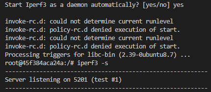

Sprawdzenie adresu IP:

```bash
docker inspect iperf-server
```

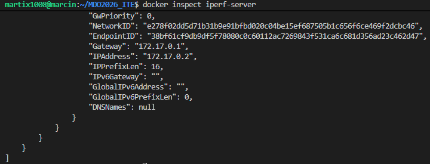

Klient:

```bash
docker run -it --name iperf-client ubuntu bash
apt update
apt install -y iperf3
iperf3 -c 172.17.0.2
```

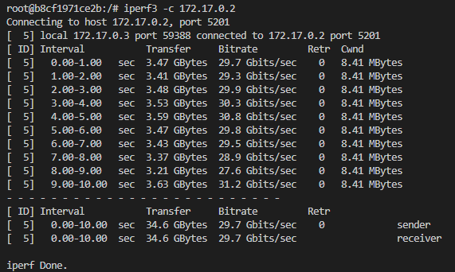

### b) Dedykowana sieć mostkowa

```bash
docker network create iperf-network
```

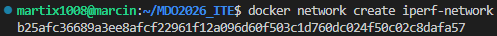

Server:

```bash
docker run -it --name iperf-server \
  --network iperf-network \
  ubuntu bash
```

```bash
apt update
apt install -y iperf3
iperf3 -s
```

Klient:

```bash
docker run -it --name iperf-client \
  --network iperf-network \
  ubuntu bash
```

```bash
apt update
apt install -y iperf3
iperf3 -c iperf-server
```

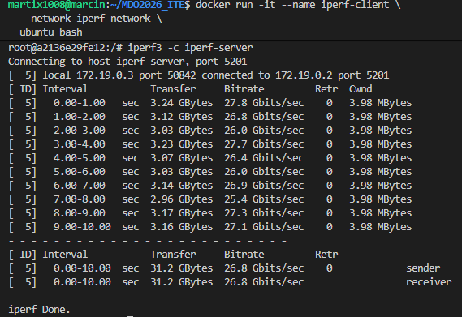

### c) Połączenie spoza kontenera:

Aby umożliwić połączenie z serwerem iperf spoza kontenerów należało opublikować port przy uruchamianiu kontenera `-p 5201:5201`.

```bash
docker run -it --name iperf-server \
  --network iperf-network \
  -p 5201:5201 \
  ubuntu bash \
  -c "apt update && apt install -y iperf3 && iperf3 -s"
```

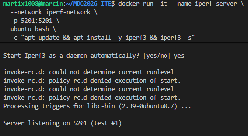

Host:

```bash
iperf3 -c localhost
```

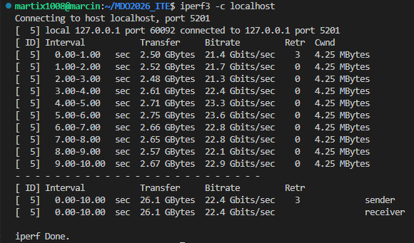

Spoza Hosta nie udało się połączyć gdyż adres IP `10.0.2.15` jest w tym wypadku wewnętrzny dla maszyny wirtualnej (należy do sieci NAT) i należałoby zmienić ustawienia sieci (w tym wypadku w VirtualBox).

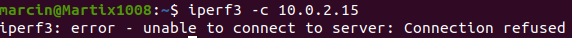

---
## 3. Usługi w rozumieniu systemu, kontenera i klastra

Zestawienie usługi SSHD

```bash
docker run -it -p 2222:22 ubuntu bash
apt update
apt install -y openssh-server
#Ustawienie nowego hasła za pomocą passwd oraz pozwolenie na logowanie rootem
sed -i 's/#PermitRootLogin prohibit-password/PermitRootLogin yes/' /etc/ssh/sshd_config
/usr/sbin/sshd
```

Podczas uruchamiania usługi SSH w kontenerze konieczne było ręczne utworzenie katalogu /run/sshd ponieważ kontener nie posiada pełnego systemu init, który normalnie utoworzyłby takie katalogi automatycznie.

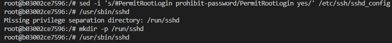

```bash
ssh root@localhost -p 2222
```

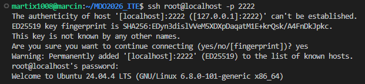

Dzięki SSH możemy zdalnie połączyć się z kontenerem (np. do debugowania), ale ma to też spore wady, gdyż dokładamy dodatkowy proces (zwięszenie zużycia zasobów) i zwiększamy szansę na atak.

---
## 4. Przygotowanie do uruchomienia serwera Jenkins

```bash
docker network create jenkins
```

```bash
docker run -d \
  --name dind \
  --network jenkins \
  --privileged \
  docker:dind
```

```bash
docker run -d \
  --name jenkins \
  --network jenkins \
  -p 8080:8080 \
  -p 50000:50000 \
  -e DOCKER_HOST=tcp://dind:2375 \
  jenkins/jenkins:lts
```

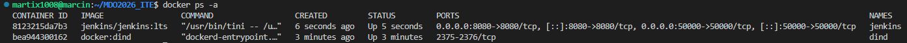

```bash
http://localhost:8080
```

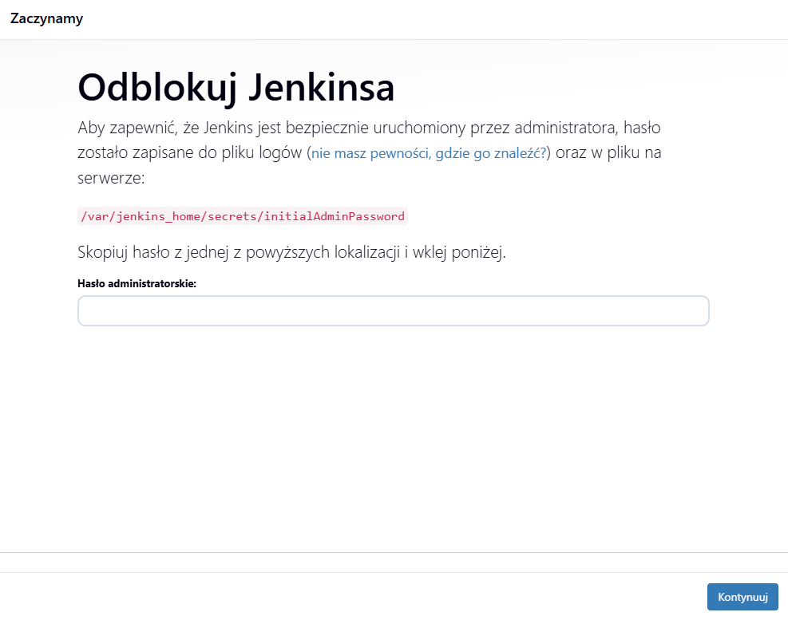

```bash
docker exec jenkins cat /var/jenkins_home/secrets/initialAdminPassword
```

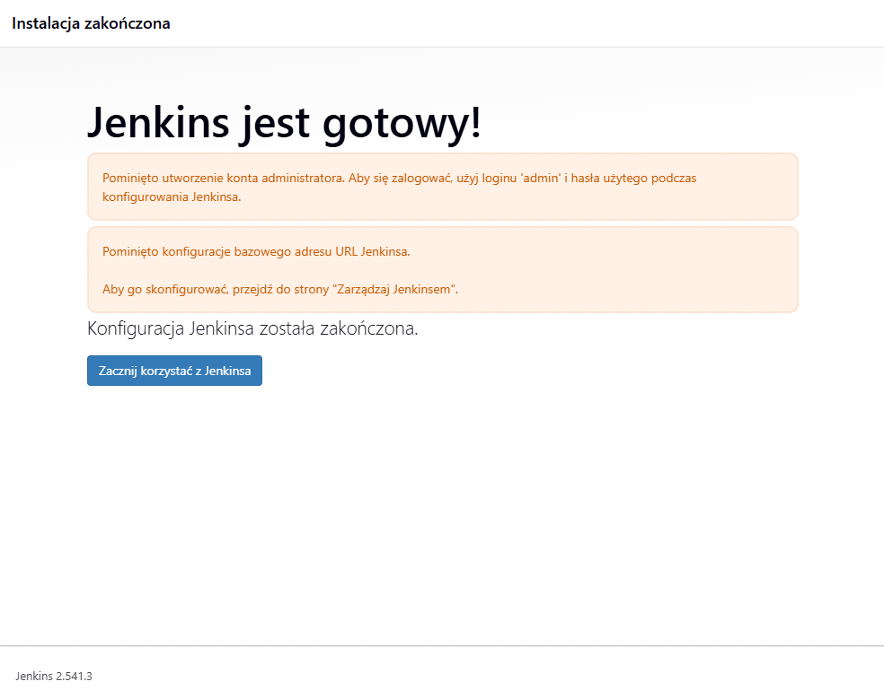