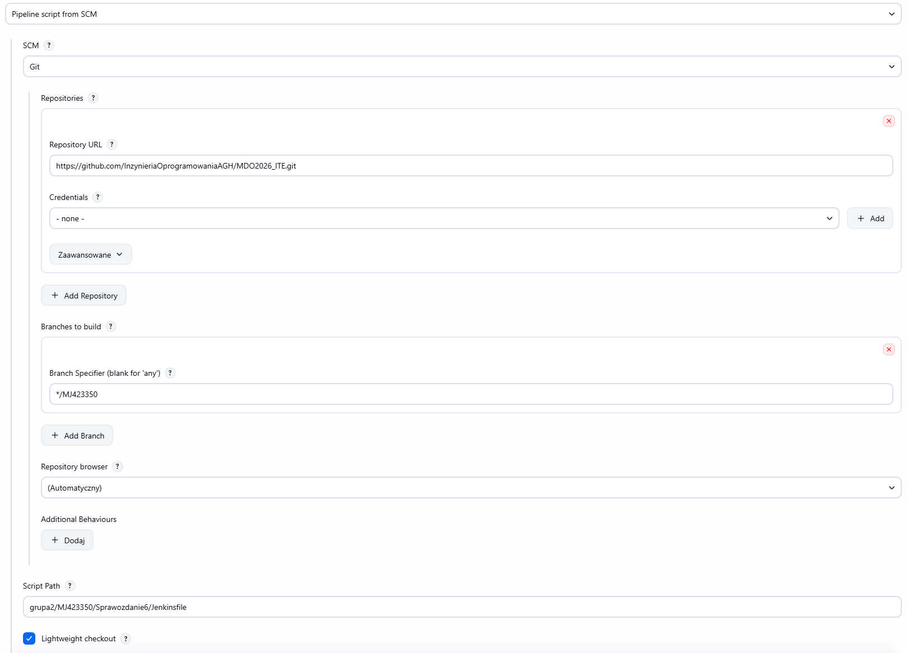
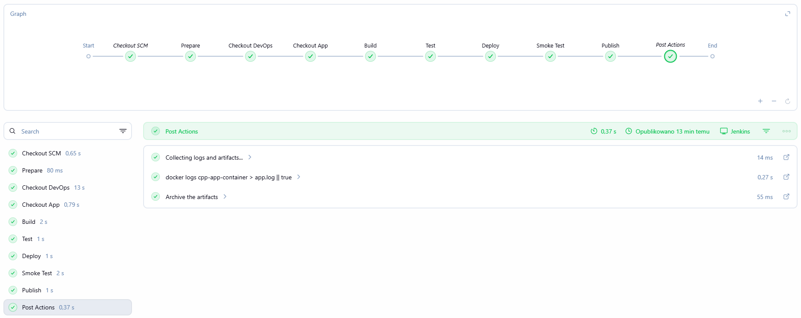
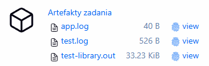
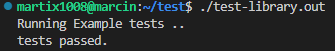

# Sprawozdanie zbiorcze

## Laboratorium 5:

### Przygotowanie infrastruktury:

- W ramach zajęć wdrożono Jenkinsa w architekturze Docker-in-Docker (DinD) z wykorzystaniem dedykowanej sieci `jenkins`.
- Przygotowano własny obraz Jenkinsa na bazie `jenkins/jenkins:lts-jdk17` wraz z doinstalowaną wtyczką BlueOcean.
- Zadbano o archiwizację oraz zabezpieczenie logów poprzez montowanie wolumenu `jenkins-home`.
- Skonfigurowano komunikację między kontenerami za pomocą zmiennej środowiskowej `DOCKER_HOST=tcp://dind:2375`.

Plik Dockerfile:
```dockerfile
FROM jenkins/jenkins:lts-jdk17

USER root

RUN apt-get update && apt-get install -y docker.io

USER jenkins

RUN jenkins-plugin-cli --plugins blueocean docker-workflow git
```

Uruchomienie kontenera `dind`:

```bash
docker run -d \
  --name dind \
  --network jenkins \
  --privileged \
  -e DOCKER_TLS_CERTDIR="" \
  docker:dind
```

Uruchomienie kontenera `jenkins`:

```bash
docker run -d \
  --name jenkins \
  --network jenkins \
  -p 8080:8080 \
  -p 50000:50000 \
  -e DOCKER_HOST=tcp://dind:2375 \
  -v jenkins_home:/var/jenkins_home \
  jenkins
```

### Zadania wstępne:

- Potwierdzono poprawność działania poprzez projekt wyświetlający informacje o systemie `uname -a`.
- Utworzono projekt, który zwraca błąd, gdy godzina jest nieparzysta oraz zweryfikowano integrację z Dockerem poprzez wykonanie operacji `docker pull ubuntu` bezpośrednio z poziomu zadania Jenkins.


### Obiekt typu pipeline:

- Utworzono pierwszy pipeline, który automatyzował:
    - pobieranie kodu z repozytorium GitHub (Clone),
    - budowanie obrazu na podstawie istniejącego pliku `Dockerfile.build` (Build Dockerfile).

Zaobserwowano również różnicę w czasie budowania między pierwszym uruchomieniem (1 min 10 s), a drugim (3.6 s), co wykazało działanie mechanizmu zapisywania danych w cache.

```groovy
pipeline {
    agent any

    stages {
        stage('Clone') {
            steps {
                git branch: 'MJ423350',
                    url: 'https://github.com/InzynieriaOprogramowaniaAGH/MDO2026_ITE.git'
            }
        }

        stage('Build Dockerfile') {
            steps {
                sh 'docker build -t app -f grupa2/MJ423350/Sprawozdanie3/Dockerfile.build grupa2/MJ423350/Sprawozdanie3/'
            }
        }
    }
}
```


## Laboratorium 6:

### Wybór aplikacji i analiza:

- Wybrano projekt: `https://github.com/deftio/C-and-Cpp-Tests-with-CI-CD-Example`
- Zdecydowano się, że fork repozytorium nie jest wymagany. Projekt ten jest publiczny, licencja pozwala na swobodne wykorzystanie oraz nie wprowadzamy zmian w kodzie źródłowym.
- Opracowano diagram UML zawierający planowany pomysł na proces CI/CD.


### Konteneryzacja:

- **Build** - oparty na `ubuntu:24.04`, zawiera pełne środowisko kompilacji (gcc, cmake, make, biblioteki deweloperskie).
- **Test** - wydzielony bezpośrednio z obrazu build, wykonuje skrypt testowy i generuje raport pokrycia
- **Deploy** - odchudzony obraz zawierający wyłącznie niezbędne zależności uruchomieniowe

```dockerfile
#Build
FROM ubuntu:24.04 AS build
RUN apt-get update \
    && apt-get install -y gcc make cmake lcov libncurses-dev git \
    && rm -rf /var/lib/apt/lists/*
WORKDIR /app
COPY app /app
RUN make

#Test
FROM build AS test
CMD ["./run_coverage_test.sh"]

#Deploy
FROM ubuntu:24.04 AS deploy
RUN apt-get update \
    && apt-get install -y libncurses-dev \
    && rm -rf /var/lib/apt/lists/*
WORKDIR /app
COPY --from=build /app /app
CMD ["./test-library.out"]
```

### Pipeline:

- Zastosowano `semantic versioning` wykorzystując zmienną `${BUILD_NUMBER}` do tagowania obrazów.
- zaimplementowano krok sprawdzający poprawność uruchomienia aplikacji (smoke test).
- zastosowano publikację wersji `latest` do lokalnego rejestru oraz archiwizację logów przy użyciu mechanizmu `fingerprint:true`.


## Laboratorium 7:

### Integracja SCM:

Definicja potoku została przeniesiona z interfejsu Jenkinsa bezpośrednio do repozytorium (plik `Jenkinsfile`). Dzięki temu umożliwiono wersjonowanie infrastruktury CI/CD.



### Czyszczenie:

Wprowadzono krok `CleanWs()`, który wymusza czyszczenie przestrzeni roboczej przed każdym uruchomieniem. Eliminuje to ryzyko błędów wynikających z cache'owania starego kodu lub artefaktów.

### Zarządzanie artefaktami:

Dodano mechanizm wyodrębniania skompilowanego pliku binarnego `test-library.out` z wewnątrz kontenera na maszynę hosta przy użyciu `docker create` i `docker cp`. Dzięki archiwizacji plik binarny jest teraz dostępny jako pobieralny artefakt bezpośrednio w historii pipeline.

Finalny plik Jenkinsfile:
```jenkinsfile
pipeline {
    agent any

    environment {
        IMAGE_NAME = "cpp-ci-app"
        VERSION = "1.0.${BUILD_NUMBER}"
        CONTAINER_NAME = "cpp-app-container"
        APP_REPO = "https://github.com/deftio/C-and-Cpp-Tests-with-CI-CD-Example.git"
    }

    stages {
        stage('Prepare') {
            steps {
                cleanWs()
            }
        }
        
        stage('Checkout DevOps') {
            steps {
                checkout scm
            }
        }

        stage('Checkout App') {
            steps {
                dir('grupa2/MJ423350/Sprawozdanie6/app') {
                    git url: "${APP_REPO}"
                }
            }
        }

        stage('Build') {
            steps {
                echo 'Building (build stage)...'
                dir('grupa2/MJ423350/Sprawozdanie6') {
                    sh 'docker build --target build -t build-image .'
                }
            }
        }

        stage('Test') {
            steps {
                echo 'Running tests (test stage)...'
                dir('grupa2/MJ423350/Sprawozdanie6') {
                    sh 'docker build --target test -t test-image .'
                    sh 'docker run --rm test-image > test.log'
                }
            }
        }

        stage('Deploy') {
            steps {
                echo 'Building deploy image...'
                dir('grupa2/MJ423350/Sprawozdanie6') {
                    sh "docker build --target deploy -t ${IMAGE_NAME}:${VERSION} ."
                }
                
                echo 'Deploying container...'
                sh "docker rm -f ${CONTAINER_NAME} || true"
                sh "docker run -d --name ${CONTAINER_NAME} ${IMAGE_NAME}:${VERSION}"
            }
        }

        stage('Smoke Test') {
            steps {
                echo 'Running smoke test...'

                sh """
                sleep 2
                STATUS=\$(docker inspect ${CONTAINER_NAME} --format='{{.State.ExitCode}}')
                echo "Exit code: \$STATUS"

                if [ "\$STATUS" -ne 0 ]; then
                    echo "Smoke test FAILED"
                    exit 1
                else
                    echo "Smoke test PASSED"
                fi
                """
            }
        }

        stage('Publish') {
            steps {
                echo 'Publishing artifact to Jenkins history...'
                sh "docker create --name artifact-container ${IMAGE_NAME}:${VERSION}"
                sh "docker cp artifact-container:/app/test-library.out ./test-library.out"
                sh "docker rm artifact-container"
                
                sh "chmod +x test-library.out"
                archiveArtifacts artifacts: 'test-library.out', fingerprint: true
                
                echo 'Tagging image as latest...'
                sh "docker tag ${IMAGE_NAME}:${VERSION} ${IMAGE_NAME}:latest"
            }
        }
    }

    post {
        always {
            echo 'Collecting logs and artifacts...'

            sh "docker logs ${CONTAINER_NAME} > app.log || true"

            archiveArtifacts artifacts: '**/test.log, *.log', fingerprint: true
        }
    }
}
```





