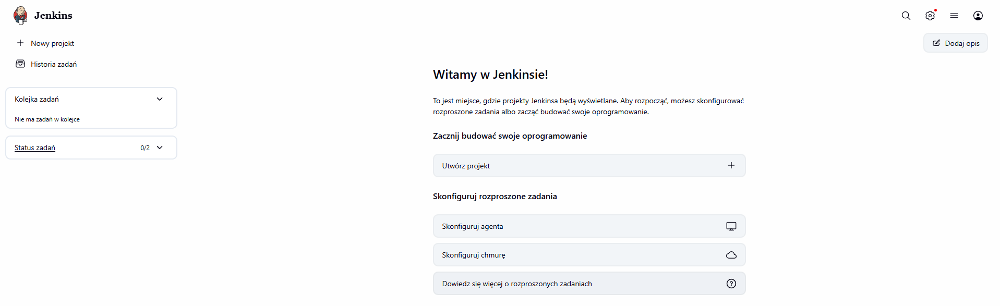
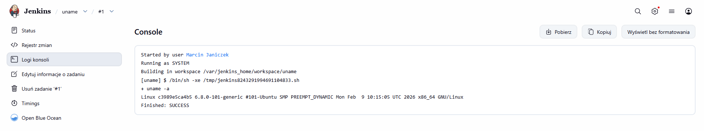
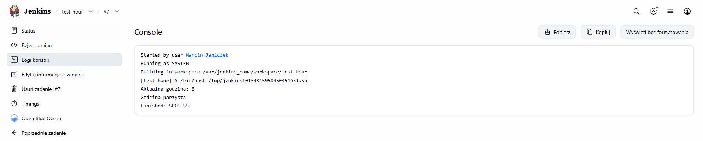
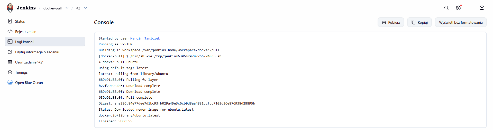
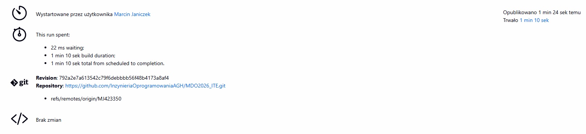
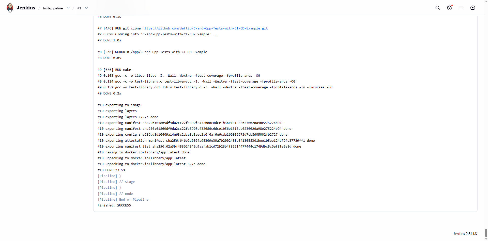
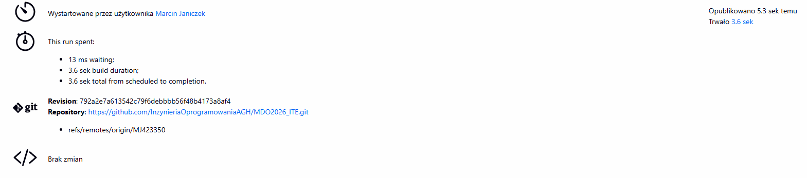
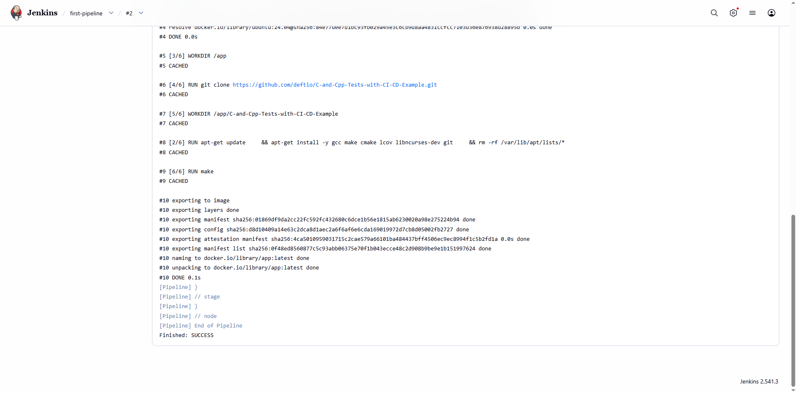

# Sprawozdanie - Lab5

## Przygotowanie

Aby utworzyć instancję jenkinsa wykonano następujące polecenia:

Stworzenie sieci `jenkins`:
```bash
docker network create jenkins
```

Uruchomienie kontenera `dind`:
```bash
docker run -d \
  --name dind \
  --network jenkins \
  --privileged \
  -e DOCKER_TLS_CERTDIR="" \
  docker:dind
```

Utworzenie prostego pliku Dockerfile:

```dockerfile
FROM jenkins/jenkins:lts-jdk17

USER root

RUN apt-get update && apt-get install -y docker.io

USER jenkins

RUN jenkins-plugin-cli --plugins blueocean docker-workflow git
```

```bash
docker build -t jenkins .
```
Dodano blueocean przy użyciu narzędzia `jenkins-plugin-cli`. Dzięki temu dostaliśmy dodatkowy zestaw pluginów rozszerzających Jenkinsa o interfejs graficzny do obsługi pipeline'ów.


Uruchomienie kontenera `jenkins`:
```bash
docker run -d \
  --name jenkins \
  --network jenkins \
  -p 8080:8080 \
  -p 50000:50000 \
  -e DOCKER_HOST=tcp://dind:2375 \
  -v jenkins_home:/var/jenkins_home \
  jenkins
```

Zadbano o archiwizację danych Jenkins poprzez użycie wolumenu `jenkins_home` zamontowanego w katalogu `/var/jenkins_home`.

Poniżej można zobaczyć skonfigurowanego Jenkins'a:



---
## Zadanie wstępne: uruchomienie

### Utworzenie projektu, który wyświetla `uname`

Dodano krok budowania (wykonaj powłokę), który wykonuje polecenie: `uname -a`. Wynik można zobaczyć w logach konsoli zadania:



### Utworzenie projektu, który zwraca błąd, gdy godzina jest nieparzysta

Podobnie jak poprzednio utworzono krok budowania, który wykonuje następujący skrypt:

```bash
#!/bin/bash

hour=$(date +%H)
hour=$((10#$hour)) #Wymuszenie interpretacji liczby w systemie dziesiętnym, gdyż np godzina 08 powodowała błąd

echo "Aktualna godzina: $hour"

if [ $((hour % 2)) -ne 0 ]; then
  echo "Godzina nieparzysta"
  exit 1
else
  echo "Godzina parzysta"
fi
```



### Pobranie w projekcie obrazu kontenera `ubuntu`

Utworzono krok budowania wykonujący następujący polecenie `docker pull ubuntu`



---
## Zadanie wstępne: obiekt typu pipeline

Stworzono pipeline, który klonuje konkretną gałąź z repozytorium i buduje obraz na podstawie dockerfile z laboratorium 3:

```groovy
pipeline {
    agent any

    stages {
        stage('Clone') {
            steps {
                git branch: 'MJ423350',
                    url: 'https://github.com/InzynieriaOprogramowaniaAGH/MDO2026_ITE.git'
            }
        }

        stage('Build Dockerfile') {
            steps {
                sh 'docker build -t app -f grupa2/MJ423350/Sprawozdanie3/Dockerfile.build grupa2/MJ423350/Sprawozdanie3/'
            }
        }
    }
}
```

Uruchomiono pipeline. Za pierwszym razem budował się on 1 min 10 sek.




Następnie uruchomiono Pipeline po raz drugi, tym razem budował się tylko 3.6 sekundy dzięki zapisaniu danych w cache.


