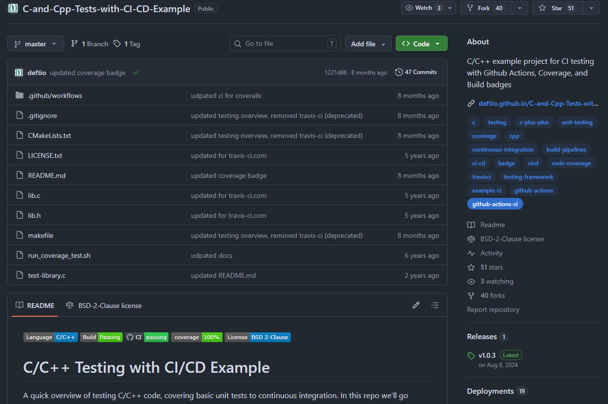
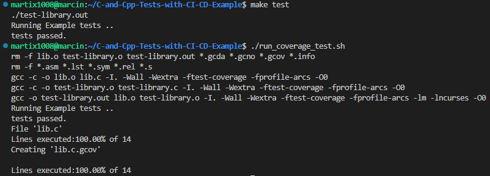
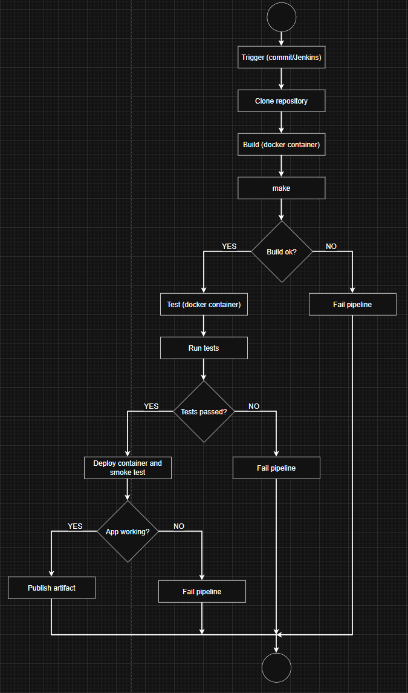
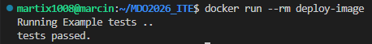
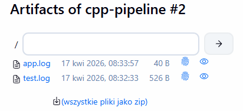
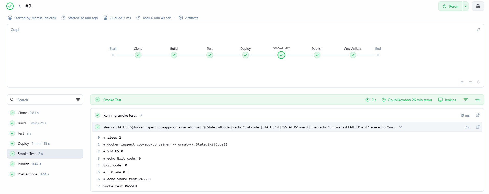

# Sprawozdanie - Lab6

## 1. Wybór aplikacji oraz licencja:
Do realizacji pipeline CI/CD wybrano projekt: https://github.com/deftio/C-and-Cpp-Tests-with-CI-CD-Example/tree/master?tab=readme-ov-file

Zawiera on aplikację w C/C++ wraz z systemem budowania oraz zestawem testów.

Repozytorium objęte jest licencją: `BSD 2-Clause`, która pozwala na dowolne użycie, modyfikację i dystrybucję kodu.



Zdecydowano się, że fork repozytorium nie jest wymagany. Projekt ten jest publiczny, licencja pozwala na swobodne wykorzystanie oraz nie wprowadzamy zmian w kodzie źródłowym.

## 2. Budowanie oraz test programu:
Zainstalowano wymagane zależności:

```bash
sudo apt install gcc make cmake lcov libncurses-dev
```

oraz wykonano build - `make`:


Następnie uruchomiono testy:

```bash
make test

#lub:
./run_coverage_test.sh
```



Jak widać powyżej wszstkie testy zakończyły się sukcesem.

## 3. Diagram UML:
Stworzono diagram, który składa się z procesów:
1. Trigger
2. Clone
3. Build
4. Test
5. Deploy
6. Publish



## 4. Kontenery build oraz test:
Stworzono odpowiedni kontener wstępny oparty na obrazie `ubuntu:24.04`, który wykonuje build wewnątrz kontenera:
```dockerfile
FROM ubuntu:24.04 build

RUN apt-get update \
    && apt-get install -y gcc make cmake lcov libncurses-dev git \
    && rm -rf /var/lib/apt/lists/*

WORKDIR /app

RUN git clone https://github.com/deftio/C-and-Cpp-Tests-with-CI-CD-Example.git

WORKDIR /app/C-and-Cpp-Tests-with-CI-CD-Example

RUN make

CMD ["bash"]
```

Następnie stworzono kontener testowy, który oparty jest o kontener build:
```dockerfile
FROM build AS test

WORKDIR /app/C-and-Cpp-Tests-with-CI-CD-Example

CMD ["./run_coverage_test.sh"]
```

## 5. Kontener deploy:
Zdefiniowano kontener deploy:
```dockerfile
FROM ubuntu:24.04 AS deploy

RUN apt-get update \
    && apt-get install -y libncurses-dev \
    && rm -rf /var/lib/apt/lists/*

WORKDIR /app

COPY --from=build-image /app/C-and-Cpp-Tests-with-CI-CD-Example /app

WORKDIR /app

CMD ["./test-library.out"]
```

Kontener buildowy nie nadaje się jako deploy, gdyż zawiera niepotrzebne narzędnia jak kompilator (jest cięższy). Kontener deploy zawiera tylko potrzebne zależności przez co jest lżejszy.

W tym wypadku deploy ma charakter integracyjny - nie wdraża aplikacji na serwer lub nie udostępnia jej użytkownikom. Służy jedyne do potwierdzenia działania aplikacji.

Poniżej można zobaczyć wyniki działania kontenera deploy:



Zdecydowano się na publikację kontenera Docker jako artefaktu, gdyż działa na każdym systemie z zainstalowanym Dockerem, zawiera wszystkie zależności oraz nie wymaga dodatkowych instalacji. Nie zdecydowano się na plik binarny `test-library.out`, gdyż mimo to że jest lżejszy to wymaga zapewnienia odpowiednich zależności.

## 6. Pipeline w Jenkins:
Do wykonania zadania użyto poniższego pliku Jenkinsfile:
```jenkinsfile
pipeline {
    agent any

    environment {
        IMAGE_NAME = "cpp-ci-app"
        VERSION = "1.0.${BUILD_NUMBER}"
        CONTAINER_NAME = "cpp-app-container"
    }

    stages {
        stage('Clone') {
            steps {
                echo 'Cloning repository...'
                git url: 'https://github.com/deftio/C-and-Cpp-Tests-with-CI-CD-Example.git'
            }
        }

        stage('Build') {
            steps {
                echo 'Building (build stage)...'
                sh 'docker build --target build -t build-image .'
            }
        }

        stage('Test') {
            steps {
                echo 'Running tests (test stage)...'
                sh 'docker build --target test -t test-image .'
                sh 'docker run --rm test-image > test.log'
            }
        }

        stage('Deploy') {
            steps {
                echo 'Building deploy image...'
                sh "docker build --target deploy -t ${IMAGE_NAME}:${VERSION} ."

                echo 'Deploying container...'
                sh "docker rm -f ${CONTAINER_NAME} || true"
                sh "docker run -d --name ${CONTAINER_NAME} ${IMAGE_NAME}:${VERSION}"
            }
        }

        stage('Smoke Test') {
            steps {
                echo 'Running smoke test...'

                sh """
                sleep 2
                STATUS=\$(docker inspect ${CONTAINER_NAME} --format='{{.State.ExitCode}}')
                echo "Exit code: \$STATUS"

                if [ "\$STATUS" -ne 0 ]; then
                    echo "Smoke test FAILED"
                    exit 1
                else
                    echo "Smoke test PASSED"
                fi
                """
            }
        }

        stage('Publish') {
            steps {
                echo 'Tagging image as latest...'
                sh "docker tag ${IMAGE_NAME}:${VERSION} ${IMAGE_NAME}:latest"
            }
        }
    }

    post {
        always {
            echo 'Collecting logs and artifacts...'

            sh "docker logs ${CONTAINER_NAME} > app.log || true"

            archiveArtifacts artifacts: '*.log', fingerprint: true
        }
    }
}
```

Do wersjonowania aplikacji użyto `semantic versioning` przy pomocy zmiennej `${BUILD_NUMBER}`.

Jako artefakty powstają tutaj:
- logi z testów,
- logi z aplikacji
- obraz Docker z deploy

Zapisywane są one w Jenkins i przypisywane do konkretnego builda, przy pomocy mechanizmu: `fingerprint: true`. Dzięki temu można łatwo zweryfikować czy aplikacja działała poprawnie lub gdzie powstał błąd.



Dodatkowo dodano tutaj prosty skrypt sh, który sprawdza, czy kontener `deploy` poprawnie się uruchomił i wypisuje wynik na ekran:
```bash
sleep 2
STATUS=\$(docker inspect ${CONTAINER_NAME} --format='{{.State.ExitCode}}')
echo "Exit code: \$STATUS"

if [ "\$STATUS" -ne 0 ]; then
    echo "Smoke test FAILED"
    exit 1
else
    echo "Smoke test PASSED"
fi
```

Finalnie pipeline pozytywnie przechodzi wszystkie etapy, co można zobaczyć poniżej:



## 7. Weryfikacja i podsumowanie:
Końcowy pipeline jest zgodny z zaplanowanym diagramem UML. Wszystkie etapy zostały zrealizowane w Jenkins. Pipeline spełnia wymagania ścieżki krytycznej, a proces jest zautomatyzowany.