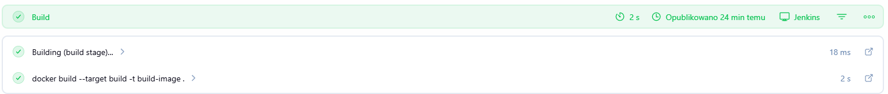
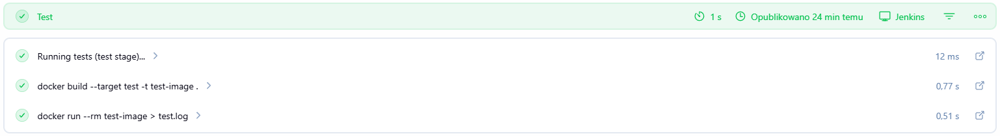
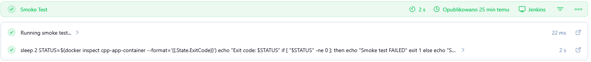
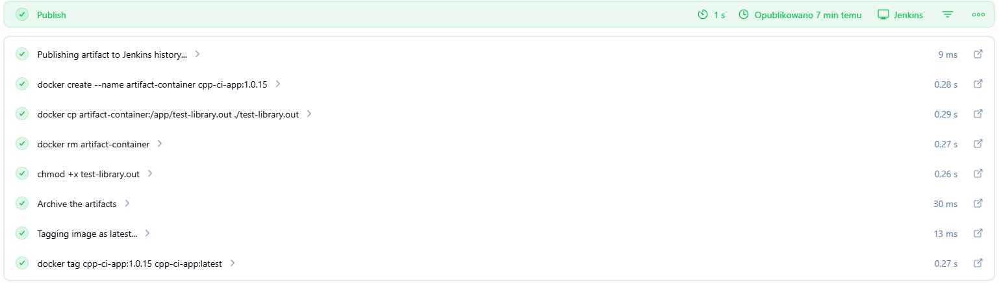
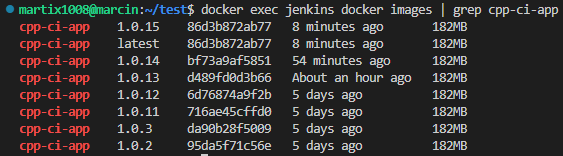

# Sprawozdanie - Lab7

## 1. Przepis dostarczony z SCM:
Proces budowania jest dostarczony z repozytorium. Plik Jenkinsfile jest zaciągany z odpowiedniego brancha i folderu co można zobaczyć poniżej:


## 2. Sprzątanie:
Pierwszym etapem pipeline jest krok `Prepare` w którym wykonywane jest polecenie `cleanWs()`, które czyści cały workspace.

## 3. Etap build:
Etap build dysponuje repozytorium poprzez krok `Checkout app` i polecenie `git url: "${APP_REPO}"`. Plik `Dockerfile` znajduje się w tym samym repozytorium co plik Jenkinsfile.

W tym kroku tworzymy obraz buildowy `build-image`, w którym instalujemy odpowiednie pakiety, kopiujemy zawartość folderu, w którym jest repozytorium, a następnie wykonujemy `make`.



## 4. Etap test:
Etap ten przeprowadza testy poprzez utworzenie obrazu testowego na podstawie obrazu build. Wykonuje testy uruchamiająć skrypt `run_coverage_test.sh`, a następnie usuwa obraz a logi zapisuje do pliku `test.log`.



## 5. Etap deploy:
Etap ten buduje finalny obraz `cpp-ci-app` i nadaje mu odpowiednią wersję, która kończy się numerem builda. Następnie wykonywany jest start kontenera oraz przeprowadzany smoke test, który sprawdza czy wszystko uruchomiło się poprawnie. Zapisywane są również logi z tego procesu.




## 6. Etap publish:
W tym etapie najnowszy artefakt aplikacji (obraz dockera) zostaje zapisany na dysku serwera. Dodatkowo tworzony jest plik `test-library.out`, który zostaje przypięty do historii builda w Jenkins.






## 7. Pliki Jenkinsfile oraz Dockerfile:

```jenkinsfile
pipeline {
    agent any

    environment {
        IMAGE_NAME = "cpp-ci-app"
        VERSION = "1.0.${BUILD_NUMBER}"
        CONTAINER_NAME = "cpp-app-container"
        APP_REPO = "https://github.com/deftio/C-and-Cpp-Tests-with-CI-CD-Example.git"
    }

    stages {
        stage('Prepare') {
            steps {
                cleanWs()
            }
        }
        
        stage('Checkout DevOps') {
            steps {
                checkout scm
            }
        }

        stage('Checkout App') {
            steps {
                dir('grupa2/MJ423350/Sprawozdanie6/app') {
                    git url: "${APP_REPO}"
                }
            }
        }

        stage('Build') {
            steps {
                echo 'Building (build stage)...'
                dir('grupa2/MJ423350/Sprawozdanie6') {
                    sh 'docker build --target build -t build-image .'
                }
            }
        }

        stage('Test') {
            steps {
                echo 'Running tests (test stage)...'
                dir('grupa2/MJ423350/Sprawozdanie6') {
                    sh 'docker build --target test -t test-image .'
                    sh 'docker run --rm test-image > test.log'
                }
            }
        }

        stage('Deploy') {
            steps {
                echo 'Building deploy image...'
                dir('grupa2/MJ423350/Sprawozdanie6') {
                    sh "docker build --target deploy -t ${IMAGE_NAME}:${VERSION} ."
                }
                
                echo 'Deploying container...'
                sh "docker rm -f ${CONTAINER_NAME} || true"
                sh "docker run -d --name ${CONTAINER_NAME} ${IMAGE_NAME}:${VERSION}"
            }
        }

        stage('Smoke Test') {
            steps {
                echo 'Running smoke test...'

                sh """
                sleep 2
                STATUS=\$(docker inspect ${CONTAINER_NAME} --format='{{.State.ExitCode}}')
                echo "Exit code: \$STATUS"

                if [ "\$STATUS" -ne 0 ]; then
                    echo "Smoke test FAILED"
                    exit 1
                else
                    echo "Smoke test PASSED"
                fi
                """
            }
        }

        stage('Publish') {
            steps {
                echo 'Publishing artifact to Jenkins history...'
                sh "docker create --name artifact-container ${IMAGE_NAME}:${VERSION}"
                sh "docker cp artifact-container:/app/test-library.out ./test-library.out"
                sh "docker rm artifact-container"
                
                sh "chmod +x test-library.out"
                archiveArtifacts artifacts: 'test-library.out', fingerprint: true
                
                echo 'Tagging image as latest...'
                sh "docker tag ${IMAGE_NAME}:${VERSION} ${IMAGE_NAME}:latest"
            }
        }
    }

    post {
        always {
            echo 'Collecting logs and artifacts...'

            sh "docker logs ${CONTAINER_NAME} > app.log || true"

            archiveArtifacts artifacts: '**/test.log, *.log', fingerprint: true
        }
    }
}
```

```dockerfile
#Build
FROM ubuntu:24.04 AS build
RUN apt-get update \
    && apt-get install -y gcc make cmake lcov libncurses-dev git \
    && rm -rf /var/lib/apt/lists/*
WORKDIR /app
COPY app /app
RUN make

#Test
FROM build AS test
CMD ["./run_coverage_test.sh"]

#Deploy
FROM ubuntu:24.04 AS deploy
RUN apt-get update \
    && apt-get install -y libncurses-dev \
    && rm -rf /var/lib/apt/lists/*
WORKDIR /app
COPY --from=build /app /app
CMD ["./test-library.out"]
```

## 8. Przebieg Pipeline:


## 9. Podsumowanie:
Pipeline jest w pełni zautomatyzowany i odporny na błędy. Spełnia wymagania przedstawione w instrukcji (listy kontrolnej). Każdy etap wykonuje się w poprawny sposób, a końcowy `plik .out` jest w stanie od razu uruchomić się na maszynie o oczekiwanej konfiguracji. Dodatkowo mamy dostęp do wszystkich obrazów aplikacji końcowej.

