# Sprawozdanie zbiorcze

## Laboratorium 8:

Celem zajęć było wdrożenie i zapoznanie się z narzędziem Ansible które służy do automatyzacji konfiguracji i zarządzania infrastrukturą IT.

Na początku przygotowano środowisko robocze poprzez uruchomienie drugiej maszyny wirtualnej i konfigurację komunikacji sieciowej. W celu usprawnienia pracy wymieniono klucze SSH między maszyną główną a węzłem docelowym oraz skonfigurowano regułę `NOPASSWD`, co umożliwiło bezhasłowe wykonywanie operacji z uprawnieniami administratora.

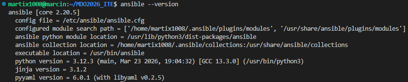
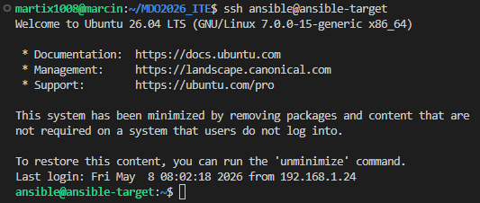

Kolejnym etapem była inwentaryzacja zasobów. Po edycji pliku `/etc/hosts`, umożliwiającej poprawne rozpoznawanie hostów po nazwach, skonfigurowano plik `inventory.ini`. Zdefiniowano w nim dwie grupy: `Orchestrators` (gdzie jako localhost wykorzystano połączenie lokalne) oraz `Endpoints` dla maszyny zdalnej. Łączność zweryfikowano za pomocą modułu ping, a także dodano plik konfiguracyjny `ansible.cfg` w celu wyciszenia zbędnych ostrzeżeń interpretera Pythona.

```bash
192.168.1.28 ansible-target
192.168.1.24 marcin
```

```ini
[Orchestrators]
localhost ansible_connection=local

[Endpoints]
ansible-target ansible_user=ansible
```

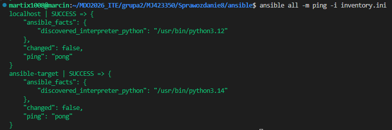

Następnie zajęto się zdalnym wywoływaniem procedur i stworzono pierwszy playbook. Skrypt ten odpowiadał za weryfikację połączenia, dystrybucję pliku inwentaryzacji, aktualizację pakietów systemowych oraz restart kluczowych usług, takich jak sshd i rngd. Przetestowano również zachowanie narzędzia w przypadku awarii – odpięcie karty sieciowej wygenerowało błąd o braku dostępu do hosta (`unreachable`).

```yaml
---
- name: Konfiguracja systemu i jego aktualizacja
  hosts: all
  become: true

  tasks:
    - name: 1. Sprawdzenie polaczenia (Ping)
      ansible.builtin.ping:

    - name: 2. Kopiowanie pliku inwentarza na Endpoints
      ansible.builtin.copy:
        src: inventory.ini
        dest: /tmp/ansible/inventory.ini
        mode: '0644'
      when: "'Endpoints' in group_names"

    - name: 3. Aktualizacja pakietów
      ansible.builtin.apt:
        update_cache: yes
        upgrade: dist
      when: ansible_facts['os_family'] == "Debian"

    - name: 4. Restart usługi SSHD
      ansible.builtin.service:
        name: sshd
        state: restarted
      when: "'Endpoints' in group_names"

    - name: 5. Restart usługi RNGD
      ansible.builtin.service:
        name: rngd
        state: restarted
      ignore_errors: yes
```

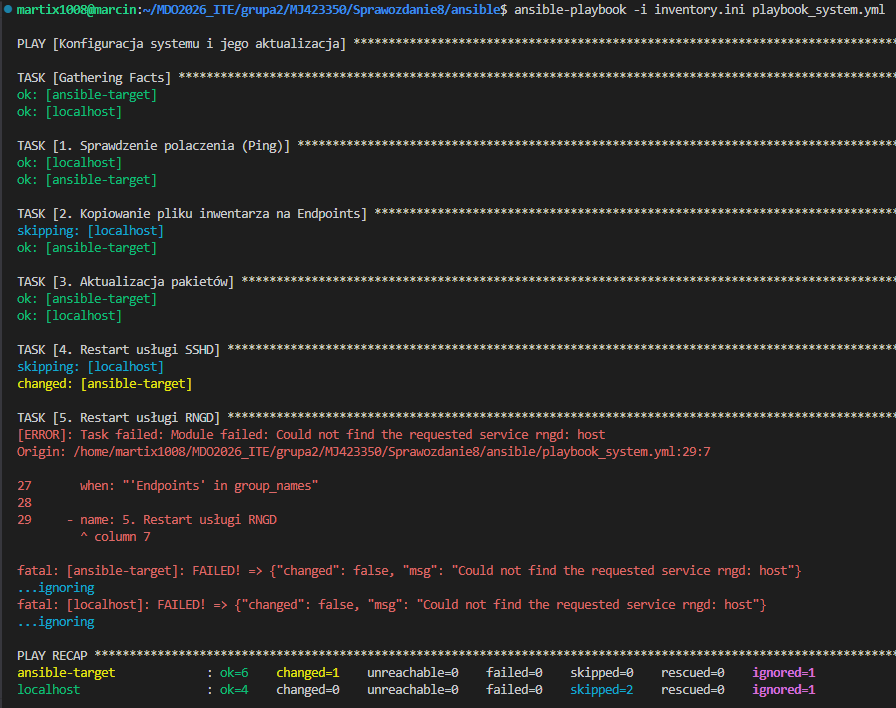

W dalszej części laboratorium wdrożono proces uruchamiania artefaktu jako pliku binarnego. Przygotowany playbook weryfikował dostępne miejsce na dysku, dbał o autentyczność pakietów z wykorzystaniem kluczy GPG oraz instalował biblioteki Pythona niezbędne do komunikacji z API Dockera. Po przetransferowaniu pliku binarnego na maszynę docelową uruchamiano kontener na bazie obrazu Ubuntu z przekierowaniem logów instalacyjnych, a po zakończeniu testów aplikacyjnych kontener był automatycznie usuwany. Cały playbook pod tym adresem: [playbook](../Sprawozdanie8/ansible/playbook_deploy.yml).

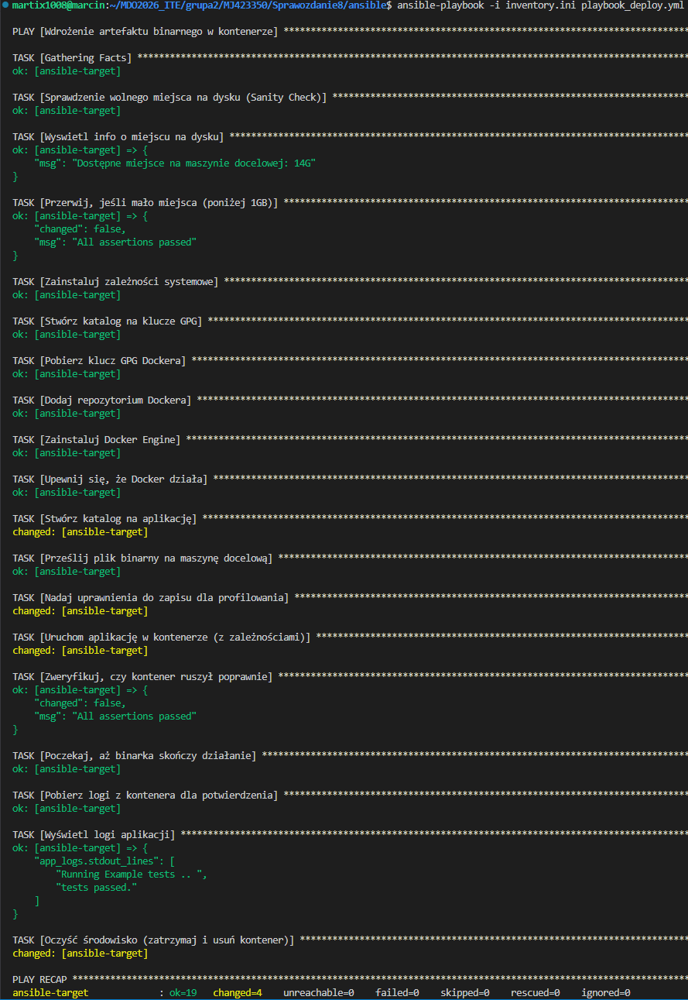

Na zakończenie zajęć zrefaktoryzowano kod, przekształcając dotychczasowego playbooka w struktury ról Ansible przy użyciu polecenia `ansible-galaxy`. Zadania, zmienne domyślne, metadane oraz pliki binarne uporządkowano w odpowiednich katalogach, co uprościło główny plik wdrożeniowy i poprawiło czytelność całego projektu.

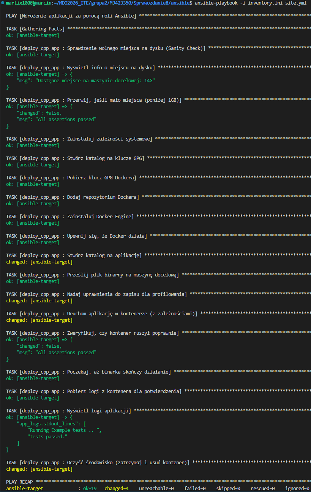

## Laboratorium 9:

Zajęcia te poświęcono na automatyzację instalacji systemu operacyjnego z wykorzystaniem dystrybucji Fedora (Everything Netinst) oraz plików odpowiedzi Kickstart (`anaconda-ks.cfg`). W pierwszym kroku przygotowano wstępną konfigurację, w której uwzględniono m.in. układ klawiatury, język, parametry sieciowe oraz repozytoria pakietów. Zapewniono również automatyczne formatowanie dysku, zdefiniowano niestandardową nazwę hosta oraz ustawiono dane dostępowe dla użytkownika i administratora z uwzględnieniem automatycznego restartu maszyny po zakończeniu instalacji.

```bash
# Generated by Anaconda 44.30
# Keyboard layouts
keyboard --vckeymap=pl --xlayouts='pl'
# System language
lang pl_PL.UTF-8

# Źródła instalacji i repozytoria
url --mirrorlist=http://mirrors.fedoraproject.org/mirrorlist?repo=fedora-$releasever&arch=x86_64
repo --name=updates --mirrorlist=http://mirrors.fedoraproject.org/mirrorlist?repo=updates-released-f$releasever&arch=x86_64

# Konfiguracja sieci
network --bootproto=dhcp --device=link --activate
network --hostname=fedora-devops

%packages
@^custom-environment

%end

# Run the Setup Agent on first boot
firstboot --enable

# Generated using Blivet version 3.13.2
ignoredisk --only-use=sda
autopart
# Partition clearing information
clearpart --all --initlabel

# System timezone
timezone Europe/Warsaw --utc

# Root password
rootpw --iscrypted --allow-ssh $y$j9T$dx2KpA6S3O.LW2OWhVx3LUdP$T1xrlcINQoTrvo/.hQ0VVZvD7NMaln9g5iF7y7TUkn/
user --groups=wheel --name=martix1008 --password=$y$j9T$LGhM0tvzlAelTDpbUWavJnjT$MZWtl42hQSBFIt0T97bxyRP8Q3QESGsyC8ewLjHmh3. --iscrypted --gecos="Marcin Janiczek"

# Automatyczny restart
reboot
```

Następnie rozszerzono plik odpowiedzi o sekcję `%post`, definiując w niej proces wdrożeniowy artefaktu. Plik wykonywalny udostępniono lokalnie za pomocą prostego serwera HTTP Pythona. W skrypcie poinstalacyjnym dodano instrukcje pobierające artefakt za pomocą narzędzia `curl` do katalogu `/usr/local/bin` wraz z nadaniem mu odpowiednich uprawnień do wykonywania. Ponadto przygotowano dedykowaną usługę systemd (`cpp-app.service`), która odpowiada za jednorazowe uruchomienie wdrożonej aplikacji po starcie systemu. W fazie testowej plik odpowiedzi przekazywano do instalatora ręcznie, edytując parametry startowe w menu GRUB za pomocą flagi `inst.ks`.

```bash
# Generated by Anaconda 44.30
# Keyboard layouts
keyboard --vckeymap=pl --xlayouts='pl'
# System language
lang pl_PL.UTF-8

# Źródła instalacji i repozytoria
url --mirrorlist=http://mirrors.fedoraproject.org/mirrorlist?repo=fedora-$releasever&arch=x86_64
repo --name=updates --mirrorlist=http://mirrors.fedoraproject.org/mirrorlist?repo=updates-released-f$releasever&arch=x86_64

# Konfiguracja sieci
network --bootproto=dhcp --device=link --activate
network --hostname=fedora-devops

%packages
@^custom-environment
ncurses-libs
ncurses-devel
curl

%end

# Run the Setup Agent on first boot
firstboot --enable

# Generated using Blivet version 3.13.2
ignoredisk --only-use=sda
autopart
# Partition clearing information
clearpart --all --initlabel

# System timezone
timezone Europe/Warsaw --utc

# Root password
rootpw --iscrypted --allow-ssh $y$j9T$dx2KpA6S3O.LW2OWhVx3LUdP$T1xrlcINQoTrvo/.hQ0VVZvD7NMaln9g5iF7y7TUkn/
user --groups=wheel --name=martix1008 --password=$y$j9T$LGhM0tvzlAelTDpbUWavJnjT$MZWtl42hQSBFIt0T97bxyRP8Q3QESGsyC8ewLjHmh3. --iscrypted --gecos="Marcin Janiczek"

# Automatyczny restart
reboot

%post --log=/root/ks-post-install.log

# Pobieranie skomplowanego pliku binarnego
curl -o /usr/local/bin/test-library.out http://192.168.1.26:8000/test-library.out

# Nadanie uprawnień do uruchomienia
chmod +x /usr/local/bin/test-library.out

# Usługa uruchamiająca program po starcie systemu
cat << 'EOF' > /etc/systemd/system/cpp-app.service
[Unit]
Description=Aplikacja C++ z pipeline
After=network.target

[Service]
Type=oneshot
ExecStart=/usr/local/bin/test-library.out
Restart=no
StandardOutput=journal+console
StandardError=journal+console

[Install]
WantedBy=multi-user.target
EOF

# Włącz usługę
systemctl enable cpp-app.service

%end
```

```bash
inst.ks=http://192.168.1.26:8000/anaconda-ks.cfg
```

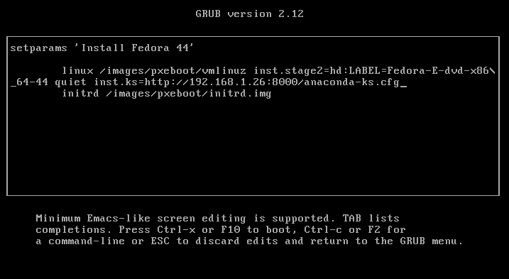

```bash
systemctl status cpp-app.service
```

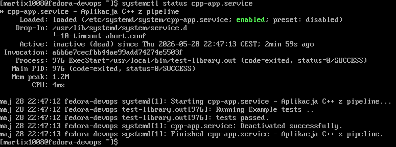

W zakresie rozszerzonym zmodyfikowano sekcję `%post` tak, aby umożliwić śledzenie postępów instalacji w czasie rzeczywistym. Dokonano przekierowania wejścia i wyjścia na trzecią konsolę tekstową (`tty3`) przy użyciu polecenia `chvt`, co pozwoliło na podgląd logów bezpośrednio na ekranie w trakcie wykonywania skryptów poinstalacyjnych. Ostatecznie proces wdrożenia zautomatyzowano w pełni, integrując zmodyfikowany plik Kickstart z oryginalnym obrazem instalacyjnym ISO. Wykorzystano do tego celu narzędzie `mkksiso`, tworząc nowy, gotowy do użycia obraz dysku ze „wstrzykniętą” konfiguracją, co pomyślnie zweryfikowano podczas uruchamiania tak przygotowanej maszyny.

```bash
%post --interpreter=/bin/bash --log=/root/ks-post-install.log

#Przekierowanie wyjścia:
exec < /dev/tty3 > /dev/tty3 2>&1
chvt 3

#Na końcu powrót do domyślnej konsoli:
chvt 1
```

```bash
sudo mkksiso --ks /home/martix1008/anaconda-ks.cfg /home/martix1008/Fedora-Everything-netinst-x86_64-44-1.7.iso /home/martix1008/Fedora-DevOps.iso
```

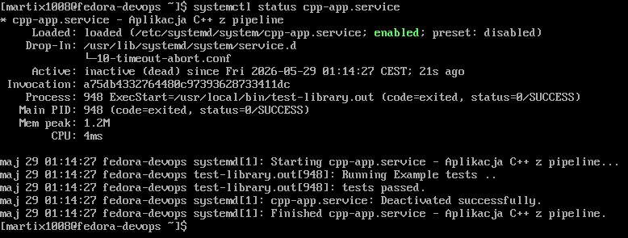

## Laboratorium 10:

Zajęcia te poświęcono na wdrożenie i konfigurację klastra Kubernetes z wykorzystaniem narzędzia Minikube, uruchamianego na sterowniku Docker. W pierwszym kroku pobrano i zainstalowano odpowiednie pakiety oraz przygotowano alias minikubctl ułatwiający zarządzanie klastrem. Ze względu na minimalne wymagania środowiskowe, maszynę wirtualną z systemem Fedora skonfigurowano tak, aby dysponowała ona zasobami co najmniej 2 CPU oraz 3 GB pamięci RAM. Dodatkowo, za pomocą przekierowania tuneli SSH, pomyślnie uruchomiono i udostępniono graficzny panel administracyjny (dashboard) bezpośrednio na hoście z systemem Windows 10.

```bash
curl -LO https://github.com/kubernetes/minikube/releases/latest/download/minikube-linux-amd64
sudo install minikube-linux-amd64 /usr/local/bin/minikube && rm minikube-linux-amd64
```

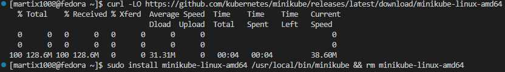

```bash
echo "alias minikubctl='minikube kubectl --'" >> ~/.bashrc
source ~/.bashrc
```

```bash
minikube start --driver=docker

minikubctl get nodes
minikube status
```

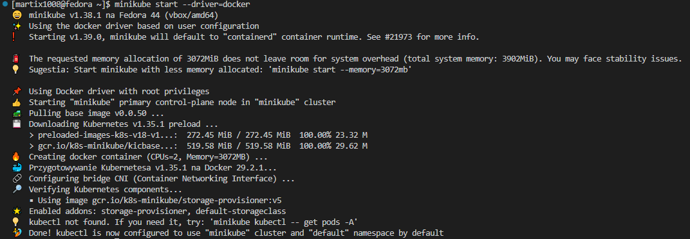

```bash
minikube dashboard
```

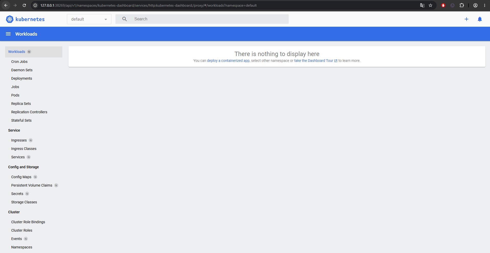

Kolejnym etapem była analiza i przygotowanie aplikacji gotowej do uruchomienia w środowisku klastrowym. Ponieważ wcześniejszy artefakt kończył swoje działanie od razu po przejściu testów, stworzono prosty serwer WWW w środowisku Node.js, który stale nasłuchuje na porcie 8080 i zwraca komunikat „Hello World”. Dla przygotowanego kodu napisano plik Dockerfile oparty na lekkim obrazie `node:20-alpine`, zbudowano lokalny obraz kontenera, a następnie załadowano go do wewnętrznego rejestru Minikube.

```bash
minikube image load hello-node:1.0
minikube image ls
```

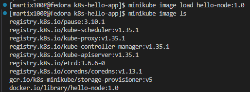

W kolejnej części wdrożono aplikację bezpośrednio w klastrze. Uruchomiono pojedynczy obiekt typu Pod z niestandardową polityką pobierania obrazu, a jego poprawne działanie zweryfikowano poprzez inspekcję logów oraz mechanizm przekierowania portów. Następnie proces manualny przekuto w deklaratywną definicję wdrożenia (Deployment). Przygotowano plik konfiguracyjny YAML określający replikację aplikacji Nginx na poziomie czterech instancji, którą wdrożono w klastrze za pomocą polecenia `apply`.

```bash
minikubctl run hello-pod --image=hello-node:1.0 --port=8080 --labels app=hello-pod --image-pull-policy=Never

minikubctl get pods
minikubctl logs hello-pod
```

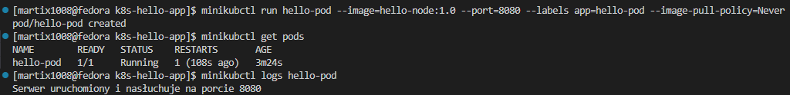

```bash
minikubctl port-forward pod/hello-pod 8080:8080

#Osobny terminal:
curl http://localhost:8080
```

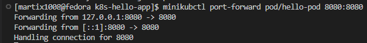


```yaml
apiVersion: apps/v1
kind: Deployment
metadata:
  name: nginx-deployment
  labels:
    app: nginx

spec:
  replicas: 4
  
  selector:
    matchLabels:
      app: nginx
  
  template:
    metadata:
      labels:
        app: nginx
    
    spec:
      containers:
      - name: nginx
        image: nginx:alpine
        ports:
        - containerPort: 80
```

```bash
minikubctl apply -f deployment.yaml
```

Na zakończenie zrealizowano ekspozycję wdrożonych zasobów na zewnątrz. Utworzono obiekt typu Service (`ClusterIP`), który zagwarantował wewnętrzną komunikację sieciową dla wdrożenia. Ostatecznie, poprzez kolejne przekierowanie portów do nowo utworzonego serwisu, pomyślnie odpytano aplikację za pomocą narzędzia `curl`, potwierdzając tym samym stabilne działanie mechanizmów routingu i load balancingu w utworzonym środowisku Kubernetes.

```bash
minikubctl expose deployment nginx-deployment --type=ClusterIP --name=nginx-service --port=80

minikubctl get service nginx-service

minikubctl port-forward service/nginx-service 8080:80

curl http://localhost:8080
```

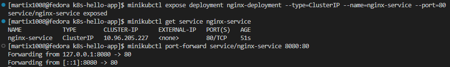
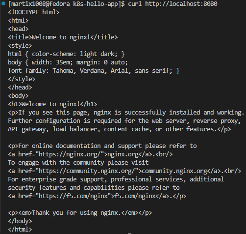

## Laboratorium 11:

Zajęcia te poświęcono na zaawansowane zarządzanie cyklem życia aplikacji, kontrolę wdrożeń oraz testowanie strategii aktualizacji w klastrze Kubernetes. Na wstępie przygotowano i oznaczono trzy wersje wdrożeniowe aplikacji Node.js (v1, zaktualizowaną v2 oraz wadliwą v3 z wymuszonym błędem działania). Zbudowane obrazy opublikowano w publicznym rejestrze Docker Hub, skąd następnie pobierano je do środowiska Minikube.

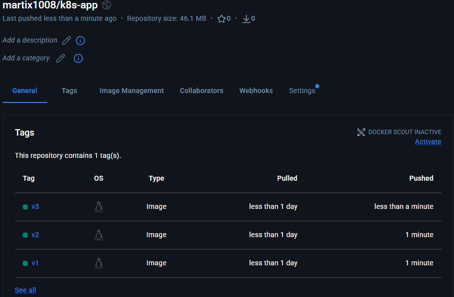

W dalszej części przetestowano operacje skalowania zasobów poprzez dynamiczną zmianę liczby replik w pliku definicji wdrożenia. Równolegle zweryfikowano mechanizmy wycofywania zmian (`rollout undo`), co pozwoliło na bezproblemowe przywrócenie stabilnej wersji oprogramowania po uprzednim wdrożeniu wadliwej rewizji. Aby zautomatyzować proces kontroli jakości, napisano skrypt powłoki weryfikujący status wdrożenia w założonym limicie czasowym, który kończy się kodem błędu w przypadku przekroczenia czasu lub awarii aplikacji.

```bash
minikubctl apply -f deployment.yaml
minikubctl get pods -l app=node-app
```

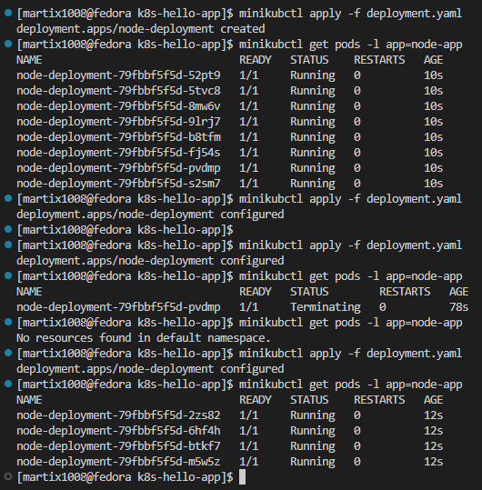

```bash
minikubctl rollout history deployment/node-deployment --revision=2
minikubctl rollout history deployment/node-deployment --revision=4
```

```bash
minikubctl rollout undo deployment/node-deployment
```

```bash
#!/bin/bash

DEPLOYMENT_NAME="node-deployment"
TIMEOUT_SECONDS=60

if timeout ${TIMEOUT_SECONDS} minikube kubectl -- rollout status deployment/${DEPLOYMENT_NAME}; then
    echo "Wdrożenie zakończyło się pomyślnie w wyznaczonym czasie!"
    exit 0
else
    echo "Wdrożenie przekroczyło limit czasu ${TIMEOUT_SECONDS} sekund lub uległo awarii!"
    exit 1
fi
```

Głównym punktem zajęć było wdrożenie i porównanie trzech podstawowych strategii aktualizacji. W pierwszej kolejności sprawdzono strategię `Recreate`, która polega na jednorazowym usunięciu wszystkich starych instancji przed uruchomieniem nowych, co wiąże się z chwilową przerwą w dostępności usługi. Następnie skonfigurowano domyślną strategię `Rolling Update`, zapewniającą płynne przejmowanie ruchu poprzez stopniową wymianę podów. W wariancie tym doprecyzowano parametry `maxUnavailable` oraz `maxSurge`, co pozwoliło na precyzyjne kontrolowanie obciążenia i liczby dostępnych instancji w trakcie procesu aktualizacji.

Recreate:
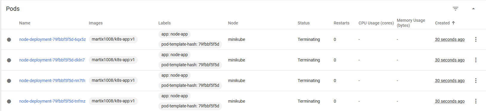

Rolling Update:
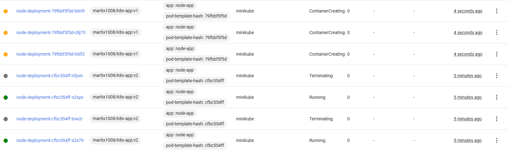

Na zakończenie zrealizowano wdrożenie typu `Canary`. Uruchomiono dwa niezależne deploymenty (wersję stabilną oraz nowszą), a sterowanie ruchem pomiędzy nimi zrealizowano za pomocą odpowiednich selektorów i etykiet w obiekcie Service, co stanowi powszechnie stosowaną praktykę bezpiecznego udostępniania nowych funkcji w środowiskach produkcyjnych.

```yaml
apiVersion: apps/v1
kind: Deployment
metadata:
  name: node-deployment-canary
  labels:
    app: node-app

spec:
  replicas: 4
  
  selector:
    matchLabels:
      app: node-app
  
  template:
    metadata:
      labels:
        app: node-app
        version: v2
    spec:
      containers:
      - name: node-container
        image: martix1008/k8s-app:v2
        ports:
        - containerPort: 8080
```

```yaml
apiVersion: v1
kind: Service
metadata:
  name: node-service
spec:
  selector:
    app: node-app
  ports:
    - protocol: TCP
      port: 80
      targetPort: 8080
```

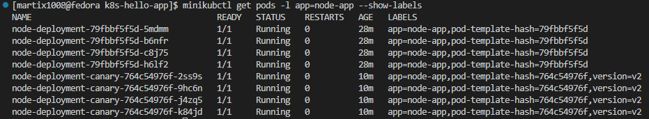

## Laboratorium 12:

Zajęcia te poświęcono na przeniesienie procesów wdrożeniowych do chmury publicznej z wykorzystaniem usługi Azure Container Instances (ACI). Na wstępie przygotowano zaktualizowany obraz aplikacji w wersji `v4`, który po zbudowaniu wypchnięto do zewnętrznego rejestru Docker Hub.

Główną część ćwiczeń zrealizowano za pośrednictwem konsoli Azure Cloud Shell. W pierwszym kroku zarejestrowano niezbędnego dostawcę zasobów `Microsoft.ContainerInstance`, a następnie utworzono dedykowaną grupę zasobów w regionie Poland Central. Wdrożenie kontenera oparto na dedykowanym poleceniu `az container create`, w którym zdefiniowano parametry takie jak: przydzielone limity zasobów sprzętowych (CPU oraz pamięć RAM), otwarty port aplikacji, typ systemu operacyjnego oraz unikalna etykieta nazwy DNS.

```bash
az provider register --namespace Microsoft.ContainerInstance
```

```bash
az group create --name martix1008-node --location polandcentral
```

```bash
az container create \
    --resource-group martix1008-node \
    --name node-app \
    --image martix1008/k8s-app:v4 \
    --cpu 1 \
    --memory 1 \
    --ports 8080 \
    --dns-name-label martix1008-app \
    --location polandcentral \
    --os-type Linux
```

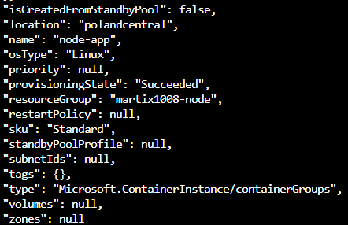

Poprawne uruchomienie instancji zweryfikowano za pomocą szczegółowych zapytań o stan wdrożenia (`provisioningState` oraz `instanceView`), a także poprzez inspekcję logów aplikacji. Ostateczny dostęp do serwisu pomyślnie potwierdzono za pomocą przeglądarki lub narzędzia curl, odpytując publicznie wygenerowany adres FQDN. Na zakończenie zajęć przeprowadzono pełne sprzątanie środowiska chmurowego, usuwając wdrożony kontener oraz utworzoną grupę zasobów przy użyciu interfejsu wiersza poleceń Azure CLI.

```bash
az container show \
    --resource-group martix1008-node \
    --name node-app \
    --query "{Name:name, ProvisioningState:provisioningState, State:instanceView.state.state}" \
    --output table

az container show \
    --resource-group martix1008-node \
    --name node-app \
    --query instanceView.state
```

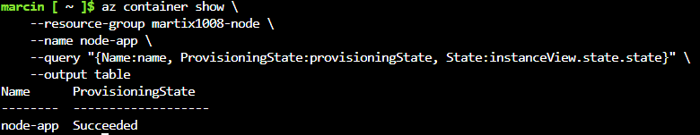

```bash
az container logs \
    --resource-group martix1008-node \
    --name node-app
```

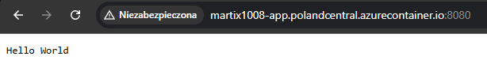

```bash
az container delete \
    --resource-group martix1008-node \
    --name node-app \
    --yes

az container list --resource-group martix1008-node --output table
```

```bash
az group delete --name martix1008-node --yes --no-wait

az group list
```

## Podsumowanie:

Cykl zajęć laboratoryjnych pozwolił na kompleksowe poznanie nowoczesnych narzędzi i metodyk automatyzacji wdrożeń.

W pierwszej części skupiono się na konfiguracji infrastruktury i systemów operacyjnych. Za pomocą narzędzia Ansible zautomatyzowano zarządzanie węzłami, a wykorzystując pliki Kickstart oraz narzędzie mkksiso, wdrożono w pełni bezobsługową instalację systemu Fedora wraz ze wstrzykniętymi aplikacjami.

Głównym elementem cyklu była praca z orkiestratorem Kubernetes (Minikube). Przetestowano tam proces konteneryzacji aplikacji Node.js, tworzenie deklaratywnych wdrożeń (Deployment, Services) oraz zaawansowane zarządzanie ruchem i aktualizacjami przy użyciu strategii Recreate, Rolling Update oraz Canary.

Ostatnim etapem było przeniesienie aplikacji do chmury publicznej z wykorzystaniem Azure Container Instances (ACI). Przećwiczono tam sprawne uruchamianie i weryfikację kontenerów bezpośrednio przez interfejs Azure CLI.