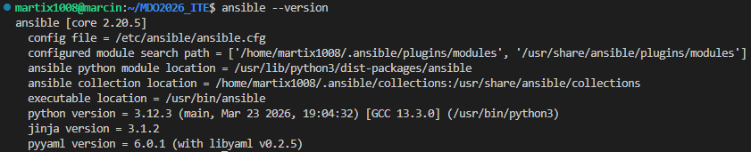
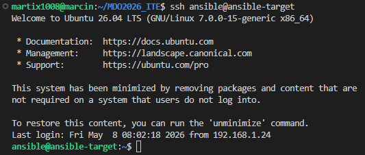
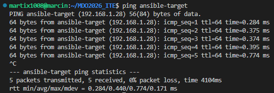
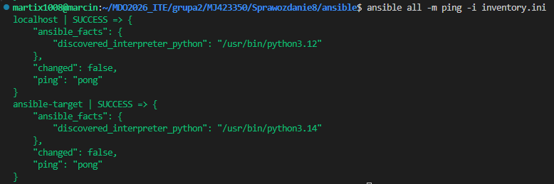
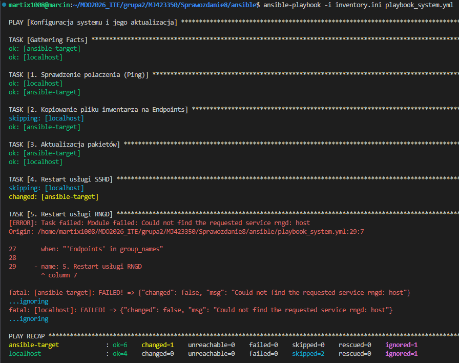
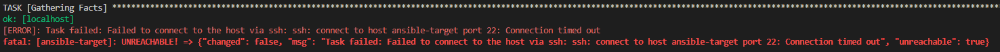
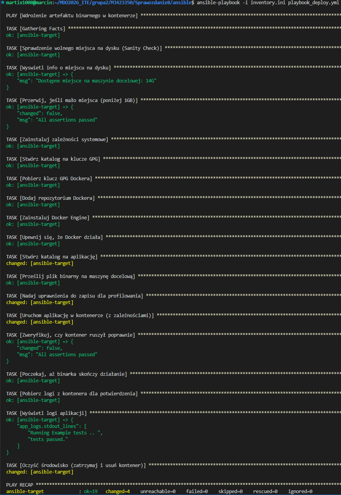
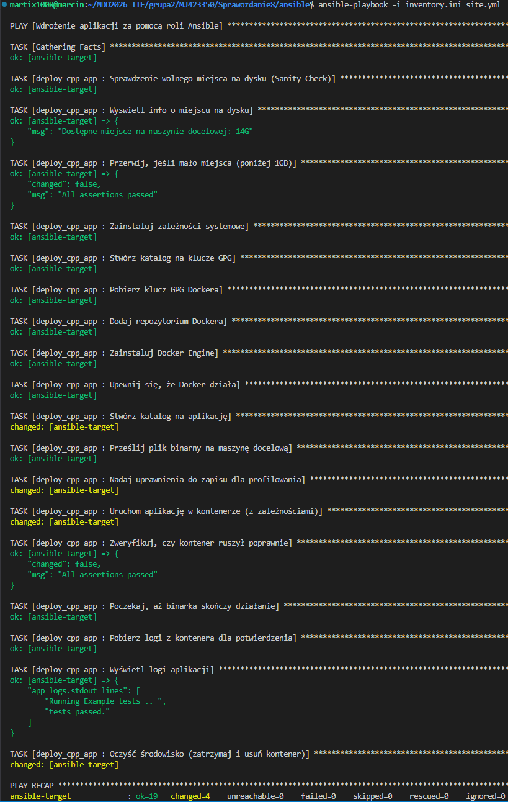

# Sprawozdanie - Lab8

## Instalacja zarządcy Ansible:
Utworzono drugą maszynę wirtualną o takim samym systemie operacyjnym jak główna maszyna, z obecnością programu tar i serwera OpenSSH. Nadano odpowiedni hostname oraz utworzono użytkownika ansible i migawkę maszyny.

Na głównej maszynie zainstalowano oprogramowanie Ansible i wymieniono klucze SSH między użytkownikiem w głównej maszynie wirtualnej, a użytkownikiem ansible tak, by logowanie ssh nie wymagało podania hasła.

Skonfigurowano również regułę `NOPASSWD` w folderze `/etc/sudoers.d/` aby nie trzeba było za każdym razem wpisywać hasła do sudo.





## Inwentaryzacja

Edytowano `/etc/hosts`, aby maszyny mogły się komunikować między sobą za pomocą nazw. W tym celu przypisano adres `192.168.1.28` do nazwy `ansible-target`.

```bash
192.168.1.28 ansible-target
192.168.1.24 marcin
```

Zweryfikowano łączność:



Utworzono plik inwentaryzacji `inventory.ini`. w którym umieszczono dwie sekcje `Orchestrators` i `Endpoints`. Dzięki `ansible_connection=local` localhost nie używa SSH do łączenia się z samym sobą.

```ini
[Orchestrators]
localhost ansible_connection=local

[Endpoints]
ansible-target ansible_user=ansible
```

Wysłano żądanie ping do wszystkich maszyn, za pomocą polecenia `ansible all -m ping -i inventory.ini`. Dodano również plik `ansible.cfg`, aby ukryć ostrzeżenie o wykrywaniu interpretera Python.

```ini
[defaults]
interpreter_python = auto_silent
```



## Zdalne wywoływanie procedur:

Stworzono playbooka Ansible, który wysyła żądanie ping do wszystkich maszyn, kopiuje plik inwentaryzacji, aktualizuje pakiety i resetuje usługi sshd oraz rngd.

```yaml
---
- name: Konfiguracja systemu i jego aktualizacja
  hosts: all
  become: true

  tasks:
    - name: 1. Sprawdzenie polaczenia (Ping)
      ansible.builtin.ping:

    - name: 2. Kopiowanie pliku inwentarza na Endpoints
      ansible.builtin.copy:
        src: inventory.ini
        dest: /tmp/ansible/inventory.ini
        mode: '0644'
      when: "'Endpoints' in group_names"

    - name: 3. Aktualizacja pakietów
      ansible.builtin.apt:
        update_cache: yes
        upgrade: dist
      when: ansible_facts['os_family'] == "Debian"

    - name: 4. Restart usługi SSHD
      ansible.builtin.service:
        name: sshd
        state: restarted
      when: "'Endpoints' in group_names"

    - name: 5. Restart usługi RNGD
      ansible.builtin.service:
        name: rngd
        state: restarted
      ignore_errors: yes
```



Ponowiono również operację względem maszyny z odpiętą kartą sieciową. Ansible zgłasza błąd `unreachable`, ale nie przerywa pracy nad resztą hostów.



## Zarządzanie stworzonym artefaktem:

Zdecydowano się na uruchomienie artefaktu jako pliku binarnego. W tym celu powstał playbook z następującymi krokami:
- Sanity Check - weryfikacja wolnego miejsca na dysku przed rozpoczęciem instalacji,
- Wykorzystanie kluczy GPG aby zapewnić autentyczność pakietów,
- Instalacja bibliotek Python, aby umożliwić Ansible komunikację z API Dockera,
- Transfer skompilowanego pliku binarnego na target za pomocą modułu `copy`,
- Uruchomienie kontenera opartego na obrazie `ubuntu:24.04`,
- Zastosowanie przekierowania `> /dev/null 2>&1` dla procesów instalacyjnych wewnątrz kontenera, aby logi końcowe zawierały tylko wyniki działania aplikacji,
- Użycie komendy `docker wait`, aby wstrzymać wykonanie playbooka do momentu zakończenia działania aplikacji,
- Usuwanie kontenera po zakończeniu weryfikacji.

Plik playbooka można zobaczyć pod tym linkiem:
[Playbook](./ansible/playbook_deploy.yml).



## Role:

Ubrano wcześniejszego playbooka w role. Wykorzystano narzędzie `ansible-galaxy role init` do stworzenia szkieletu katalogów.
- Zadania zostały przeniesione do `tasks/main.yml`,
- zmienne takie jak nazwa artefaktu umieszczono w `defaults/main.yml`,
- plik binarny umieszczono w folderze `files`,
- w pliku `meta/main.yml` zamieszczono informacje o autorze, licencji i wspieranych platformach,
- główny plik wdrożeniowy został zredukowany i przypisuje jedynie odpowiednią rolę do grupy hostów `Endpoints`.

