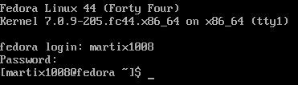
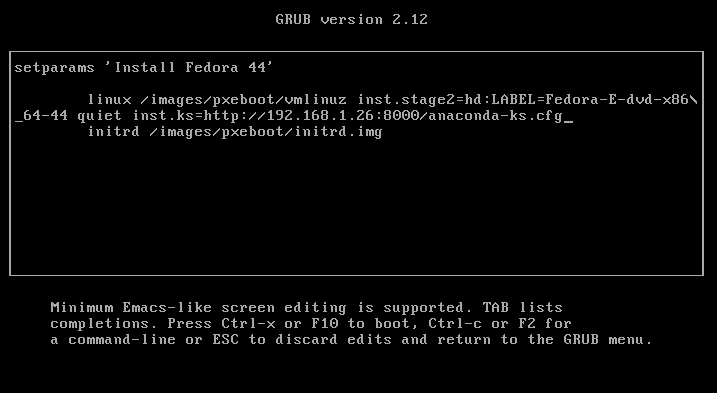
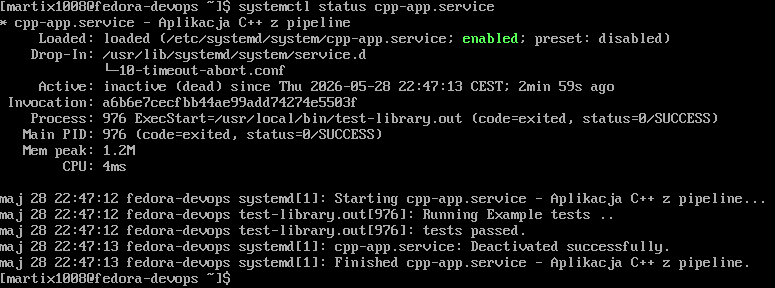
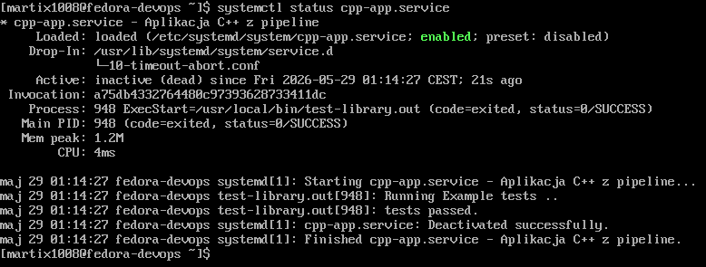

# Sprawozdanie - Lab9

## Instalacja systemu Fedora:

Zainstalowano system Fedora (Everything Netinst) oraz pobrano plik odpowiedzi `root/anaconda-ks.cfg`



## Modyfikacja pliku `anaconda-ks.cfg`:

Do wcześniej pobranego pliku dodano wzmiankę o repozytoriach, zapewniono zawsze formatowanie dysku i ustawiono hostname inny niż domyślny localhost. Zadbano również o automatyczny restart. Zmodyfikowany plik można zobaczyć poniżej:

```bash
# Generated by Anaconda 44.30
# Keyboard layouts
keyboard --vckeymap=pl --xlayouts='pl'
# System language
lang pl_PL.UTF-8

# Źródła instalacji i repozytoria
url --mirrorlist=http://mirrors.fedoraproject.org/mirrorlist?repo=fedora-$releasever&arch=x86_64
repo --name=updates --mirrorlist=http://mirrors.fedoraproject.org/mirrorlist?repo=updates-released-f$releasever&arch=x86_64

# Konfiguracja sieci
network --bootproto=dhcp --device=link --activate
network --hostname=fedora-devops

%packages
@^custom-environment

%end

# Run the Setup Agent on first boot
firstboot --enable

# Generated using Blivet version 3.13.2
ignoredisk --only-use=sda
autopart
# Partition clearing information
clearpart --all --initlabel

# System timezone
timezone Europe/Warsaw --utc

# Root password
rootpw --iscrypted --allow-ssh $y$j9T$dx2KpA6S3O.LW2OWhVx3LUdP$T1xrlcINQoTrvo/.hQ0VVZvD7NMaln9g5iF7y7TUkn/
user --groups=wheel --name=martix1008 --password=$y$j9T$LGhM0tvzlAelTDpbUWavJnjT$MZWtl42hQSBFIt0T97bxyRP8Q3QESGsyC8ewLjHmh3. --iscrypted --gecos="Marcin Janiczek"

# Automatyczny restart
reboot
```

## Rozszerzenie pliku:

Wybrano opcję hostowania pliku binarnego za pomocą serwera HTTP z pomocą polecenia:

```bash
python -m http.server 8000
```

W taki sam sposób pobierany jest również plik `anaconda-ks.cfg`.

Zmieniony plik odpowiedzi wygląda następująco (zadbano o umieszczenie programu w `/usr/local/bin` oraz w sekcji `%packages` zapewniono instalację wszystkich potrzebnych zależności):

```bash
# Generated by Anaconda 44.30
# Keyboard layouts
keyboard --vckeymap=pl --xlayouts='pl'
# System language
lang pl_PL.UTF-8

# Źródła instalacji i repozytoria
url --mirrorlist=http://mirrors.fedoraproject.org/mirrorlist?repo=fedora-$releasever&arch=x86_64
repo --name=updates --mirrorlist=http://mirrors.fedoraproject.org/mirrorlist?repo=updates-released-f$releasever&arch=x86_64

# Konfiguracja sieci
network --bootproto=dhcp --device=link --activate
network --hostname=fedora-devops

%packages
@^custom-environment
ncurses-libs
ncurses-devel
curl

%end

# Run the Setup Agent on first boot
firstboot --enable

# Generated using Blivet version 3.13.2
ignoredisk --only-use=sda
autopart
# Partition clearing information
clearpart --all --initlabel

# System timezone
timezone Europe/Warsaw --utc

# Root password
rootpw --iscrypted --allow-ssh $y$j9T$dx2KpA6S3O.LW2OWhVx3LUdP$T1xrlcINQoTrvo/.hQ0VVZvD7NMaln9g5iF7y7TUkn/
user --groups=wheel --name=martix1008 --password=$y$j9T$LGhM0tvzlAelTDpbUWavJnjT$MZWtl42hQSBFIt0T97bxyRP8Q3QESGsyC8ewLjHmh3. --iscrypted --gecos="Marcin Janiczek"

# Automatyczny restart
reboot

%post --log=/root/ks-post-install.log

# Pobieranie skomplowanego pliku binarnego
curl -o /usr/local/bin/test-library.out http://192.168.1.26:8000/test-library.out

# Nadanie uprawnień do uruchomienia
chmod +x /usr/local/bin/test-library.out

# Usługa uruchamiająca program po starcie systemu
cat << 'EOF' > /etc/systemd/system/cpp-app.service
[Unit]
Description=Aplikacja C++ z pipeline
After=network.target

[Service]
Type=oneshot
ExecStart=/usr/local/bin/test-library.out
Restart=no
StandardOutput=journal+console
StandardError=journal+console

[Install]
WantedBy=multi-user.target
EOF

# Włącz usługę
systemctl enable cpp-app.service

%end
```

Po wykonaniu powyższych kroków nastąpiła konfiguracja nowej maszyny. Aby wszystko poprawnie działało należało odpowiednio przekazać plik w menu GRUB. W tym celu przy starcie instalatora z ISO trzeba było wybrać opcję `Install Fedora 44` i nacisnąć przycisk `e` aby wejść do edycji parametrów startowych. Tam dopisana została następująca linijka:

```bash
inst.ks=http://192.168.1.26:8000/anaconda-ks.cfg
```



Po instalacji systemu można zobaczyć poprawne uruchomienie finalnego artefaktu za pomocą polecenia:

```bash
systemctl status cpp-app.service
```



## Zakres rozszerzony

Dodano możliwość wypisywania działań z sekcji `%post` na ekranie. W tym celu należało podpiąć standardowe wejście i wyjście pod trzecią konsolę tekstową oraz dodać odpowiednie przekierowanie, a na końcu wrócić do domyślnej konsoli instalatora. Zmiany jakie zaszły:

```bash
%post --interpreter=/bin/bash --log=/root/ks-post-install.log

#Przekierowanie wyjścia:
exec < /dev/tty3 > /dev/tty3 2>&1
chvt 3

#Na końcu powrót do domyślnej konsoli:
chvt 1
```

Połączono również plik odpowiedzi z nośnikiem instalacyjnym za pomocą narzędzia polecenia:

```bash
sudo mkksiso --ks /home/martix1008/anaconda-ks.cfg /home/martix1008/Fedora-Everything-netinst-x86_64-44-1.7.iso /home/martix1008/Fedora-DevOps.iso
```

Dzięki temu mamy nowy plik iso na bazie wcześniejszego z wstzykniętym plikiem odpowiedzi. Po uruchomieniu systemu na nowo możemy zobaczyć, że plik binarny uruchomił się poprawnie.

