# Sprawozdanie Zbiorcze – Laboratoria 1–4

**Imię i nazwisko:** Mateusz Malaga  
**Numer indeksu:** MM416540  
**Grupa:** Gr. 2  

---

## Spis treści

1. [Zajęcia 01 – Konfiguracja środowiska pracy](#zajęcia-01--konfiguracja-środowiska-pracy)
2. [Zajęcia 02 – Wprowadzenie do Dockera](#zajęcia-02--wprowadzenie-do-dockera)
3. [Zajęcia 03 – Dockerfiles, kontener jako definicja etapu](#zajęcia-03--dockerfiles-kontener-jako-definicja-etapu)
4. [Zajęcia 04 – Woluminy, sieć, usługi i Jenkins](#zajęcia-04--woluminy-sieć-usługi-i-jenkins)
5. [Wnioski i spostrzeżenia](#wnioski-i-spostrzeżenia)

---

## Zajęcia 01 – Konfiguracja środowiska pracy

### Cel i zakres

Celem pierwszych zajęć było przygotowanie pełnego środowiska pracy dewelopera: instalacja i konfiguracja Gita, nawiązanie połączenia SSH z serwerem laboratoryjnym, skonfigurowanie edytora VS Code z rozszerzeniem Remote SSH oraz podłączenie klienta SFTP.

### Instalacja i konfiguracja Git

Zainstalowano Git oraz sklonowano repozytorium kursowe z użyciem protokołu SSH.

### VS Code i Remote SSH

Zainstalowano wtyczkę Remote SSH w VS Code, umożliwiającą edycję plików bezpośrednio na zdalnym serwerze. Napotkano problem z połączeniem przy użyciu sieci kablowej – problem rozwiązało przełączenie na sieć Wi-Fi.

### Konfiguracja SFTP (FileZilla)

Skonfigurowano klienta SFTP FileZilla do transferu plików między hostem lokalnym a serwerem. Połączenie oparto na uwierzytelnianiu kluczem SSH.
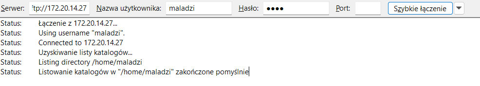

### Generowanie kluczy SSH

Wygenerowano dwa klucze SSH różnych algorytmów:

- **ed25519** – nowoczesny algorytm krzywej eliptycznej, rekomendowany do nowych wdrożeń
- **ecdsa** – starszy algorytm krzywej eliptycznej, zachowany ze względów kompatybilności
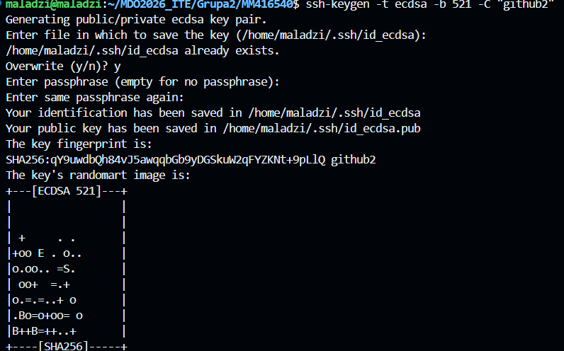

Oba klucze zostały dodane do `ssh-agent` oraz do konta GitHub.

### Git Hook – weryfikacja komunikatu commita

Napisano skrypt `commit-msg`, który wymusza, aby każdy komunikat commita rozpoczynał się od prefiksu `MM416540`.

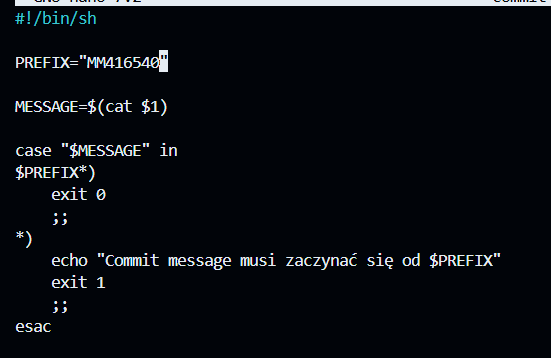

### Pull Request

Zmiany wprowadzono na gałęzi `MM416540` i wystawiono Pull Request do głównego repozytorium kursu `MDO2026_ITE`.

### Podsumowanie zajęć 01

| Zadanie | Uwagi |
|---------|-------|
| Instalacja Git | — |
| VS Code + Remote SSH | Problem z siecią kablową – rozwiązano przez Wi-Fi |
| SFTP (FileZilla) | Uwierzytelnienie kluczem SSH |
| Klucz SSH ed25519 | Dodany do GitHub |
| Klucz SSH ecdsa | Dodany do GitHub |
| Git hook (commit-msg) | Prefiks MM416540 |
| Pull Request | Gałąź MM416540 |

---

## Zajęcia 02 – Wprowadzenie do Dockera

### Cel i zakres

Celem drugich zajęć było praktyczne zapoznanie się z Dockerem: instalacja silnika, logowanie do Docker Hub, zarządzanie obrazami i kontenerami oraz zrozumienie mechanizmu izolacji procesów.

### Instalacja Dockera i logowanie

Zainstalowano Docker Engine na maszynie i zalogowano się do Docker Hub poleceniem `docker login`.

### Podstawowe operacje na obrazach i kontenerach

- Pobrano i uruchomiono obraz `hello-world` w celu weryfikacji instalacji
- Pobrano obrazy: `ubuntu`, `alpine`, `busybox`, `mariadb`, `node`
- Sprawdzono rozmiary pobranych obrazów poleceniem `docker images`
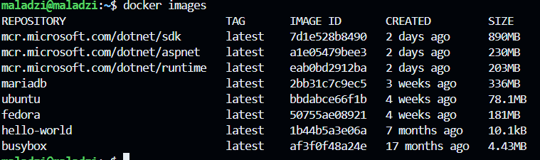

### Analiza kodów wyjścia kontenerów

Zbadano kody wyjścia kontenerów po ich zakończeniu:

- Kontener `mariadb` uruchomiony bez parametrów zakończył się **kodem 1** (błąd) – serwer wymaga zmiennych środowiskowych (np. `MYSQL_ROOT_PASSWORD`)
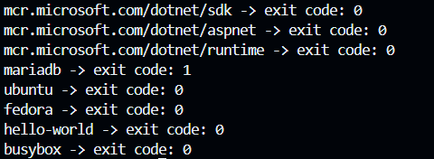
- Po dodaniu wymaganej konfiguracji kontener kończy z **kodem 0** (sukces)


### Kontener interaktywny (busybox)

Uruchomiono kontener `busybox` w trybie interaktywnym (flagi `-it`), co umożliwiło pracę w powłoce `sh` wewnątrz kontenera.

### Izolacja procesów – PID 1 w kontenerze

Zademonstrowano, że pierwszy proces w kontenerze otrzymuje PID 1 – analogicznie do `init`/`systemd` na hoście. Procesy kontenera widoczne są na hoście jako zwykłe procesy systemowe:

### Podsumowanie zajęć 02

| Zadanie |
|---------|
| Instalacja Docker Engine |
| Logowanie do Docker Hub |
| Uruchomienie hello-world |
| Pobieranie i porównanie obrazów |
| Analiza kodów wyjścia (mariadb) |
| Kontener interaktywny (busybox) |
| Izolacja procesów / PID 1 |

---

## Zajęcia 03 – Dockerfiles, kontener jako definicja etapu

### Cel i zakres

Celem zajęć było tworzenie Dockerfiles definiujących etapy pipeline'u CI: budowanie i testowanie, z zachowaniem separacji odpowiedzialności między etapami.

### Wybór repozytorium: `expressjs/express`

Wybrałem repozytorium `expressjs/express` (`https://github.com/expressjs/express`), ponieważ:
- ma otwartą licencję MIT,
- jest popularnym frameworkiem webowym dla Node.js,
- zawiera `package.json` z gotowymi skryptami `npm test` oraz `npm install`,
- testy jednostkowe oparte na Mocha/Supertest dają jednoznaczny raport końcowy (passed/failed).

### Weryfikacja lokalna

Przed konteneryzacją zweryfikowano poprawność budowania lokalnie:

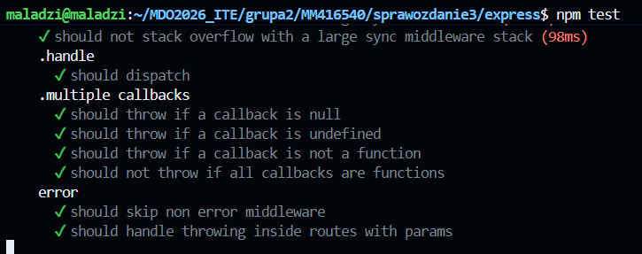

### Dockerfile.build – etap budowania

Plik `Dockerfile.build` tworzy obraz z zainstalowanymi zależnościami projektu. Obraz bazowy: `node:20-alpine` (~60 MB).

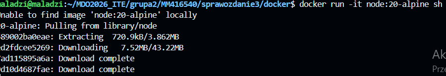

``` dockerfile
# Dockerfile.build
FROM node:20-alpine

# Zainstaluj git (wymagany do klonowania)
RUN apk add --no-cache git

# Ustaw katalog roboczy
WORKDIR /app

# Sklonuj repozytorium
RUN git clone https://github.com/expressjs/express.git .

# Zainstaluj zależności
RUN npm install

# Domyślna komenda – pokazuje, że build zakończył się sukcesem

CMD ["node", "-e", "const e = require('./package.json'); console.log('Express version:', e.version)"]
```

### Dockerfile.test – etap testowania

Plik `Dockerfile.test` bazuje na obrazie `express-build:latest` i jedynie zmienia domyślną komendę – nie powtarza kroków budowania. Kontener kończy z kodem `0` (sukces) lub `1` (błąd testów).
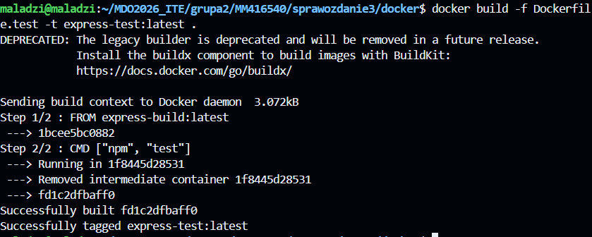

```dockerfile
# Dockerfile.test
FROM express-build:latest


CMD ["npm", "test"]
```


### Docker Compose – zarządzanie etapami

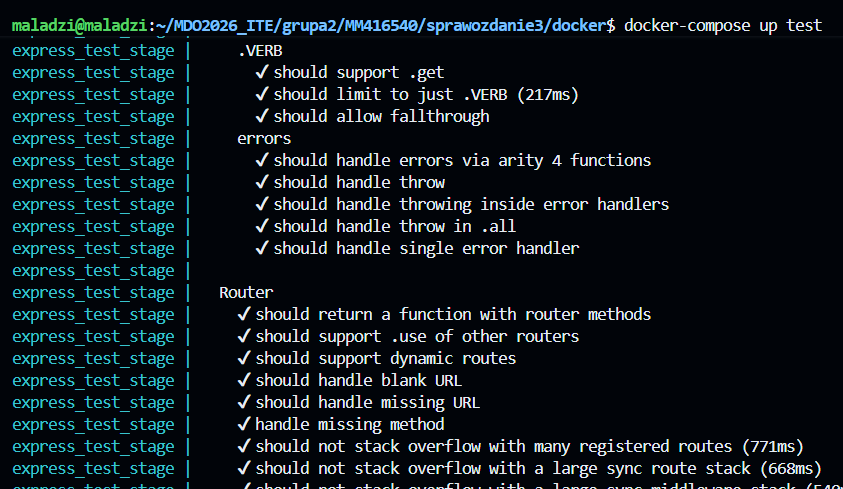

```yaml
# docker-compose.yml
version: "3.9"

services:

  build:
    build:
      context: .
      dockerfile: Dockerfile.build
    image: express-build:latest
    container_name: express_build_stage

  test:
    build:
      context: .
      dockerfile: Dockerfile.test
    image: express-test:latest
    container_name: express_test_stage
    depends_on:
      - build
```

### Dyskusja: przygotowanie do wdrożenia

Obraz buildowy nie nadaje się do produkcji – zawiera `git`, `devDependencies` i narzędzia testowe. Rozwiązaniem jest **multi-stage build**

Express.js jako biblioteka jest standardowo dystrybuowany jako pakiet npm (`.tgz`), nie jako kontener.

### Podsumowanie zajęć 03

| Etap | Dockerfile | Obraz bazowy | Działanie |
|------|-----------|-------------|-----------|
| Build | `Dockerfile.build` | `node:20-alpine` | Klonuje repo, `npm install` |
| Test | `Dockerfile.test` | `express-build:latest` | Wykonuje `npm test` |
| Prod (multi-stage) | `Dockerfile.prod` | `node:20-alpine` | Minimalny obraz produkcyjny |

---

## Zajęcia 04 – Woluminy, sieć, usługi i Jenkins

### Cel i zakres

Zajęcia poświęcone były trwałemu przechowywaniu danych (woluminy), komunikacji sieciowej między kontenerami (iperf3), uruchamianiu usług w kontenerach (SSHD) oraz konfiguracji Jenkins z Docker-in-Docker (DIND).

### Woluminy Docker

#### Tworzenie woluminów

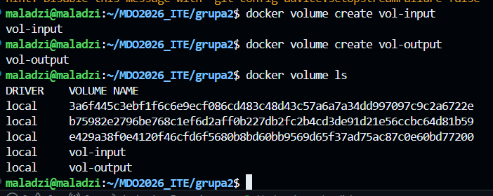

#### Sklonowanie kodu przez kontener pomocniczy

Ponieważ główny kontener buildowy celowo nie zawiera Gita, kod źródłowy umieszczono na woluminie za pomocą oddzielnego, tymczasowego kontenera `alpine/git`:

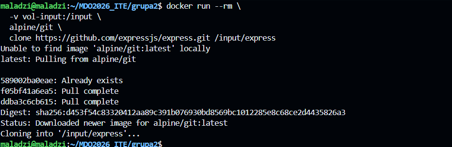

| Metoda | Zalety | Wady |
|--------|--------|------|
| **Kontener pomocniczy z git** | Przenośne, brak gita w kontenerze docelowym | Dodatkowy krok |
| Bind mount z lokalnym katalogiem | Proste | Zależy od stanu hosta |
| Git wewnątrz kontenera bazowego | Wszystko w jednym | Narusza wymaganie |

#### Build z woluminami

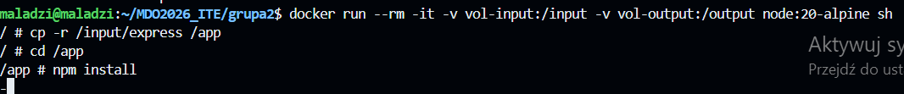

Plik `.tgz` persystuje na woluminie `vol-output` po zakończeniu kontenera.

### Sieć kontenerów – iperf3

#### Domyślna sieć bridge (adres IP)

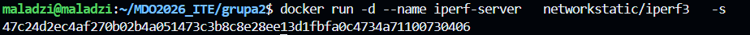

#### Własna sieć mostkowa (DNS)

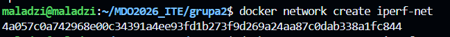

Własna sieć mostkowa umożliwia rozwiązywanie nazw kontenerów przez wbudowany DNS Dockera – czego nie oferuje domyślna sieć `bridge`.

| Scenariusz | Metoda połączenia | Wynik |
|------------|-------------------|-------|
| Domyślna sieć bridge | Adres IP kontenera | ~27 Gbits/s (loopback) |
| Własna sieć mostkowa | Nazwa kontenera (DNS) | ~27 Gbits/s (loopback) |
| Host ↔ kontener | `localhost` + `-p 5201:5201` | Wymaga iperf3 na hoście |

> Wyniki rzędu 27 Gbits/s są artefaktem wirtualnego interfejsu (veth) i nie odzwierciedlają przepustowości fizycznej sieci.

### Usługa SSHD w kontenerze

```dockerfile
FROM ubuntu:22.04

RUN apt-get update && \
    apt-get install -y openssh-server && \
    mkdir /var/run/sshd && \
    echo 'root:password' | chpasswd && \
    sed -i 's/#PermitRootLogin prohibit-password/PermitRootLogin yes/' /etc/ssh/sshd_config

EXPOSE 22
CMD ["/usr/sbin/sshd", "-D"]
```

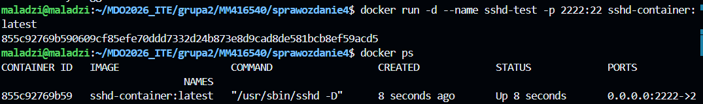

| Zalety | Wady |
|--------|------|
| Znany, uniwersalny protokół | Sprzeczne z filozofią kontenerów (jeden proces) |
| Tunelowanie portów, SCP/SFTP | `docker exec` zastępuje SSH w większości przypadków |
| Przydatny do debugowania | Dodatkowa powierzchnia ataku |
| Działa bez Docker API | Zwiększa rozmiar obrazu i złożoność |

### Jenkins z Docker-in-Docker (DIND)

#### Architektura

```
Host
├── jenkins-docker (docker:dind)      ← uruchamia kontenery kroków pipeline'u
│   └── sieć: jenkins
└── jenkins-blueocean                 ← interfejs webowy Jenkins
    ├── port 8080 → UI
    ├── port 50000 → agenci
    └── sieć: jenkins
```

#### Kroki instalacji

**1. Sieć i woluminy**

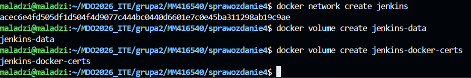

**2. Kontener DIND**

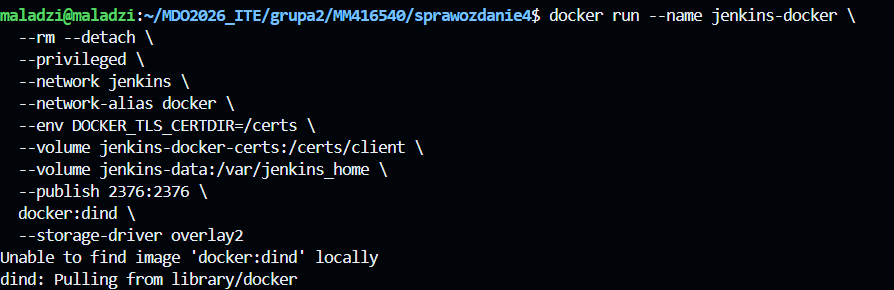

**3. Obraz Jenkins z Blue Ocean**

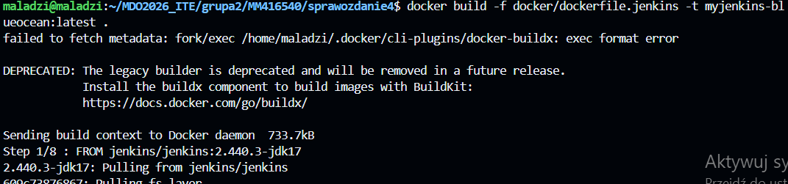

**4. Uruchomienie Jenkins**

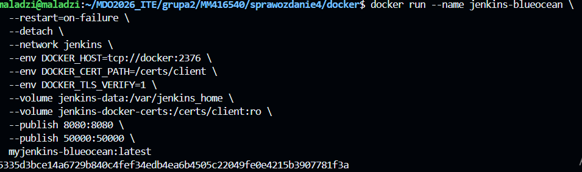

**5. Hasło inicjalne**

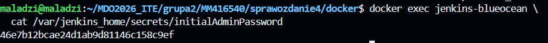

Interfejs dostępny pod adresem `http://10.120.130.27:8080/`.

### Podsumowanie zajęć 04

| Zadanie | Metoda |
|---------|--------|
| Wolumin wejściowy | Kontener pomocniczy `alpine/git` |
| Wolumin wyjściowy | Artefakt `.tgz` na `vol-output` |
| iperf3 – domyślna sieć | Adres IP kontenera |
| iperf3 – własna sieć + DNS | Nazwa kontenera |
| SSHD w kontenerze | `openssh-server`, port 2222 |
| Jenkins + DIND | Blue Ocean, `docker:dind` |
---

## Wnioski i spostrzeżenia

### Kluczowe wnioski techniczne

- **Git i SSH** stanowią fundament pracy z kodem – właściwa konfiguracja (klucze, hooki) od początku chroni integralność repozytorium.
- **Kontener Docker to izolowany proces hosta** – zrozumienie modelu izolacji (PID, sieć, filesystem) jest kluczowe dla efektywnego debugowania.
- **Separacja etapów build/test/deploy** w odrębnych Dockerfiles zwiększa czytelność i umożliwia ponowne użycie warstw obrazów.
- **Multi-stage build** to standard dla obrazów produkcyjnych – eliminuje zbędne zależności i zmniejsza powierzchnię ataku.
- **Własne sieci mostkowe** zapewniają rozwiązywanie nazw DNS między kontenerami, co upraszcza konfigurację usług.
- **Woluminy** persystują dane niezależnie od cyklu życia kontenerów – kluczowe przy artefaktach buildów i danych baz danych.
- **Jenkins z DIND** umożliwia pełny pipeline CI/CD w środowisku kontenerowym.

### Ocena narzędzi

| Narzędzie | Ocena | Zastosowanie |
|-----------|-------|--------------|
| Git + SSH + hooki | 5/5 | Fundament każdego projektu |
| Docker + Dockerfile | 5/5 | Standaryzacja środowisk build/test |
| Docker Compose | 4/5 | Lokalne środowiska wielousługowe |
| Docker woluminy | 4/5 | Persystencja danych, artefakty CI |
| Jenkins + DIND | 3/5 | Automatyzacja pipeline'ów CI/CD |
| SSHD w kontenerze | 2/5 | Tylko do debugowania / scenariusze legacy |

---