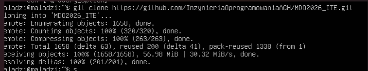
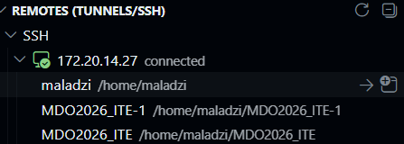
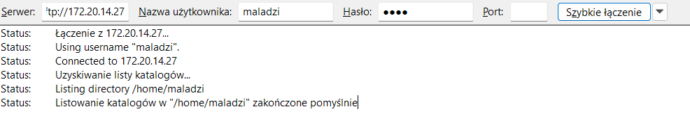
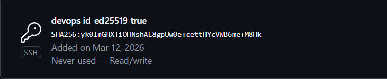
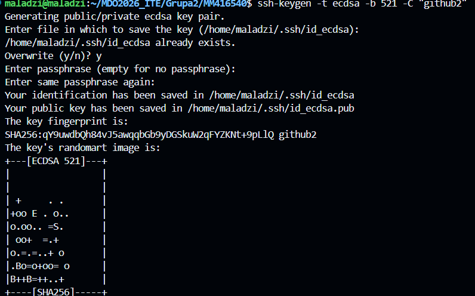
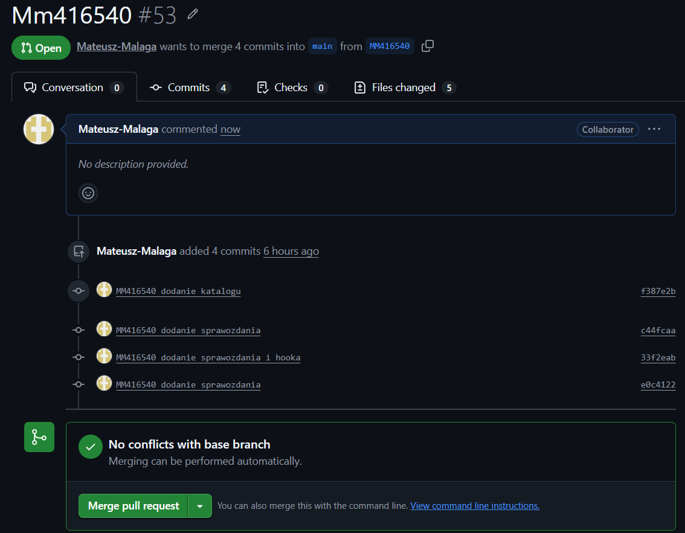

# Sprawozdanie Zajęcia 01

Mateusz Malaga Gr.2

MM416540

## Git
Zainstalowano Git i sklonowano repozytorium.



## Konfiguracja VS code i Remote SSH (wtyczka)

Zainstalowałem wtyczkę i skonfigurowałem połączenie.



Z niedokońca zrozumiałego powodu nie było możliwości podłączenia się do ssh podczas gdy byłem podłączony po kablu, problem rozwiązało przejscie na wi-fi

## Konfiguracja połączenia SFTP w File Zilla



## SSH
Utworzono klucze:
- ed25519



- ecdsa



## Utworzenie Git Hook'a do werfikacji 

Treść:
```bash

#!/bin/sh

PREFIX="MM416540"

MESSAGE=$(cat "$1")

case "$MESSAGE" in
$PREFIX*)
    exit 0
    ;;
*)
    echo "Commit message musi zaczynać się od $PREFIX"
    exit 1
    ;;
esac
```

## Pull Request


## Podsumowanie
Podczas zajęć:

przygotowano środowisko pracy z Git i SSH,
wygenerowano dwa klucze SSH (ed25519 oraz ecdsa),
dodano klucze do ssh-agent oraz do konta GitHub,
przetestowano połączenie SSH z GitHub,
sklonowano repozytorium przy użyciu protokołu SSH,
utworzono gałąź MM416540,
przygotowano git hook sprawdzający poprawność komunikatu commita.