# Zajęcia 10 – Kubernetes (minikube)

---

## CZĘŚĆ 1: Instalacja minikube i kubectl

### 1: Instalacja minikube
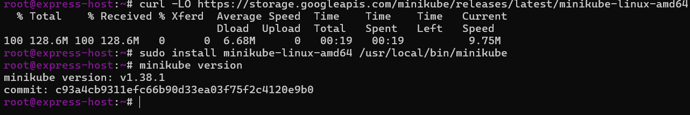

### 2: Instalacja kubectl

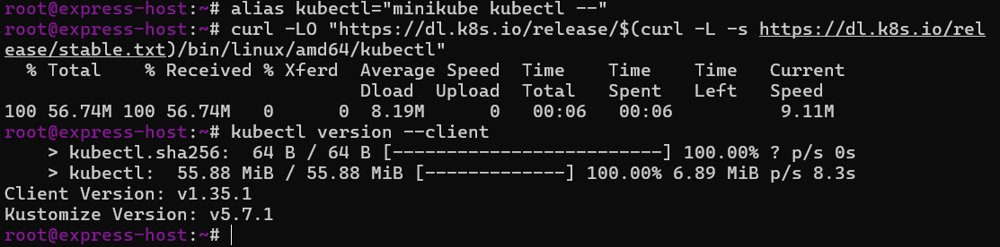
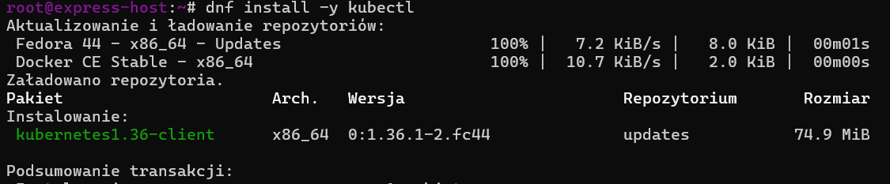

###  3: uruchomienie minikube ( i problemy ze względu na specyfikację )

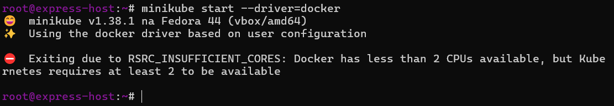
Dodałem dodatkowy core w maszynie witualnej 

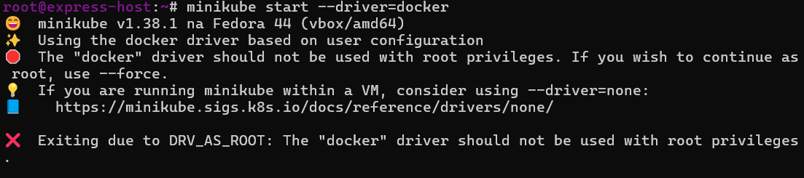

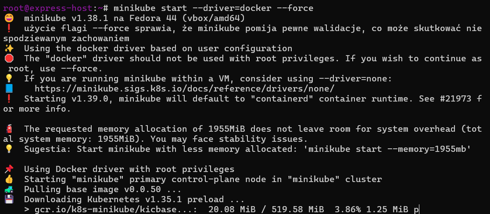

###  4:  status klastra

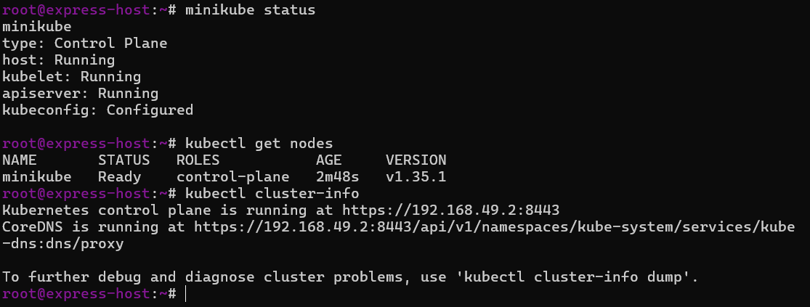

## CZĘŚĆ 2: Dashboard

###  5: Uruchomienie Dashboarda

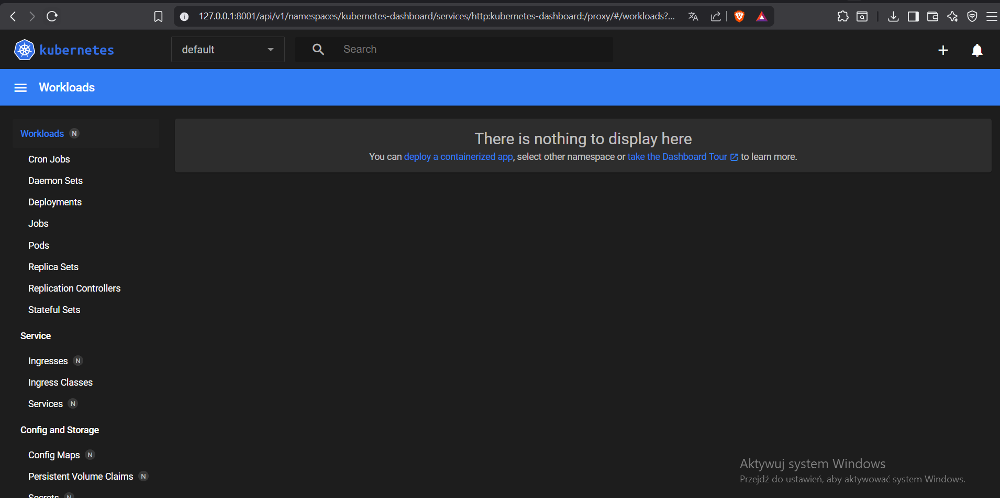

## CZĘŚĆ 3: Analiza kontenera – Express.js

###  6: obraz do minikube

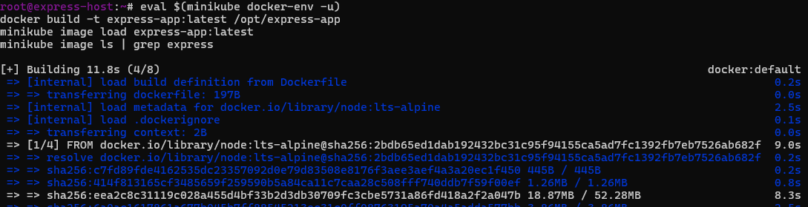
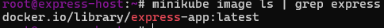

###  7: Weryfikacja że kontener pracuje (nie kończy od razu)

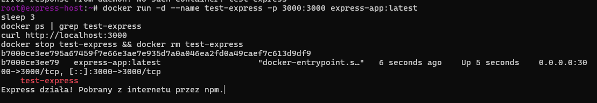

---

## CZĘŚĆ 4: Uruchomienie na Kubernetes

###  8: Uruchomienie pod z aplikacją

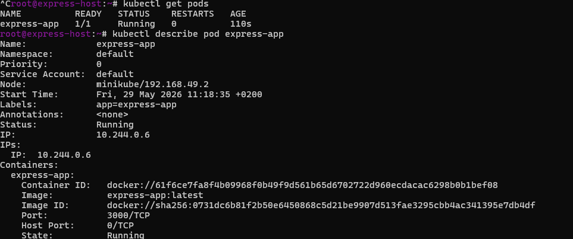
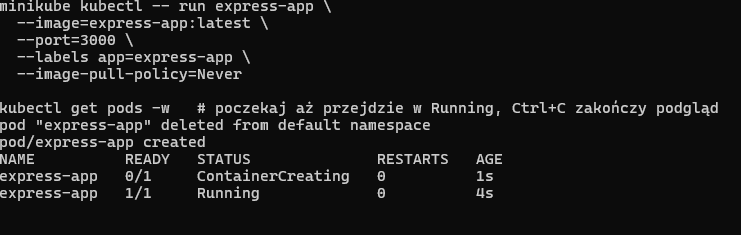

`--image-pull-policy=Never` – używa lokalnego obrazu zamiast pobierać z Docker Hub.

###  9:  Status poda

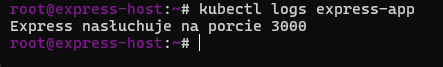

### 10: Wyprowadzanie portu

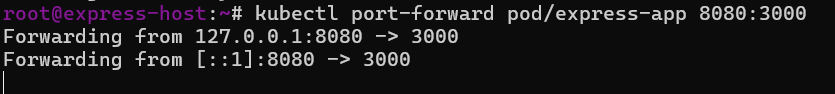
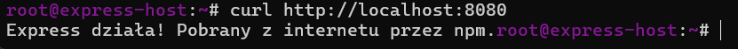

---

## CZĘŚĆ 5: Plik wdrożenia (Deployment YAML)

### 11: utworzyłem plik deployment.yml i Próbne wdrożenie nginx (test)

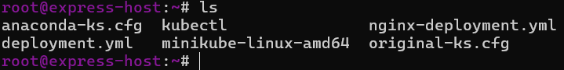
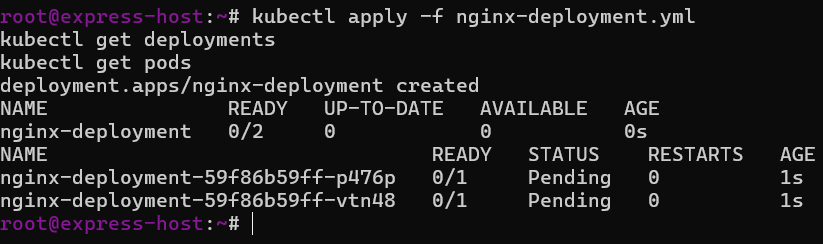

### 13: Wdrożenie Express z 4 replikami

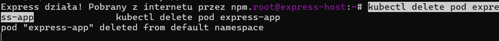

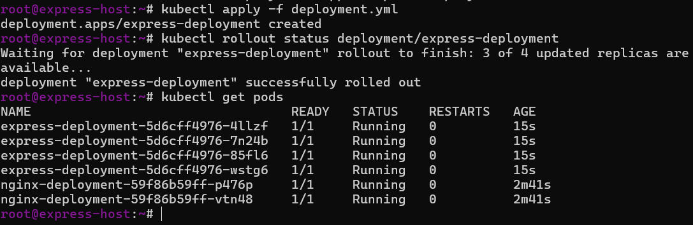
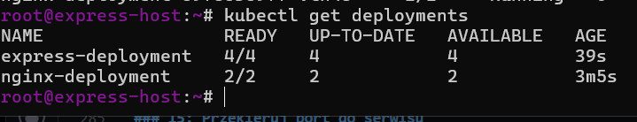

### 14: Eksportacja jako serwis

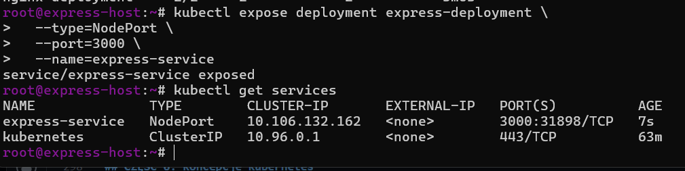

### 15: Przekierowanie portu do serwisu

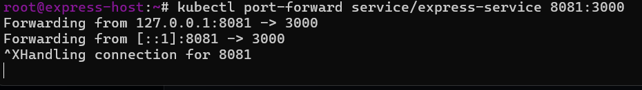
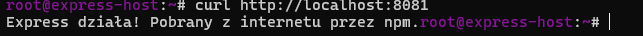

## CZĘŚĆ 6: Koncepcje Kubernetes

### Pod
Najmniejsza jednostka w Kubernetes. Zawiera jeden lub więcej kontenerów współdzielących sieć i storage. Tymczasowy – może być tworzony i usuwany automatycznie.

### Deployment
Zarządza zestawem identycznych podów. Zapewnia że zawsze działa określona liczba replik. Obsługuje rolling updates i rollback.

### Service
Stały punkt dostępu do zestawu podów. Działa jako load balancer. Typy: ClusterIP, NodePort, LoadBalancer.

### ReplicaSet
Zarządza liczbą replik podów. Tworzony automatycznie przez Deployment.

---

## Wymagania sprzętowe – mitygacja problemów

| Problem | Rozwiązanie |
|---------|-------------|
| Mało RAM (< 2 GB) | `minikube start --memory=1800mb` |
| Brak docker grupy | `sudo usermod -aG docker $USER && newgrp docker` |
| Wolny dysk | `minikube start --disk-size=10g` |
| Brak CPU (< 2 rdzenie) | `minikube start --cpus=1` |

Minimalne wymagania minikube: 2 CPU, 2 GB RAM, 20 GB dysk.

---

## Typowe pułapki

| Objaw | Przyczyna | Rozwiązanie |
|-------|-----------|-------------|
| `ImagePullBackOff` / `ErrImagePull` | k8s próbuje pobrać `:latest` z Docker Hub | `imagePullPolicy: Never` w YAML lub `--image-pull-policy=Never` w `kubectl run` |
| `failed to read dockerfile: open Dockerfile.production` | Zła nazwa pliku lub zły katalog kontekstu | Plik nazywa się `Dockerfile`, kontekst to `/opt/express-app` |
| `pull access denied for express-prod` | Pomyłka nazwy obrazu | Właściwa nazwa: `express-app:latest` |
| `failed to resolve reference docker.io/...` podczas `docker build` w docker-env minikube | Sieć/DNS klastra minikube nie dociera do internetu | Buduj na hoście (Metoda 1 w kroku 6) i `minikube image load` |
