# Zajęcia 11 – Kubernetes (2): Strategie wdrożeń
## Sprawozdanie

---

## CZĘŚĆ 1: Przygotowanie wersji obrazów

###  1:  wersja 5.2.1 (aktualna)

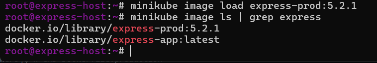

###  2:  wersja 5.2.2 (nowa wersja)

przepokowanie istniejącego obrazu przez commit:
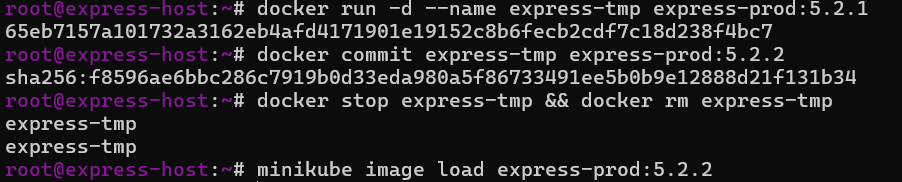

###   3:  wersja "wadliwą" (5.2.3-broken)

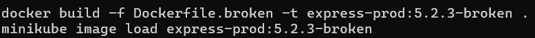

###   4: Weryfikacja dostępnych obrazów

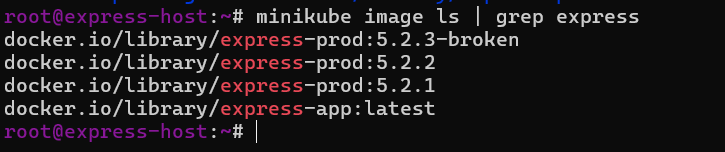

## CZĘŚĆ 2: Zmiany w deploymencie

### Bazowy plik deployment.yml (wersja startowa – 4 repliki)

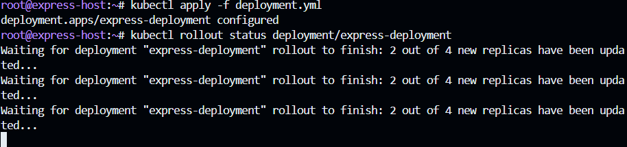

---

###   5: Zwiększenie replik do 8

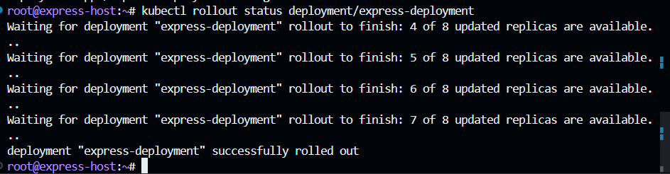
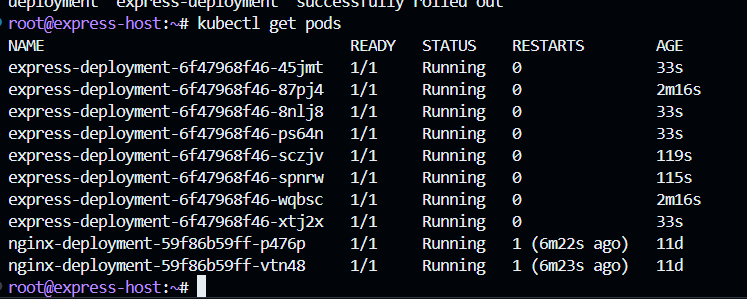

###   6: Zmniejszenie replik do 1

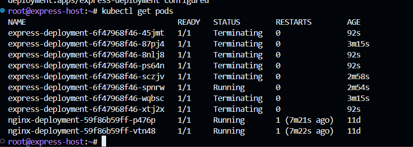

###   7: Zmniejszenie replik do 0

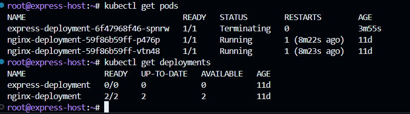

###   8: Przeskalowanie do 4 replik

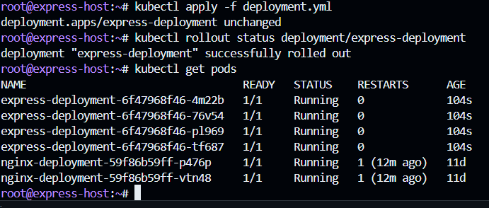

---

###   9: Zastosowanie nowej wersji obrazu (5.2.2)

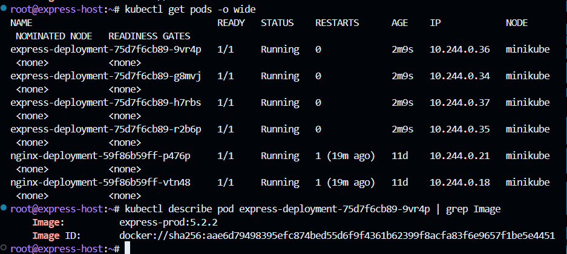

---

###   10: Powrót do starszej wersji (5.2.1)

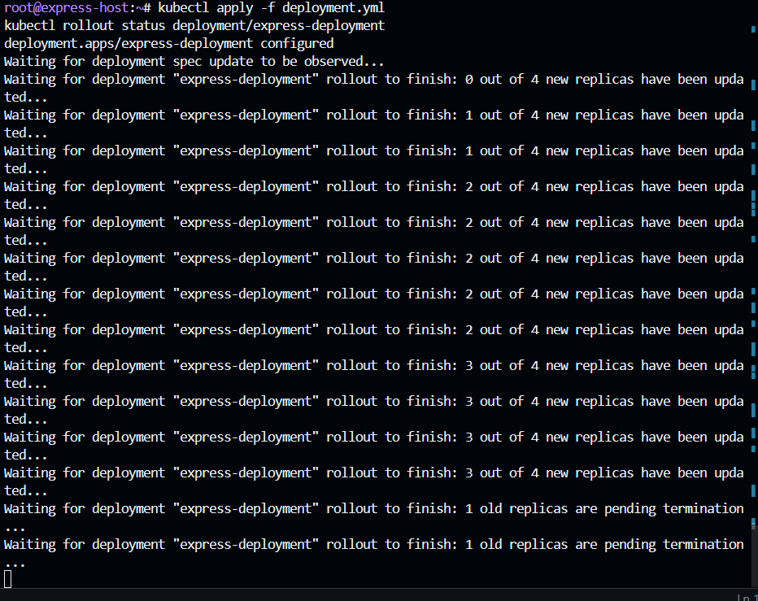

---

###   11: Zastosowanie wadliwego obrazu (5.2.3-broken)

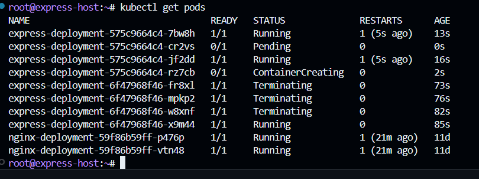
Deployment się "zawiesza" – stare pody dalej działają

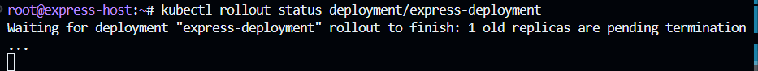

Waiting for deployment... (nie kończy się)

---

## CZĘŚĆ 3: Historia i cofanie wdrożeń

###   12: Historia wdrożeń

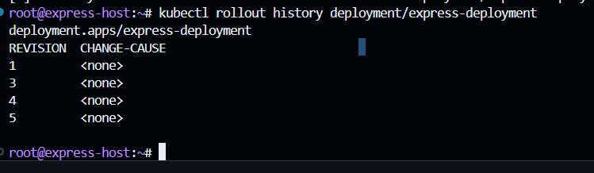

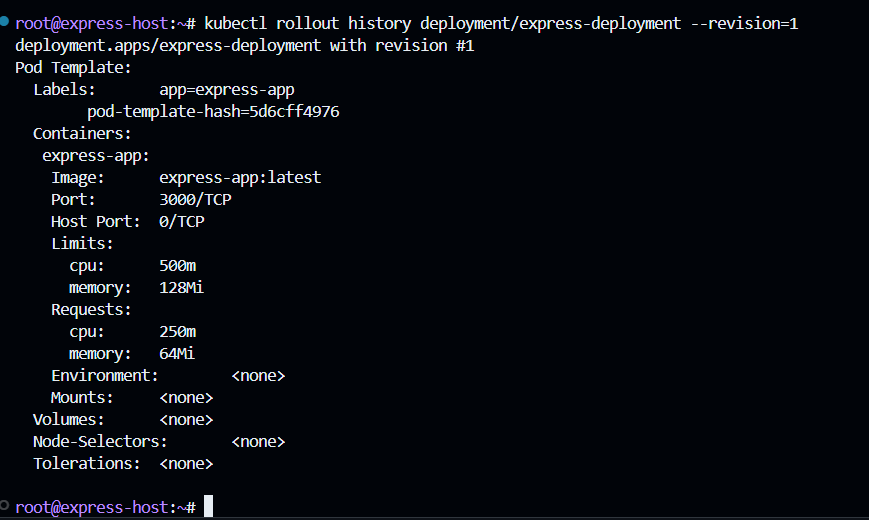

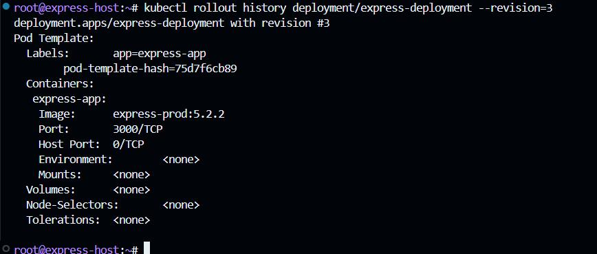

Aby historia miała opisowe nazwy, można dodać adnotację przy apply:

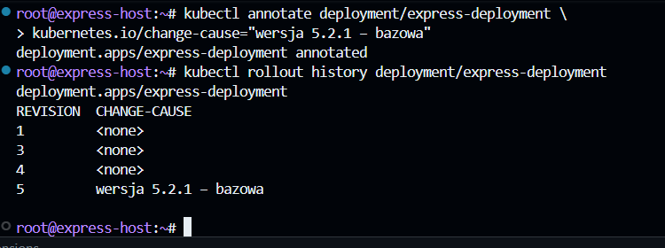

###   13: Cofnięcie wdrożenia (undo)

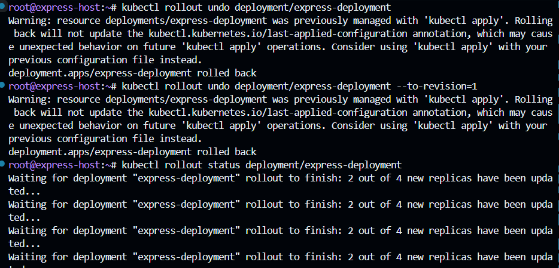
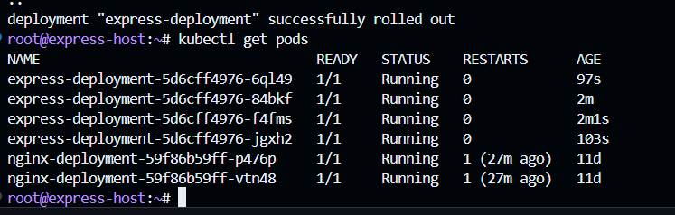

---

## CZĘŚĆ 4: Skrypt weryfikujący wdrożenie

###   14:  skrypt verify-deployment.sh

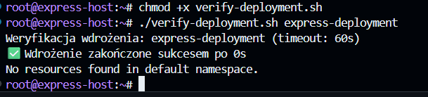

## CZĘŚĆ 5: Strategie wdrożeń

###   15: Strategia Recreate

Zatrzymuje WSZYSTKIE stare pody przed uruchomieniem nowych. Powoduje chwilową niedostępność.

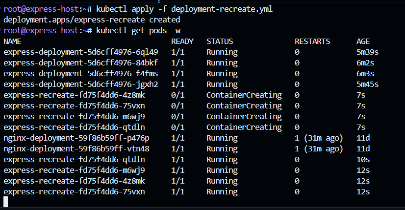

wszystkie pody zatrzymują się naraz, potem nowe startują

---

###   16: Strategia Rolling Update (z parametrami)

Aktualizuje pody stopniowo. Zawsze część podów jest dostępna.

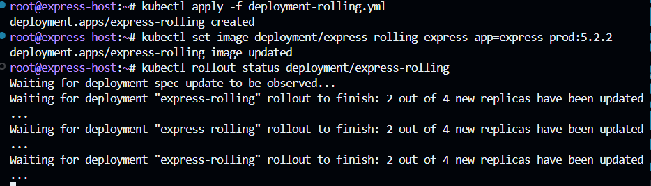

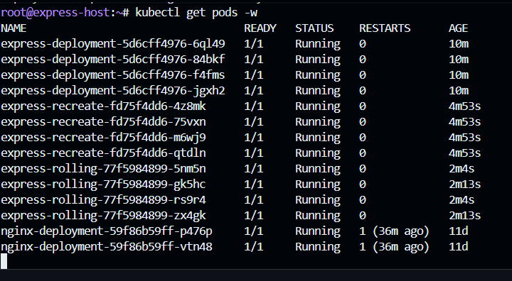

---

###   17: Strategia Canary Deployment

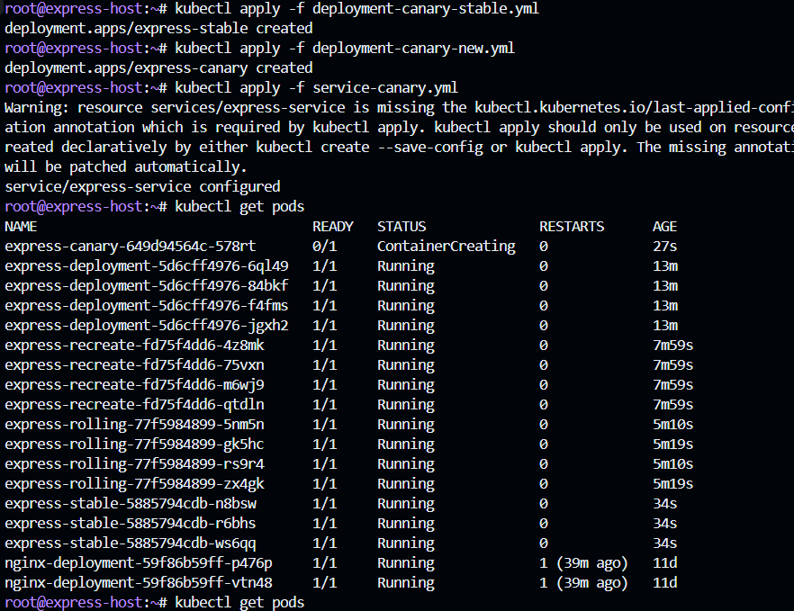
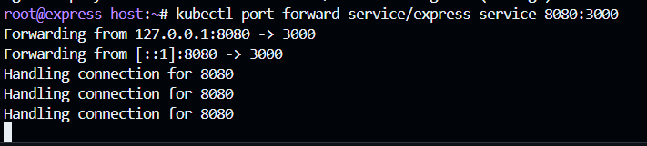
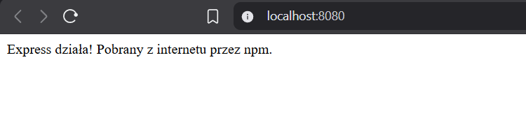

---

## CZĘŚĆ 6: Porównanie strategii

| Strategia | Downtime | Ryzyko | Rollback | Kiedy używać |
|-----------|---------|--------|----------|--------------|
| **Recreate** | TAK (chwilowy) | Wysokie | Szybki | Środowiska testowe, brak wymogów dostępności |
| **RollingUpdate** | NIE | Średnie | Automatyczny | Produkcja, stopniowa aktualizacja |
| **Canary** | NIE | Niskie | Usuń canary deployment | Testowanie nowej wersji na części ruchu |

### Obserwacje

**Recreate:** Podczas aktualizacji z 5.2.1 na 5.2.2 wszystkie 4 pody zatrzymały się jednocześnie, przez ~10 sekund aplikacja była niedostępna, następnie uruchomiono 4 nowe pody z wersją 5.2.2.

**Rolling Update:** Aktualizacja przebiegła stopniowo – najpierw zatrzymano 2 pody (maxUnavailable=2), uruchomiono 2 nowe z 5.2.2, potem kolejne 2. Aplikacja była cały czas dostępna.

**Canary:** Ruch był rozłożony 75% na wersję stabilną (5.2.1) i 25% na canary (5.2.2). Po potwierdzeniu że 5.2.2 działa poprawnie – usunięto canary deployment i przeskalowano stable do 4 replik z nową wersją.