# Zajęcia 12 – Wdrażanie kontenerów w chmurze (Azure)
## Sprawozdanie

---

## 1. Przygotowanie kontenera

### Weryfikacja obrazu lokalnie

Przed wdrożeniem w Azure upewniono się że obraz działa poprawnie lokalnie:

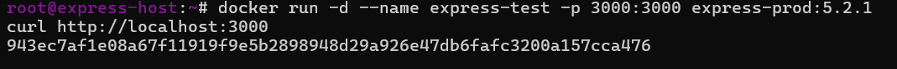

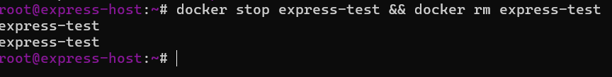

### Publikacja obrazu na Docker Hub

Obraz musi być publicznie dostępny na Docker Hub aby Azure mógł go pobrać:

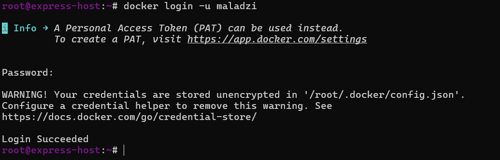

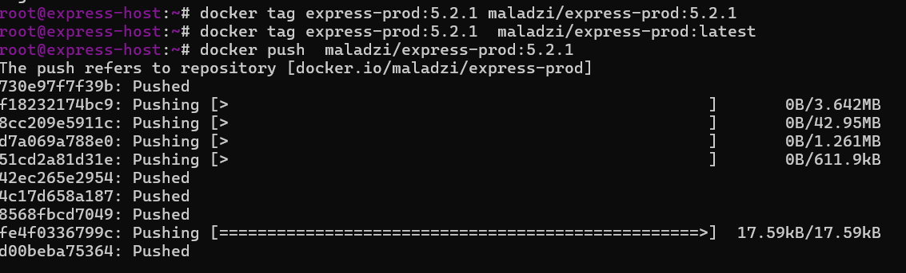

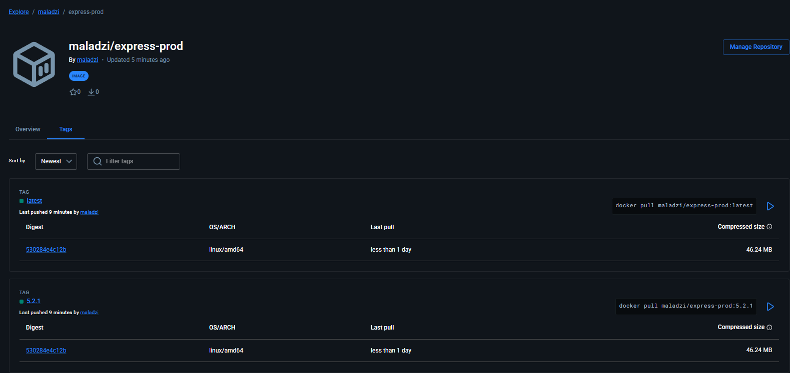

---

## 2. Platformą Azure

### Cennik Azure Container Instances

Przed wdrożeniem zapoznano się z cennikiem

Kluczowe informacje:
- Opłata za czas działania kontenera (per sekunda)
- Opłata za vCPU i pamięć RAM osobno
- Bezpłatny tier: 180 000 vCPU-sekund / miesiąc

---

## 3. Wdrożenie kontenera

### 1: utworzenie Resource Group

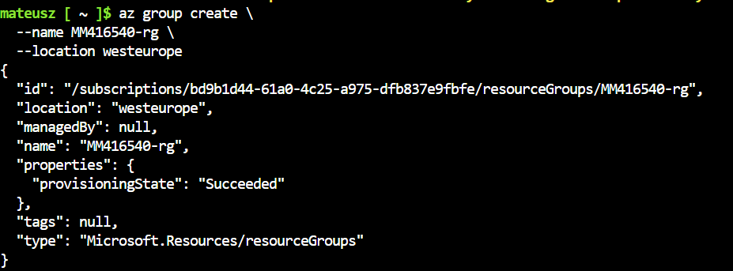

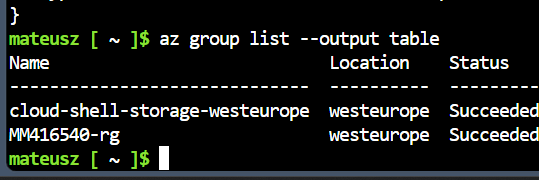

### 2: Wdrożenie kontenera z Docker Hub

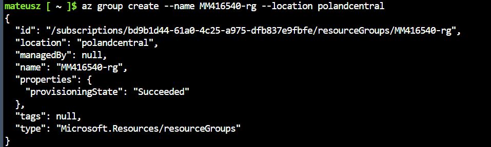
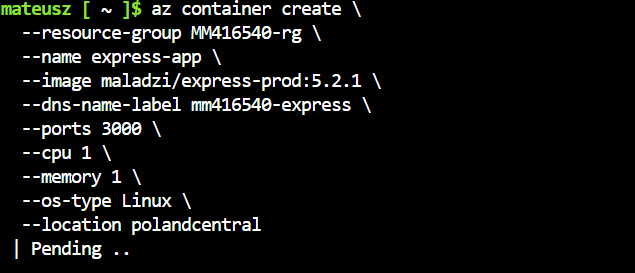

### 3:  Status kontenera

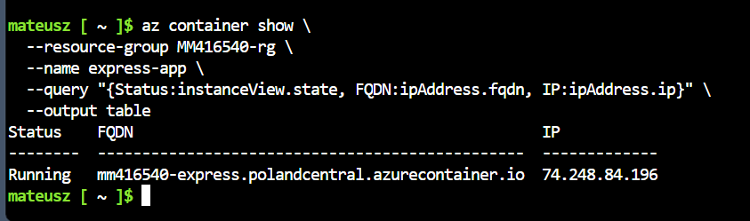

### 4: Pobranie logów kontenera

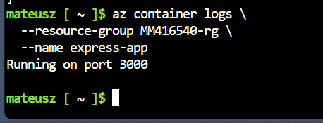

### 5: Weryfikacja działania – dostęp HTTP

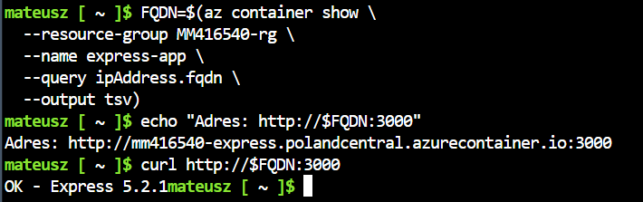

Aplikacja dostępna pod adresem:
http://mm416540-express.polandcentral.azurecontainer.io:3000/

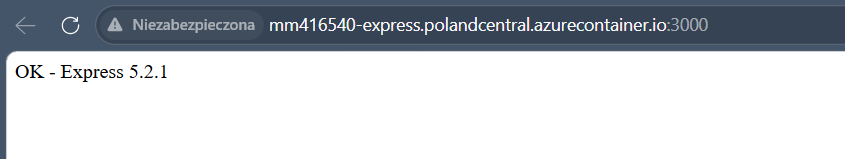

---

## 4. Zatrzymanie i usunięcie kontenera

### 6: zatrzymanie kontenera

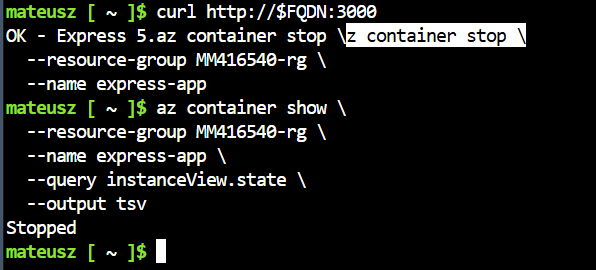

###   7: usunięcie kontenera

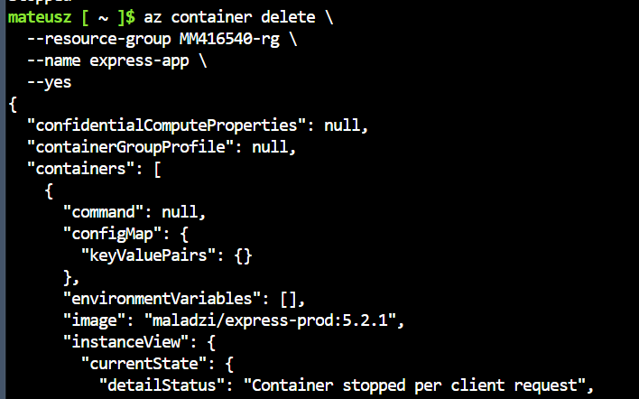

###   8: usunięcie Resource Group

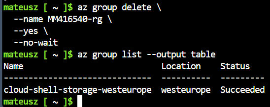

---

## 5. Dyskusja

### Dlaczego nie potrzeba Azure Container Registry?

Zadanie explicite wskazuje że nie jest potrzebne tworzenie Docker Registry w Azure. Obraz `express-prod:5.2.1` jest już dostępny na publicznym Docker Hub – Azure Container Instances może go pobrać bezpośrednio.

ACR (Azure Container Registry) byłoby potrzebne gdy:
- Obraz jest prywatny
- Wymagana jest niska latencja pobierania (rejestr w tym samym regionie)
- Wymagana jest integracja z Azure Active Directory

### Metoda dostępu do serwisu HTTP

Azure Container Instances udostępnia kontener przez:
- **FQDN** (Fully Qualified Domain Name) – `mm416540-express.westeurope.azurecontainer.io`
- **Publiczny adres IP** – przydzielany automatycznie

Port 3000 jest bezpośrednio dostępny z internetu bez dodatkowej konfiguracji load balancera.

### Porównanie z minikube (lokalne k8s)

| Aspekt | minikube (lokalnie) | Azure Container Instances |
|--------|--------------------|-----------------------------|
| Dostępność | Tylko lokalnie | Publiczny internet |
| Koszty | Brak | Per sekunda działania |
| Konfiguracja | Złożona | Jedno polecenie `az container create` |
| Skalowanie | Ręczne | Automatyczne (ACI) |
| Zastosowanie | Deweloperskie | Produkcyjne/testowe |

