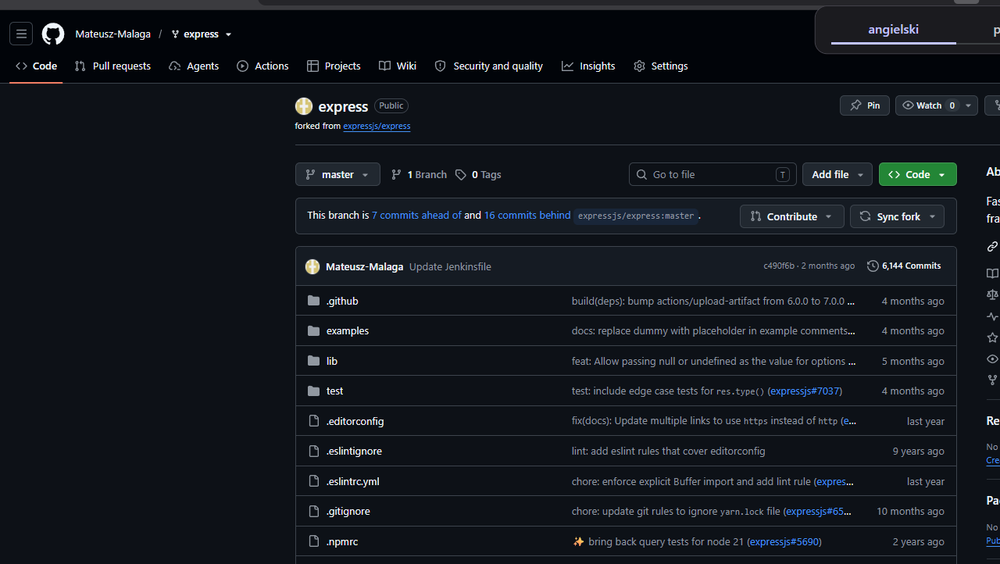
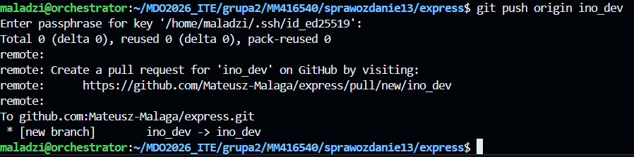
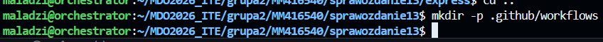
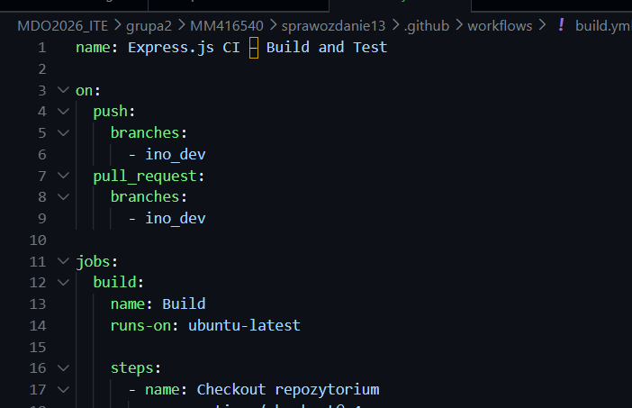
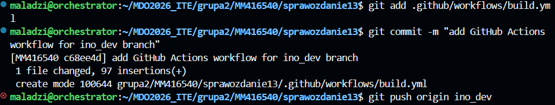
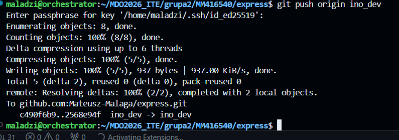
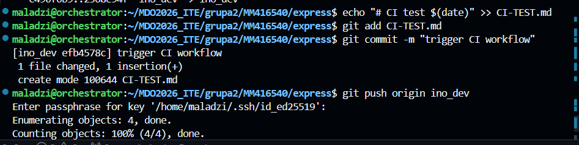
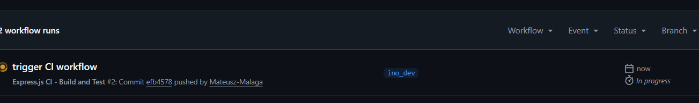

# Zajęcia 13 – Shift-left: GitHub Actions

## 1. Koncepcja GitHub Actions

GitHub Actions to platforma CI/CD wbudowana w GitHub. Pozwala automatyzować procesy (build, test, deploy) bezpośrednio w repozytorium bez zewnętrznych narzędzi (jak Jenkins).

### Kluczowe pojęcia

| Pojęcie | Opis |
|---------|------|
| **Workflow** | Plik YAML definiujący automatyzację, przechowywany w `.github/workflows/` |
| **Trigger** | Zdarzenie uruchamiające workflow (push, pull_request, schedule...) |
| **Job** | Zestaw kroków wykonywanych na jednym runnerze |
| **Step** | Pojedynczy krok w jobie (polecenie lub akcja) |
| **Action** | Gotowy, wielokrotnego użytku komponent (np. `actions/checkout`) |
| **Runner** | Maszyna wirtualna wykonująca job (GitHub-hosted lub self-hosted) |

### Cennik

Darmowy plan GitHub (Free) zawiera:
- **2000 minut/miesiąc** dla repozytoriów publicznych – **nielimitowane**
- 2000 minut/miesiąc dla repozytoriów prywatnych
- Minuty liczone tylko dla GitHub-hosted runnerów
- Repozytorium Express.js jest publiczne → bez limitów

---

## 2. Przygotowanie repozytorium

###   1: Fork



###   2:  gałąź ino_dev



---

## 3. Plik GitHub Actions Workflow

###   4: Utwórzono plik workflow



###   5: Wypchnięcie workflow do repozytorium



---

## 4. Trigger – wyjaśnienie

Workflow uruchamia się na dwa sposoby:

```yaml
on:
  push:
    branches:
      - ino_dev        # przy każdym push do ino_dev
  pull_request:
    branches:
      - ino_dev        # przy PR do ino_dev
```

**Dlaczego `ino_dev` a nie `master`?**
- Zgodnie z wymaganiem zadania – nie commitujemy pipeline'ów do głównej gałęzi
- `ino_dev` to dedykowana gałąź deweloperska
- Kontrybutorzy głównego projektu nie wciągną naszych workflow'ów

---

## 5. Weryfikacja działania

###   6: Wywołaj workflow przez commit






---

## 6. Porównanie GitHub Actions vs Jenkins

| Aspekt | GitHub Actions | Jenkins |
|--------|---------------|---------|
| Konfiguracja | Plik YAML w repo | Jenkinsfile + serwer |
| Infrastruktura | GitHub-hosted runners | Własny serwer + DIND |
| Trigger | Zdarzenia GitHub (push, PR) | Webhook, polling, manual |
| Artefakty | `upload-artifact` | `archiveArtifacts` |
| Koszt | Darmowy dla publicznych repo | Własna infrastruktura |
| Izolacja | Każdy job nowy runner | Współdzielony agent |
| Shift-left | TAK – CI w repo | NIE – zewnętrzny serwer |

### Shift-left

Koncepcja **shift-left** oznacza przesunięcie testowania i weryfikacji jak najwcześniej w cyklu życia oprogramowania. GitHub Actions realizuje to przez:
- Automatyczny build przy każdym push
- Testy uruchamiane przed merge do głównej gałęzi
- Code quality checks w PR
- Brak potrzeby zewnętrznego serwera CI

---