# Sprawozdanie Zajęcia 03

Mateusz Malaga Gr.2

MM416540

## 1. Wybor opragramowania

Wybrałem repozytorium expressjs/express (https://github.com/expressjs/express) ponieważ ma otawrtą licencje MIT, jest to popularny framwork webowy dal Node.js, zawiera package.json z gotowymi skryptami npm test oraz npm install, a testy jednostkowe opartne na Mocha/Supertest dają jednoznaczny raport końcowy (liczba testów passed/failed)    

## 2. Kroki wykonane lokalnie (poza kontenerem)

``` bash
# Klonowanie repozytorium
git clone https://github.com/expressjs/express.git
cd express

# Instalacja zależności
npm install

# Uruchomienie testów
npm test

```
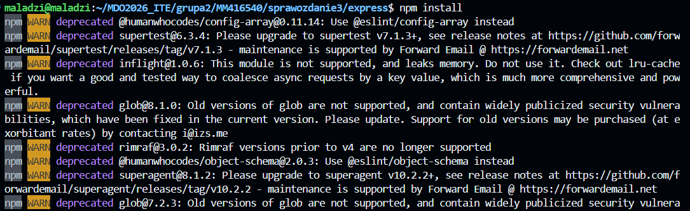

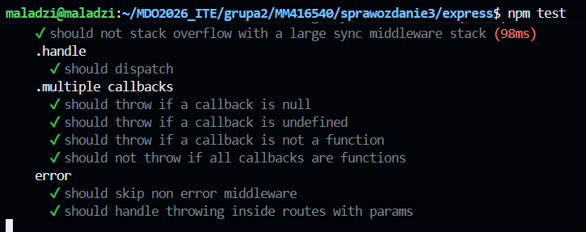

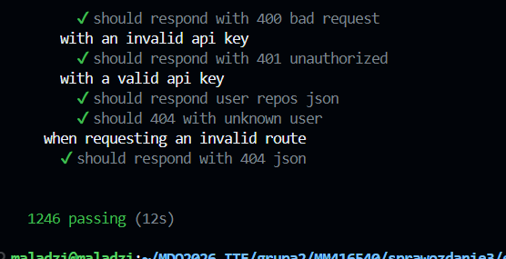

Program przechodzi wszystkie załączone testy jednostkowe

## 3. Izolacja i powtarzalność: build w kontenerze (interaktywnie)

### 3.1 Wybór obrazu bazowego

wybrałem node:20-alpine ponieważ zawiera node.js i npm a dotego nie waży zadużo 

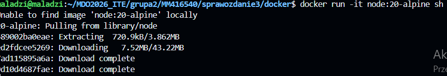

### 3.2 Kroki interaktywne

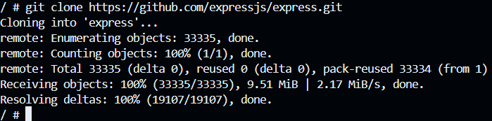
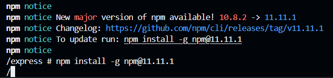
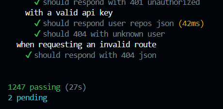

Wynik jest mniej więcej identyczny jak lokalnie w obu przypadach zero faili

## 4. Dockerfile – wersja 1: Build

Tworzymy plik docker który automatyzuje powyższe kroki ale nie robi testów
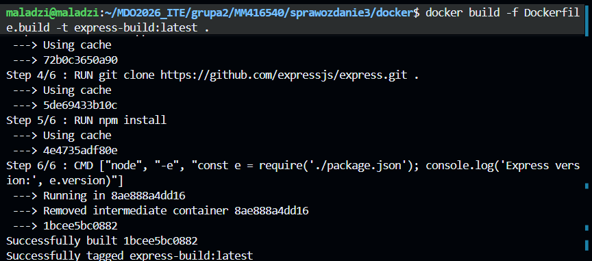
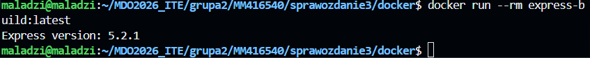

## 5. Dockerfile – wersja 2: Test

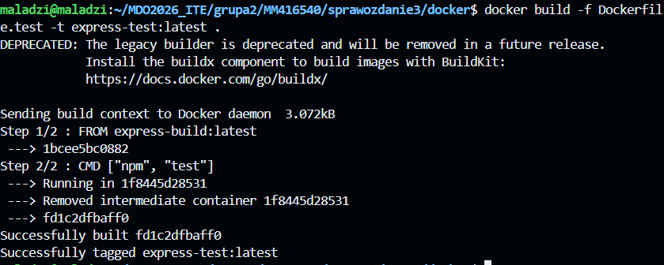
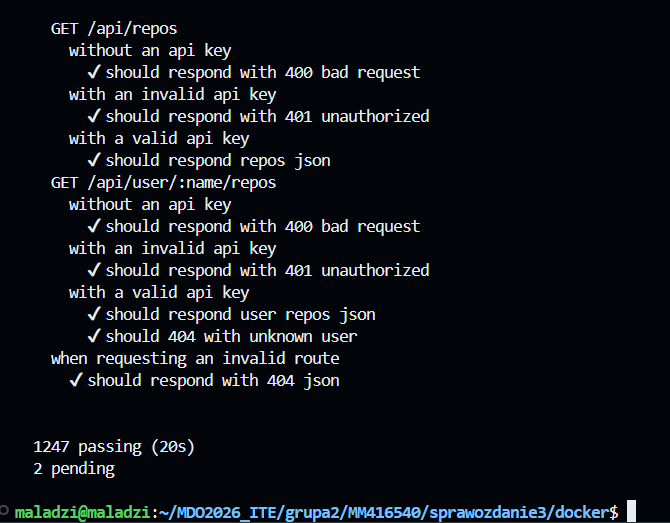

zero błędów wynik taki sam jak w kontenerze 

## 6. Weryfikacja poprawności działania kontenerów

### Różnica: obraz vs kontener

| Pojęcie | Definicja |
|---------|-----------|
| **Obraz (image)** | Niezmienny szablon – wynik docker build. Przechowywany na dysku. |
| **Kontener** | Uruchomiona instancja obrazu – izolowany proces z własnym filesystem, siecią, PID. |

## Co pracuje w kontenerze?

W kontenerze express-test pracuje:
- proces node uruchamiający framework testowy Mocha,
- Mocha wczytuje i wykonuje pliki z katalogu test/,
- każdy test wysyła żądania HTTP do tymczasowej instancji Express,
- po zakończeniu Mocha drukuje raport i kończy proces.

Kontener jest efemeryczny – żyje tylko przez czas wykonania testów.

### Sprawdzenie listy obrazów i kontenerów:

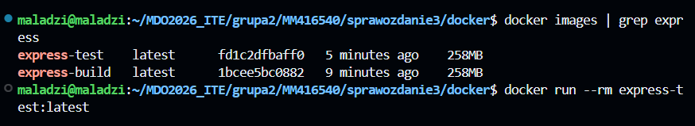

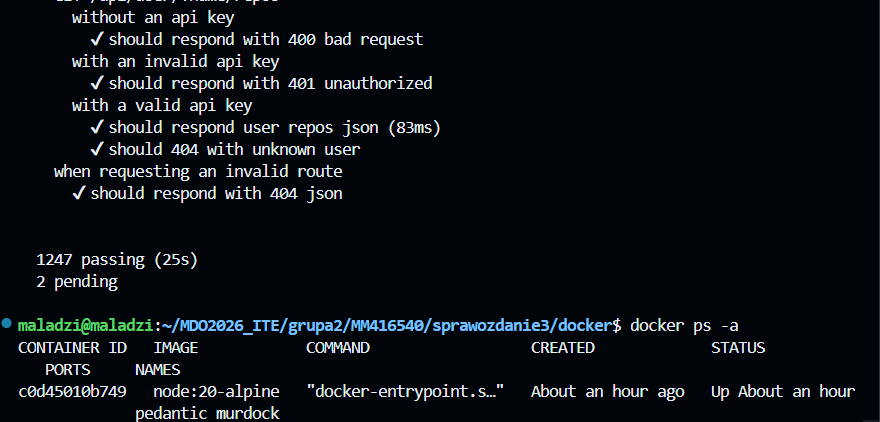
brak – kontenery z --rm usuwają się po zakończeniu


## 7. Docker Compose (zadanie dodatkowe)

Plik docker-compose.yml pozwala zarządzać etapami bez ręcznego wywoływania docker build i docker run

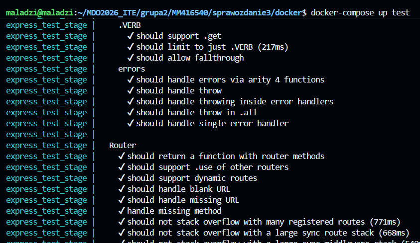
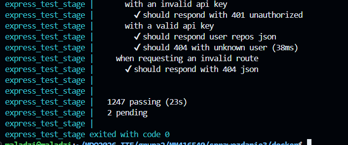
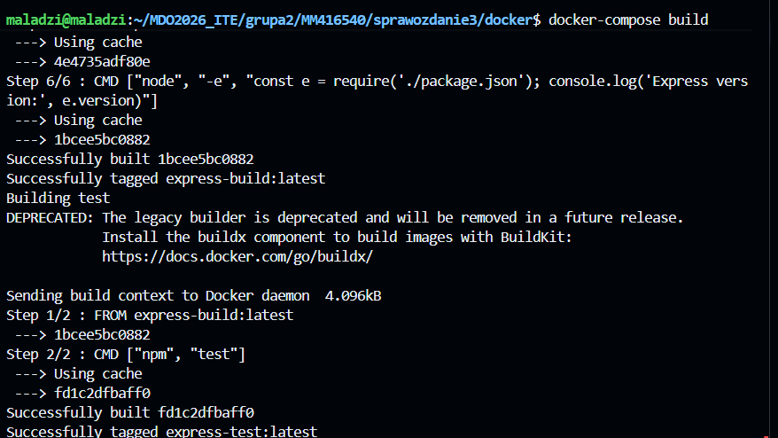
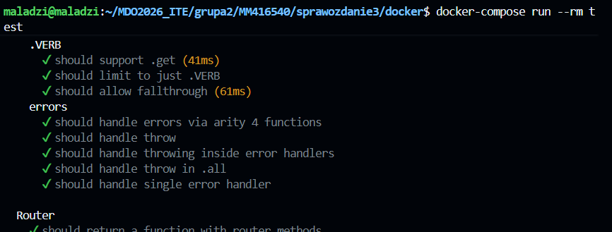

depends_on: build gwarantuje, że obraz express-build zostanie zbudowany przed obrazem express-test.

## 8. Dyskusja

### 8.1 Czy Express.js nadaje się do wdrażania jako kontener?

**Tak – Express.js jest doskonałym kandydatem do wdrożenia jako kontener.**

Express to serwer HTTP, który z natury działa jako długożyjący proces nasłuchujący na porcie. Kontenery Docker idealnie pasują do tego modelu: izolują środowisko, umożliwiają skalowanie horyzontalne (np. w Kubernetes) i są przenośne między środowiskami.

Natomiast **obecny kontener buildowy nie jest optymalny do wdrożenia** z następujących powodów:
- zawiera git, narzędzia deweloperskie, testy i devDependencies,
- obraz jest niepotrzebnie duży,
- obecność kodu testów i narzędzi build stanowi zbędne ryzyko bezpieczeństwa.

### 8.2 Wieloetapowy build (multi-stage) jako rozwiązanie

Najlepszą praktyką jest zastosowanie **multi-stage build**

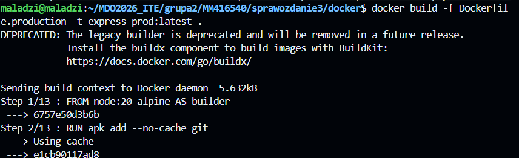
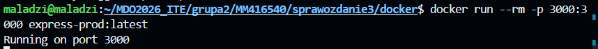
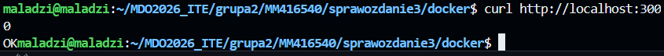
Odpowiada OK to oznacza że działa 

**Zalety multi-stage:**
- Końcowy obraz nie zawiera gita, narzędzi budowania ani testów
- Znacznie mniejszy rozmiar (np. 60 MB zamiast 180 MB)
- Mniejsza powierzchnia ataku

### 8.3 Osobna ścieżka CI vs Deploy

W praktyce pipeline CI/CD ma **oddzielne Dockerfiles**:

Dockerfile.build   → obraz z wszystkimi zależnościami (build + devDeps)

Dockerfile.test    → bazuje na build, uruchamia testy

Dockerfile.prod    → multi-stage, minimalny obraz produkcyjny

Lub używa się jednego pliku z wieloma stagami

### 8.4 Alternatywne formaty dystrybucji

Dla biblioteki takiej jak Express.js (a nie aplikacji) kontener produkcyjny nie ma sensu – biblioteka jest dystrybuowana jako pakiet npm (npm publish). Analogicznie dla innych ekosystemów:

| Ekosystem | Format pakietu | Odpowiednik |
|-----------|---------------|-------------|
| Node.js   | `.tgz` (npm)  | `npm pack && npm publish` |
| Java      | `.jar` / `.war` | `mvn package` |
| Python    | `.whl` / `.egg` | `python -m build` |
| Debian    | `.deb`         | `dpkg-buildpackage` |
| Red Hat   | `.rpm`         | `rpmbuild` |

### 8.5 Trzeci kontener: pakowanie artefaktu

Jeśli wymagana jest dystrybucja jako pakiet (np. `.deb`), można dodać trzeci etap:

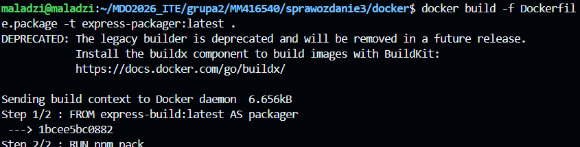
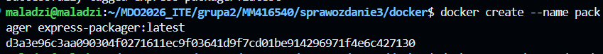
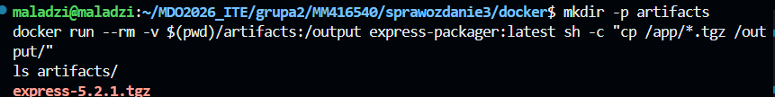
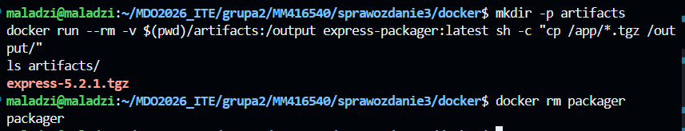

W środowisku CI (np. GitHub Actions, GitLab CI) artefakt byłby przechowywany jako artifact pipeline'u lub publikowany do rejestru (npm registry, Nexus, Artifactory).

## 9. Podsumowanie

| Etap | Dockerfile | Obraz bazowy | Co robi? |
|------|-----------|-------------|----------|
| Build | `Dockerfile.build` | `node:20-alpine` | Klonuje repo, `npm install` |
| Test  | `Dockerfile.test`  | `express-build:latest` | `npm test` (bez buildu) |
| Prod  | `Dockerfile.prod`  | `node:20-alpine` (multi-stage) | Minimalny obraz do wdrożenia |
| Pack  | `Dockerfile.package` | `express-build:latest` | Tworzy `.tgz` do publikacji |


Kluczowe wnioski:
1. separacja etapów (build vs test vs deploy) zwiększa czytelność i umożliwia ponowne użycie obrazów.
2. Multi-stage build to standard dla obrazów produkcyjnych – eliminuje zbędne zależności.
3. Express.js nadaje się do wdrożenia jako kontener (serwer HTTP), ale jako biblioteka jest dystrybuowany jako pakiet npm.
4. Docker Compose upraszcza zarządzanie wieloetapowym pipeline'em lokalnie.