# Sprawozdanie Zajęcia 04

Mateusz Malaga Gr.2

MM416540

## 1. Zachowywanie stanu między kontenerami

### 1.1 Tworzenie woluminów

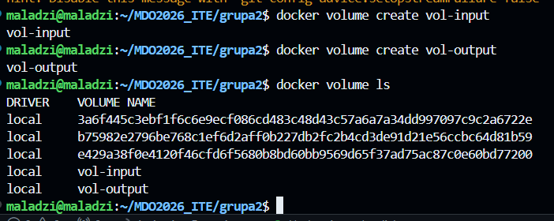

### 1.2 Sklonowanie repozytorium na wolumin wejściowy

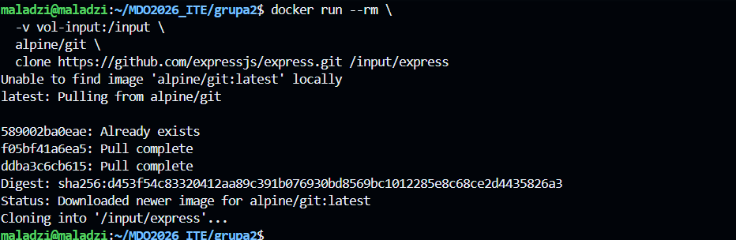

**Dlaczego ta metoda?**

| Metoda | Zalety | Wady |
|--------|--------|------|
|Kontener pomocniczy z git | Nie wymaga gita na hoście ani w kontenerze docelowym; w pełni przenośne | Dodatkowy krok |
| Bind mount z lokalnym katalogiem | Proste | Zależy od stanu hosta; niereprodukowalne |
| Kopiowanie do `/var/lib/docker` | Brak dodatkowych kontenerów | Wymaga `sudo`; niebezpieczne; zależne od implementacji |
| Git wewnątrz kontenera bazowego | Wszystko w jednym kontenerze | Kontener musi mieć gita – narusza wymaganie |

Kontener pomocniczy (`alpine/git`) jest efemeryczny (`--rm`) i służy wyłącznie do sklonowania kodu na współdzielony wolumin. Kontener docelowy (budujący) nigdy nie potrzebuje Gita.

### 1.3 Uruchomienie buildu z woluminami

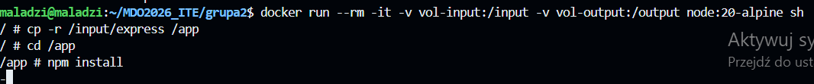
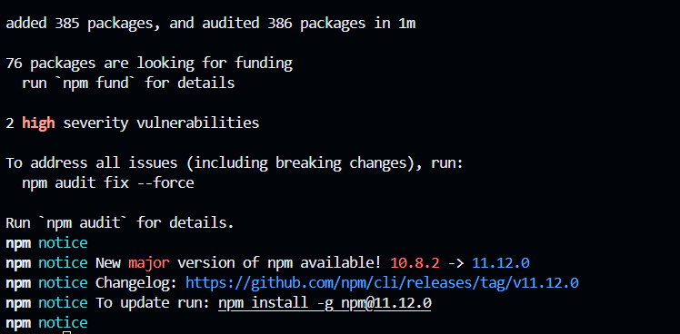
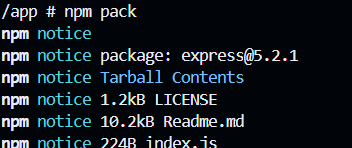
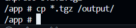

Wynik na woluminie wyjściowym:
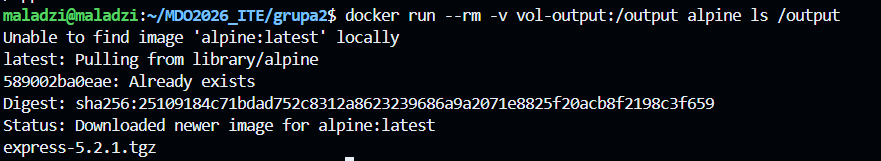

Plik `.tgz` jest dostępny na woluminie `vol-output` **po wyłączeniu kontenera** – wolumin persystuje niezależnie od cyklu życia kontenera.

### 1.4 Wariant z Gitem wewnątrz kontenera

Tutaj kontener bazowy ma gita i sam klonuje repo na wolumin:
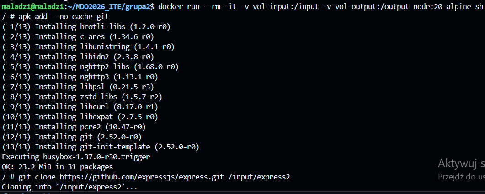
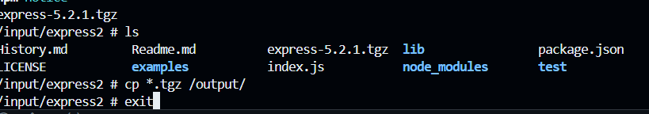

### 1.5 Dyskusja: `RUN --mount` w Dockerfile

`RUN --mount` (BuildKit) pozwala montować zasoby **wyłącznie podczas budowania obrazu** – nie są one częścią finalnego obrazu

**Różnica wobec woluminów runtime:**
- `RUN --mount` działa **tylko podczas `docker build`** – nie jest dostępne przy `docker run`
- Woluminy (`-v`) działają **podczas `docker run`** – przechowują dane między uruchomieniami kontenera
- `--mount=type=cache` przyspiesza buildy (cache warstw npm/pip bez wbudowywania ich w obraz)

---

## 2. Eksponowanie portów i łączność między kontenerami

### 2.1 Uruchomienie serwera iperf3

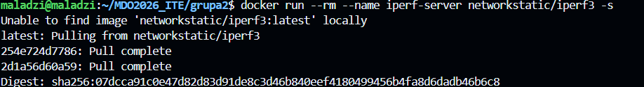
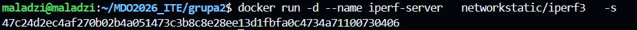
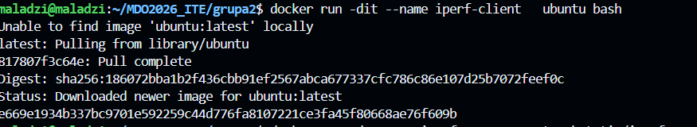
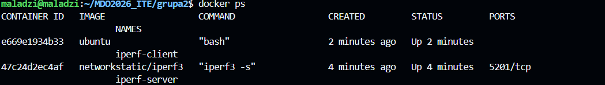

Sprawdzenie adresów IP kontenerów.
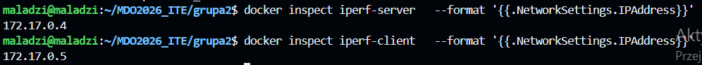

Uruchomienie testu iperf3 -c 
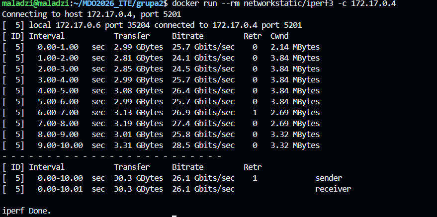

### 2.3 Dedykowana sieć mostkowa z rozwiązywaniem nazw

Utworzenie własnej sieci poprzez docker network create i uruchomnienie nowych kontenerów z tą siecią.

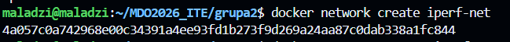
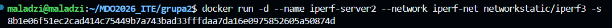
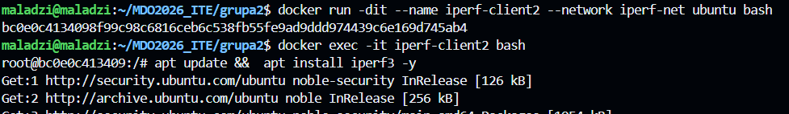

test z wykorzystaniem nazwy

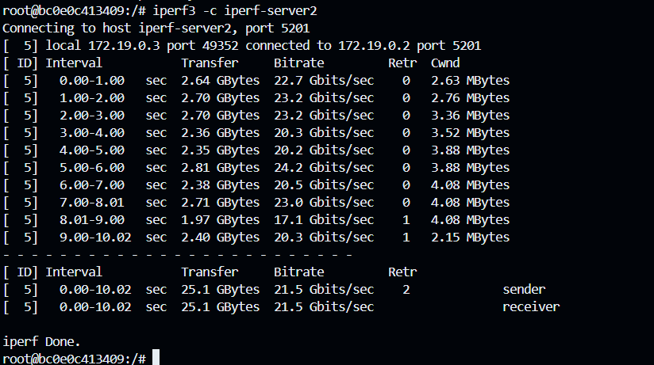

Rozwiązywanie nazw działa dzięki wbudowanemu DNS Dockera dostępnemu w sieciach użytkownika.

### 2.4 Połączenie spoza kontenera (z hosta)

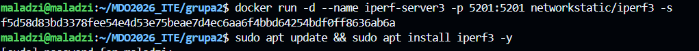
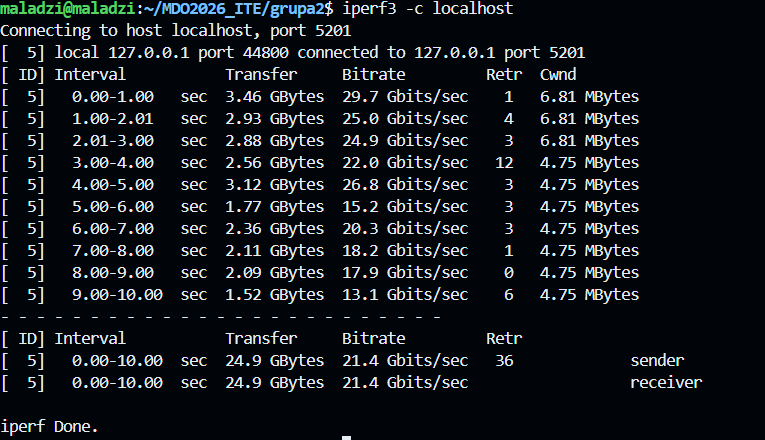
localhost, ponieważ z punktu widzenia hosta usługa jest dostępna lokalnie na jego własnym porcie 5201.

### 2.5 Połączenie spoza hosta
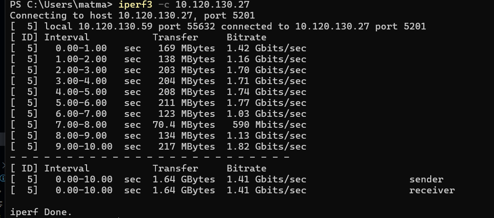

**Problem z pomiarem przepustowości:**
Komunikacja między kontenerami na tym samym hoście przebiega przez wirtualny interfejs sieciowy (veth), nie przez fizyczną sieć – wyniki rzędu 15-30 Gbits/sec są artefaktem pętli zwrotnej i nie odzwierciedlają rzeczywistej przepustowości sieci.

---

## 3. Usługa SSHD w kontenerze

### 3.1 Uruchomienie SSHD w kontenerze Ubuntu

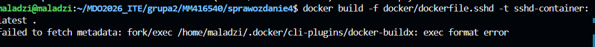
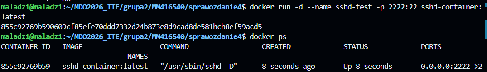

### 3.2 Połączenie SSH
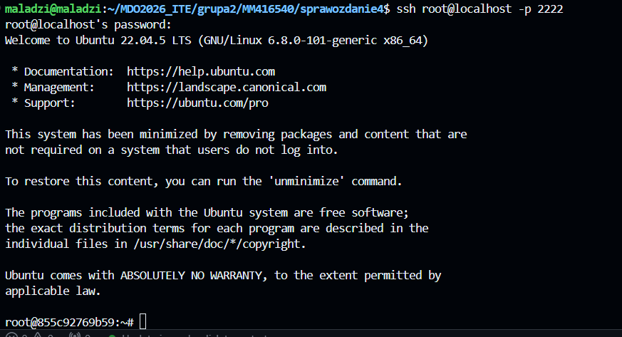

### 3.3 Zalety i wady SSH w kontenerze

**Zalety:**
- Znany, uniwersalny protokół – działa z każdym klientem SSH
- Możliwość tunelowania portów i przekazywania plików (`scp`, `sftp`)
- Przydatny do debugowania i inspekcji działającego kontenera
- Umożliwia dostęp do kontenera bez Dockera (np. przez Kubernetes exec alternative)

**Wady i zastrzeżenia:**
- **Sprzeczne z filozofią kontenerów** – kontener powinien uruchamiać jeden proces; SSHD to drugi
- Zarządzanie kluczami/hasłami w kontenerze jest problematyczne
- `docker exec` zastępuje SSH w większości przypadków deweloperskich
- Ryzyko bezpieczeństwa – dodatkowa powierzchnia ataku
- Zwiększa rozmiar obrazu i złożoność

**Kiedy SSH w kontenerze ma sens:**
- Środowiska deweloperskie (np. Dev Containers w VS Code)
- Systemy legacy wymagające SSH jako interfejsu
- Gdy brak dostępu do Docker API (np. zdalne środowiska bez `docker exec`)

---

## 4. Jenkins w kontenerze (DIND)

### 4.1 Instalacja Jenkins

utworzenie sieci i woluminów

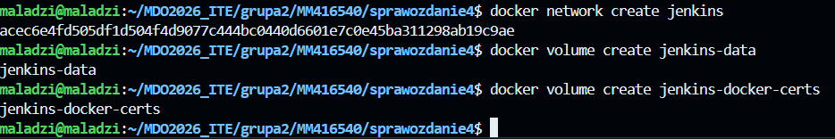

uruchomienie docker-in-docker **(DIND)**

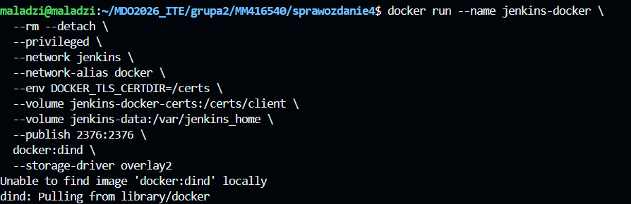
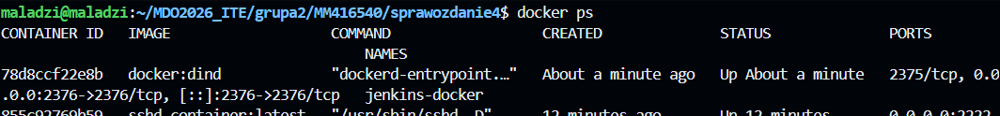

budowa obrazu jenkis z blue ocean

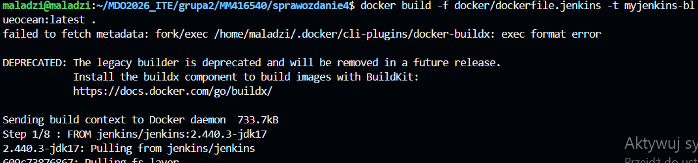

uruchomienie jenkis

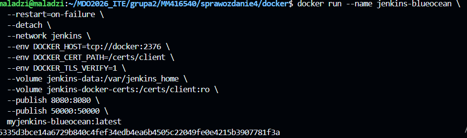

pobranie hasla 
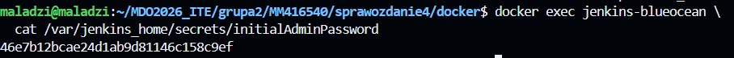

Weryfikacja działających kontenerów
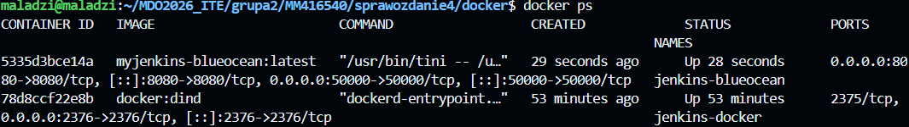

Dostęp do interfejsu
http://10.120.130.27:8080/

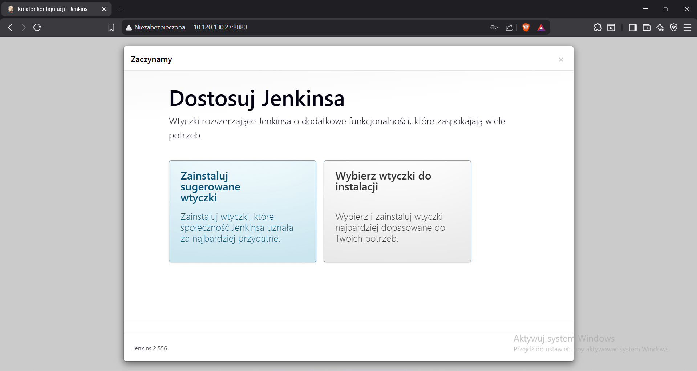

insgtalacja sugerowanych wtyczek
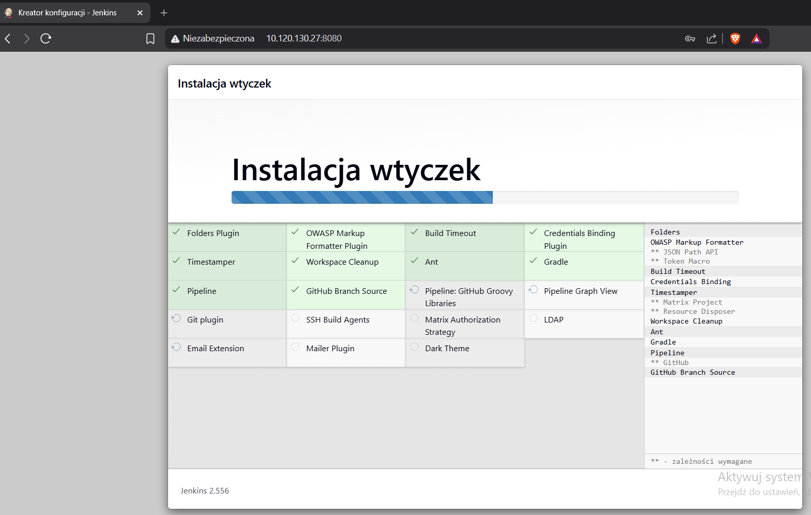

tworzenie konta administratora
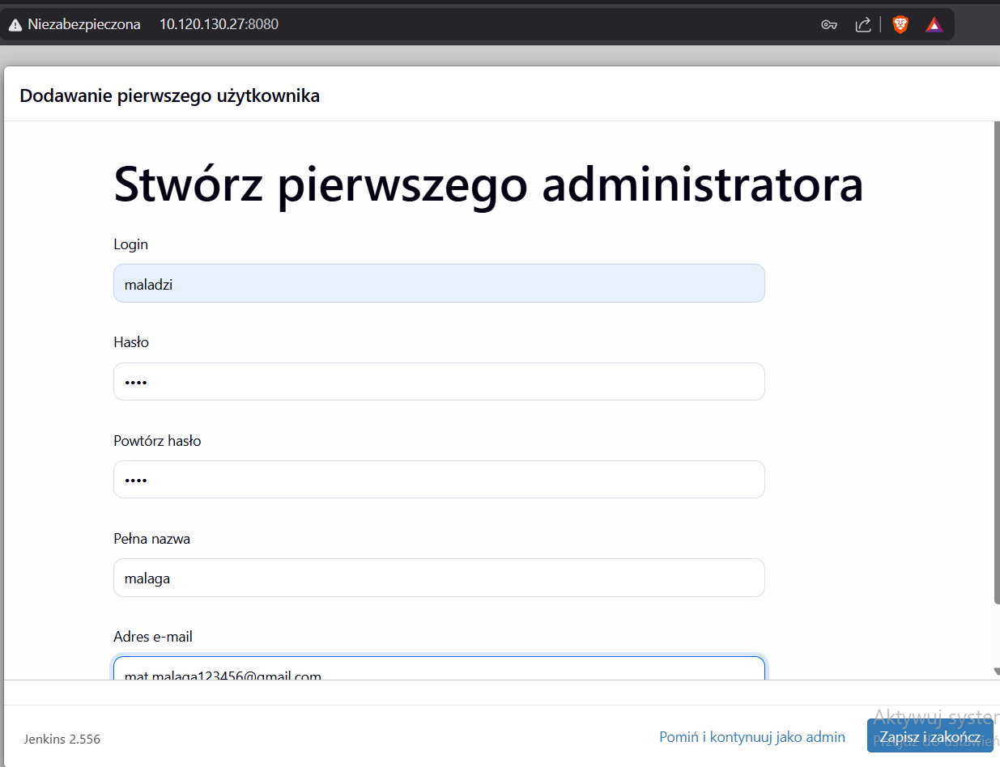

gotowy jenkins
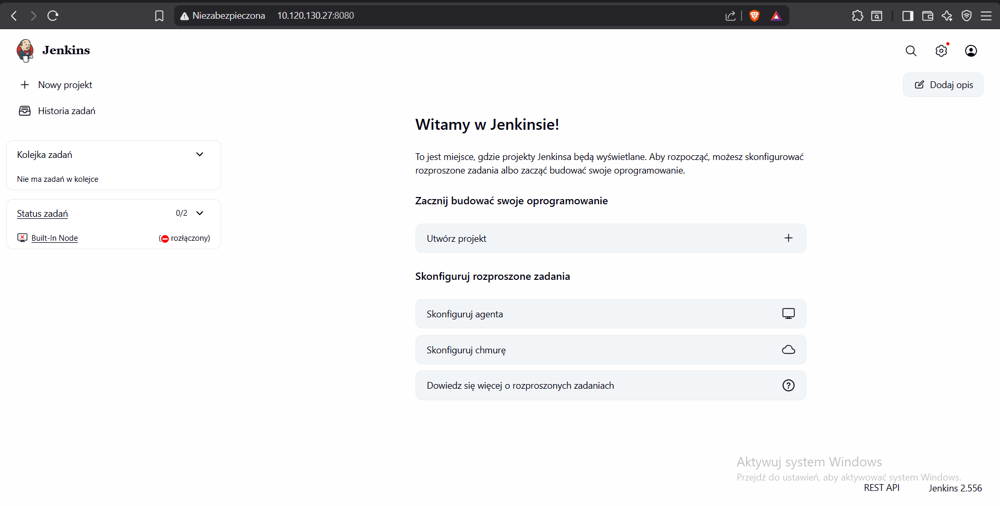