# Sprawozdanie – Zajęcia 05, 06, 07
## Pipeline Jenkins, izolacja etapów, lista kontrolna Jenkinsfile
---

# Zajęcia 05 – Pipeline, Jenkins, izolacja etapów

## 1. Przygotowanie – weryfikacja środowiska

Przed rozpoczęciem zajęć zweryfikowano działanie kontenerów z poprzednich zajęć. Uruchomiono instancję Jenkins wraz z pomocnikiem DIND (Docker-in-Docker).
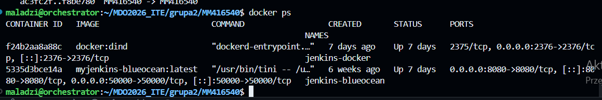

## 2. Różnica między obrazem Jenkins a BlueOcean

| Obraz | Zawartość | Zastosowanie |
|-------|-----------|--------------|
| `jenkins/jenkins` | Podstawowy Jenkins bez pluginów UI | Serwer CI bez interfejsu Blue Ocean |
| `myjenkins-blueocean` | Jenkins + Blue Ocean + Docker CLI | Pełny interfejs + integracja z Dockerem |

Obraz `myjenkins-blueocean` zbudowano własnoręcznie na podstawie `Dockerfile.jenkins`, dodając Docker CLI i plugin Blue Ocean.

## 3. Zadania wstępne – pierwsze projekty

### Projekt: wyświetlanie uname


Utworzono projekt Freestyle o nazwie `uname-test`. W sekcji **Build Steps** → **Execute shell**:

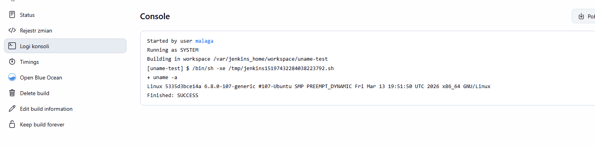

Build zakończony sukcesem – w Console Output widoczna informacja o systemie operacyjnym.

### Projekt: błąd przy godzinie nieparzystej

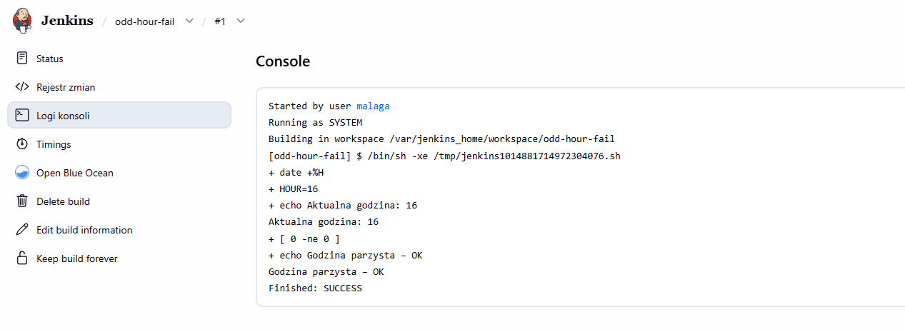

Build kończy się czerwonym statusem gdy godzina jest nieparzysta.

### Projekt: docker pull ubuntu
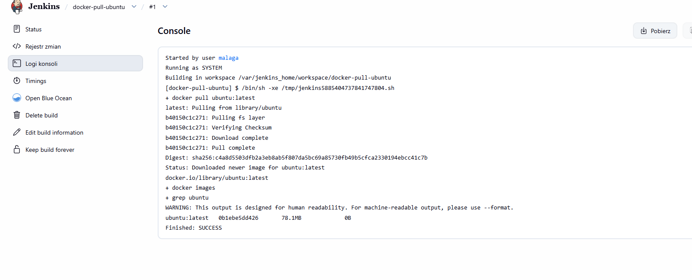

## 4. Obiekt typu Pipeline – pierwsze uruchomienie

Utworzono obiekt typu **Pipeline**. Treść pipeline'u wpisano bezpośrednio do obiektu (nie z SCM). Pipeline klonował repozytorium Express.js, budował obraz Docker i uruchamiał testy.

Pipeline uruchomiono **dwukrotnie** – obydwa przebiegi zakończyły się sukcesem.
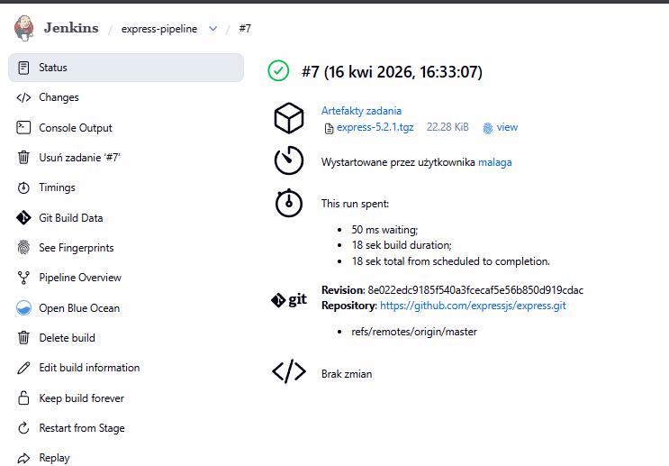

## 5. Diagram aktywności CI/CD

```
[Commit / trigger]
        │
        ▼
    [Clone]
    checkout scm – Jenkinsfile z repo
        │
        ▼
    [Build]
    docker build → express-build:5.2.1 ----→ obraz buildowy
        │                                     node:20.19.0-alpine
        ▼
    [Test]
    docker run express-test:5.2.1 ---------→ test-results.txt
        │                                     Jenkins Artifacts
    ┌───┴───┐
  FAIL     TAK
    │        │
  [Stop]     ▼
          [Deploy]
          docker build Dockerfile.production
          docker run -d + smoke test
              │
              ▼
          [Publish]
          npm pack → express-5.2.1.tgz ----→ fingerprint SHA-256
              │                               Jenkins Artifacts
              ▼
          [Cleanup]
```

---

# Zajęcia 06 – Pipeline: lista kontrolna

## 1. Wybrana aplikacja i licencja

**Aplikacja:** Express.js – framework webowy dla Node.js

- **Repozytorium:** https://github.com/expressjs/express
- **Licencja:** MIT
- **Wersja:** 5.2.1

Weryfikacja licencji:
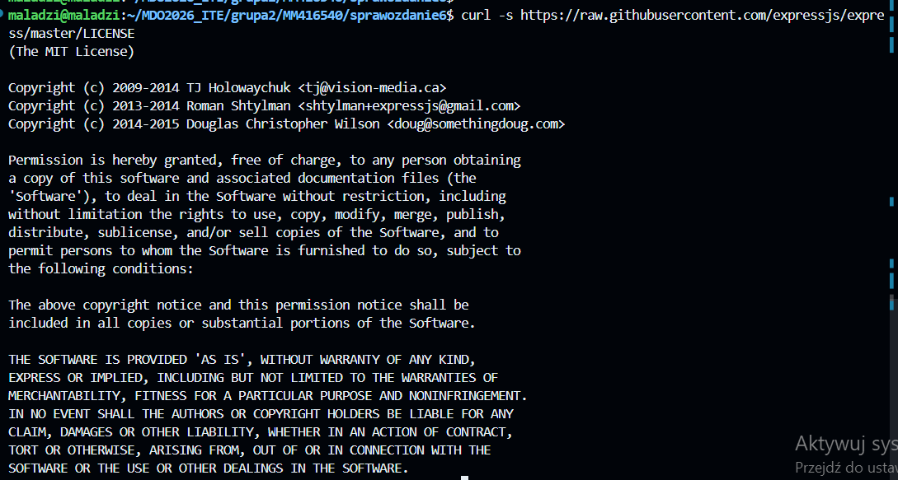

Licencja MIT pozwala na swobodne używanie, kopiowanie, modyfikowanie i dystrybucję kodu, w tym na potrzeby zadań akademickich.

## 2. Build i testy lokalne

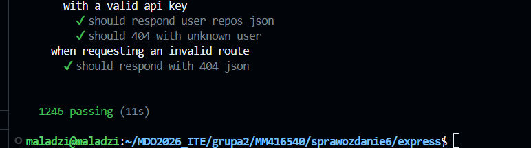

Testy oparte o framework **Mocha** + **Supertest** dają jednoznaczny raport końcowy.

## 3. Fork repozytorium

Fork jest potrzebny – umożliwia umieszczenie `Jenkinsfile` i plików `Dockerfile` bezpośrednio w repozytorium projektu.

**Fork:** https://github.com/Mateusz-Malaga/express
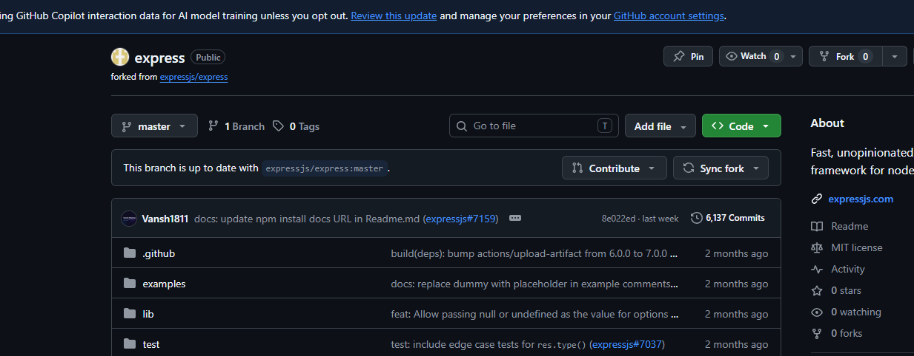

## 4. Kontener bazowy

**Wybrany obraz:** `node:20.19.0-alpine` (świadomie wybrany tag, nie `latest`)

**Uzasadnienie:**
- Alpine Linux – minimalny rozmiar (~60 MB vs ~1 GB dla pełnego Debian)
- Node.js 20 – wersja LTS, stabilna produkcyjnie
- Konkretna wersja `20.19.0` zapewnia reprodukowalność buildów
- Nie ma potrzeby osobnego kontenera Dependencies – `node:20.19.0-alpine` zawiera wszystko

## 5. Pliki Dockerfile

### Dockerfile.build
### Dockerfile.test
### Dockerfile.production (multi-stage)

## 6. Uzasadnienie: kontener buildowy ≠ kontener deploy

Obraz `express-build:5.2.1` nie nadaje się bezpośrednio do wdrożenia produkcyjnego:

| Cecha | express-build | express-prod |
|-------|--------------|-------------|
| Rozmiar | ~256 MB | ~136 MB |
| Zawiera git | TAK | NIE |
| devDependencies | TAK | NIE |
| Kod testów | TAK | NIE |
| Nadaje się do prod | NIE | TAK |

**Rozwiązanie:** multi-stage build w `Dockerfile.production` – etap `builder` buduje, etap `production` zawiera tylko runtime. Mniejszy obraz = mniejsza powierzchnia ataku.

Porównanie rozmiarów:
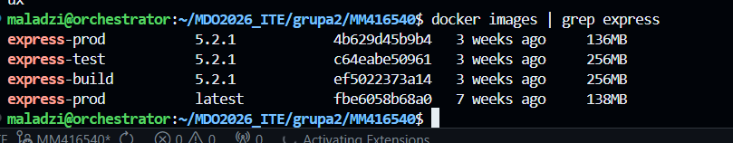

## 7. Uzasadnienie wyboru formatu artefaktu: pakiet npm (`.tgz`)

Express.js to **biblioteka Node.js** – nie samodzielna aplikacja. Naturalnym formatem dystrybucji jest pakiet npm.

| Format | Dlaczego NIE dla Express |
|--------|--------------------------|
| Kontener Docker | Express to biblioteka, nie aplikacja serwerowa |
| Plik binarny | Node.js nie kompiluje do binarki natywnej |
| Flatpak | Express nie ma GUI |
| RPM / DEB | Express nie jest pakietem systemowym |
| **`.tgz` (npm pack)** | **WYBRANY** – standardowy format dla bibliotek Node.js |

Analogie w innych ekosystemach:

| Ekosystem | Odpowiednik `.tgz` npm |
|-----------|----------------------|
| Java | `.jar` (Maven) |
| Python | `.whl` (pip/PyPI) |
| .NET | `.nupkg` (NuGet) |
| Ruby | `.gem` |

## 8. Wersjonowanie artefaktu (Semantic Versioning)

Wersja artefaktu pochodzi automatycznie z `package.json`:
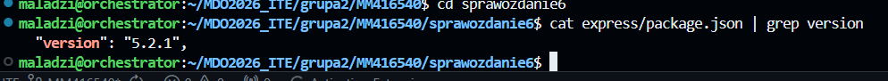


Format **semver** – `MAJOR.MINOR.PATCH`:
- `PATCH` – bugfixy
- `MINOR` – nowe funkcje, kompatybilne wstecznie
- `MAJOR` – breaking changes

Artefakt: `express-5.2.1.tgz` – wersja wbudowana w nazwę pliku.

## 9. Dostępność artefaktu i identyfikacja pochodzenia

Artefakt dostępny jako pobieralny wynik builda w Jenkins:
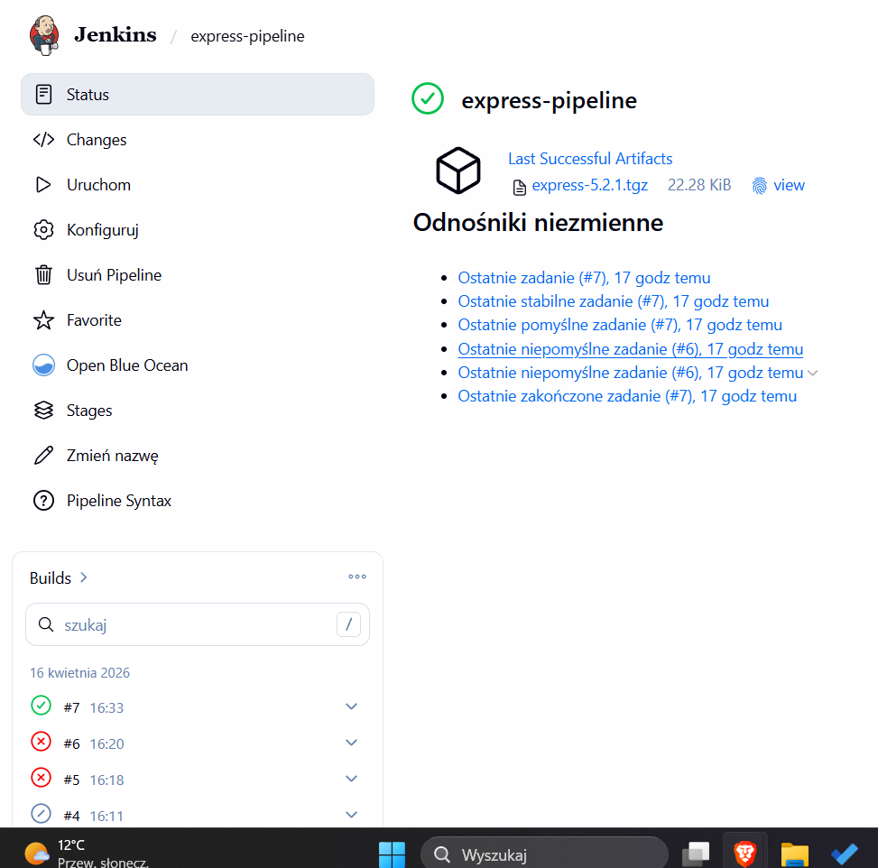

Fingerprint SHA-256 widoczny po kliknięciu **(i)** obok pliku w zakładce Artifacts – pozwala zidentyfikować z którego builda pochodzi artefakt.

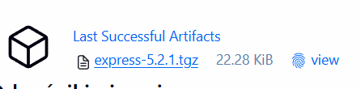

## 10. Lista kontrolna – status

| Punkt | Status | Opis |
|-------|--------|------|
| Aplikacja wybrana | ✅ | Express.js, licencja MIT |
| Licencja potwierdza swobodny obrót | ✅ | MIT – curl raw.githubusercontent.com |
| Program buduje się | ✅ | npm install – 386 packages |
| Testy przechodzą | ✅ | 1246 passing (11s) |
| Zdecydowano o forku | ✅ | github.com/Mateusz-Malaga/express |
| Diagram UML | ✅ | Diagram aktywności z legendą |
| Kontener bazowy wybrany | ✅ | node:20.19.0-alpine (świadomy tag) |
| Build w kontenerze | ✅ | docker build Dockerfile.build |
| Testy w kontenerze | ✅ | docker run express-test:5.2.1 |
| Kontener test bazuje na build | ✅ | FROM express-build:5.2.1 |
| Logi jako numerowany artefakt | ✅ | archiveArtifacts test-results.txt |
| Kontener deploy zdefiniowany | ✅ | Dockerfile.production (multi-stage) |
| Uzasadnienie build ≠ deploy | ✅ | Różnica rozmiaru, brak devDeps w prod |
| Wersjonowany deploy wdrożony | ✅ | docker run express-prod:5.2.1 |
| Smoke test | ✅ | curl http://$IP:3000 |
| Artefakt zdefiniowany | ✅ | express-5.2.1.tgz (npm pack) |
| Uzasadnienie wyboru formatu | ✅ | Biblioteka Node.js → .tgz |
| Wersjonowanie artefaktu | ✅ | semver z package.json |
| Dostępność: Jenkins Artifacts | ✅ | archiveArtifacts fingerprint: true |
| Identyfikacja pochodzenia | ✅ | SHA-256 fingerprint w Jenkins |
| Pliki w repozytorium | ✅ | Dockerfile.build/test/production + Jenkinsfile |
| Rozbieżność UML vs efekt | ✅ | Deploy jako multi-stage zamiast 2 plików |

---

# Zajęcia 07 – Jenkinsfile: lista kontrolna

## 1. Pipeline przeniesiony do SCM

Poprzedni pipeline był wklejony bezpośrednio do obiektu Jenkins. Przeniesiono go do repozytorium (SCM), tak aby `Jenkinsfile` był częścią kodu projektu – **"infrastructure as code"**.

Konfiguracja Jenkins – Pipeline from SCM:

| Parametr | Wartość |
|----------|---------|
| Definition | Pipeline script from SCM |
| SCM | Git |
| Repository URL | https://github.com/Mateusz-Malaga/express.git |
| Branch | `*/master` |
| Script Path | `Jenkinsfile` |

## 2. Kompletny Jenkinsfile

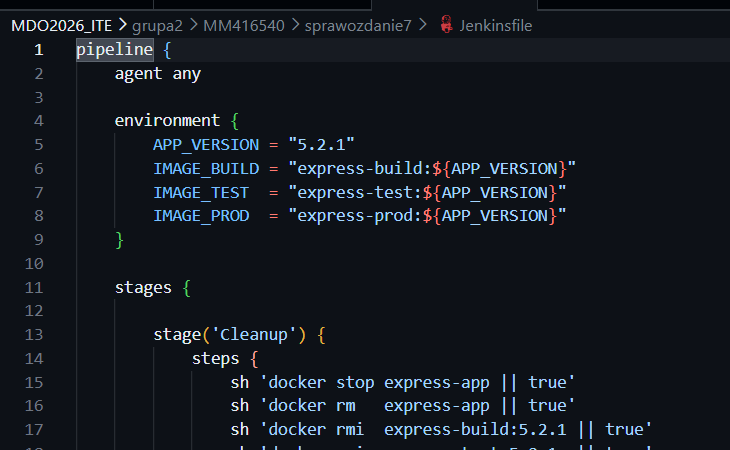

## 3. Lista kontrolna Jenkinsfile

| Punkt | Status | Opis |
|-------|--------|------|
| Przepis z SCM (nie wklejony) | ✅ | Jenkinsfile w repo, Pipeline from SCM |
| Cleanup – świeży kod | ✅ | cleanWs() + docker rmi starych obrazów |
| Build dysponuje repo i Dockerfiles | ✅ | checkout scm w etapie Build |
| Build tworzy obraz buildowy (BLDR) | ✅ | express-build:5.2.1 |
| Artefakt prod ≠ build | ✅ | Dockerfile.production (multi-stage) |
| Test przeprowadza testy | ✅ | 1246 passing – logi w test-results.txt |
| Deploy – obraz z entrypointem | ✅ | CMD node w Dockerfile.production |
| Deploy – start kontenera | ✅ | docker run -d express-app |
| Smoke test | ✅ | curl przez docker network test-net |
| Publish – artefakt do historii | ✅ | archiveArtifacts fingerprint: true |
| Ponowne uruchomienie (no cache) | ✅ | Cleanup usuwa obrazy przed każdym buildem |

## 4. Definition of Done

### Czy obraz może być uruchomiony bez modyfikacji?

**TAK** – obraz `express-prod:5.2.1` jest samodzielny:
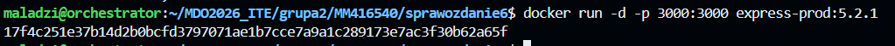


Obraz zawiera tylko runtime (Node.js + kod Express) bez narzędzi buildowych.

### Czy artefakt `.tgz` zadziała na maszynie docelowej?

**TAK** – wymaga Node.js w wersji ≥18:
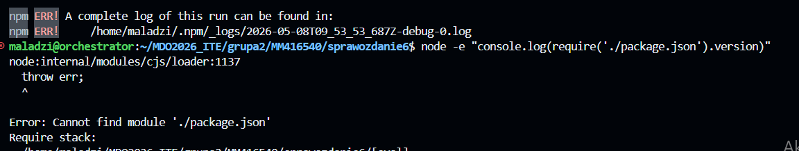
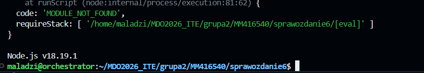

# 5. Różnica: DIND vs kontener CI bez DIND

| Aspekt | Bez DIND (socket hosta) | Z DIND |
|--------|------------------------|--------|
| Izolacja | Kontenery na hoscie | Kontenery wewnątrz DIND |
| Bezpieczeństwo | Docker socket hosta dostępny | Izolowany Docker daemon |
| Cache obrazów | Współdzielony z hostem | Izolowany, czysty |
| Złożoność | Prosta konfiguracja | Wymaga `--privileged` |
| Zastosowanie | Dev/test | Produkcyjne CI/CD |

W naszej konfiguracji używamy **DIND** (`jenkins-docker`) – Jenkins nie ma bezpośredniego dostępu do Docker socket hosta.

## 6. Weryfikacja rozbieżności UML vs efekt

Planowany diagram UML był zgodny z otrzymanym efektem. Jedyna różnica:

- **Planowane:** etap Deploy jako osobny Dockerfile
- **Implementacja:** multi-stage build w jednym `Dockerfile.production`
- **Ocena:** rozwiązanie lepsze – mniejszy obraz produkcyjny, jeden plik do utrzymania