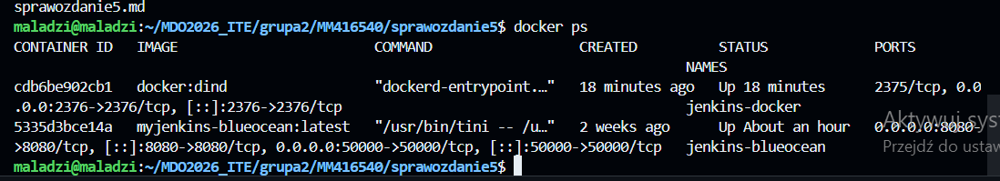
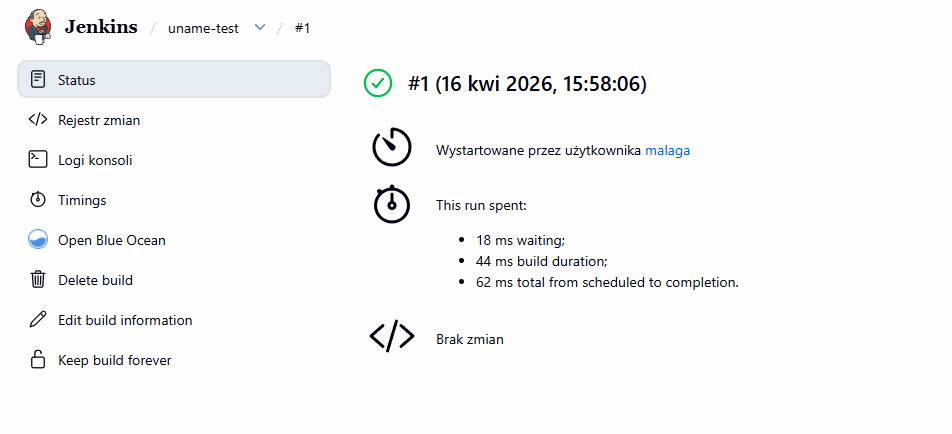
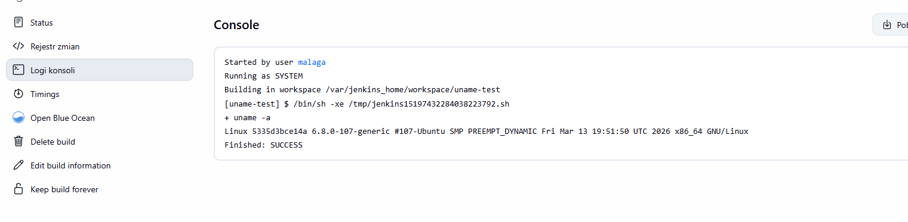
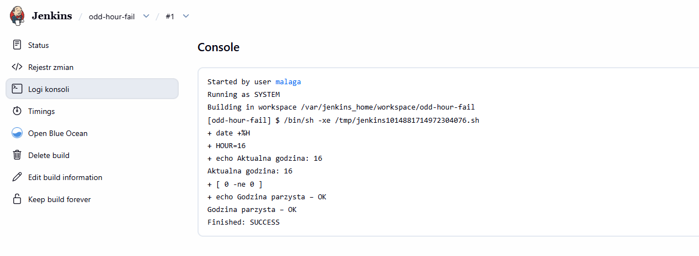
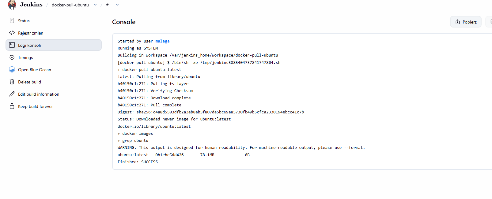
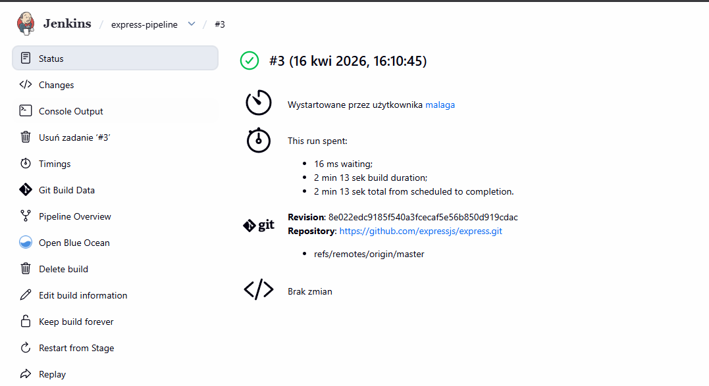
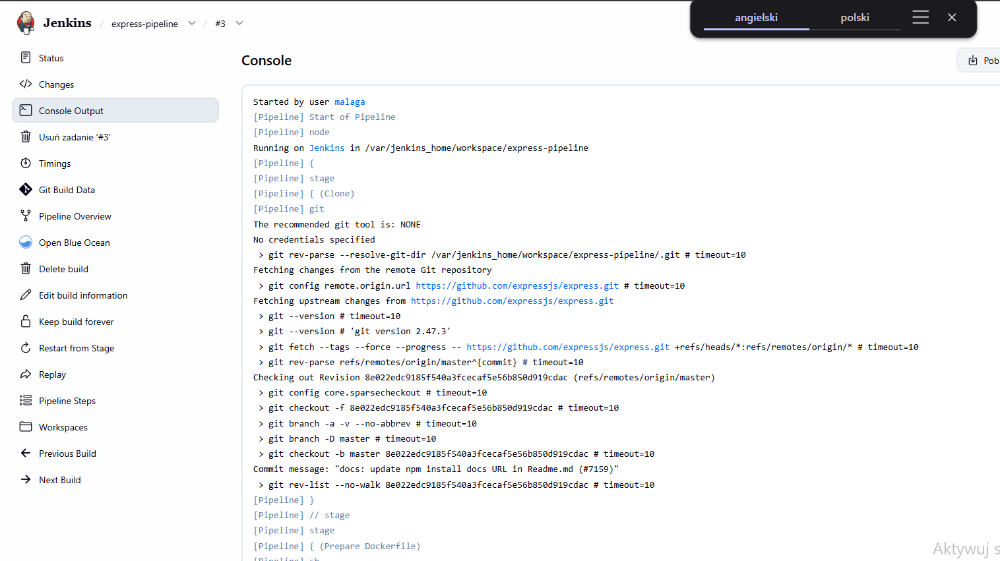
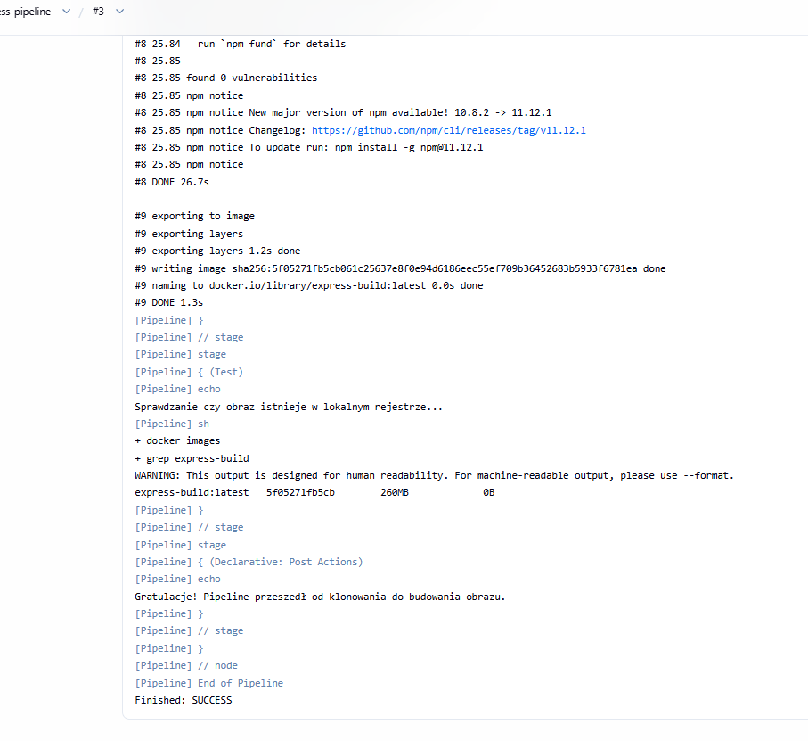
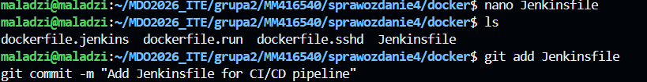

# Zajęcia 05 – Pipeline, Jenkins, izolacja etapów


## CZĘŚĆ 1: Przygotowanie – Jenkins działa




Otworzyć: **http://10.57.133.27:8080/**
10.57.133.27- aktualny host
---

## CZĘŚĆ 2: Zadanie wstępne – pierwsze projekty

### Projekt wyświetlający `uname`



### Projekt zwracający błąd gdy godzina nieparzysta

   ```bash
   HOUR=$(date +%H)
   echo "Aktualna godzina: $HOUR"
   if [ $((HOUR % 2)) -ne 0 ]; then
     echo "Godzina nieparzysta – błąd!"
     exit 1
   else
     echo "Godzina parzysta – OK"
   fi
   ```


---

### Projekt pobierający obraz ubuntu

   ```bash
   docker pull ubuntu
   docker images | grep ubuntu
   ```


---

## CZĘŚĆ 3: Obiekt typu Pipeline

###  Pipeline – klonowanie repo i build Dockerfile





Kolejne odtworzenia tego pipeline były szybsze bo obraz był już pobrany

---

## CZĘŚĆ 4: Kompletny pipeline build → test → deploy → publish

###  Umieść Jenkinsfile w repozytorium


---

### Krok 7: Skonfiguruj pipeline z SCM


## CZĘŚĆ 5: Dyskusja – Deploy i Publish dla Express.js

### Czy pakować do przenośnego formatu?

**Tak – rekomendowany format: `.tgz` (npm pack)**

Express jest biblioteką Node.js. Naturalnym formatem dystrybucji jest pakiet npm (`.tgz`), analogicznie jak:
- Java → `.jar`
- Python → `.whl`
- Debian → `.deb`

### Czy dystrybuować jako obraz Docker?

**Jako serwer HTTP – tak. Jako biblioteka – nie.**

- Jeśli Express pełni rolę serwera aplikacji → obraz Docker ma sens
- Jeśli jest tylko zależnością innego projektu → dystrybuuj jako pakiet npm

Obraz produkcyjny **nie powinien** zawierać:
- katalogu `.git`
- logów z buildu
- `devDependencies`
- narzędzi buildowych (git, make, gcc...)

### `node` vs `node-slim`

| Obraz | Rozmiar | Zawartość | Zastosowanie |
|-------|---------|-----------|--------------|
| `node:20` | ~1 GB | Pełny Debian + wszystkie narzędzia | Build, CI |
| `node:20-slim` | ~200 MB | Debian minimal + Node.js | Runtime produkcyjny |
| `node:20-alpine` | ~60 MB | Alpine + Node.js | Produkcja, lekkość |

**Wniosek:** Build w `node:20`, deploy w `node:20-alpine`.


## CZĘŚĆ 6: Diagramy UML

### Diagram aktywności (collect → build → test → deploy → publish)

```
[Start]
   │
   ▼
[Collect] ──── git clone / checkout
   │
   ▼
[Build] ──── docker build Dockerfile.build → express-build:latest
   │
   ▼
[Test] ──── docker run express-test:latest → logi testów
   │
   ├── FAIL ──→ [Powiadomienie] → [Stop]
   │
   ▼
[Deploy] ──── docker run express-prod:latest -p 3000:3000
   │
   ▼
[Publish] ──── npm pack → express-5.2.1.tgz → archiveArtifacts
   │
   ▼
[Cleanup] ──── docker stop/rm express-app
   │
   ▼
[Stop]
```

### Diagram wdrożeniowy

```
Host (Linux)
├── jenkins-docker (DIND) ─────────────────────────────┐
│   └── uruchamia kontenery pipeline'ów                │
│                                                       │
├── jenkins-blueocean                                   │
│   ├── port 8080 → UI                                 │
│   └── Jenkinsfile ──► steruje pipeline'm             │
│                                                       │
└── Kontenery pipeline'u (w DIND):                     │
    ├── express-build:latest   ◄── Dockerfile.build    │
    ├── express-test:latest    ◄── Dockerfile.test     │
    ├── express-prod:latest    ◄── Dockerfile.prod     │
    └── Artefakt: express-5.2.1.tgz                    │
                                                        │
GitHub ──► git clone ──────────────────────────────────┘
```
