# Zajęcia 06
---

## Pipeline: lista kontrolna
Scharakteryzuj plan na *pipeline* i przedstaw postęp prac. Czy mamy pomysł na każdy krok poniżej?

### Ścieżka krytyczna
Podstawowy zbiór czynności do wykonania w ramach zadania z pipelinem CI/CD. Ścieżką krytyczną jest:
- [ ] commit (lub tzw. *manual trigger* @ Jenkins)
- [ ] clone
- [ ] build
- [ ] test
- [ ] deploy
- [ ] publish

Poniższe czynności wykraczają ponad tę ścieżkę, ale zrealizowanie ich pozwala stworzyć pełny, udokumentowany, jednoznaczny i łatwy do utrzymania pipeline z niskim progiem wejścia dla nowych *maintainerów*.

### Pełna lista kontrolna
Zweryfikuj dotychczasową postać sprawozdania oraz planowane czynności względem ścieżki krytycznej oraz poniższej listy. Realizacja punktu wymaga opisania czynności,
wykazania skuteczności (np. zrzut ekranu), podania poleceń i uzasadnienia decyzji dot. implementacji.

- [ ] Aplikacja została wybrana

- [ ] Licencja potwierdza możliwość swobodnego obrotu kodem na potrzeby zadania
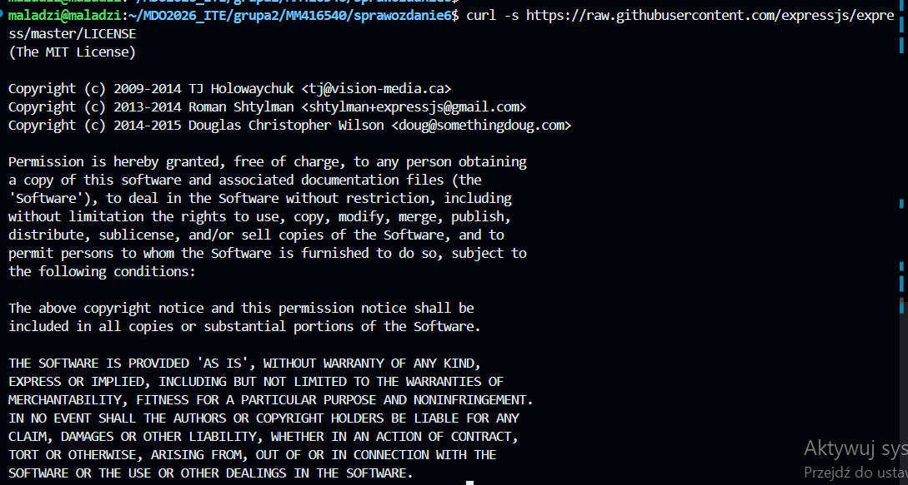
- [ ] Wybrany program buduje się
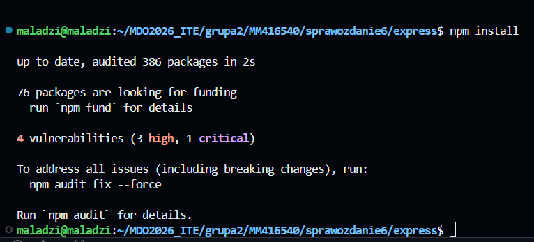
- [ ] Przechodzą dołączone do niego testy
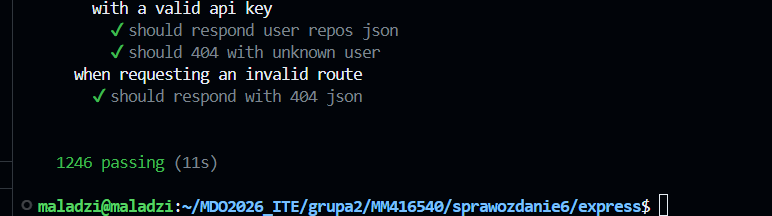
- [ ] Zdecydowano, czy jest potrzebny fork własnej kopii repozytorium
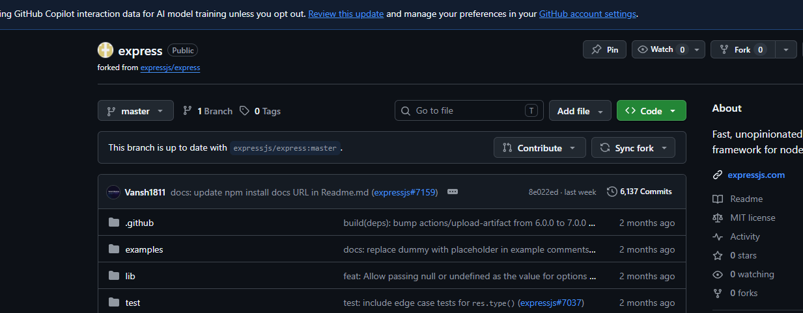
- [ ] Stworzono diagram UML zawierający planowany pomysł na proces CI/CD
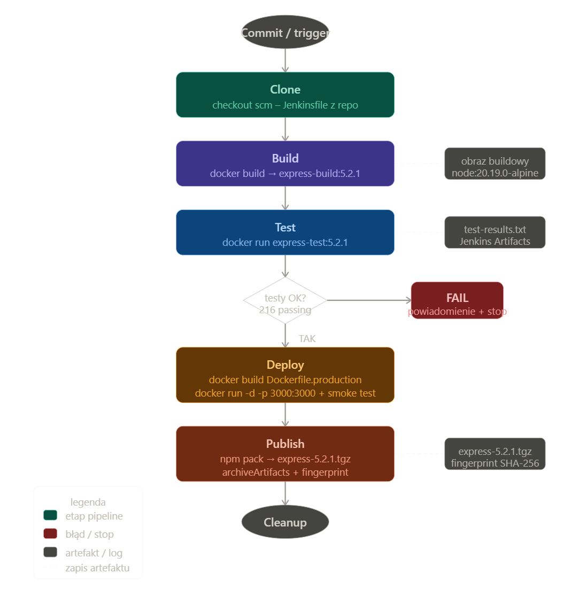
- [ ] Wybrano kontener bazowy lub stworzono odpowiedni kontener wstepny (runtime dependencies)
- [ ] *Build* został wykonany wewnątrz kontenera
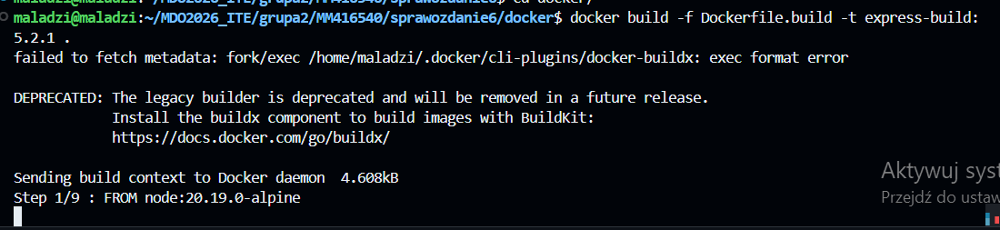
- [ ] Testy zostały wykonane wewnątrz kontenera (kolejnego)
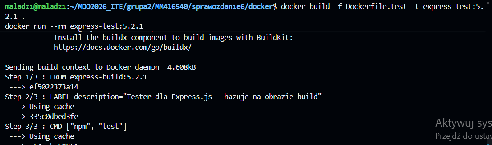
- [ ] Kontener testowy jest oparty o kontener build
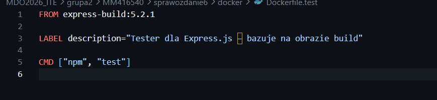
- [ ] Logi z procesu są odkładane jako numerowany artefakt, niekoniecznie jawnie
- [ ] Zdefiniowano kontener typu 'deploy' pełniący rolę kontenera, w którym zostanie uruchomiona aplikacja (niekoniecznie docelowo - może być tylko integracyjnie)

- [ ] Uzasadniono czy kontener buildowy nadaje się do tej roli/opisano proces stworzenia nowego, specjalnie do tego przeznaczenia

Obraz express-build:5.2.1 powstał w oparciu o Dockerfile.build i zawiera wszystko czego potrzeba do zbudowania projektu – ale nie powinien trafiać na produkcję.
Zawartość obrazu buildowego (niepotrzebna na produkcji):

igitklonowanie repo❌ zbędny
devDependencies (mocha, supertest...)uruchamianie testów❌ zbędne
katalog test/testy jednostkowe❌ zbędny
node_modules z dev-deps~150 MB❌ zbędne

Rozwiązanie: multi-stage build w Dockerfile.production
Dockerfile.production używa dwóch etapów:

etap builder – instaluje wszystko, buduje
etap production – kopiuje tylko pliki runtime, bez narzędzi budowania

Dzięki temu obraz produkcyjny jest mniejszy i bezpieczniejszy.
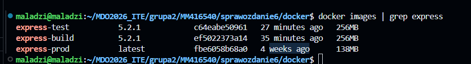

- [ ] Wersjonowany kontener 'deploy' ze zbudowaną aplikacją jest wdrażany na instancję Dockera
- [ ] Następuje weryfikacja, że aplikacja pracuje poprawnie (*smoke test*) poprzez uruchomienie kontenera 'deploy'
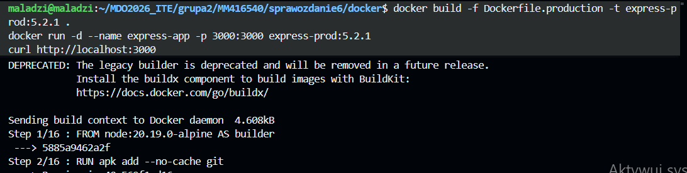

- [ ] Zdefiniowano, jaki element ma być publikowany jako artefakt
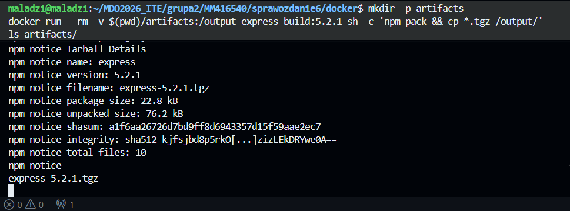
- [ ] Uzasadniono wybór: kontener z programem, plik binarny, flatpak, archiwum tar.gz, pakiet RPM/DEB

| Format | Dla kogo | Dlaczego NIE dla Express |
|--------|----------|--------------------------|
| **Kontener Docker** | Gotowa aplikacja serwerowa | Express to biblioteka, nie aplikacja – nie ma sensu dystrybuować samej biblioteki jako kontenera |
| **Plik binarny** | Aplikacje kompilowane (C, Go, Rust) | Node.js nie kompiluje do binarki natywnej |
| **Flatpak** | Aplikacje desktopowe Linux | Express nie ma GUI ani interfejsu użytkownika |
| **RPM / DEB** | Oprogramowanie systemowe instalowane przez menedżer pakietów dystrybucji | Express jest zależnością projektową, nie pakietem systemowym |
| **ZIP / TAR.GZ** | Archiwa bez systemu wersjonowania | npm `.tgz` robi to samo, ale ze wsparciem dla `package.json`, wersji i rejestru |

Pakiet npm to **naturalny i standardowy format dystrybucji** dla bibliotek Node.js:

- `npm pack` tworzy `express-5.2.1.tgz` – dokładnie ten sam format co oficjalne paczki w rejestrze npmjs.com
- Wersja jest wbudowana w nazwę pliku – `5.2.1` pochodzi z `package.json`
- Można go zainstalować bezpośrednio: `npm install ./express-5.2.1.tgz`
- Można go opublikować do rejestru: `npm publish express-5.2.1.tgz`

- [ ] Opisano proces wersjonowania artefaktu (można użyć *semantic versioning*)
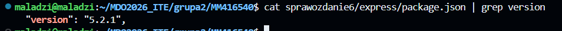
- [ ] Dostępność artefaktu: publikacja do Rejestru online, artefakt załączony jako rezultat builda w Jenkinsie
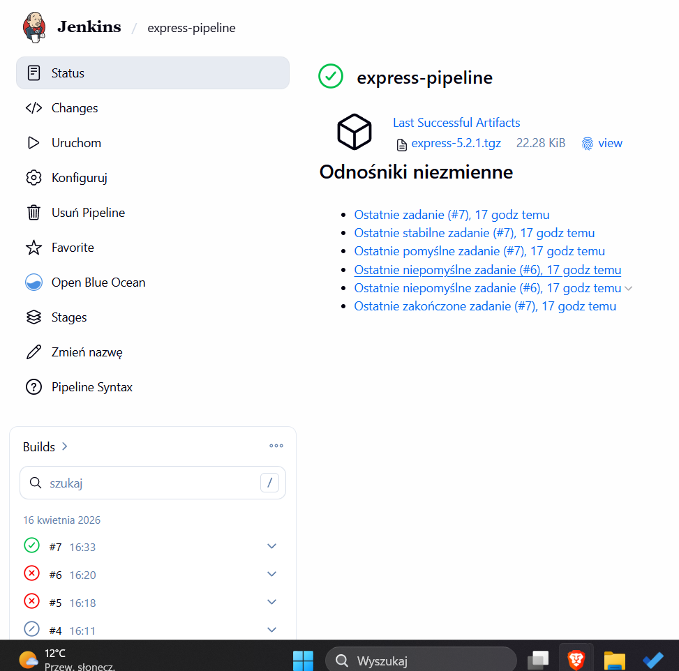
- [ ] Przedstawiono sposób na zidentyfikowanie pochodzenia artefaktu
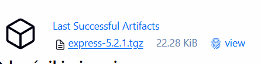
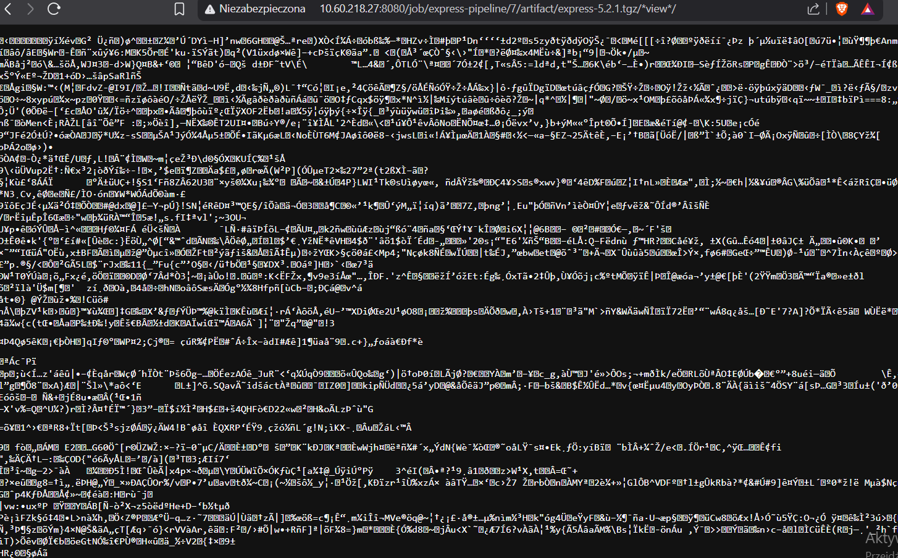
- [ ] Pliki Dockerfile i Jenkinsfile dostępne w sprawozdaniu w kopiowalnej postaci oraz obok sprawozdania, jako osobne pliki
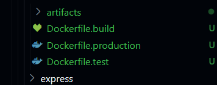
- [ ] Zweryfikowano potencjalną rozbieżność między zaplanowanym UML a otrzymanym efektem
