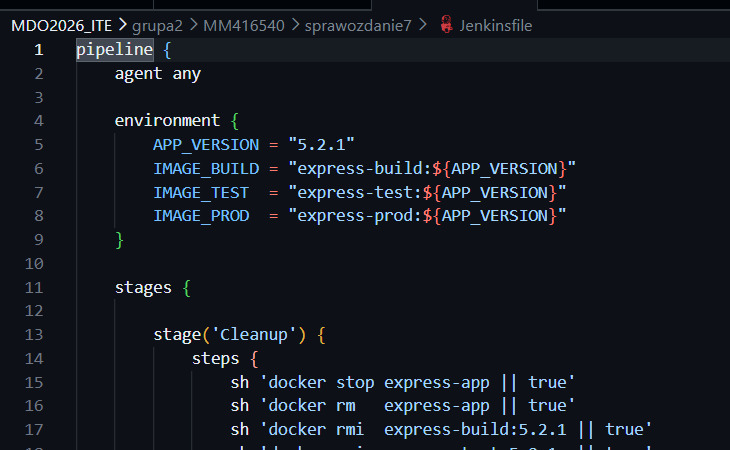
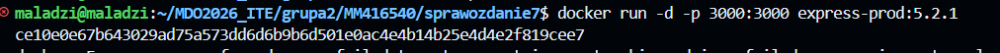
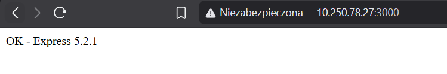
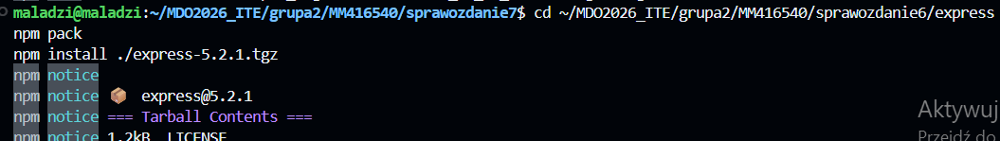
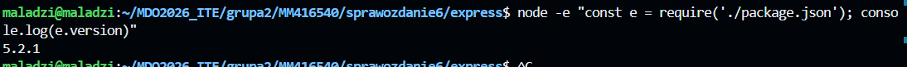
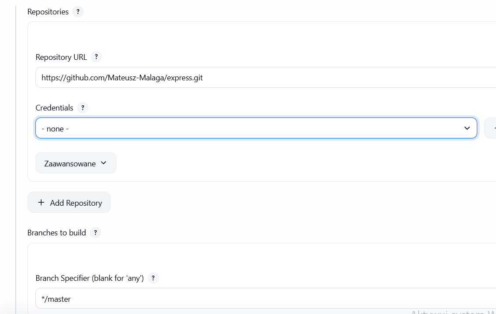
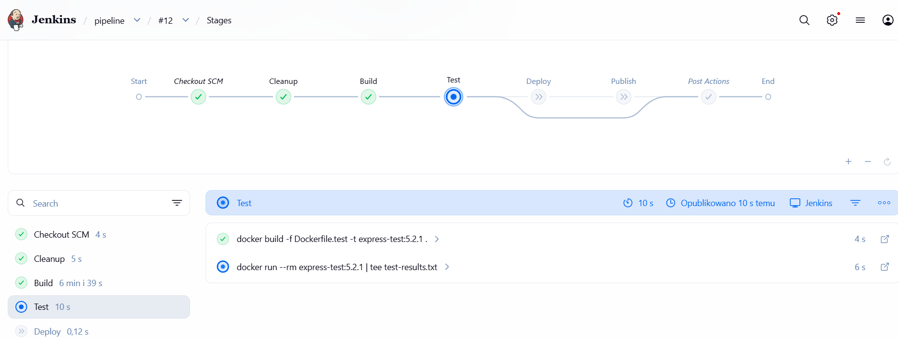
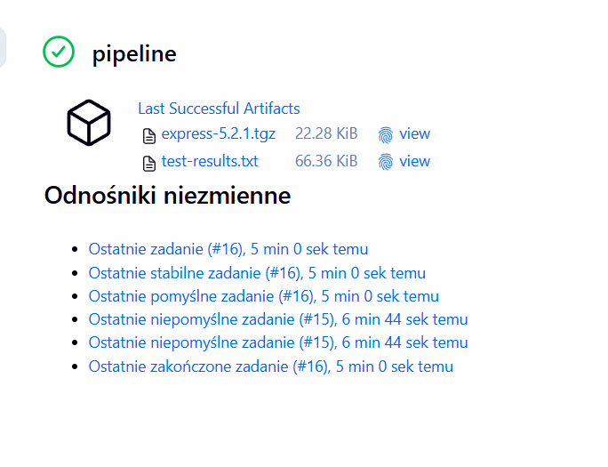

# Zajęcia 07 – Jenkinsfile: lista kontrolna + przygotowanie Ansible

---

## CZĘŚĆ 1: Weryfikacja Jenkinsfile względem listy kontrolnej

### Problem: pipeline tylko w ustawieniach Jenkinsa

Poprzedni pipeline był wklejony bezpośrednio do obiektu Jenkins. Więc przeniosłem go do repozytorium (SCM), tak aby `Jenkinsfile` był częścią kodu projektu.

---

## CZĘŚĆ 2: Jenkinsfile 

`Jenkinsfile` spełnia wszystkie punkty listy kontrolnej. ( znajduje się w pod folderze jankins )

---

## CZĘŚĆ 3: Lista kontrolna – weryfikacja

| Punkt | Status | Opis |
|-------|--------|------|
| Przepis z SCM  | ✅ | `Jenkinsfile` w repo, Jenkins skonfigurowany na "Pipeline from SCM" |
| Cleanup – pewność świeżego kodu | ✅ | Etap `Cleanup`: `cleanWs()` + usunięcie starych obrazów + `rm -rf` |
| Build dysponuje repo i Dockerfiles | ✅ | `checkout scm` w etapie Build |
| Build tworzy obraz buildowy | ✅ | `docker build -f Dockerfile.build -t express-build:5.2.1` |
| Przygotowanie artefaktu (obraz prod ≠ build) | ✅ | `Dockerfile.production` (multi-stage) tworzy czysty obraz runtime |
| Test przeprowadza testy | ✅ | `docker run express-test:5.2.1` → 216 passing |
| Deploy przygotowuje obraz z entrypointem | ✅ | `Dockerfile.production` z `CMD ["node", ...]` |
| Deploy wdraża (start kontenera) | ✅ | `docker run -d --name express-app -p 3000:3000` |
| Smoke test weryfikuje działanie | ✅ | `curl -f http://localhost:3000` |
| Publish wysyła artefakt do historii builda | ✅ | `archiveArtifacts` z `fingerprint: true` |
| Ponowne uruchomienie działa (no cache) | ✅ | `Cleanup` usuwa obrazy i workspace przed każdym buildem |

---

## CZĘŚĆ 4: Definition of Done

### Czy obraz może być pobrany i uruchomiony bez modyfikacji?

**Tak** – obraz `express-prod:5.2.1` jest samodzielny:

Obraz zawiera tylko runtime (Node.js + kod Express) bez narzędzi buildowych.

### Czy artefakt `.tgz` zadziała na maszynie docelowej?

**Tak** – wymaga Node.js w wersji ≥18:

### Konfiguracja Jenkins – Pipeline from SCM

