# Sprawozdanie zbiorcze – Zajęcia 8–12
### DevOps i orkiestracja kontenerów

**Autor:** Mateusz Malaga  
**Data:** 13.06.2026

---

## Spis treści

1. [Zajęcia 08 – Ansible](#zajęcia-08--ansible)
2. [Zajęcia 09 – Pliki odpowiedzi (Kickstart)](#zajęcia-09--pliki-odpowiedzi-kickstart)
3. [Zajęcia 10 – Kubernetes (minikube)](#zajęcia-10--kubernetes-minikube)
4. [Zajęcia 11 – Kubernetes: Strategie wdrożeń](#zajęcia-11--kubernetes-strategie-wdrożeń)
5. [Zajęcia 12 – Wdrażanie w chmurze (Azure)](#zajęcia-12--wdrażanie-w-chmurze-azure)

---

# Zajęcia 08 – Ansible

**Temat:** Automatyzacja konfiguracji i wdrożeń za pomocą Ansible.

Skonfigurowano dwie maszyny wirtualne: główną (ansible-controller) oraz docelową (ansible-target). Wymieniono klucze SSH, zainstalowano Ansible i zweryfikowano połączenie pingiem do wszystkich hostów.

---

## CZĘŚĆ 1: Instalacja i konfiguracja środowiska

### Instalacja Ansible

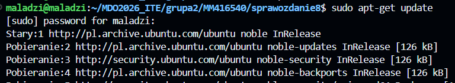

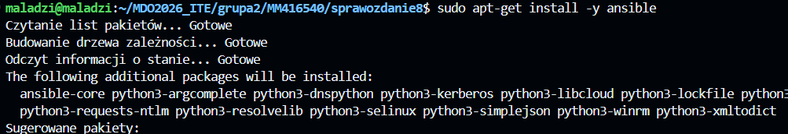

### Weryfikacja instalacji

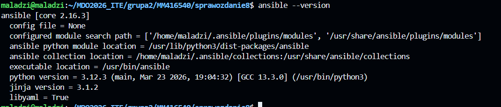

### Wymiana kluczy SSH

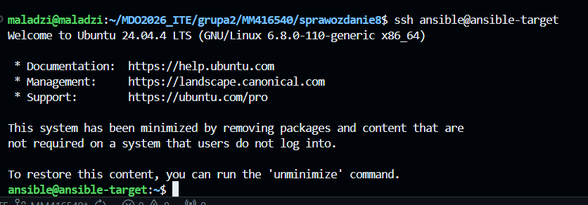

---

## CZĘŚĆ 2: Inwentaryzacja

### Plik inwentaryzacji (inventory)

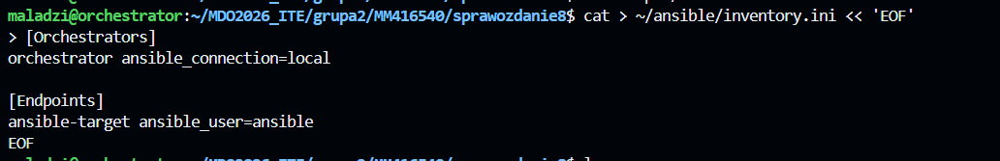

### Ping do wszystkich hostów

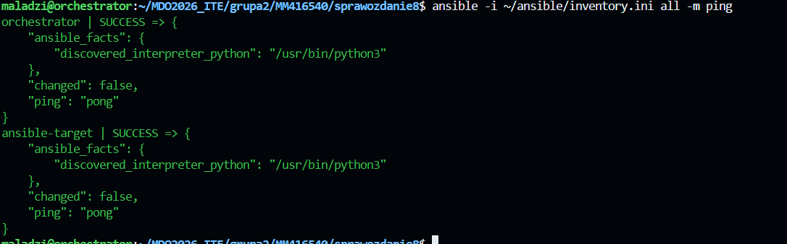

---

## CZĘŚĆ 3: Playbook – zdalne wywoływanie procedur

### Treść playbooka

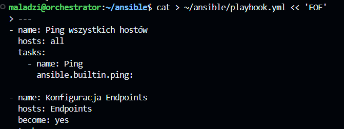

### Pierwsze uruchomienie – status `changed`

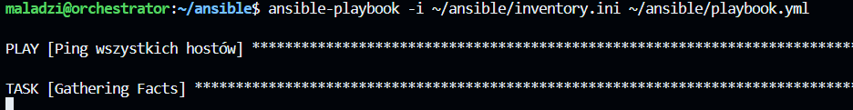

### Ponowne uruchomienie – status `ok` (idempotentność)

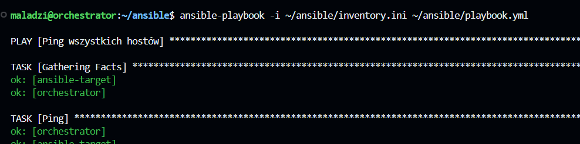

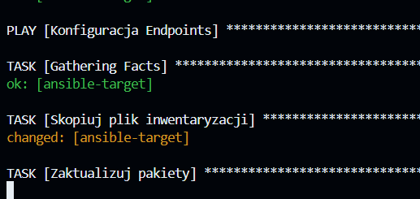

---

## CZĘŚĆ 4: Wdrożenie kontenera Express przez Ansible

### Playbook instalujący Dockera na ansible-target

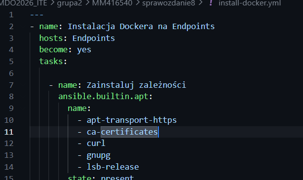

### Playbook wdrażający kontener Express

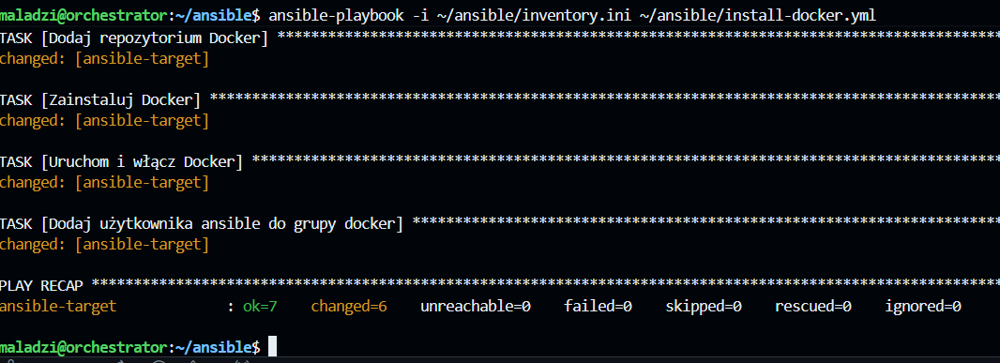

---

## CZĘŚĆ 5: Rola Ansible (ansible-galaxy)

### Szkielet roli (`ansible-galaxy init`)


### Definicja zadań – tasks/main.yml

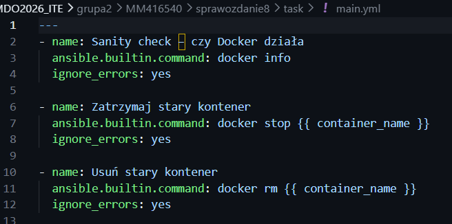

### Playbook używający roli i wynik uruchomienia

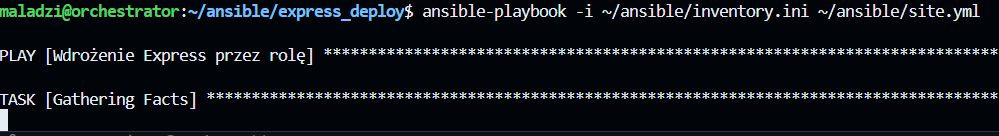

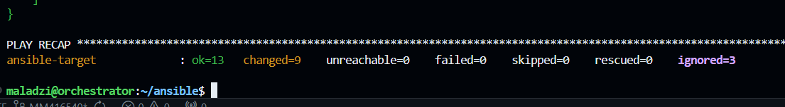

---

# Zajęcia 09 – Pliki odpowiedzi (Kickstart)

**Temat:** Automatyczna instalacja systemu Fedora Server przy użyciu pliku Kickstart (anaconda-ks.cfg).

Celem było przygotowanie pliku odpowiedzi umożliwiającego instalację nienadzorowaną, po której system automatycznie hostuje aplikację Express.js w kontenerze Docker.

---

## 1. Instalacja wstępna i pobranie pliku odpowiedzi

### Instalacja Fedory w VirtualBox

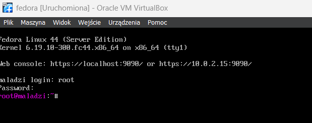

### Wygenerowany plik anaconda-ks.cfg

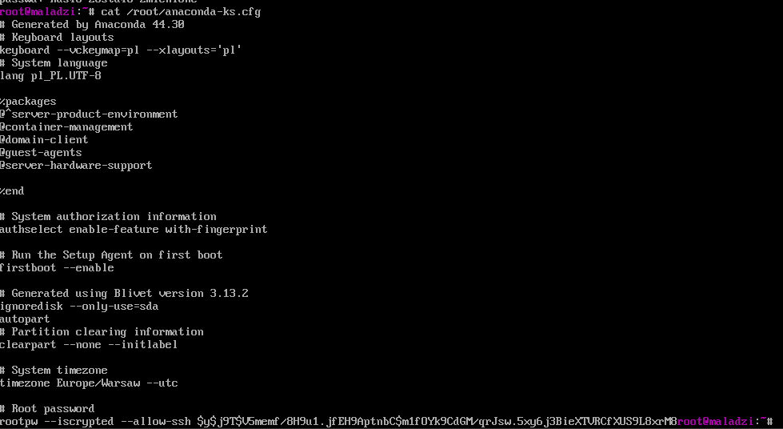

### Skopiowanie pliku na główną maszynę

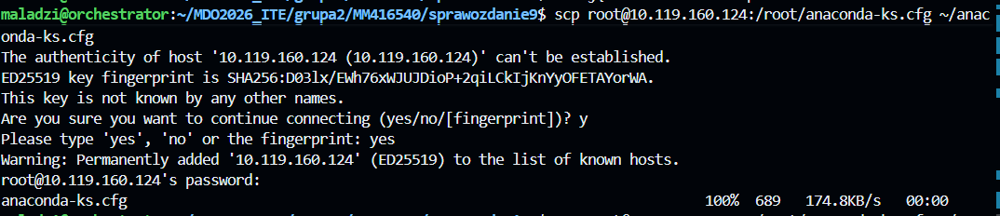

### Kluczowe modyfikacje pliku Kickstart

| Zmiana | Powód |
|--------|-------|
| Dodano `url --mirrorlist=...` | Brak repozytoriów w wygenerowanym pliku |
| Dodano `clearpart --all` | Zawsze formatuj cały dysk |
| Zmieniono hostname na `express-host` | Wymaganie zadania |
| Dodano `reboot --eject` | Automatyczny restart po instalacji |
| Rozszerzono `%packages` | Docker i zależności |
| Dodano sekcję `%post` | Instalacja Dockera, konfiguracja autostartu |

---

## 2. Dlaczego `docker run` nie działa w `%post`?

Sekcja `%post` wykonuje się podczas instalacji, zanim system zostanie w pełni uruchomiony – demon `dockerd` jeszcze nie działa. Rozwiązaniem jest `systemctl enable`, który uruchamia kontener dopiero przy pierwszym restarcie:

```
Instalacja → %post (enable) → reboot → Docker start → express-app.service → docker run
```

---

## 3. Uruchomienie instalacji nienadzorowanej

### Serwer HTTP udostępniający plik odpowiedzi

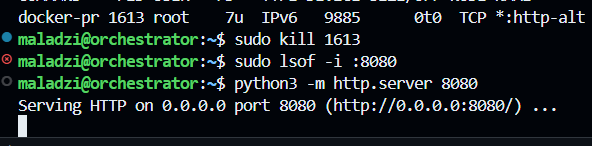

### Modyfikacja GRUB – dodanie parametru `inst.ks`

```
inst.ks=http://10.119.160.27:8888/anaconda-ks.cfg
```

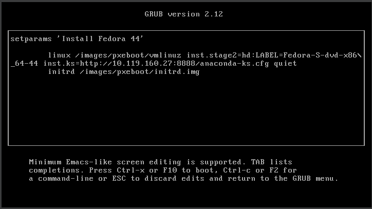

---

## 4. Weryfikacja po instalacji

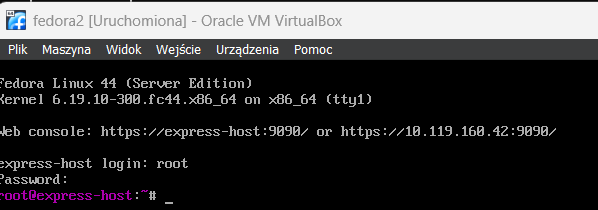

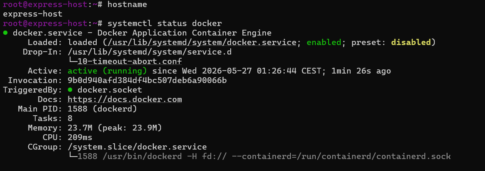

---

## 5. Dyskusja – kiedy instalacja nienadzorowana ma sens?

| | |
|---|---|
| **Zalety** | Powtarzalność, automatyzacja, skalowalność (setki maszyn równocześnie), plik kickstart jako dokumentacja konfiguracji |
| **Wady** | Złożoność konfiguracji, trudne debugowanie, ograniczenia sekcji `%post` |
| **Zastosowania** | Provisioning chmurowy (AWS, Azure), CI/CD, systemy IoT, obrazy bazowe VM |

---

# Zajęcia 10 – Kubernetes (minikube)

**Temat:** Wprowadzenie do Kubernetes – uruchamianie aplikacji w lokalnym klastrze minikube.

---

## CZĘŚĆ 1: Instalacja i uruchomienie klastra

### Instalacja minikube

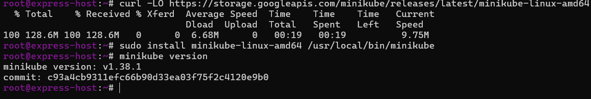

### Uruchomienie klastra (po dodaniu rdzenia CPU w VirtualBox)

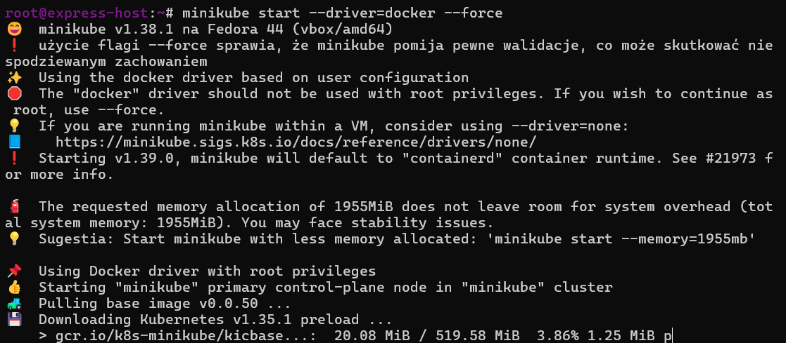

### Status klastra

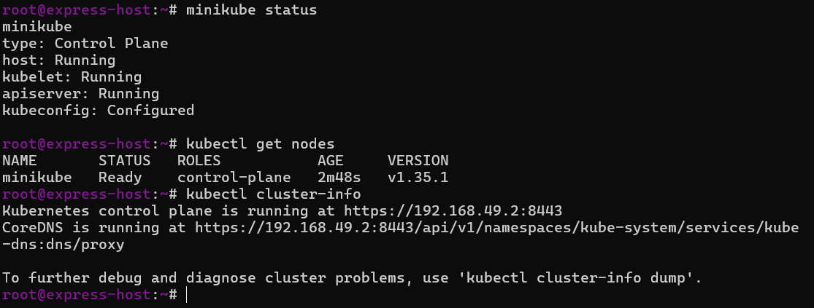

---

## CZĘŚĆ 2: Dashboard i załadowanie obrazu

### Kubernetes Dashboard

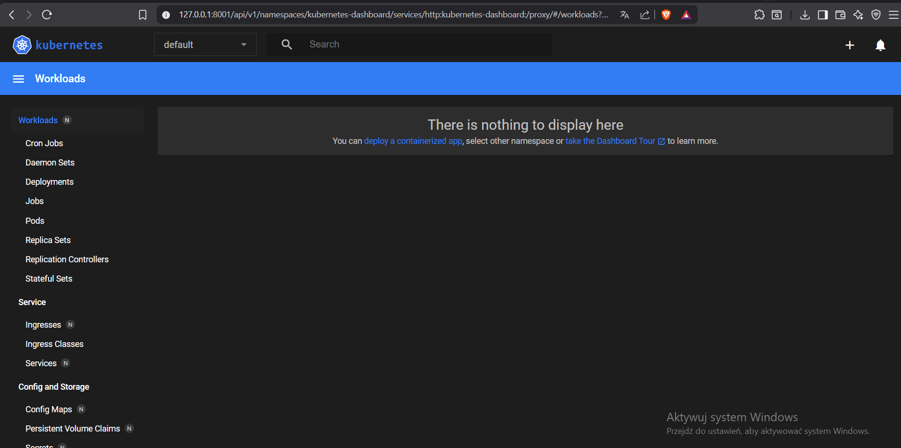

### Załadowanie obrazu Express do minikube

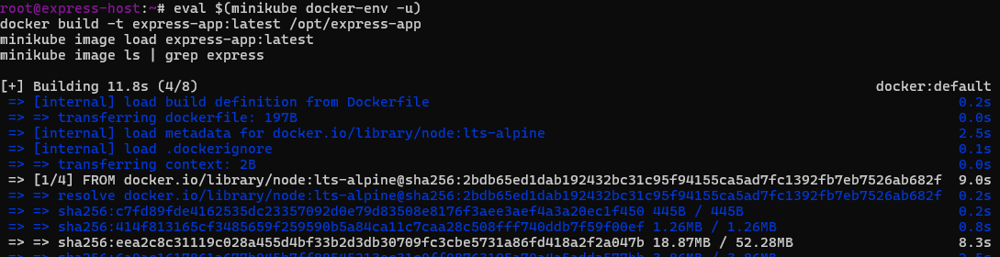

---

## CZĘŚĆ 3: Uruchomienie poda i dostęp do aplikacji

### Uruchomienie poda

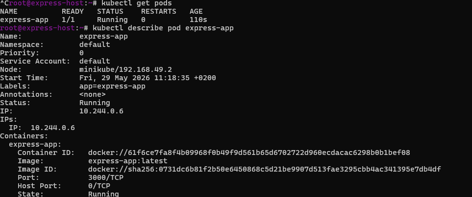

### Status poda

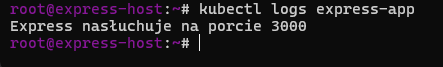

### Port-forward i działająca aplikacja

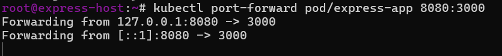

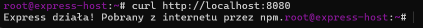

---

## CZĘŚĆ 4: Deployment YAML i serwis

### Plik deployment.yml

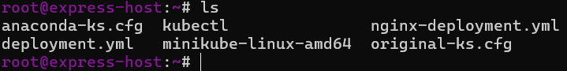

### Deployment Express z 4 replikami

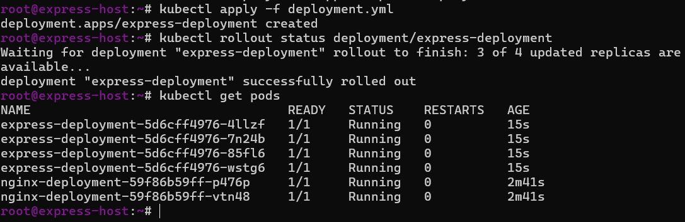

### Eksport jako serwis

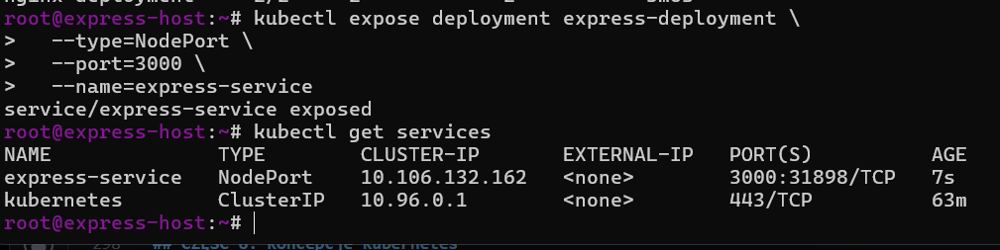

---

## CZĘŚĆ 5: Koncepcje Kubernetes

| Obiekt | Opis |
|--------|------|
| **Pod** | Najmniejsza jednostka; jeden lub więcej kontenerów współdzielących sieć i storage |
| **Deployment** | Zarządza zestawem replik; obsługuje rolling updates i rollback |
| **Service** | Stały punkt dostępu do podów; load balancer (ClusterIP / NodePort / LoadBalancer) |
| **ReplicaSet** | Zarządza liczbą replik; tworzony automatycznie przez Deployment |

### Typowe pułapki

| Objaw | Przyczyna | Rozwiązanie |
|-------|-----------|-------------|
| `ImagePullBackOff` | k8s próbuje pobrać obraz z Docker Hub | `imagePullPolicy: Never` |
| `pull access denied` | Pomyłka nazwy obrazu | Sprawdź nazwę: `express-app:latest` |
| DNS klastra nie działa | Sieć minikube odcięta od internetu | Buduj obraz na hoście, użyj `minikube image load` |

---

# Zajęcia 11 – Kubernetes: Strategie wdrożeń

**Temat:** Skalowanie, rollback i strategie aktualizacji wdrożeń w Kubernetes.

Przygotowano trzy wersje obrazu: `5.2.1` (stabilna), `5.2.2` (nowa) i `5.2.3-broken` (celowo wadliwa, do testowania rollbacku).

---

## CZĘŚĆ 1: Przygotowanie obrazów

### Lista dostępnych obrazów

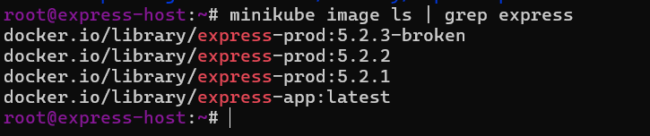

### Bazowy plik deployment.yml (4 repliki)

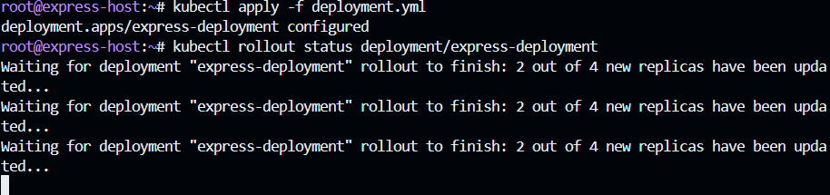

---

## CZĘŚĆ 2: Skalowanie

### Zwiększenie replik do 8

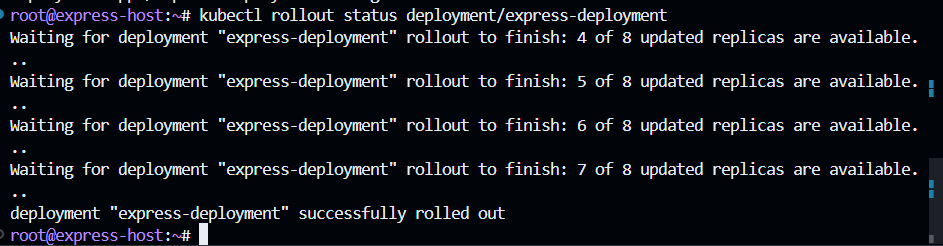

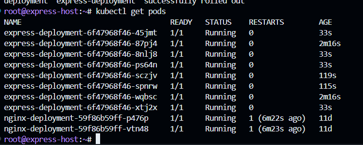

### Zmniejszenie replik do 0 i powrót do 4

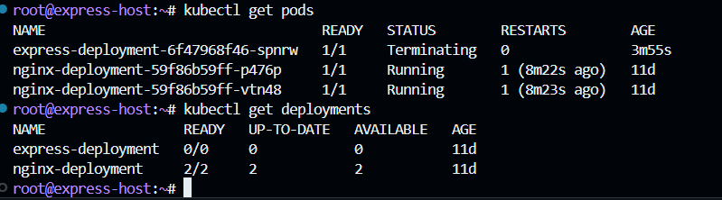

---

## CZĘŚĆ 3: Aktualizacja obrazu i rollback

### Zastosowanie nowej wersji 5.2.2

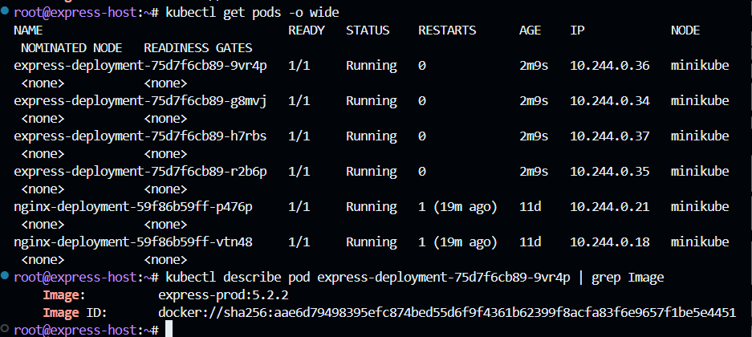

### Powrót do wersji 5.2.1

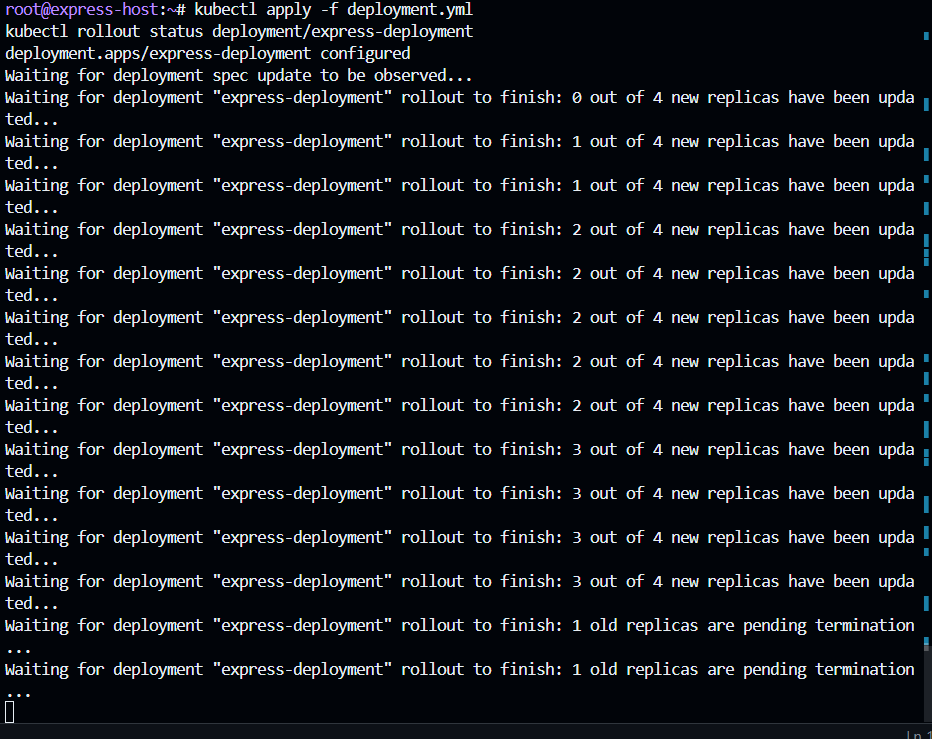

### Wadliwy obraz 5.2.3-broken – deployment zawiesza się

Po zastosowaniu wadliwej wersji nowe pody nie startowały, a stare nadal działały.

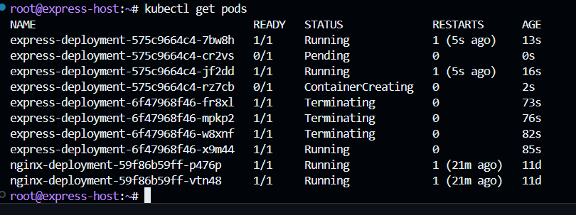

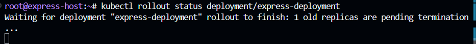

### Historia wdrożeń i cofnięcie

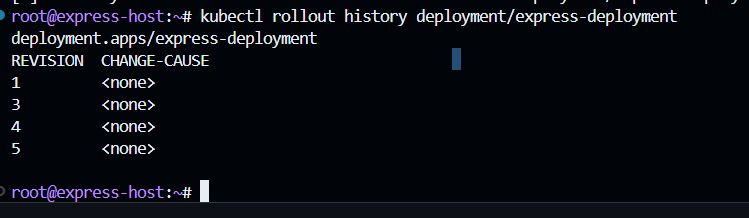

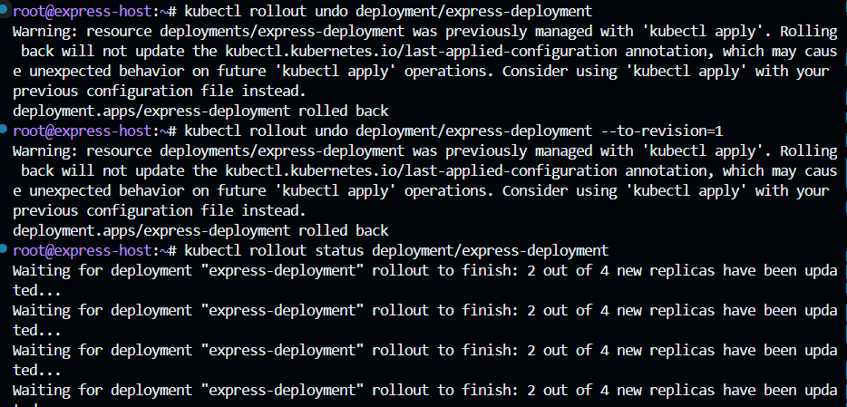

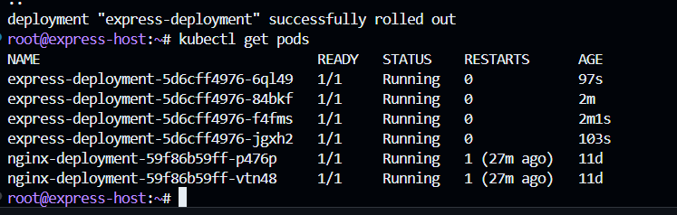

---

## CZĘŚĆ 4: Skrypt weryfikujący wdrożenie

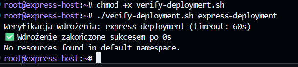

---

## CZĘŚĆ 5: Strategie wdrożeń

### Recreate – wszystkie pody zatrzymują się jednocześnie

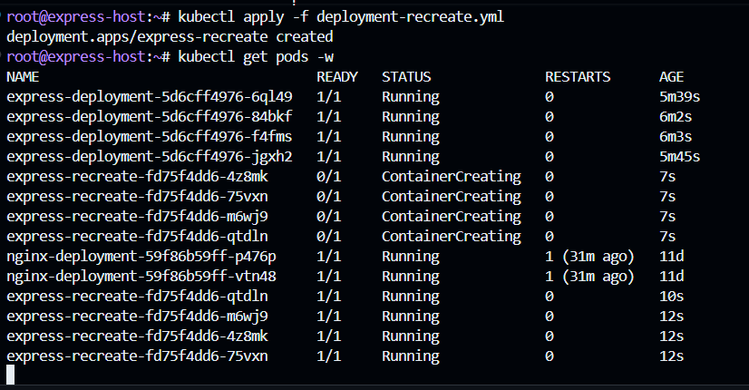

### Rolling Update – stopniowa aktualizacja

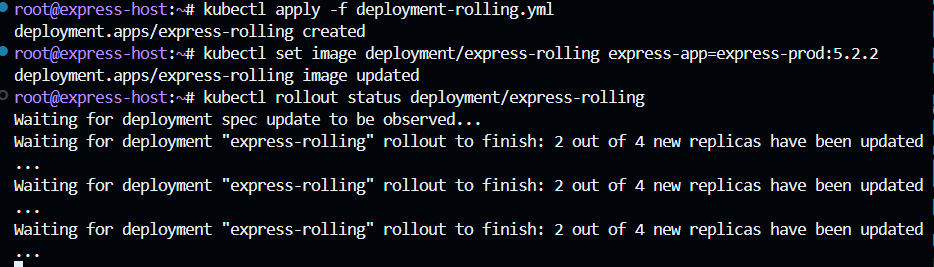

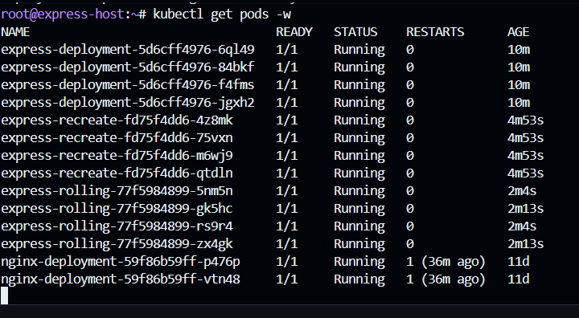

### Canary Deployment – 25% ruchu na nową wersję

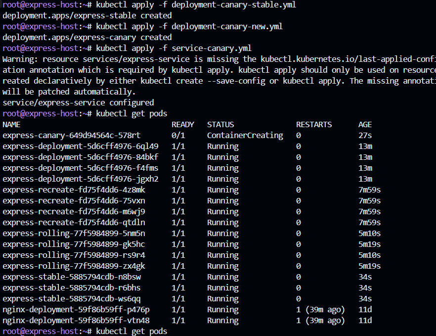

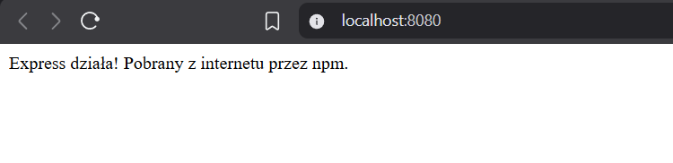

---

## CZĘŚĆ 6: Porównanie strategii

| Strategia | Downtime | Ryzyko | Rollback | Kiedy używać |
|-----------|---------|--------|----------|--------------|
| **Recreate** | TAK (~10 s) | Wysokie | Szybki | Środowiska testowe |
| **RollingUpdate** | NIE | Średnie | Automatyczny | Produkcja, stopniowa aktualizacja |
| **Canary** | NIE | Niskie | Usuń canary deployment | Testowanie nowej wersji na części ruchu |

---

# Zajęcia 12 – Wdrażanie w chmurze (Azure)

**Temat:** Uruchamianie kontenerów w Azure Container Instances (ACI).

---

## 1. Przygotowanie i publikacja obrazu

### Weryfikacja obrazu lokalnie

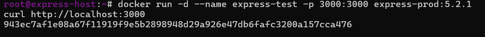

### Publikacja na Docker Hub

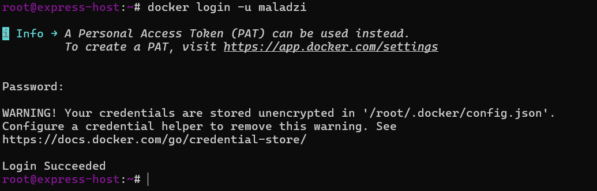

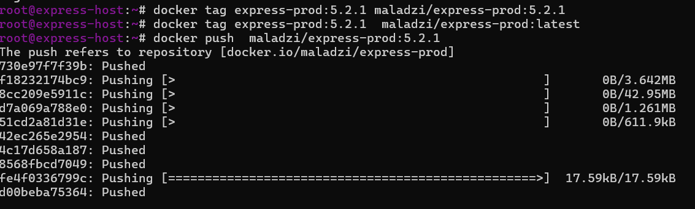

---

## 2. Platforma Azure – cennik ACI

Kluczowe informacje: opłata per sekunda za vCPU i RAM, bezpłatny tier 180 000 vCPU-s/miesiąc.


---

## 3. Wdrożenie kontenera

### Utworzenie Resource Group i wdrożenie kontenera

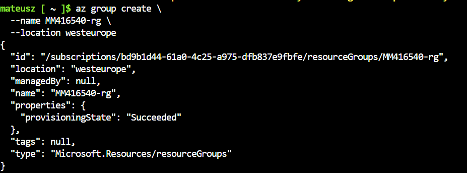

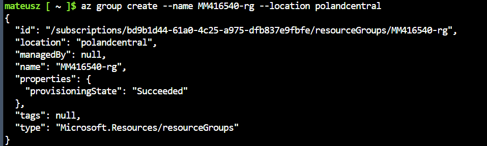

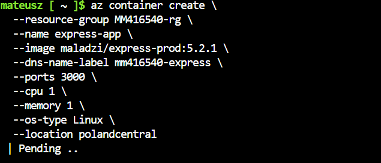

### Status kontenera

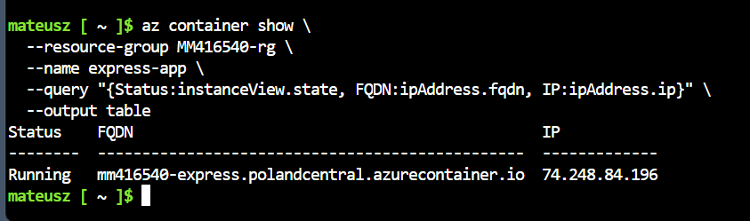

### Logi kontenera

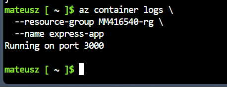

### Weryfikacja HTTP – aplikacja dostępna publicznie

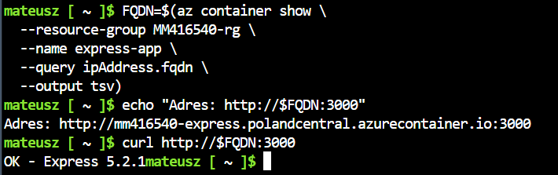

`http://mm416540-express.polandcentral.azurecontainer.io:3000/`

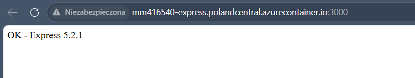

---

## 4. Zatrzymanie i usunięcie zasobów

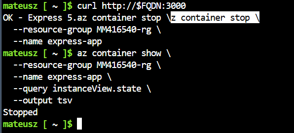

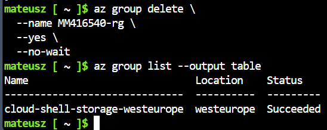

---

## 5. Dyskusja

**Dlaczego nie potrzeba Azure Container Registry?**  
Obraz jest publiczny na Docker Hub – ACI pobiera go bezpośrednio. ACR byłoby potrzebne dla obrazów prywatnych lub wymagających integracji z Azure AD / niskiej latencji pobierania.

**Porównanie z minikube:**

| Aspekt | minikube | Azure ACI |
|--------|----------|-----------|
| Dostępność | Tylko lokalnie | Publiczny internet |
| Koszty | Brak | Per sekunda (180k vCPU-s/mies. gratis) |
| Konfiguracja | Złożona | Jedno polecenie `az container create` |
| Skalowanie | Ręczne | Automatyczne |
| Zastosowanie | Deweloperskie | Produkcyjne / testowe |

---

# Podsumowanie

Zajęcia 8–12 tworzyły spójną ścieżkę od automatyzacji konfiguracji serwerów, przez instalacje nienadzorowane, aż po orkiestrację kontenerów lokalnie i w chmurze.

## Zdobyte umiejętności

| Zajęcia | Technologia | Kluczowe pojęcia |
|---------|------------|------------------|
| 08 | Ansible | Playbook, inwentaryzacja, idempotentność, rola ansible-galaxy |
| 09 | Kickstart / Anaconda | Instalacja nienadzorowana, sekcja `%post`, GRUB |
| 10 | Kubernetes / minikube | Pod, Deployment, Service, ReplicaSet, kubectl |
| 11 | Kubernetes (zaawansowany) | Skalowanie, rollback, Recreate / RollingUpdate / Canary |
| 12 | Azure ACI | Wdrożenie w chmurze, Docker Hub, Resource Group |

## Wspólny wątek – aplikacja Express.js

Przez wszystkie zajęcia przewijał się ten sam artefakt – kontener `express-prod:5.2.1`. Pozwoliło to prześledzić pełny cykl życia aplikacji:

1. **Ansible (zaj. 08)** – automatyczne wdrożenie kontenera na zdalnej maszynie przez playbook
2. **Kickstart (zaj. 09)** – automatyczna instalacja systemu, który po restarcie uruchamia kontener
3. **Kubernetes lokalnie (zaj. 10–11)** – orkiestracja wielu replik, strategie aktualizacji bez przestojów
4. **Azure ACI (zaj. 12)** – publikacja obrazu i uruchomienie aplikacji dostępnej publicznie w internecie

## Wnioski

- **Ansible** sprawdza się przy zarządzaniu konfiguracją wielu maszyn – idempotentność gwarantuje powtarzalność operacji.
- **Kickstart** eliminuje ręczną instalację systemów, co jest kluczowe przy provisioningu na dużą skalę.
- **Kubernetes** zapewnia wysoką dostępność i elastyczne skalowanie – strategia RollingUpdate i mechanizm rollback chronią przed skutkami wadliwych wdrożeń.
- **Azure ACI** to najprostszy sposób na udostępnienie kontenera publicznie – bez konieczności zarządzania infrastrukturą, z rozliczeniem per sekunda.
