# Zajęcia 08 – Ansible: poradnik krok po kroku

---

## CZĘŚĆ 1: Druga maszyna wirtualna (ansible-target)

### Krok 1: Utwórz minimalną VM

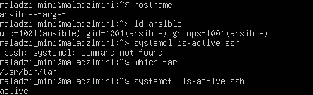

### Krok 2: Sprawdź hostname

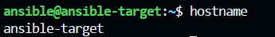

### Krok 3: Zrób migawkę VM

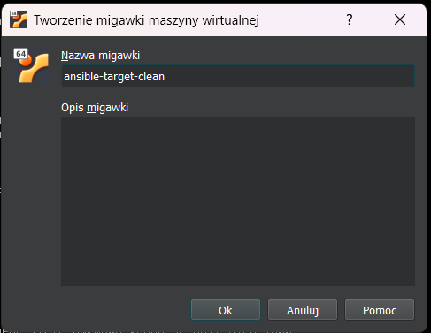
---

## CZĘŚĆ 2: Ansible na głównej maszynie

### Krok 5: Zainstaluj Ansible

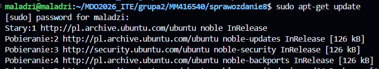

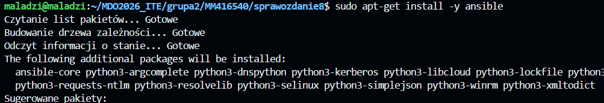

# Weryfikacja:

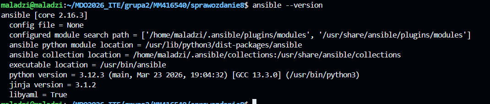

### Krok 6: Znajdź IP maszyny ansible-target

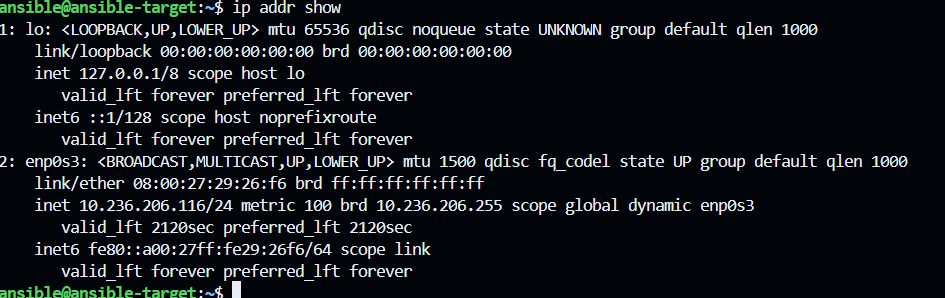


### Krok 7: Dodaj wpis do /etc/hosts na głównej maszynie

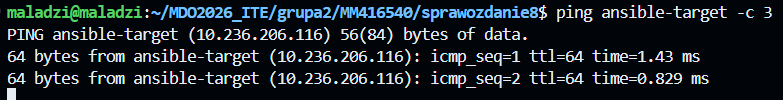

### Krok 8: Wymień klucze SSH

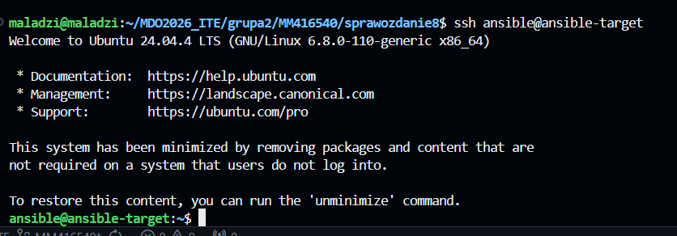

---

## CZĘŚĆ 3: Inwentaryzacja

### Krok 9: Ustaw hostname na głównej maszynie

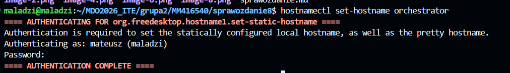
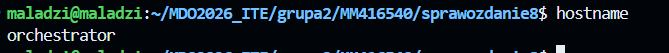

   
### Krok 10: Stwórz plik inwentaryzacji

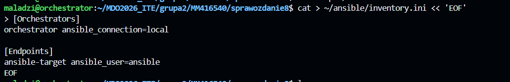

### Krok 11: Wyślij ping do wszystkich maszyn

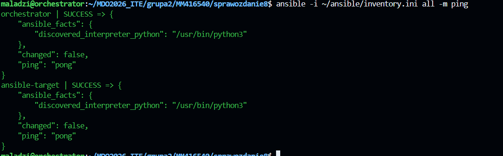

---

## CZĘŚĆ 4: Playbook – zdalne wywoływanie procedur

### Krok 12: Stwórz główny playbook
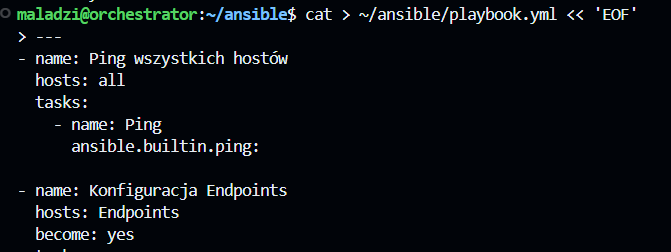

### Krok 13: Uruchom playbook

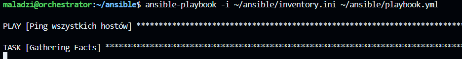

### Krok 14: Ponów operację i porównaj wyniki

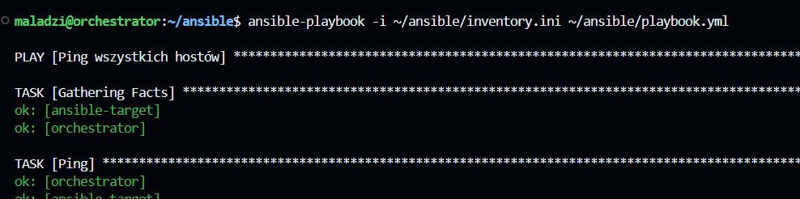

Przy ponownym uruchomieniu zadanie kopiowania pliku pokaże `ok` zamiast `changed` – Ansible jest idempotentny.
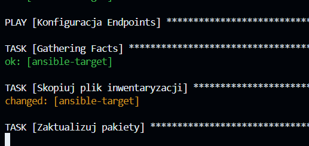

---

## CZĘŚĆ 5: Zarządzanie artefaktem (kontener Express)

Artefaktem z pipeline'u jest kontener `express-prod:5.2.1`.

### Krok 15: Playbook instalujący Dockera na ansible-target

```bash
cat > ~/ansible/install-docker.yml << 'EOF'
---
- name: Instalacja Dockera na Endpoints
  hosts: Endpoints
  become: yes
  tasks:

    - name: Zainstaluj zależności
      ansible.builtin.apt:
        name:
          - apt-transport-https
          - ca-certificates
          - curl
          - gnupg
          - lsb-release
        state: present
        update_cache: yes

    - name: Dodaj klucz GPG Docker
      ansible.builtin.apt_key:
        url: https://download.docker.com/linux/ubuntu/gpg
        state: present

    - name: Dodaj repozytorium Docker
      ansible.builtin.apt_repository:
        repo: "deb [arch=amd64] https://download.docker.com/linux/ubuntu {{ ansible_distribution_release }} stable"
        state: present

    - name: Zainstaluj Docker
      ansible.builtin.apt:
        name:
          - docker-ce
          - docker-ce-cli
          - containerd.io
        state: present
        update_cache: yes

    - name: Uruchom i włącz Docker
      ansible.builtin.service:
        name: docker
        state: started
        enabled: yes

    - name: Dodaj użytkownika ansible do grupy docker
      ansible.builtin.user:
        name: ansible
        groups: docker
        append: yes
EOF
```

```bash
ansible-playbook -i ~/ansible/inventory.ini ~/ansible/install-docker.yml
```

### Krok 16: Playbook wdrażający kontener Express

```bash
cat > ~/ansible/deploy-express.yml << 'EOF'
---
- name: Wdrożenie Express.js na Endpoints
  hosts: Endpoints
  become: yes
  vars:
    image_name: "express-prod"
    image_tag: "5.2.1"
    container_name: "express-app"
    app_port: 3000

  tasks:

    - name: Sanity check – czy Docker działa?
      ansible.builtin.command: docker info
      register: docker_info
      ignore_errors: yes

    - name: Wypisz status Dockera
      ansible.builtin.debug:
        var: docker_info.stdout_lines

    - name: Zatrzymaj stary kontener jeśli istnieje
      ansible.builtin.command: docker stop {{ container_name }}
      ignore_errors: yes

    - name: Usuń stary kontener
      ansible.builtin.command: docker rm {{ container_name }}
      ignore_errors: yes

    - name: Uruchom kontener Express
      ansible.builtin.command: >
        docker run -d
        --name {{ container_name }}
        -p {{ app_port }}:{{ app_port }}
        {{ image_name }}:{{ image_tag }}

    - name: Poczekaj na start aplikacji
      ansible.builtin.pause:
        seconds: 3

    - name: Weryfikacja – sprawdź czy kontener działa
      ansible.builtin.command: docker ps --filter name={{ container_name }}
      register: container_status

    - name: Wypisz status kontenera
      ansible.builtin.debug:
        var: container_status.stdout_lines

    - name: Weryfikacja – sprawdź logi
      ansible.builtin.command: docker logs {{ container_name }}
      register: container_logs

    - name: Wypisz logi kontenera
      ansible.builtin.debug:
        var: container_logs.stdout_lines

- name: Czyszczenie środowiska
  hosts: Endpoints
  become: yes
  tasks:

    - name: Zatrzymaj kontener
      ansible.builtin.command: docker stop express-app
      ignore_errors: yes

    - name: Usuń kontener
      ansible.builtin.command: docker rm express-app
      ignore_errors: yes
EOF
```

```bash
ansible-playbook -i ~/ansible/inventory.ini ~/ansible/deploy-express.yml
```

---

## CZĘŚĆ 6: Rola Ansible (ansible-galaxy)

### Krok 17: Utwórz szkielet roli

```bash
cd ~/ansible
ansible-galaxy role init express_deploy
```

Powstanie struktura:
```
express_deploy/
├── defaults/
│   └── main.yml
├── handlers/
│   └── main.yml
├── meta/
│   └── main.yml
├── tasks/
│   └── main.yml
├── templates/
├── tests/
│   ├── inventory
│   └── test.yml
└── vars/
    └── main.yml
```

### Krok 18: Wypełnij meta/main.yml

```bash
cat > ~/ansible/express_deploy/meta/main.yml << 'EOF'
galaxy_info:
  author: MM416540
  description: Rola wdrażająca Express.js w kontenerze Docker
  license: MIT
  min_ansible_version: "2.9"
  platforms:
    - name: Ubuntu
      versions:
        - jammy
  galaxy_tags:
    - docker
    - nodejs
    - express
dependencies: []
EOF
```

### Krok 19: Wypełnij tasks/main.yml

```bash
cat > ~/ansible/express_deploy/tasks/main.yml << 'EOF'
---
- name: Sanity check – czy Docker działa
  ansible.builtin.command: docker info
  ignore_errors: yes

- name: Zatrzymaj stary kontener
  ansible.builtin.command: docker stop {{ container_name }}
  ignore_errors: yes

- name: Usuń stary kontener
  ansible.builtin.command: docker rm {{ container_name }}
  ignore_errors: yes

- name: Uruchom kontener Express
  ansible.builtin.command: >
    docker run -d
    --name {{ container_name }}
    -p {{ app_port }}:{{ app_port }}
    {{ image_name }}:{{ image_tag }}

- name: Weryfikacja działania
  ansible.builtin.command: docker logs {{ container_name }}
  register: logs

- name: Wypisz logi
  ansible.builtin.debug:
    var: logs.stdout_lines
EOF
```

### Krok 20: Wypełnij defaults/main.yml

```bash
cat > ~/ansible/express_deploy/defaults/main.yml << 'EOF'
---
image_name: "express-prod"
image_tag: "5.2.1"
container_name: "express-app"
app_port: 3000
EOF
```

### Krok 21: Playbook używający roli

```bash
cat > ~/ansible/site.yml << 'EOF'
---
- name: Wdrożenie Express przez rolę
  hosts: Endpoints
  become: yes
  roles:
    - express_deploy
EOF
```

```bash
ansible-playbook -i ~/ansible/inventory.ini ~/ansible/site.yml
```

### Krok 22: Wypchnij do repozytorium

```bash
cp -r ~/ansible ~/MDO2026_ITE/grupa2/MM416540/sprawozdanie8/
cd ~/MDO2026_ITE/grupa2/MM416540
git add sprawozdanie8/
git commit -m "add ansible playbooks and role"
git push origin master
```

---

## Podsumowanie kroków

| # | Co robisz | Gdzie |
|---|-----------|-------|
| 1-4 | Tworzysz VM ansible-target | VirtualBox |
| 5 | Instalujesz Ansible | Główna maszyna |
| 6-8 | Konfiguracja SSH | Terminal |
| 9-10 | Plik inwentaryzacji | Terminal |
| 11 | Ping do wszystkich | Terminal |
| 12-14 | Playbook podstawowy | Terminal |
| 15 | Instalacja Dockera Ansiblem | Terminal |
| 16 | Deploy kontenera Express | Terminal |
| 17-21 | Rola ansible-galaxy | Terminal |
| 22 | Push do repo | Terminal |
