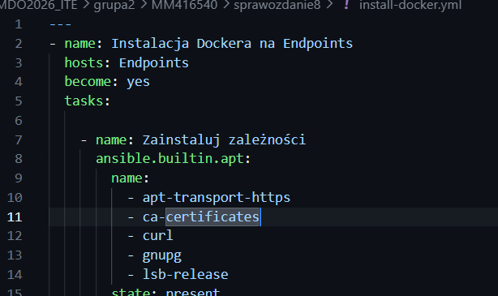
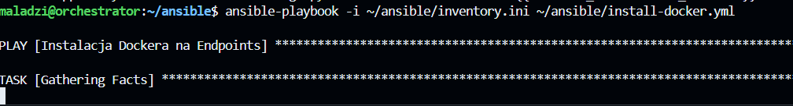
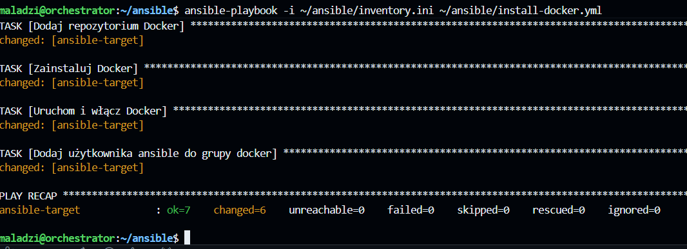
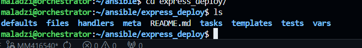
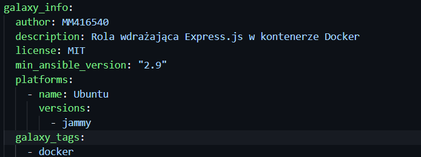
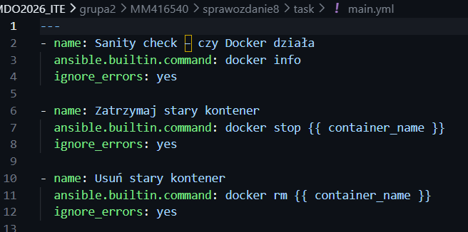
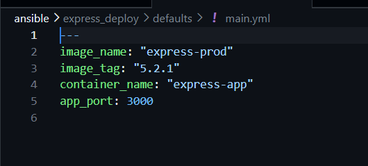
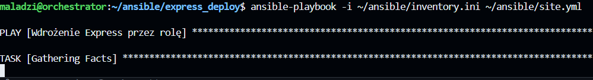
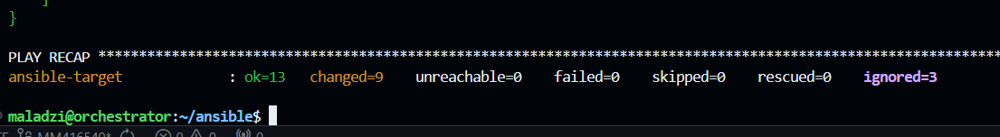

# Zajęcia 08 – Ansible: poradnik krok po kroku

---

## CZĘŚĆ 1: Druga maszyna wirtualna (ansible-target)

### Krok 1: Utwórz minimalną VM

### Krok 2: Sprawdź hostname

### Krok 3: Zrób migawkę VM

---

## CZĘŚĆ 2: Ansible na głównej maszynie

### Krok 5: Zainstaluj Ansible

# Weryfikacja:

### Krok 6: Znajdź IP maszyny ansible-target

### Krok 7: Dodaj wpis do /etc/hosts na głównej maszynie

### Krok 8: Wymień klucze SSH

---

## CZĘŚĆ 3: Inwentaryzacja

### Krok 9: Ustaw hostname na głównej maszynie

   
### Krok 10: Stwórz plik inwentaryzacji

### Krok 11: Wyślij ping do wszystkich maszyn

---

## CZĘŚĆ 4: Playbook – zdalne wywoływanie procedur

### Krok 12: Stwórz główny playbook

### Krok 13: Uruchom playbook

### Krok 14: Ponów operację i porównaj wyniki

Przy ponownym uruchomieniu zadanie kopiowania pliku pokaże `ok` zamiast `changed` – Ansible jest idempotentny.

---

## CZĘŚĆ 5: Zarządzanie artefaktem (kontener Express)

Artefaktem z pipeline'u jest kontener `express-prod:5.2.1`.

### Krok 15: Playbook instalujący Dockera na ansible-target

### Krok 16: Playbook wdrażający kontener Express

---

## CZĘŚĆ 6: Rola Ansible (ansible-galaxy)

### Krok 17: Utwórz szkielet roli

### Krok 18: Wypełnij meta/main.yml

### Krok 19: Wypełnij tasks/main.yml

### Krok 20: Wypełnij defaults/main.yml

### Krok 21: Playbook używający roli

