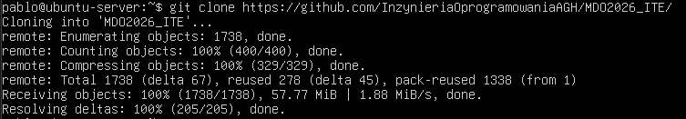
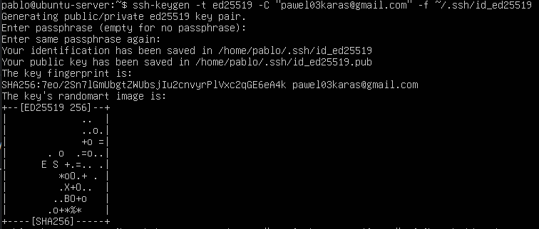
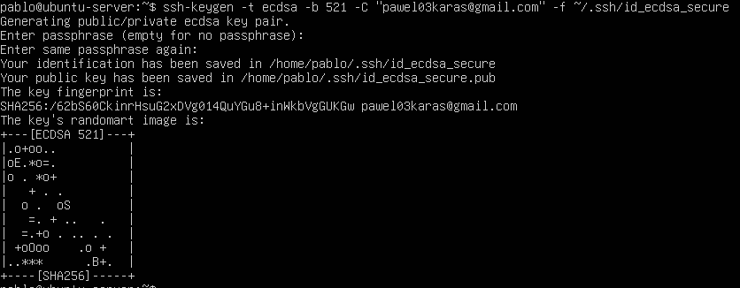
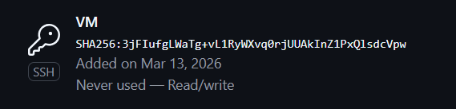
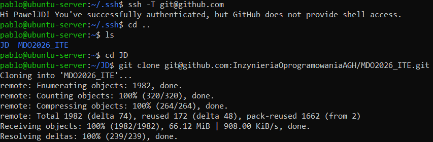
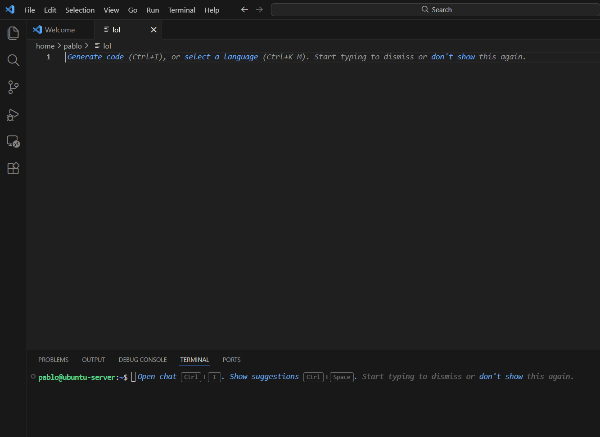
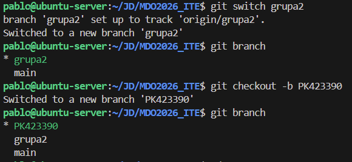
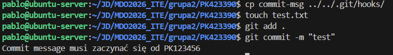

# Sprawozdanie 1

# 1. Instalacja Git


# 2. Klonowanie repozytorium przez HTTPS

Repozytorium zostało sklonowane przy użyciu protokołu HTTPS oraz Personal Access Token.



# 3. Tworzenie kluczy SSH

Utworzono dwa klucze SSH bez hasła i z




# 4. Dodanie klucza SSH do GitHub

Klucz publiczny został dodany do konta GitHub w sekcji **SSH Keys**.

Wyświetlenie klucza publicznego:

```bash
cat ~/.ssh/id_ed25519.pub
```


# 5. Klonowanie repozytorium przez SSH

Repozytorium zostało sklonowane przy użyciu protokołu SSH.



# 6. Konfiguracja środowiska pracy

Repozytorium zostało otwarte w edytorze **Visual Studio Code** przy użyciu połączenia **Remote SSH**.



# 7. Praca na gałęziach

### Przejście na gałąź grupy i utworzenie własnej



# 8. Git Hook – weryfikacja commit message

Utworzono skrypt `commit-msg`, który sprawdza czy komunikat commita zaczyna się od inicjałów i numeru indeksu.

### Treść githooka

```bash
#!/bin/bash

message=$(cat $1)

prefix="PK423390"

if [[ $message != $prefix* ]]; then
    echo "Commit message musi zaczynać się od $prefix"
    exit 1
fi
```

Hook został skopiowany do katalogu `.git/hooks/`.

# 9. Test działania hooka

Próba wykonania commita bez wymaganego prefiksu zakończyła się błędem.


