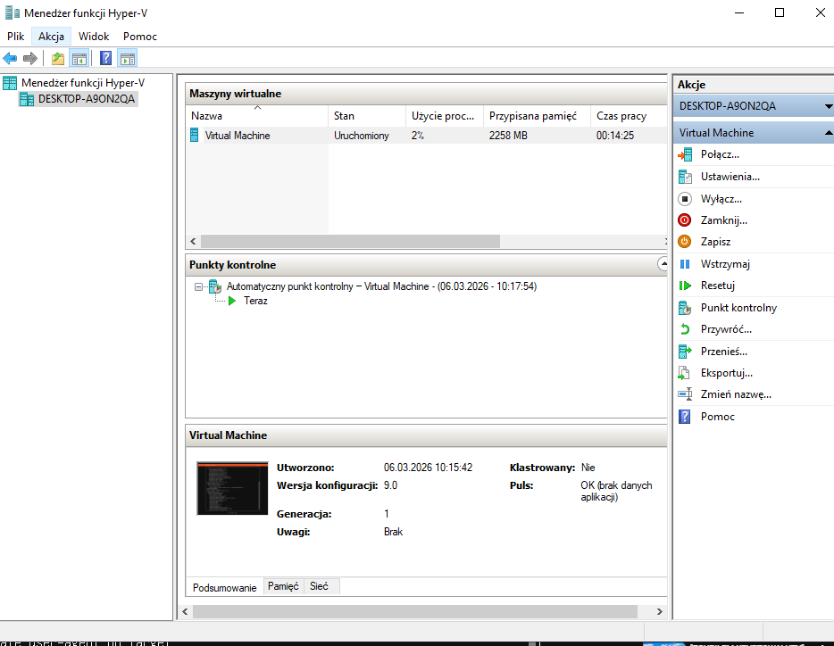
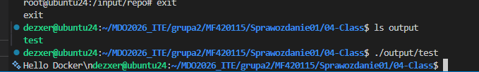
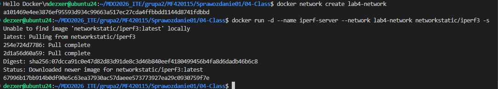
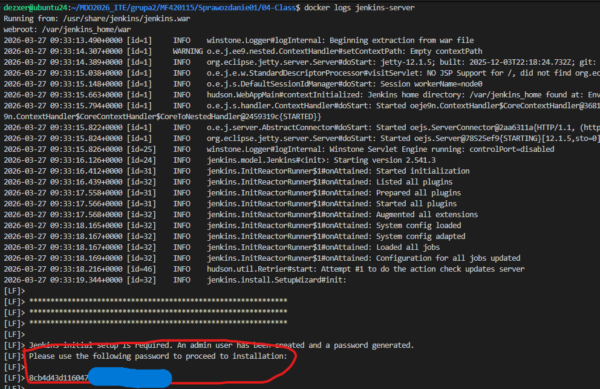
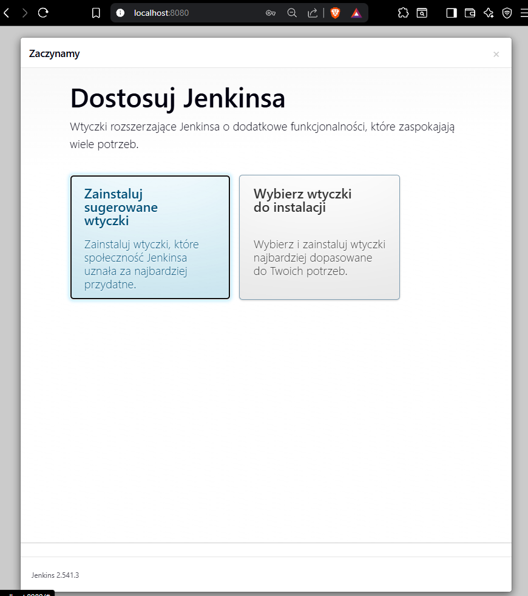

# Sprawozdanie: Laboratoriów (Zajęcia 01-04)
Autor: Maciej Fraś 

Data: 27 marca 2026 r.

Środowisko: Ubuntu 24.04.4 LTS (Virtual Machine / Hyper-V), Visual Studio Code (VSC)

1. Cel zajęć
Celem cyklu zajęć było zapoznanie się z technologią konteneryzacji - Docker, tworzeniem powtarzalnych środowisk budowania projektów, zarządzaniem siecią i woluminami oraz uruchomieniem serwera Jenkins w modelu Docker-in-Docker (DinD).

2. Zajęcia 01-02: Podstawy kontenerów i izolacja
Podczas pierwszych zajęć skupiono się na instalacji środowiska oraz uruchomieniu pierwszych obrazów. Wykazano różnicę między systemem hosta a kontenerem.

3. Zajęcia 03: Dockerfiles i etapy budowania
Celem było stworzenie powtarzalnego procesu CI. Wykorzystano projekt Expressjs, dzieląc proces na dwa etapy.

Stworzono obraz który instaluje kompilatory (npm), klonuje repozytorium i buduje projekt.

Następnie stworzono drugi obraz bazujący na obrazie buildera, który uruchamia testy jednostkowe.

4. Zajęcia 04: Woluminy, Sieci i Jenkins
Ostatni etap skupił się na zaawansowanym zarządzaniu danymi i łącznością.

Zamiast Gita wewnątrz kontenera, użyto mechanizmu montowania katalogów z hosta.
Kod źródłowy przekazano przez -v ~/jenkins_data/in:/input.Zbudowany plik binarny odebrano w folderze ~/jenkins_data/out.

B. Sieci i IPerf3
Stworzono dedykowaną sieć lab4-network oraz uruchomiono serwer i klient iperf3.Wykazano łączność po nazwie kontenera (iperf-server), 

C. Jenkins w architekturze DinD
Uruchomiono serwer Jenkins wraz z pomocnikiem docker:dind.

Konfiguracja: Jenkins łączy się z pomocnikiem przez port 2376, co umożliwia mu budowanie własnych obrazów Dockerowych wewnątrz potoków CI/CD.

Weryfikacja: Uzyskano hasło admina i wyświetlono ekran logowania na localhost:8080.

5. Laboratoria pozwoliły zrozumieć pełny cykl życia aplikacji w kontenerach: od pisania Dockerfile, przez zarządzanie siecią, aż po automatyzację w Jenkinsie.  Docker znacznie upraszcza zarządzanie zależnościami w aplikacji i gwarantuje uniwersalność działania na każdej maszynie.