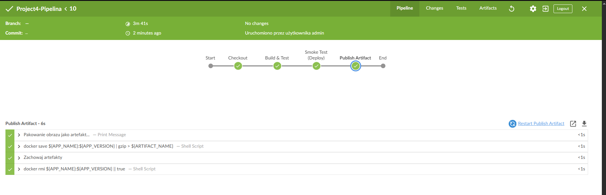
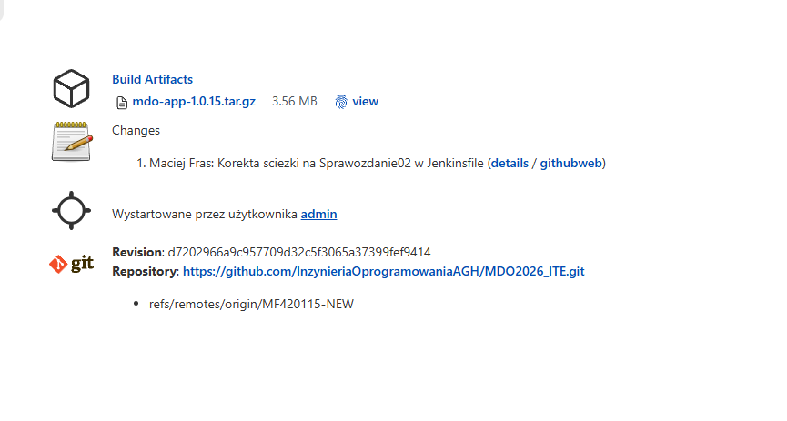

Autor: Maciej Fraś 

Data: 7 maja 2026 r.

Środowisko: Ubuntu 24.04.4 LTS (Virtual Machine / Hyper-V), Visual Studio Code (VSC)

Temat: Automatyzacja cyklu życia aplikacji przy użyciu Jenkins Pipeline i architektury Docker-in-Docker (DinD).

1. Wstęp i Architektura Systemu
Celem laboratoriów było wdrożenie pełnego procesu CI/CD dla aplikacji webowej. Cały proces miał się opierać na Jenkins'ie – narzędzie open-source automatyzujące budowanie, testowanie i wdrażanie kodu.

Architektura Docker-in-Docker (DinD):
Aby zapewnić maksymalną izolację procesu od systemu operacyjnego hosta, zastosowano architekturę kontenerową:

Serwer Jenkins: Kontener z interfejsem Blue Ocean, zarządzający logiką potoków.

Serwer Dockera: Osobny kontener pełniący rolę silnika, wewnątrz którego odbywały się operacje budowania obrazów.

Komunikacja: Kontenery połączono w dedykowanej sieci, a Jenkins komunikował się z silnikiem poprzez zmienne środowiskowe DOCKER_HOST oraz DOCKER_CERT_PATH.

2. Implementacja Pipeline
Zrezygnowano z prostych zadań typu "Freestyle" na rzecz Pipeline as Code. Całość logiki została zapisana w pliku tekstowym Jenkinsfile znajdującym się w repozytorium (SCM).

Struktura i proces:
Cleanup: Kluczowy etap zapewniający czystość środowiska. Użycie komendy docker system prune -f pozwoliło uniknąć konfliktów i przepełnienia dysku.

Checkout: Pobieranie kodu z repozytorium GitHub na dedykowanym branchu grupy.

Build & Test:

Wykorzystano strategię Multi-stage Build. Pierwszy etap (Dockerfile.build) kompilował aplikację w cięższym obrazie z narzędziami g++ i make.

Drugi etap (Dockerfile.runtime) tworzył lekki obraz produkcyjny na bazie alpine, zawierający jedynie niezbędne pliki binarne.

Weryfikacja Jakości (Smoke Test): Jenkins uruchamiał kontener na porcie 8080 i sprawdzał komendą curl, czy serwer odpowiada. Zapobiega to publikacji obrazów, które budują się poprawnie, ale nie startują.

Publish (Artefakt): Gotowy produkt pakowany był do uniwersalnego formatu .tar.gz i archiwizowany w historii buildu (archiveArtifacts).

3. Zarządzanie Artefaktami i Innowacje
W ramach prac wprowadzono mechanizm Fail-safe w procesie kompilacji. W przypadku błędu kompilatora g++, skrypt generował "aplikację zastępczą" w formie skryptu powłoki, co pozwalało na przetestowanie ciągłości potoku nawet przy brakujących plikach źródłowych (np. main.cpp).

Gotowy artefakt (paczka .tar.gz) stał się podstawą do dalszych prac z narzędziem Ansible, służącym do automatycznego wdrażania aplikacji na zdalnych hostach.

4. Wnioski
Architektura DinD gwarantuje, że procesy budowania nie "śmiecą" w systemie operacyjnym hosta.

Dzięki Multi-stage Build drastycznie zmniejszono rozmiar obrazów końcowych, co przyspiesza ich przesyłanie i start.

Zastosowanie Jenkinsfile umożliwia pełną odtwarzalność środowiska – każda zmiana w kodzie automatycznie przechodzi przez te same rygorystyczne testy.

Stabilność: Regularne CleanUp jest niezbędny w profesjonalnych systemach CI/CD, aby zapewnić powtarzalność wyników. Umożliwia to uniwersalnosc wyników na wszystkich urządzeniach.