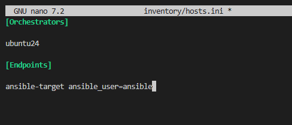
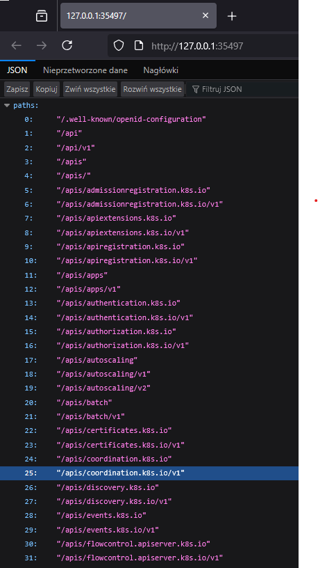
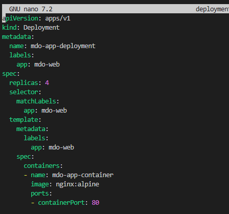
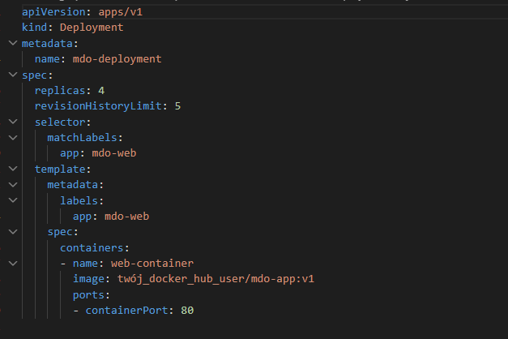
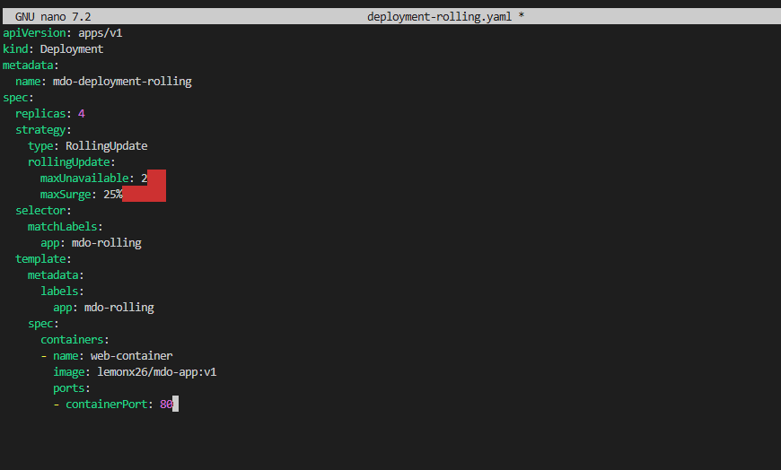
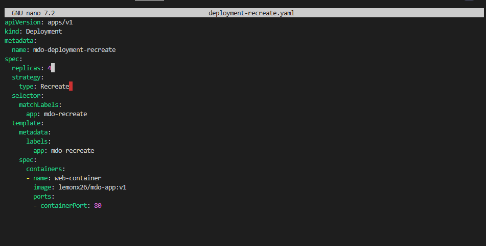
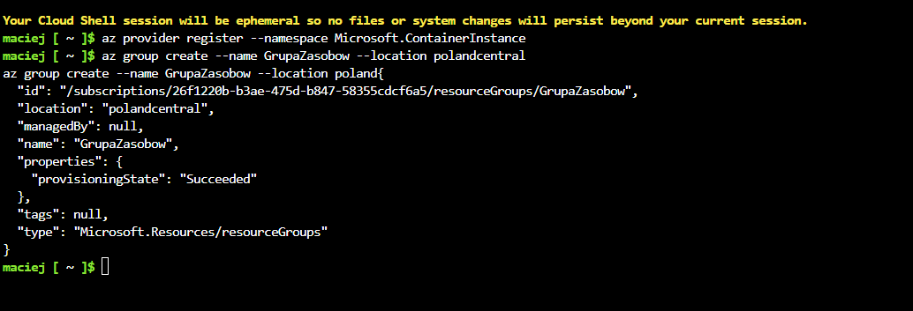
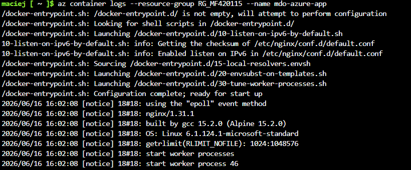
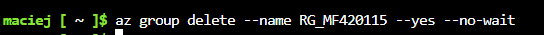

Autor: Maciej Fraś 

Data: 16 czerwca 2026 r.

Środowisko: Ubuntu 24.04.4 LTS (Virtual Machine / Hyper-V), Visual Studio Code (VSC)

1. Automatyzacja i zdalne zarządzanie (Ansible)
Cel: Automatyzacja konfiguracji i testy odporności infrastruktury.

Skonfigurowano mapowanie nazw i plik inwentarza z podziałem na Orchestrators (ubuntu24) oraz Endpoints (ansible-target – IP 172.24.176.188).

Zaimplementowano aktualizację apt, transfer plików oraz restarty usług ssh i rng. Drugie uruchomienie potwierdziło idempotentność Ansible (brak nadmiarowych zmian).

Test awaryjny: Celowe wyłączenie serwera SSH na hoście docelowym poskutkowało poprawnym przerwaniem potoku ze statusem UNREACHABLE.

Zainstalowano silnik Docker i uruchomiono kontener aplikacji na porcie produkcyjnym (failed=0). Po weryfikacji środowisko oczyszczono.

2. Fedora Kickstart
Cel: Automatyzacja aprowizacji czystego systemu operacyjnego.

Przygotowano plik odpowiedzi automatycznej Fedora Kickstart i udostępniono źródła przez lokalny serwer HTTP. Po instalacji uruchomiono i zweryfikowano demona Docker poleceniem docker ps.

3. Kubernetes
Cel: Zarządzanie mikroserwisami i mitygacja ograniczeń sprzętowych.

minikube uruchomiono z jawnym przydziałem 1900 MiB RAM i 2 rdzeni CPU.
Udostępniono Dashboard i API przez proxy. Wdrożono pojedynczy Pod nginx:alpine z przekierowaniem na port hosta 8085.

Za pomocą pliku YAML utworzono Deployment wyskalowany do 4 niezależnych replik. Na koniec wyczyszczono zasoby.

4. Strategie wdrożeń i mechanizmy Rollout
Cel: Bezprzestojowe aktualizacje i obsługa błędów wdrożeniowych.

Na Docker Hub  opublikowano wersje :v1, :v2 oraz uszkodzoną :broken - błędna komenda CMD.
Po wdrożeniu obrazu :broken pody weszły w stan awarii CrashLoopBackOff. Wykonano natychmiastowe rollout, przywracając bezprzestojowo stabilną wersję oprogramowania.

Napisano skrypt sprawdzający dostępność replik. Przeanalizowano strategie: 
Recreate -  generuje downtime, brak konfliktów wersji
Rolling Update - stopniowa, płynna podmiana
Canary Deployment - rozdzielenie ruchu w stosunku 75% do 25% przy pomocy obiektów Service.

5. Konteneryzacja w chmurze (Microsoft Azure)
Cel: Bezserwerowe wdrażanie kontenerów w chmurze publicznej.

W Azure Cloud Shell (Bash'u) aktywowano dostawcę Microsoft.ContainerInstance. Grupę zasobów i kontener uruchomiono w regionie polandcentral, pobierając obraz bezpośrednio z Docker Huba: lemonx26/mdo-app:v2.

Weryfikacja i czyszczenie: Poprawność wdrożenia zweryfikowano logami z poziomu konsoli oraz odpytaniem publicznego DNS w przeglądarce. Na koniec usunięto całą grupę zasobów w celu zatrzymania naliczania opłat.

6. Wnioski 
Ansible & Kickstart standaryzują procesy konfiguracyjne i instalacyjne, zapewniając powtarzalność środowiskową.

Kubernetes gwarantuje bezprzestojowość i elastyczność dzięki zaawansowanym strategiom dystrybucji ruchu (Rolling Update, Canary).

Azure ACI weryfikuje korzyści podejścia Serverless, skracając czas wdrożenia aplikacji bezpośrednio z rejestrów publicznych.