# Sprawozdanie Lab12, Tomasz Kamiński


## Przygotowanie kontenera


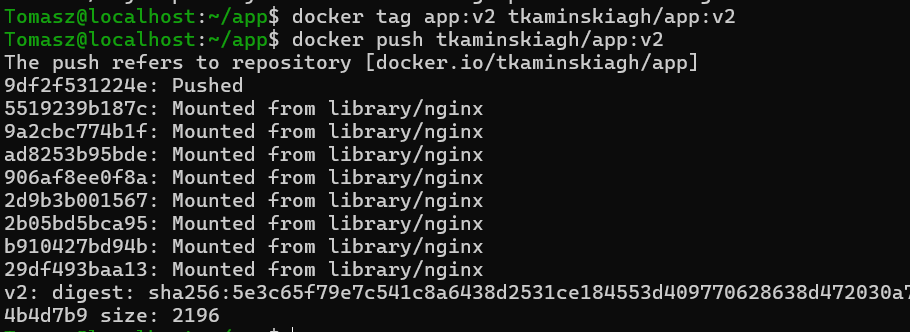

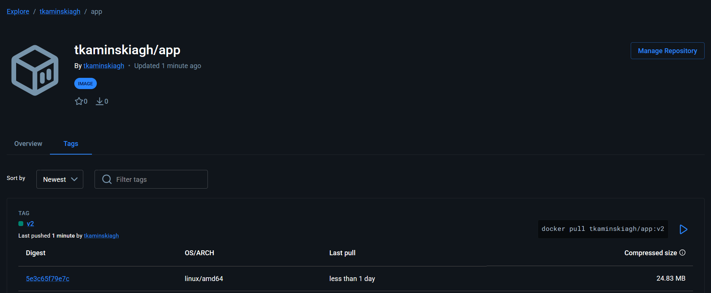

Wykorzystano obraz v2 z poprzednich zajęć i wypchnięto go na repozytorium dockerhub


## Azure

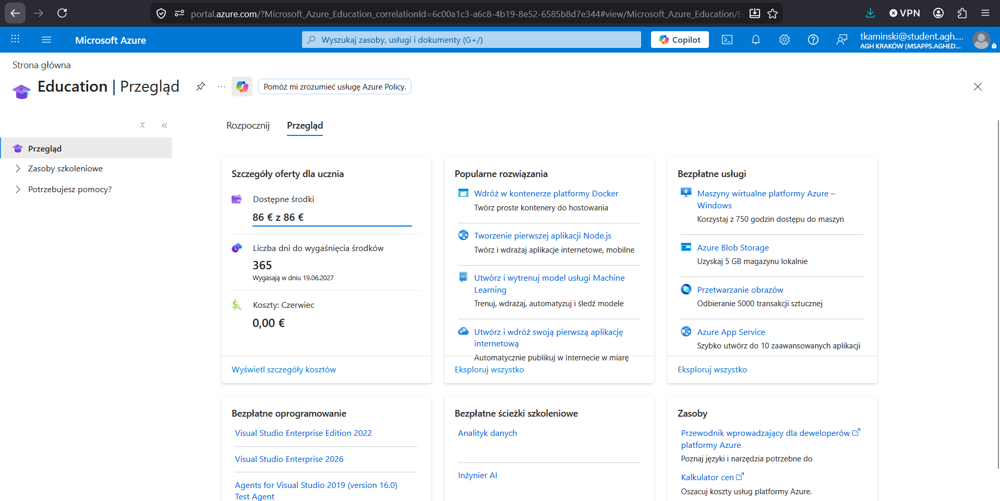


Uruchomienie Azure Cloud Shell w trybie Bash

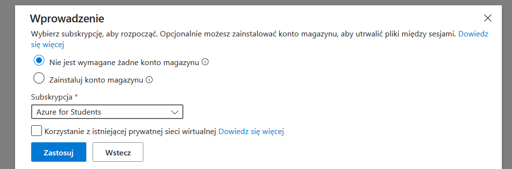


## Utworzenie grupy zasobów 

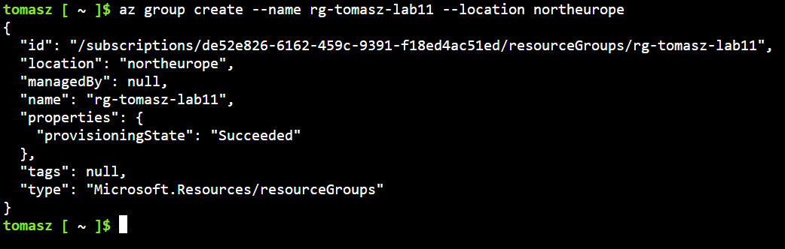


Podczas prób wdrożenia w regionach northeurope, polandcentral czy francecentral system Azure zwracał błąd odmowy dostępu, dopiero po wykorzystaniu polecnia ``` az policy assignment list --disable-scope-strict-match --query "[?name=='sys.regionrestriction'].parameters" --output json ``` można było określić prawidłową i w pełni autoryzowaną listę regionów geograficznych przypisanych do posiadanej subskrypcji studenckiej.

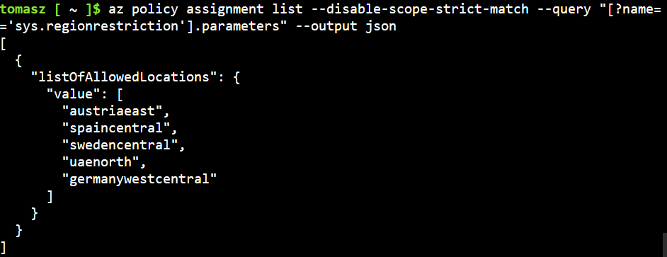


Po skorygowaniu lokalizacji na dozwolony region swedencentral, ponowne wywołanie polecenia ```az container create```  zakończyło się sukcesem. Utworzono instancje kontera z wykorzystaniem obrazu tkaminskiagh/app:v2 

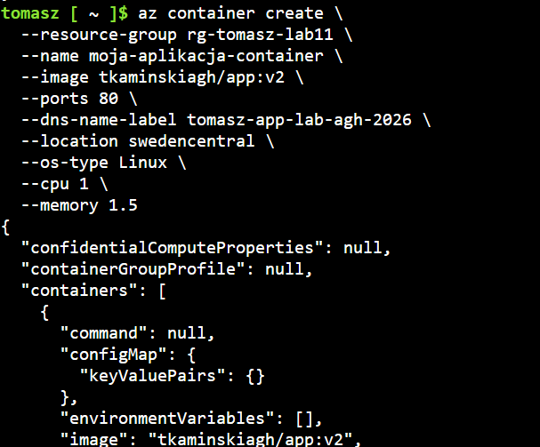


## Wykazanie stanu pracy kontenera 

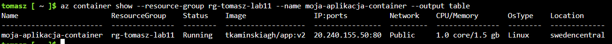


## Pobranie logów aplikacji 

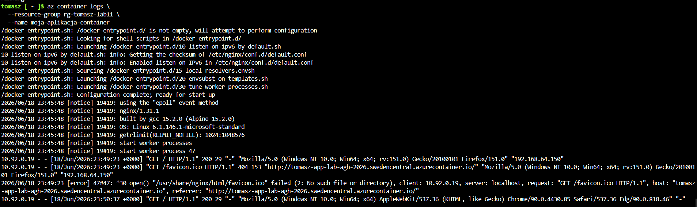


## Dostęp do usługi HTTP 


Wcześniejsze korki umożliwiły wyświetlnie strony pod publicznym adresem DNS przydzielonym przez Azure;

```http://tomasz-app-lab-agh-2026.swedencentral.azurecontainer.io/ ```

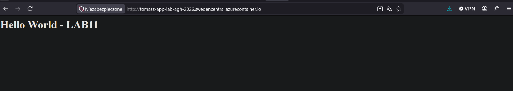


## Usunięcie kontenera i grupy zasobów 

Usunięcie kontenera:

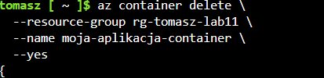

Usuniecie grupy:

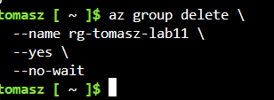

Brak dostępnych grup:

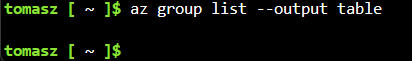

