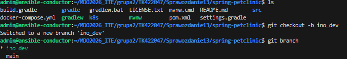
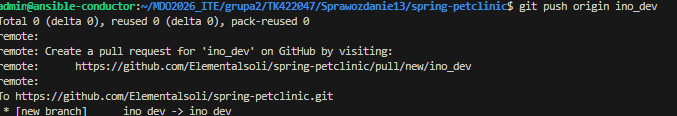
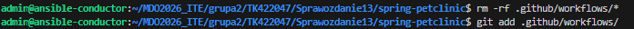
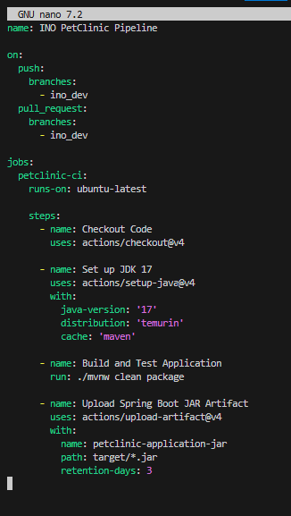
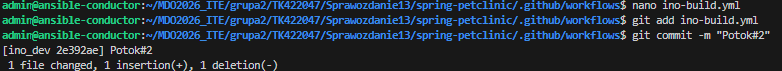
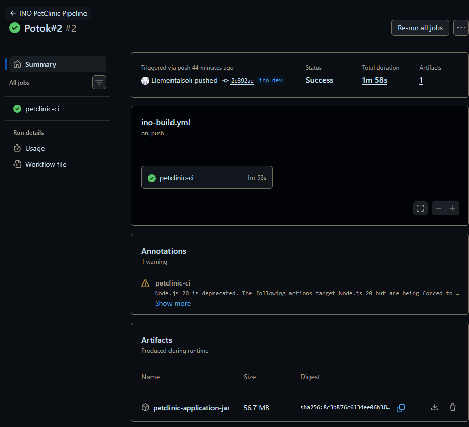
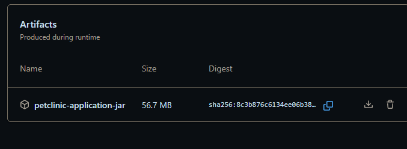

# Sprawozdanie Lab13, Tomasz Kamiński

## Fork projektu 

Do ćwiczenia wybrano projekt open-source spring-petclinic na licencji Apache-2.0 license
który wykorzystuje m.in Jave 17+, Spring boota, spring Data JPA / Hibernate

link do oficjalnego repo:
https://github.com/spring-projects/spring-petclinic


## Przygotowanie środowiska

Repozytorium zostało sklonowane z wcześniej utworzonego forka a następnie utworzono odrębny branch ```ino_dev```





Zgodnie z poleceniem usunięto wszystkie pliki workflow znajdują się w folderze .github/workflow oraz utworzono nasz własny workflow.




## Plik workflow ino-build.yml




Wypchnięcie na naszą gałąż;




### Trigger

```
on:
  push:
    branches:
      - ino_dev
  pull_request:
    branches:
      - ino_dev
```

Potok Github Actions reaguje automatycznie na dwa zdarzenia dotyczące brancha ```ino_dev```
* push - Uruchamia się natychmiast gdy commit zostanie spushowany do brancha
* pullrequest - Uruchamia się w momencie tworzenia pull reqesta oraz przy jego modyfikacji 


### Weryfikacja działania 

Po przejściu do zakłądki Actions można zobaczyć workflow zakończony sukcesem.




### Artefakt 

Zgodnie z treścią instrukcji został wygenerowany artefakt, w naszym przypadku plik w formacie .jar

```
  - name: Upload Spring Boot JAR Artifact
        uses: actions/upload-artifact@v4
        with:
          name: petclinic-application-jar
          path: target/*.jar
          retention-days: 3
```

```retetion-days``` - określa ile dni artefakt będzie dostepny do pobrania 

