# Sprawozdanie Lab5, Tomasz Kamiński

## Wstepna konfiguracja 

Uruchomienie kontenerów i odczytanie hasła

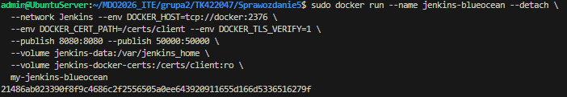

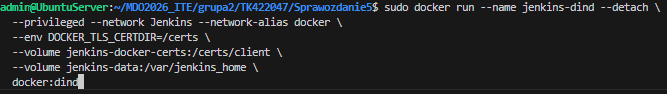

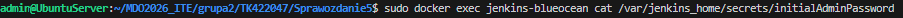

Panel główny:

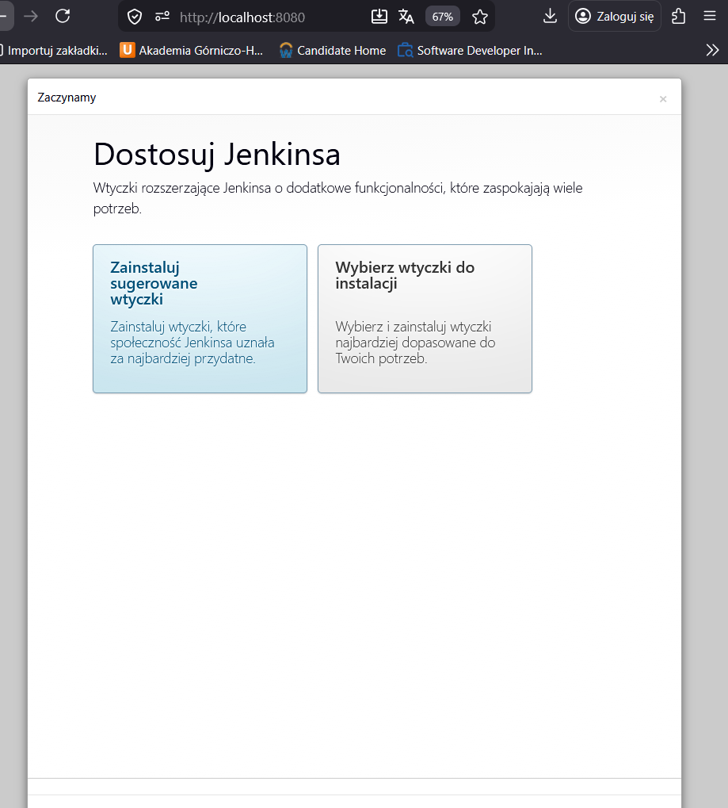

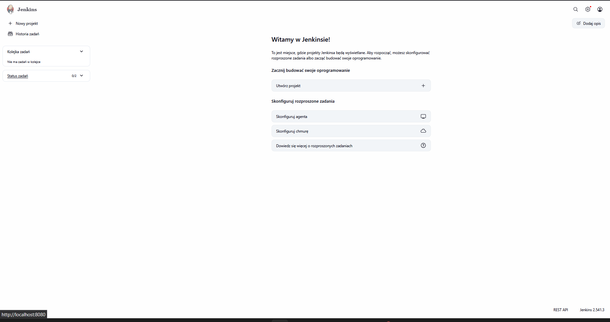

## Zadanie wstępne 

Utworzenie pierwszego zadania z uname -a 

Pipline:
~~~ 
pipeline {
    agent any
    stages {
        stage('Pokaz system') {
            steps {
                sh 'uname -a'
            }
        }
    }
}
~~~

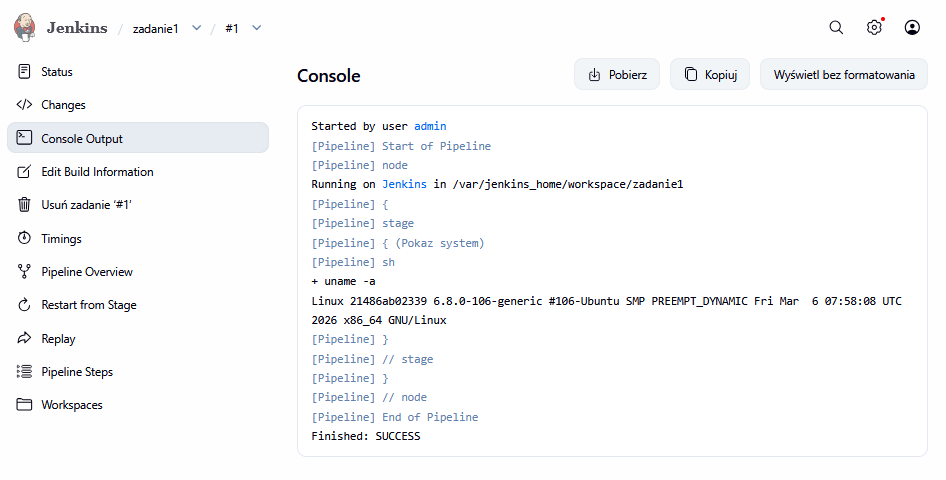

Pipline zadanie z godzina:
~~~
pipeline {
    agent any
    stages {
        stage('Sprawdzanie godziny') {
            steps {
                sh '''
                HOUR=$(date +%H)
                echo "Aktualna godzina: $HOUR"
                if [ $((10#$HOUR % 2)) -ne 0 ]; then
                    echo "Godzina $HOUR jest nieparzysta"
                    exit 1
                else
                    echo "Godzina $HOUR jest parzysta"
                fi
                '''
            }
        }
    }
}
~~~

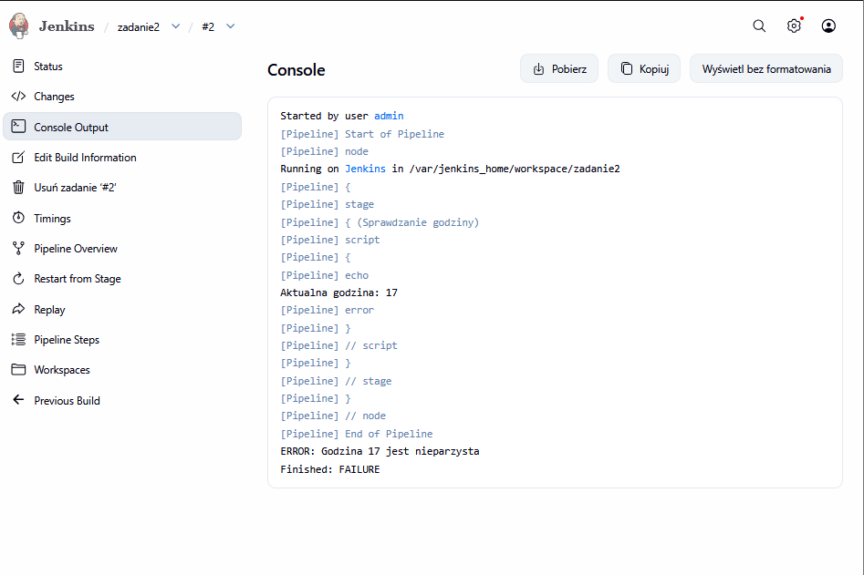

Pipline z docker pull 
~~~
pipeline {
    agent any
    stages {
        stage('Docker Pull') {
            steps {
                sh 'docker pull ubuntu:latest'
                sh 'docker images | grep ubuntu'
            }
        }
    }
}
~~~
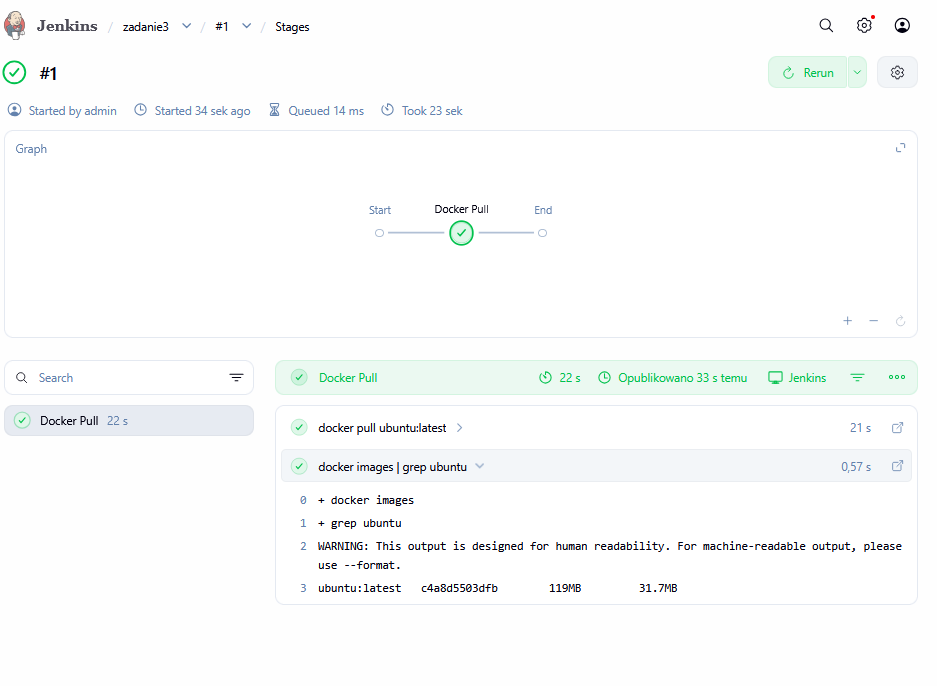

~~~
pipeline {
    agent any

    stages {
        stage('Sklonowanie repozytorium') {
            steps {
                deleteDir()
                    sh 'git clone --depth 1 --branch TK422047 https://github.com/InzynieriaOprogramowaniaAGH/MDO2026_ITE.git .'
            }
        }
        
        stage('Zbudowanie Dockerfile') {
            steps {
                script {
                    echo "Wchodzę do katalogu z Dockerfile i buduję obraz"
                    dir('grupa2/TK422047/sprawozdanie_lab4') {
                        sh "docker build -t moj-builder:${env.BUILD_ID} -f DockerFile ."
                    }
                }
            }
        }
    }
}
~~~

# Pierwsze uruchomienie 

Skrypt wykonuje klowanie repo na osobistej gałęźi i budowanie obrazu z Dokerfile.

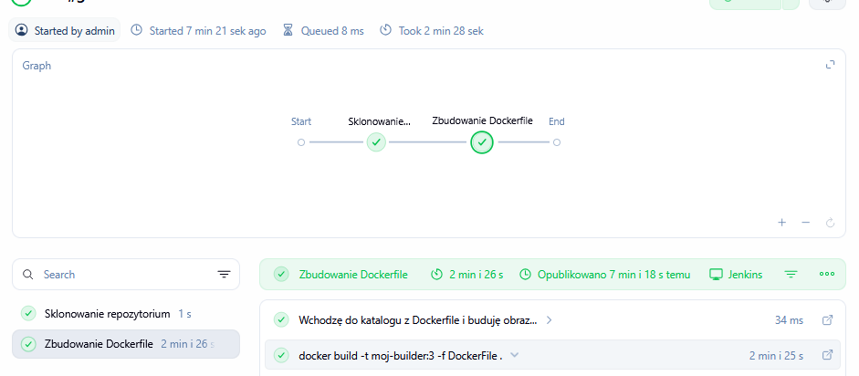

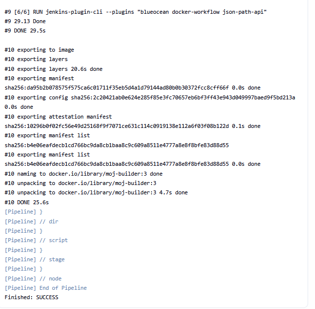

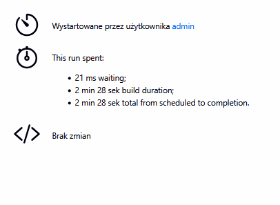

# Drugie uruchomienie 

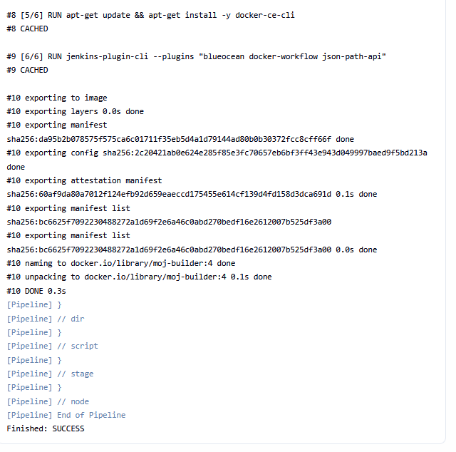

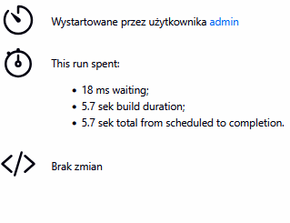

Podczas realizacji ćwiczenia można zauważyć że drugie uruchomienie zajmuje o wiele mniej czasu względem pierwszego. Różnica w czsie spowodowana jest cachowaniem, poprzedni stan jest zapamietany co skraca czas wynkonywania i logi.

