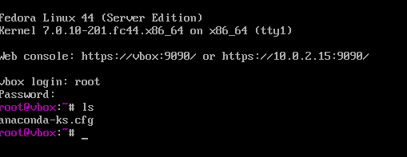
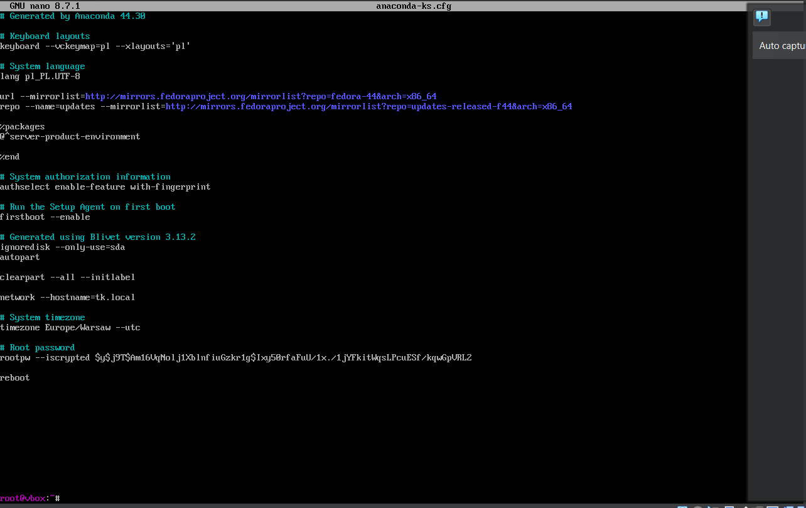
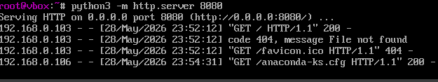
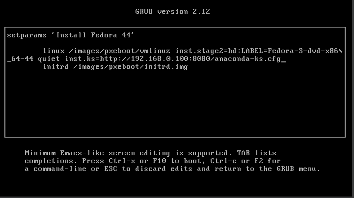
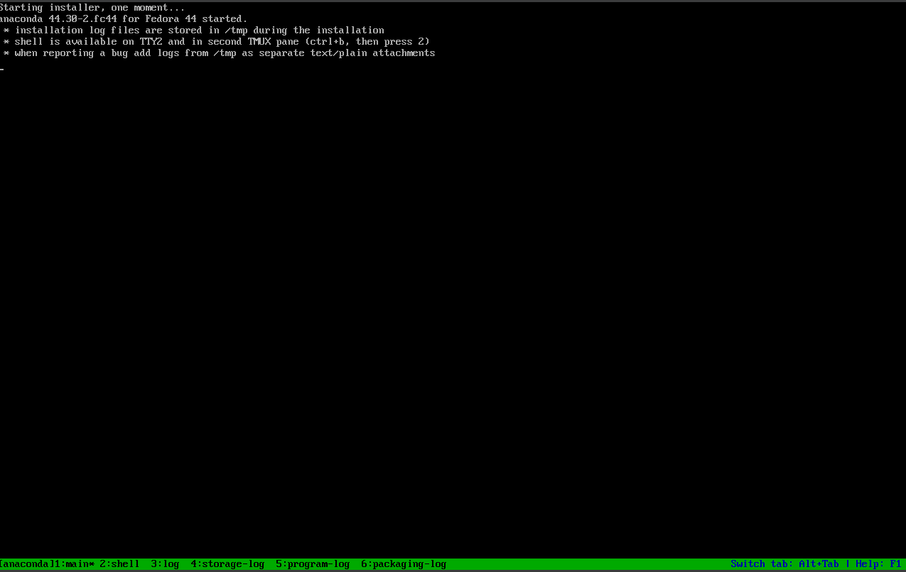
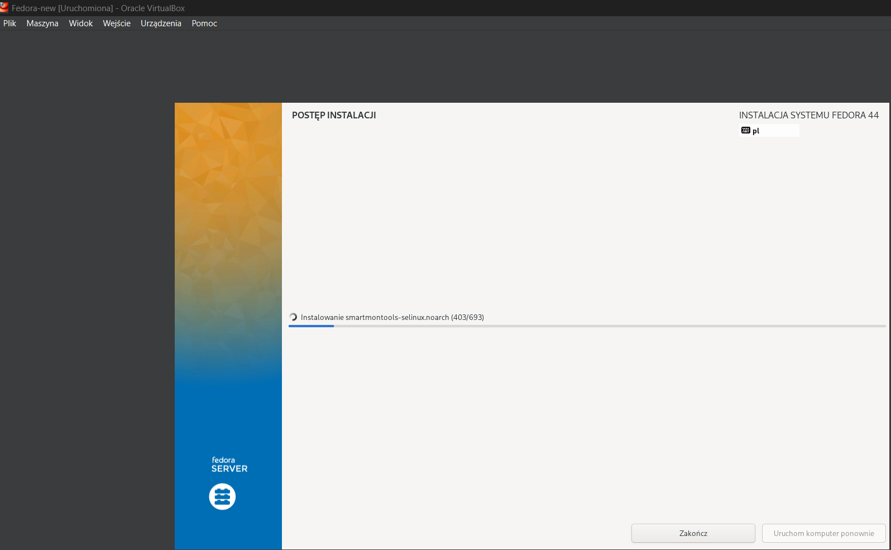
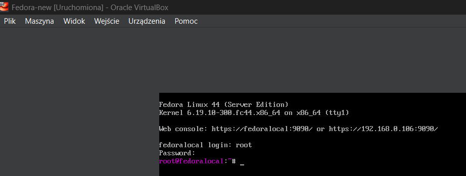
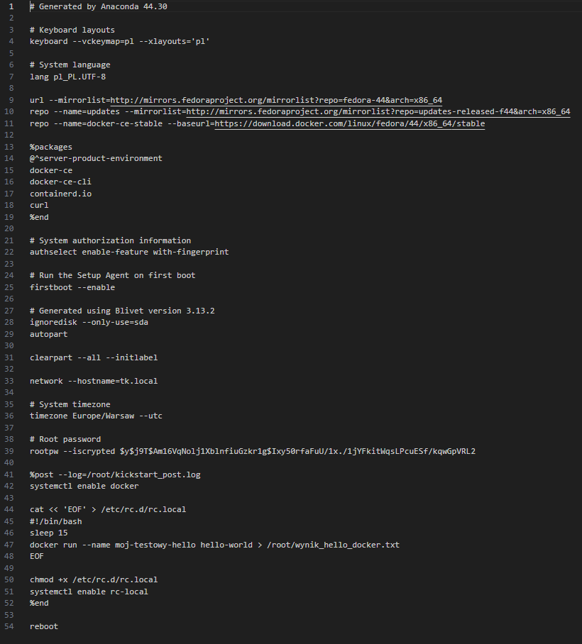
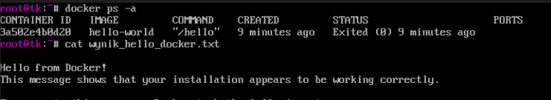

# Sprawozdanie Lab9 Tomasz Kamiński

## Utworzenie nowej maszyny z fedora

Wykorzystano obraz Fedora-Server-netinst-x86_64-44-1.7.iso

## Przygotowanie pliku kickstar

Skrypt kickstar służy do całkowitego zautomatyzowania procesu instalacji systemu operacyjnego, zamiast ręcznie wybierać opcje w interfejsce graficznym modyfikujemy plik konfiguracyjny z którego instalator będzie korzystał.

Zmodyfikowany plik anaconda-ks.cfg: 

## Automatyczna instalacja nienadzorowana

Zmieniono tryb sieci w ustawieniach obu maszyn z NAT na Kartę sieciową typu mostek oraz wyłączono firewall na pierwszej maszynie, aby odblokować ruch przychodzący na porcie 8080.

Na zainstalowanej maszynie uruchomiono serwer HTTP za pomocą Pythona, aby udostępnić plik anaconda-ks.cfg:

Wskazanie instalatorowi przygotowanego pliku odpowiedzi:

Instalacja przebiegła poprawnie, nowa maszyna pomyślnie połączyła się z serwerem http i pobrała plik .cfg 

Logowanie na nowo utworzonej maszynie Fedora-new 

Zmodyfikowany plik anaconda-ks.cfg: 

Logowanie na nowo utworzonej maszynie Fedora-new(hostname tk)

