# Sprawozdanie Lab11, Tomasz Kamiński


## Przygotowanie nowego obrazu

Budowana nowego obrazu app:v2

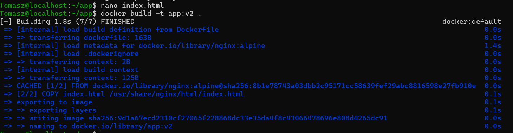

Budowa wadliwego obrazu app:v3-error z niestniejącą komendą 
``` CMD ["polecenie-nie-istnieje-blad"] ``` w Dockerfile


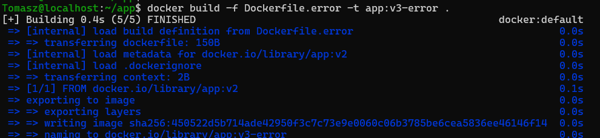

Utworzone obrazy:

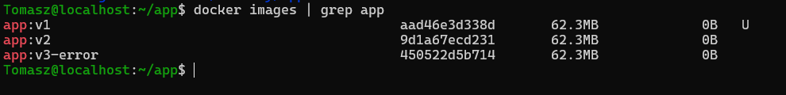


## Zmiany w deploymencie

Zwiększenie liczby replik do 8: 

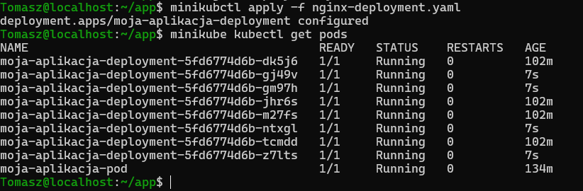


Zmniejszenie liczby replik do 1: 

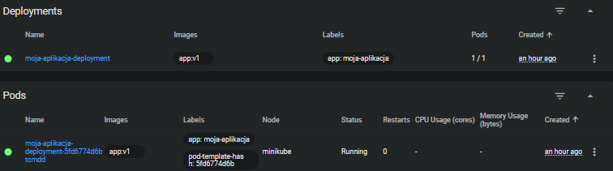

Zmniejszenie liczby replik do 0: 

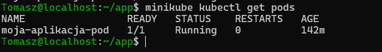

Widoczny pod został, ponieważ został utworzony ręcznie komendą kubectl run, przez co działa niezależnie i nie podlega pod reguły skalowania pliku yaml.


Powrót do 4 replik

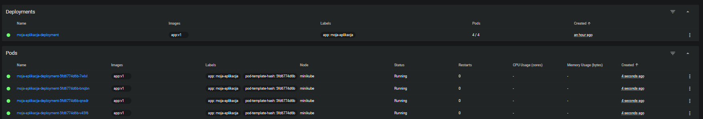


## Zarządzanie wersjami obrazów i Rollbacki


Po zmianie na nowy obraz```app:v2``` 

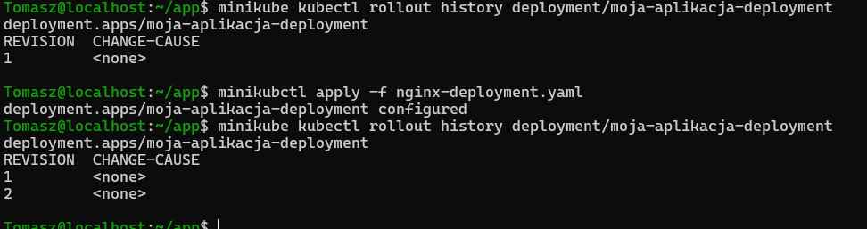


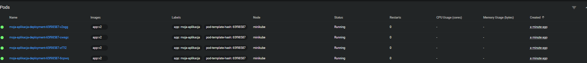


Powrót do wersji v1 po zastosowaniu komendy  ``` minikubctl rollout undo deployment/moja-aplikacja-deployment ```

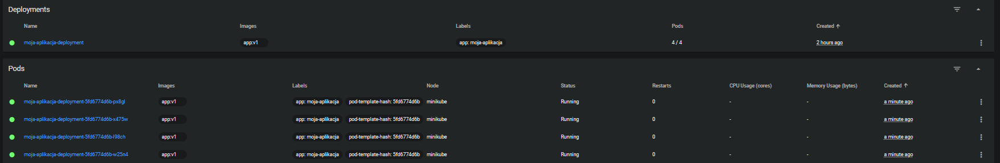


Zastosowanie wadliwego obrazu v3

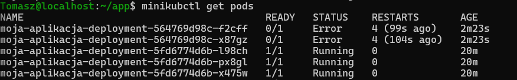


Historia wdrożenia 

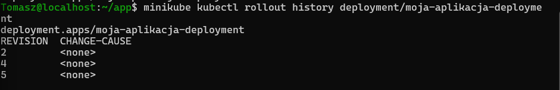


skrypt.sh

``` 
#!/bin/bash

if minikube kubectl -- rollout status deployment/moja-aplikacja-deployment --timeout=60s; then
    echo "Aplikacja wdrożyła się prawidłowo poniżej 60 sekund."
    exit 0
else
    echo "Przekroczenie limitu 60 sekund"
    exit 1
fi


fi
```

Pierwsze uruchomienie skryptu odbywa się na wersji v1 natomiast drugie na wadliwym v3, skrypt rzuca informacje o przekroczeniu przy drugim wykonaniu 

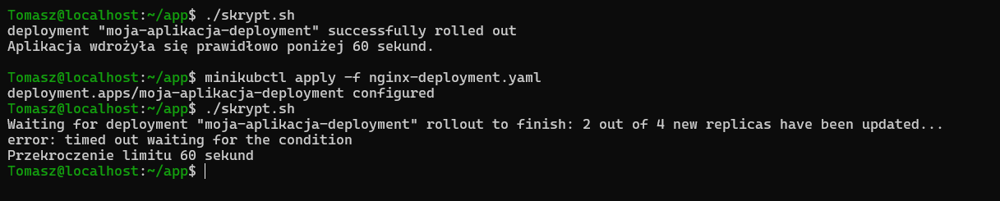


## Strategie wdrożenia

### Strategia Recreate 

deployment-recreate.yaml

```
apiVersion: apps/v1
kind: Deployment
metadata:
  name: moja-aplikacja-recreate
  labels:
    app: moja-aplikacja
    strategy: recreate
spec:
  replicas: 4
  strategy:
    type: Recreate
  selector:
    matchLabels:
      app: moja-aplikacja-recreate
  template:
    metadata:
      labels:
        app: moja-aplikacja-recreate
    spec:
      containers:
      - name: nginx-container
        image: app:v1
        ports:
        - containerPort: 80
```

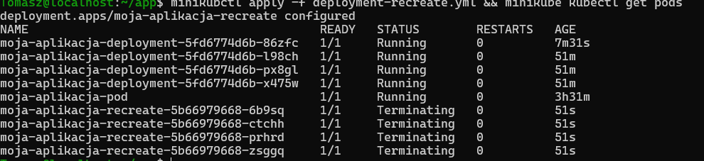

Po zmianie wdrożenia na v2 wszystkie 4 stare pody od razu przechodzą w stan Terminating czyli są usuwane, a nowe pody przez krótki moment jeszcze nie działają

### Strategia Rolling Update


deployment-rolling.yaml

```
apiVersion: apps/v1
kind: Deployment
metadata:
  name: moja-aplikacja-rolling
  labels:
    app: moja-aplikacja
    strategy: rollingupdate
spec:
  replicas: 4
  strategy:
    type: RollingUpdate
    rollingUpdate:
      maxUnavailable: 2
      maxSurge: "25%"
  selector:
    matchLabels:
      app: moja-aplikacja-rolling
  template:
    metadata:
      labels:
        app: moja-aplikacja-rolling
    spec:
      containers:
      - name: nginx-container
        image: app:v1
        ports:
        - containerPort: 80
```


Ta strategia podmienia pody stopniowo, zapewniając ciągłość działania aplikacji. Część podów jest zabijana, podczas gdy nowe już się tworzą(status ContainerCreating).


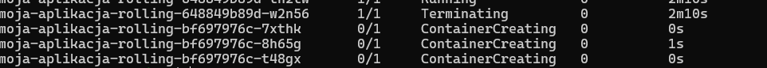

### Strategia Canary deployment 

Utworzono 3 nowe pliki 

* Deployment-canary-stable.yaml- wersja v1 na 3 replikach
* Deployment-canary-new.yaml - wersja v2 na 1 replice
* service-canary.yaml - serwis który rozdziela ruch na podstwaie wspólnej etykiety ``` app: moja-aplikacja-canar ``` 


Wdrożenie kanarkowe polega na uruchomieniu nowej wersji (v2) obok starej wersji produkcyjnej (v1) i skierowaniu do niej tylko części użytkowników. Łącznie istnieją 4 pody i każdy użytkownik ma 25% szans na trafienie na nową wersje. 

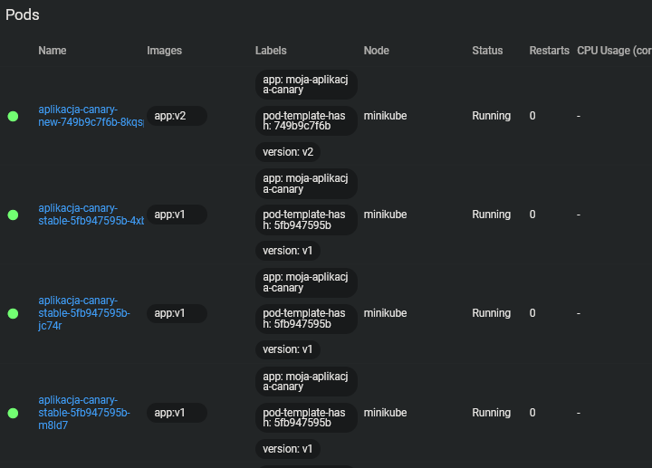


