# Sprawozdanie Lab8-12, Tomasz Kamiński

## Automatyzacja i zdalne wykonywanie poleceń za pomocą Ansible (Lab8)

### Przygotowanie środowiska 


Ansible to otwartoźródłowe narzędzie służące do automatyzacji procesów, takich jak zarządzanie konfiguracją, wdrażanie oprogramowania oraz zdalne wykonywanie zadań na wielu serwerach jednocześnie

* Utworzono nową maszynę wirtualną (ansible target) oraz na maszynie głównej zainstalowano oprogramowanie Ansible.
* Zapewniono obecność pakietu tar oraz serwera OpenSSH 
* Wymieniono klucze SSH między użytkownikiem w głównej maszynie wirtualnej, a użytkownikiem ansible z nowej, tak aby logowanie nie wymagało hasła.


### Inwentaryzacja 

Za pomocą narzędzia hostnamectl ustawiono jednoznaczne nazwy hostów, eliminując domyślne mapowanie do localhost

Stworzono plik inwentaryzacji z podziałem na grupy Orchestrators oraz Endpoints:

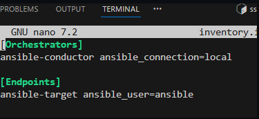

Wykonano testowe żądanie ping przy użyciu ad-hoc systemu Ansible
zakończone sukcesem.

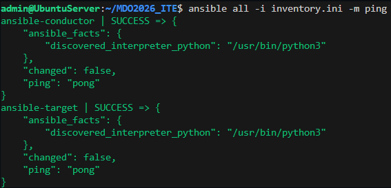


### Playbooks

Do pełnej automatyzacji zadań stworzono plik Playbook (playbook.yaml). Jego celem było wykonanie następnych kroków.


  * Sprawdzenie łączności - Ansible sprawdził, czy ma połączenie z serwerem i czy może na nim wykonywać komendy jako administrator.
  * Przesłanie pliku konfiguracyjnego - Wykorzystano moduł copy do przesłania pliku inwentaryzacji inventory.ini z maszyny sterującej do katalogu domowego użytkownika na węźle końcowym
  * Aktualizacja pakietów - Przy użyciu modułu apt przeprowadzono pełną aktualizację bazy pakietów oraz podniesienie wersji zainstalowanego oprogramowania dist-upgrade
  * Instalacja narzędzi - Playbook sprawdza, czy w systemie znajduje się pakiet rng-tools-debian. Jeśli go brakowało, został on automatycznie doinstalowany.
  * Restart usług sshd, rngd : Na koniec zrestartowano usługę z ssh oraz nowo zainstalowaną usługę rngd. Restart potwierdził, że wszystkie wprowadzone zmiany działają poprawnie, a usługi uruchomiły się z nowymi ustawieniami.
  

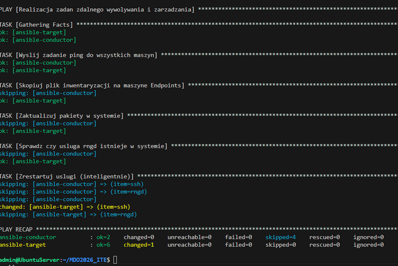

Cały playbook zakończył się sukcesem (failed=0, unreachable=0). Wynik changed=1 na węźle docelowym potwierdza, że środowisko zostało pomyślnie zmodyfikowane w kontrolowany sposób (dokonano wymaganej modyfikacji restartu usługi ssh), a pozostałe elementy systemu zachowały swoją spójność dzięki zasadzie idempotentności.

## Pliki odpowiedzi dla wdrożeń nienadzorowanych (Lab9)


### Przygotowanie pliku odpowiedzi Kickstart


Skrypt kickstart służy do całkowitego zautomatyzowania procesu instalacji systemu operacyjnego, zamiast ręcznie wybierać opcje w interfejsie graficznym modyfikujemy plik konfiguracyjny z którego instalator będzie korzystał. Żeby nie pisać pliku kickstart od zera, najpierw przeprowadziliśmy ręczną instalacje Fedory. Po jej zakończeniu system sam zapisuje wszystkie dokonane wybory w  ```/root/anaconda-ks.cfg ```

Zmodyfikowany plik anaconda-ks.cfg:

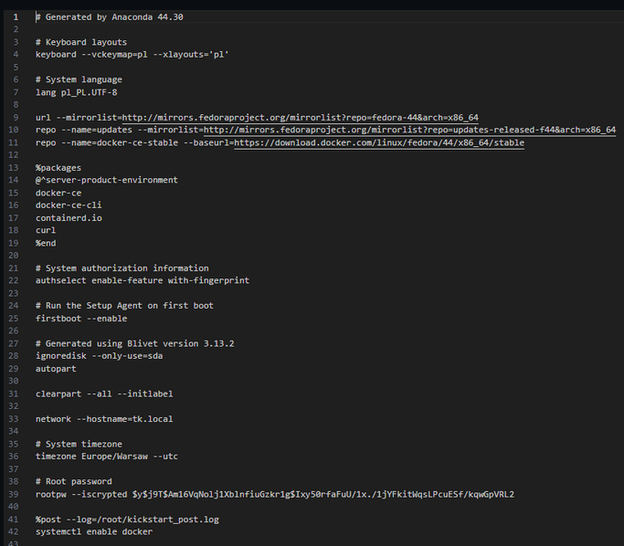

Omówienie wprowadzonych zmian: 

* wskazano oficjalne serwery lustrzane repozytoriów Fedory 44. Pozwala to na pobieranie pakietów w ich najnowszych wersjach bezpośrednio z internetu w trakcie trwania instalacji. Wskazano również również repozytorium Dockera.

* ```clearpart --all --initlabel``` czyści cały dysk i tworzy nową tabelę partycji. Dzięki temu instalator nie zatrzyma się z pytaniem, czy może nadpisać stare dane. ```autopart``` z kolei sam decyduje, jak optymalnie podzielić miejsce na dysku.

* ```hostname=tk.local``` nadaje maszynie unikalną nazwę w sieci lokalnej.

* sekcji ```%packages``` rozszerzono listę instalowanych pakietów o komponenty niezbędne do uruchomienia kontenera: docker-ce, docker-ce-cli, containerd.io oraz curl.

* W sekcji ```%post``` dodano wpis systemctl enable docker, który powoduje automatyczne uruchamianie usługi Docker przy każdym starcie systemu.

### Automatyczna instalacja nienadzorowana

Zmieniono tryb sieci w ustawieniach obu maszyn z NAT na Kartę sieciową typu mostek oraz wyłączono firewall na pierwszej maszynie, aby odblokować ruch przychodzący na porcie 8080.

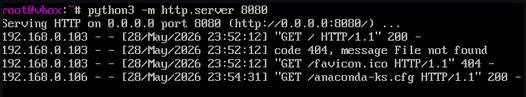

Na zainstalowanej maszynie uruchomiono serwer HTTP za pomocą Pythona, aby udostępnić plik anaconda-ks.cfg:

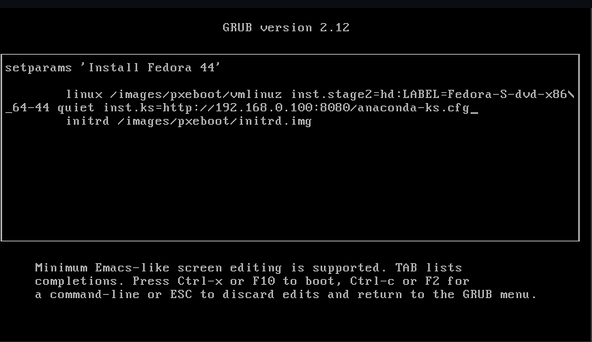

Od tego momentu instalacja przegła całkowicie autmatycznie. Po jej zakończeniu zalogowano się na nowy system.


## Wdrażanie na zarządzalne kontenery: Kubernetes (Lab10)


Celem zajęć było stworzenie odizolowanego, bezpiecznego środowiska testowego, które odwzorowuje działanie chmury obliczeniowej oraz klastra produkcyjnego Kubernetes na pojedynczej stacji roboczej.

Instalacja minikube(v1.38.1) przebiegła pomyślnie oraz dla wygody i zgodnie z rekomendacją instrukcji dodano alias ```minikubctl``` dla  polecenia ``` minikube kubectl```;

Mechanizm Kubernetes zabrania uruchomienia drivera Dockera z uprawnieniami roota, w związku z tym utworzyliśmy nowego użytkownika. Polecenie ```-driver=docker``` zapewnia pełną izolacje kontenerową.

```
useradd Tomasz 
passwd Tomasz
    
//dodanie użytkownika do grupy Dockera
usermod -aG docker Tomasz
su Tomasz
```

### Dashboard i weryfikacja łączności

Ponieważ system operacyjny hosta nie ma bezpośredniego dostępu do adresu localhost maszyny wirtualnej, wykorzystano tunelowanie portów przez protokół SSH ``` ssh -L 40381:127.0.0.1:40381 ```. Komendę tę zastosowano w celu zmapowania odizolowanego portu wirtualki na port lokalny fizycznego komputera i odpalenie dashboardu w przeglądarce na hoscie.

```minikubctl dashboard``` -- url uruchomienie dashboardu

Po tunelowaniu dashboard był dostępny lokalnie pod adresem 127.0.0.1:40381 ...

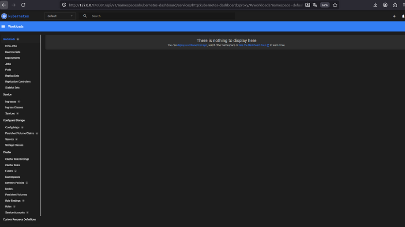


### Analiza posiadanego kontenera

Wybrano wariant optimum, wykorzystano serwer nginx, który stale działa w tle i nie kończy natychmiast pracy. Utworzono Dockerfile, który podmienia domyślną stronę startową Nginxa na naszą własną index.html.

``` eval $(minikube docker-env) ``` - komenda przełącza terminal na środowisko Dockera wewnątrz minikube.


Dockerfile

```
FROM nginx:alpine
COPY index.html /usr/share/nginx/html/index.html 
```

Utworzony obraz:

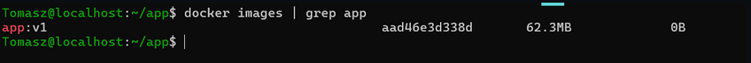

Przekierowanie portu na 8085 oraz weryfikacja łączności lokalnej: 

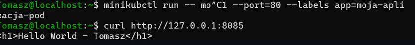


### Przekucie wdrożenia manualnego w plik wdrożenia


Utworzono plik nginx-deployment.yaml z 4 replikami i przeprowadzono próbę wdrożenia 

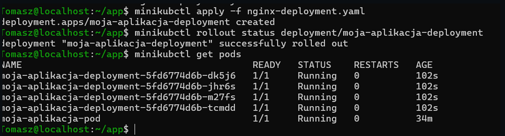

``` minikubctl apply -f nginx-deployment.yaml ``` - Uruchomienie wdrożenia 

``` minikubctl rollout status deployment/moja-aplikacja-deployment ```- 
Zbadanie stanu wdrożenia

Następnie wyeksportowanie wdrożenia jako serwis: ``` minikubctl expose deployment moja-aplikacja-deployment --type=NodePort --port=80 --name=moja-aplikacja-service ``` 

Widok dashboardu z łącznie 5 podami: 

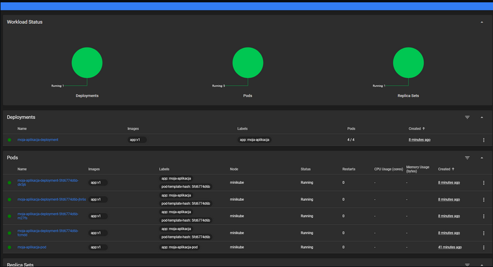


## Wdrażanie na zarządzalne kontenery: Kubernetes (Lab11)

Utworzono 2 dodatkowe wersje obrazu do testów 

``` 
docker build -t app:v2 . 
docker build -f Dockerfile.error -t app:v3-error . 
```

obraz app:v3-error został utworzony z nieistniejącą instrukcją startową``` CMD ["polecenie-nie-istnieje-blad"] ``` w Dockerfile. 

Utworzone obrazy: 
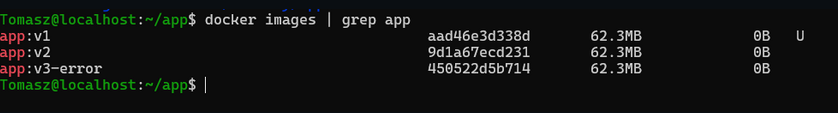


### Zmiany w deploymencie

Wykonywane zadanie polegało na skalowalnosci aplikacji poprzez zmaianę replik. Obserwowano zachowanie klastra podczas zwiększania oraz zmniejszania liczby działających podów. Przetestowano odpowiednio liczbę 8,1, 0, 4 replik.

Zmniejszenie replik do 0: 
Na liście aktywnych zasobów po wykonaniu operacji pozostał jeden działający pod o nazwie moja-aplikacja-pod. Sytuacja ta wynika z faktu, że pod ten został wcześniej utworzony drogą manualną za pomocą polecenia kubectl run

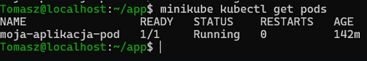


``` minikubctl rollout undo deployment/moja-aplikacja-deployment ```- polecnie używamy w celu powrotu do poprzedniej wersji w przypadku zmiany obrazu w pliku yaml.

``` minikubctl rollout history deployment/moja-aplikacja-deployment ```- 
Wyświetlenie listy wcześniejszych wdrożeń pozwala zobaczyć jakie wersje zapisał Kubernetes

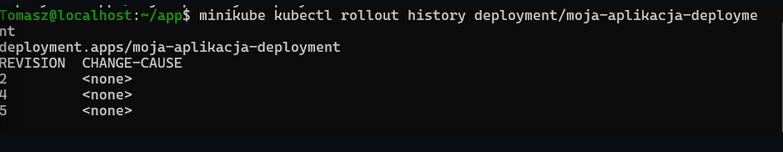

### Kontrola wdrożeń

Napisano skrypt służący do automatycznej weryfikacji statusu wdrożenia w oknie czasowym 60s.

```
#!/bin/bash

if minikube kubectl -- rollout status deployment/moja-aplikacja-deployment --timeout=60s; then
    echo "Aplikacja wdrożyła się prawidłowo poniżej 60 sekund."
    exit 0
else
    echo "Przekroczenie limitu 60 sekund"
    exit 1
fiV
``` 

Pierwsze uruchomienie skryptu odbywa się na wersji v1 natomiast drugie na wadliwym v3, skrypt rzuca informacje o przekroczeniu czasu przy drugim wykonaniu

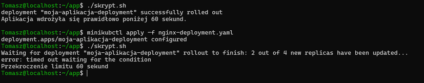

### Porównanie strategi wdrożeń 

#### Strategia recreate 


```
spec:
  replicas: 4
  strategy:
    type: Recreate
  selector:
``` 


Po zmianie wdrożenia na v2 wszystkie 4 stare pody od razu przechodzą w stan Terminating czyli są usuwane, a nowe pody przez krótki moment jeszcze nie działają

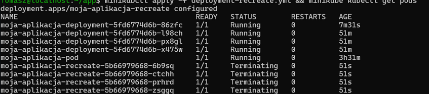


#### Strategia Rolling Update


Ta strategia podmienia pody stopniowo, zapewniając ciągłość działania aplikacji. Część podów jest zabijana, podczas gdy nowe już się tworzą(status ContainerCreating).

```
 replicas: 4
  strategy:
    type: RollingUpdate
    rollingUpdate:
      maxUnavailable: 2
      maxSurge: "25%"
```

```maxUnavailable: 2 ``` - makymsalnie 2 stare pody mogą być wyłączone jednocześnie w trakcie trwania aktualizacji 

``` maxSurge: "25%" ``` - Definiuje, ile dodatkowych podów Kubernetes może tymczasowo stworzyć ponad zadeklarowaną liczbę replik. W naszym przypadku 25% z 4 to 1 pod 


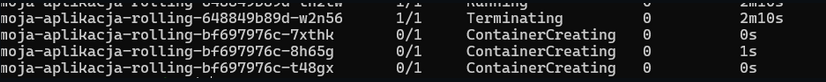


#### Strategia Canary deployment

Wdrożenie kanarkowe polega na uruchomieniu nowej wersji (v2) obok starej wersji produkcyjnej (v1) i skierowaniu do niej tylko części użytkowników. Łącznie istnieją 4 pody i każdy użytkownik ma 25% szans na trafienie na nową wersje. 

W celu wykorzystania tej strategi utworzono 3 nowe pliki 

* Deployment-canary-stable.yaml- wersja v1 na 3 replikach
* Deployment-canary-new.yaml - wersja v2 na 1 replice
* service-canary.yaml - serwis który rozydziela ruch na podstwaie wspólnej etykiety ``` app: moja-aplikacja-canary ``` 


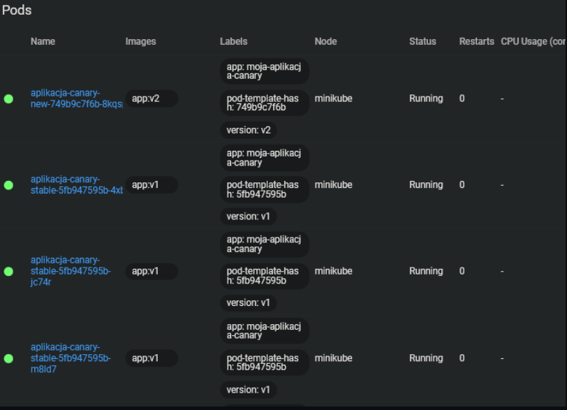


## Wdrażanie na zarządzalne kontenery w chmurze (Lab12)

W ramach laboratorium z powodzeniem przeprowadzono cykl wdrożenia aplikacji w usłudze Azure, utworzyliśmy grupę oraz instację kontenera na podstawie obrazu z lab11 wypchniętego na repozytorium docker Hub. Następnie zweryfikowaliśmy stan operacyjny kontenera poprzez inspekcję wewnętrznych logów systemowych oraz przetestowaliśmy publiczną metodę dostępu do usługi HTTP za pomocą automatycznie wygenerowanego adresu domenowego. Na koniec laboratoriów usuneliśmy kontener i grupę aby uniknąć naliczania kosztów.


Wyświetlnie strony pod publicznym adresem DNS przydzielonym przez Azure:


