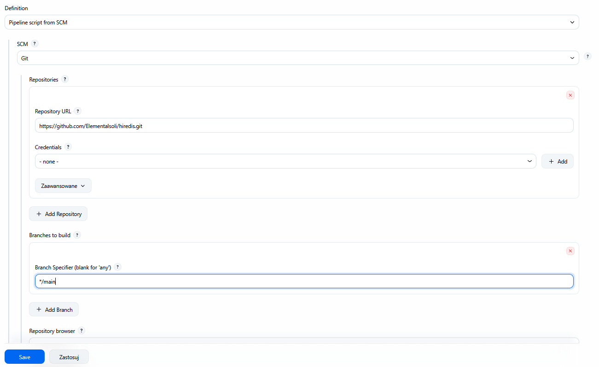
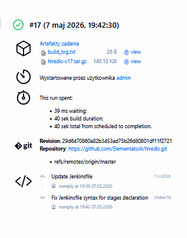
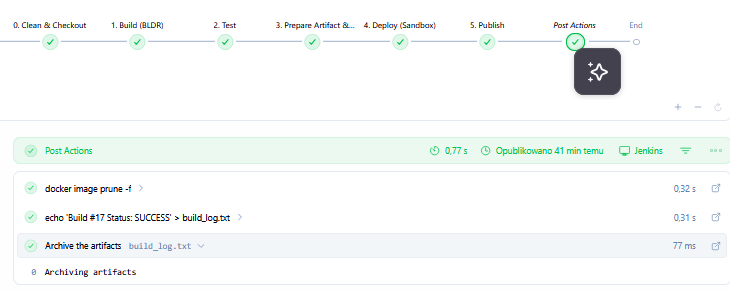

# Sprawozdanie Lab7 Tomasz Kamiński

##  SCM

Dostarczono przepis z SCM zamiast ręcznego pisania Jenkinfile 



Wskazano na sforkowane repo w którym znadjuje się Jenkinsfile dockerfile.build i dockerfile.deploy 

## Czyszczenie 

```
stage('0. Clean & Checkout') {
            steps {
                cleanWs()
                checkout scm
            }
        }
```

## Build 

```
stage('1. Build (BLDR)') {
        steps {
            sh "docker build -t hiredis-bldr:${IMAGE_TAG} -f Dockerfile.build ."
        }
    }

```

## Testy

```
stage('2. Test') {
    steps {
        script {
            sh "docker run -d --name redis-server-${BUILD_NUMBER} redis:alpine"
            
            try {
                sh "docker run --rm --network container:redis-server-${BUILD_NUMBER} hiredis-bldr:${IMAGE_TAG} make test"
            } catch (Exception e) {
                error "Błąd podczas testów: ${e.message}"
            } finally {
                sh "docker stop redis-server-${BUILD_NUMBER} || true"
                sh "docker rm redis-server-${BUILD_NUMBER} || true"
            }
        }
    }
}
```

## Utworzenie artefaktu 

```
stage('3. Prepare Artifact & Deploy Image') {
    steps {
        sh "docker create --name temp-${BUILD_NUMBER} hiredis-bldr:${IMAGE_TAG}"
        sh "docker cp temp-${BUILD_NUMBER}:/app/libhiredis.so ./libhiredis.so"
        sh "docker rm temp-${BUILD_NUMBER}"
        
        sh "docker build -t ${DOCKER_HUB_USER}/hiredis-final:${IMAGE_TAG} -f Dockerfile.deploy ."
        sh "tar -cvzf hiredis-v${BUILD_NUMBER}.tar.gz libhiredis.so"
    }
}
```

## Deploy

```
stage('4. Deploy (Sandbox)') {
    steps {
        sh "docker rm -f hiredis-sandbox || true"
        sh "docker run -d --name hiredis-sandbox ${DOCKER_HUB_USER}/hiredis-final:${IMAGE_TAG}"
      
        sh "docker ps -a | grep hiredis-sandbox"
    }
}
```

# Publish 

```
stage('5. Publish') {
    steps {
        archiveArtifacts artifacts: "hiredis-v${BUILD_NUMBER}.tar.gz", fingerprint: true
    }
}

```

pipline overview






Czy opublikowany obraz może być pobrany z Rejestru i uruchomiony w Dockerze bez modyfikacji? .

* Tak, ponieważ jedną z głównych zalet konteneryzacji jest zamknięcie całego środowiska uruchomieniowego wraz z aplikacją wewnątrz obrazu, Obraz zbudowany zgodnie z dobrymi praktykami zawiera wszystkie niezbędne biblioteki systemowe i konfiguracje. W naszym przypadku obraz docelowy
zbudowany z dockerfile.deploy zawiera skompilowaną bibliotekę libhiredis.so umieszczoną w standardowym katalogu /usr/lib, dzięki czemy każdy użytkownik otrzyma gotowe i przetestowane środowisko

Czy dołączony do jenkinsowego przejścia artefakt, gdy pobrany, ma szansę zadziałać od razu na maszynie o oczekiwanej konfiguracji docelowej? .

* Tak, skuteczny pipline CI/CD gwarantuje, że artefakt jest zdatny do wdrożenia, ponieważ został zbudowany w kontrolowanym, czystym środowisku.
jeśli środowisko docelowe jest zgodne z założeniami projektowymi, artefakt
zadziałą bez dodatkowej kompilacji. W naszym procesie dowodem na poprawność artefaktu jest etap 4, wygenerowana paczka tar.gz została rozpakowana, a jej zawartość została zamontowana i przetestowana w osobnym, czystym kontenerze.

