# Sprawozdanie Lab10, Tomasz Kamiński

 ## Instalacja minikube
 
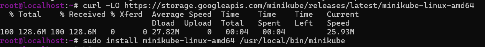

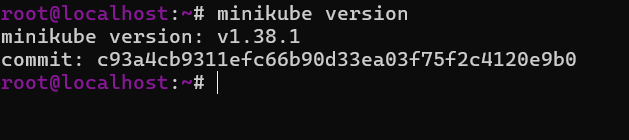


 ## Zaopatrzenie się w polecenie kubectl

Ustawiono alias minikubctl zgodnie z rekomendacją w instrukcji.

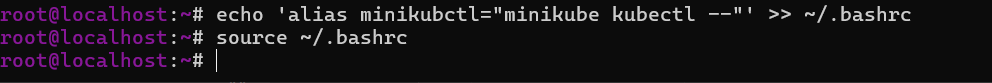

 ## Uruchomienie Klastra

Przy pierwszej próbie uruchomienia Minikube się nie odpalał ze względu na za małą ilość przydzielonych zasobów, w ustawnieniach maszyny wirtualnej zwiększono liczbe procesorów do 2 oraz podniesiono limit pamieci RAM. Po restarcie klaster wystartował już bez żadnych problemów na nowo utworzonym użytkowniku.

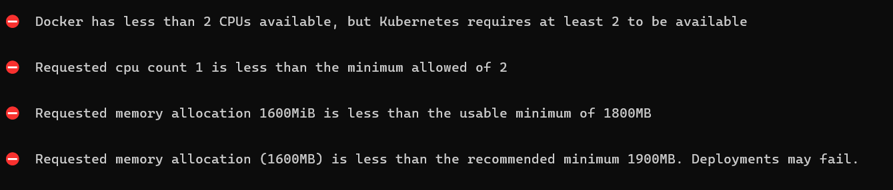


Mechanizm Kubernetes zabrania uruchomienia drivera Docker z uprawnieniami roota

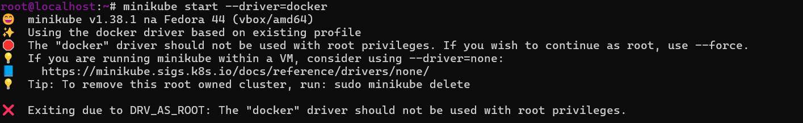


Utworzenie nowego użytkownika
``` 
useradd Tomasz 
passwd Tomasz
    
//dodanie użytkownika do grupy Dockera
usermod -aG docker Tomasz
su -u Tomasz
``` 

Prawidłowe uruchomienie klastra:

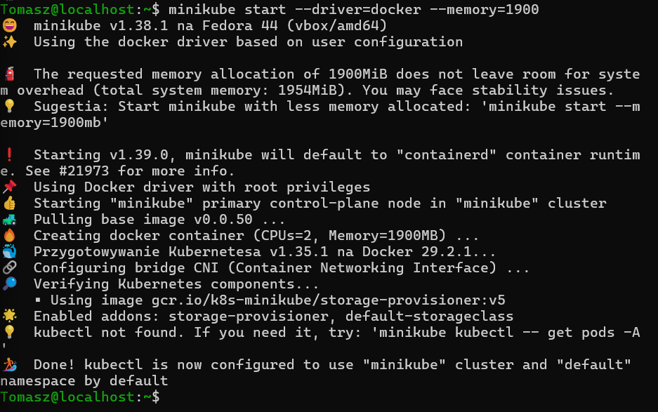


Sprawdzenie działającego węzła:

 
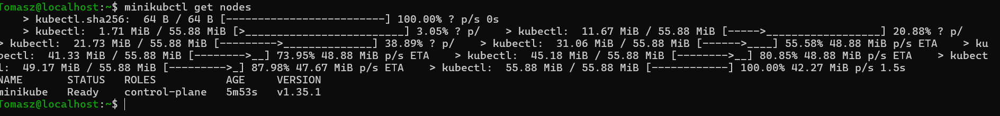

# Uruchomienie interfejsu graficznego 

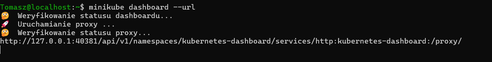

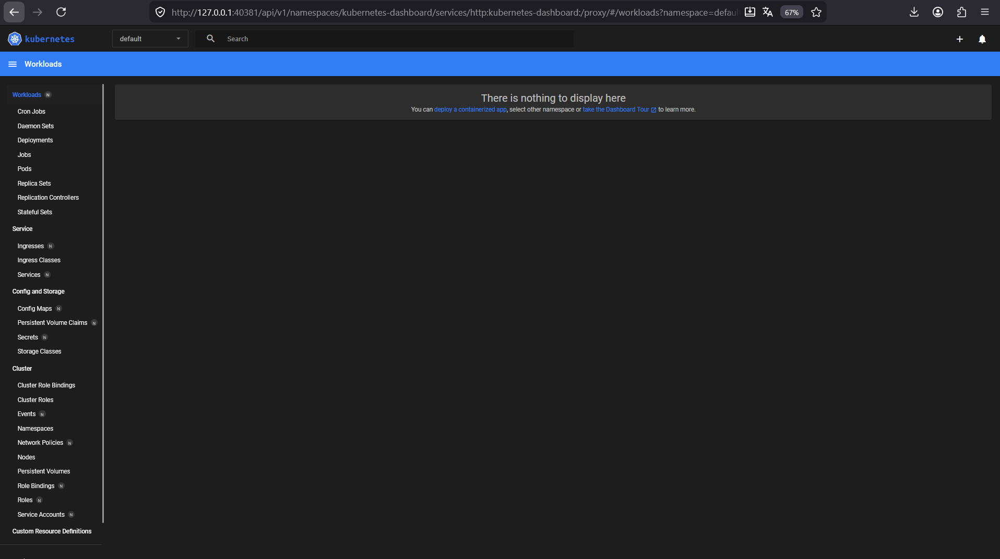

Weryfikacja łączności lokalnej:

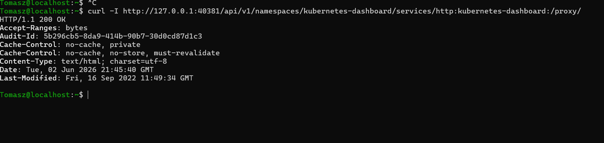

Ponieważ system operacyjny hosta nie ma bezpośredniego dostępu do adresu localhost maszyny wirtualnej, wykorzystano tunelowanie portów przez protokół SSH ```ssh -L 40381:127.0.0.1:40381```. Komendę tę zastosowano w celu zmapowania odizolowanego portu wirtualki na port lokalny fizycznego komputera i odpalenie dashbordu w przeglądarce na hoscie.

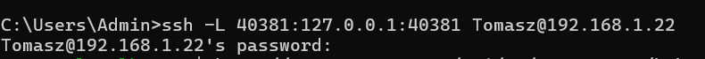


## Analiza posiadanego kontenera

Wybrano wariant optimum, wykorzystano serwer nginx, który stale działa w tle i nie kończy natychmiast pracy. Utworzono Dockerfile, który podmienia domyślną stronę startową Nginxa na naszą własną index.html.
  
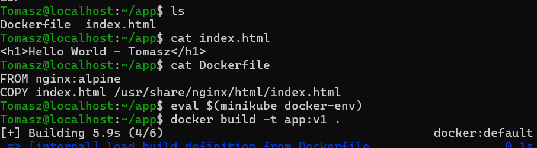

eval $(minikube docker-env) - komenda przełącza terminal na środowisko Dockera wewnątrz minikube

Utworzony obraz: 

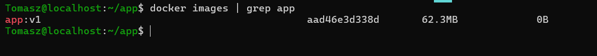


##  Uruchamianie oprogramowania

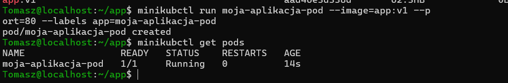


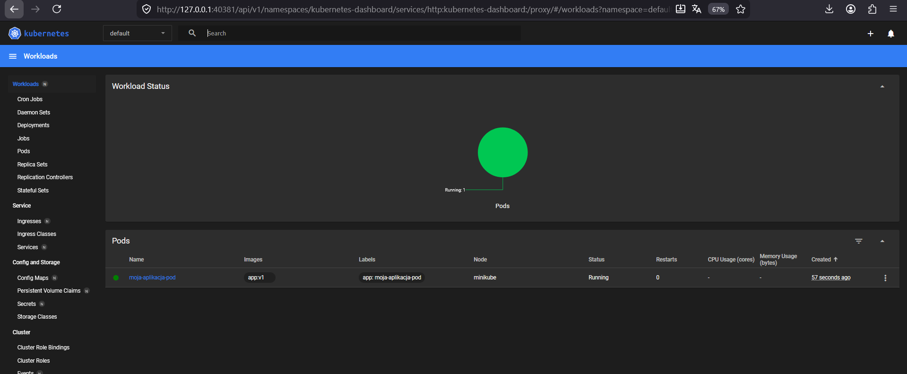


Przekierowanie portu na 8085 oraz weryfikacja łączności lokalnej

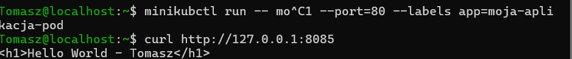

W celu uruchomienia w przeglądarce ponownie musimy skorzystać z ssh -L
```ssh -L 8085:127.0.0.1:8085 Tomasz@192.168.1.22```

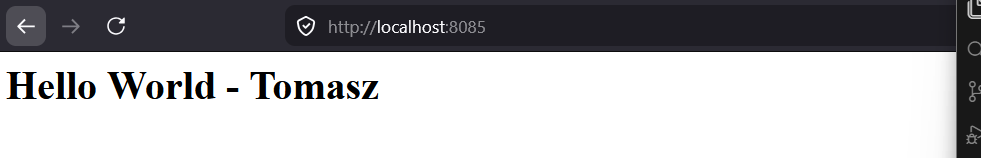


## Przekucie wdrożenia manualnego w plik wdrożenia 


Utworzenie nginx-deployment.yaml: 

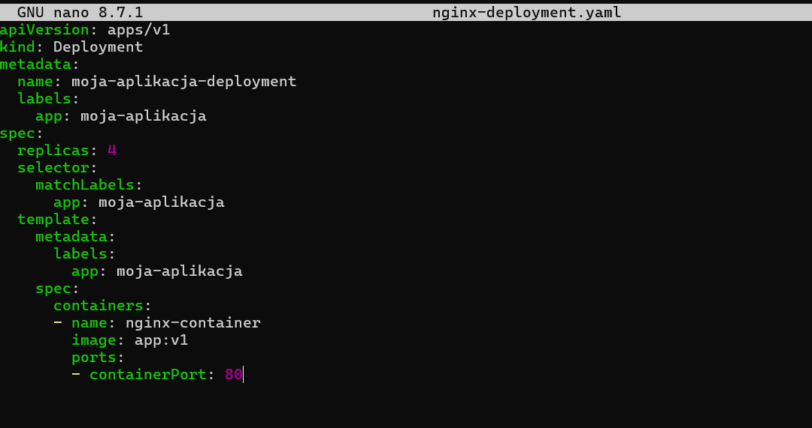

Uruchomienie wdrożenia :  ```minikubctl apply -f nginx-deployment.yaml```

Zbadanie stanu wdrożenia : ```minikubctl rollout status deployment/moja-aplikacja-deployment```


4 nowo utworzone pody:

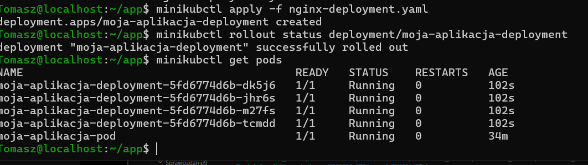

Wyeksportowanie wdrożenia jako serwis: 
``` minikubectl expose deployment moja-aplikacja-deployment --type=NodePort --port=80 --name=moja-aplikacja-service ```


Widok dashboardu :

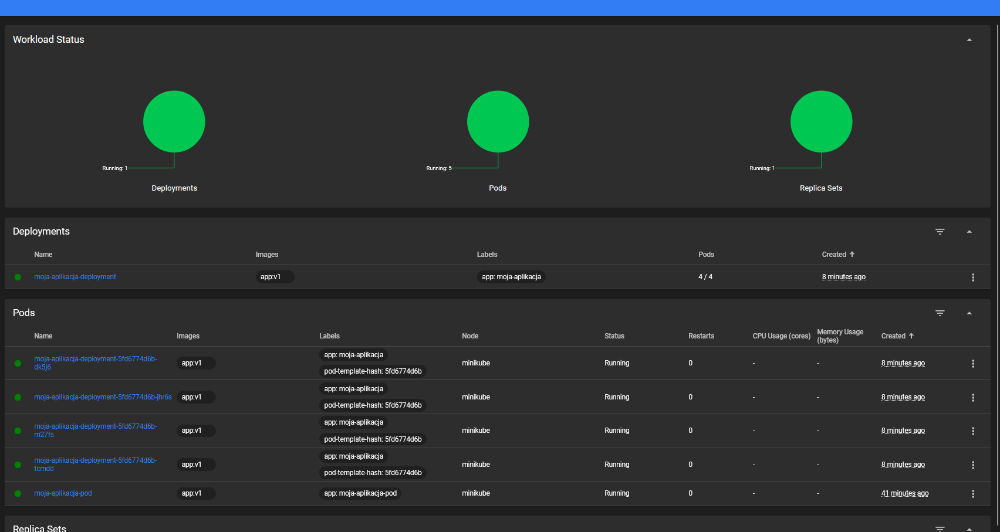


Aplikacja działa pod portem 8086

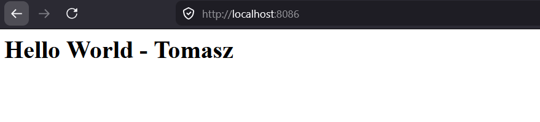

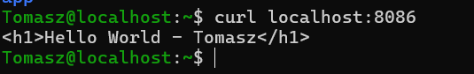