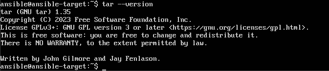
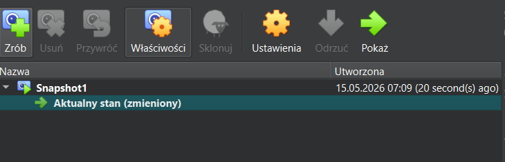
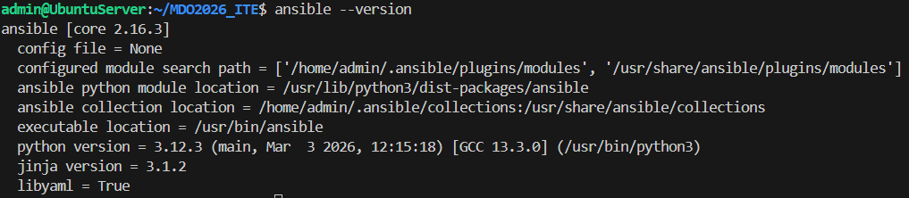
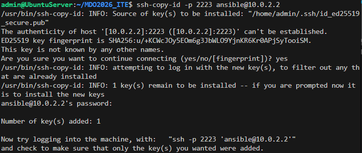
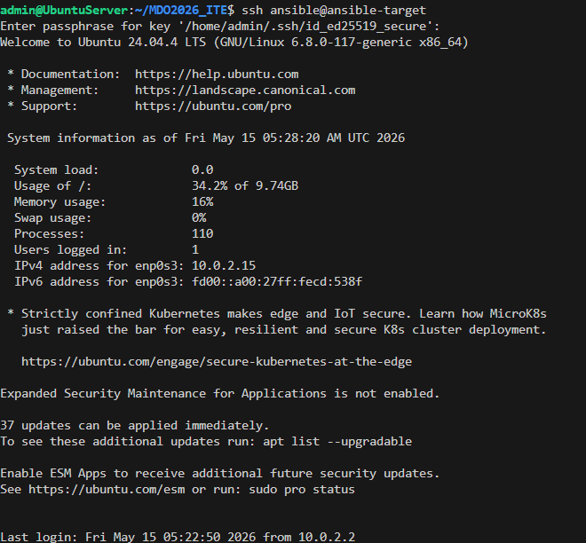
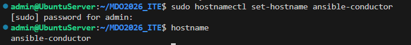
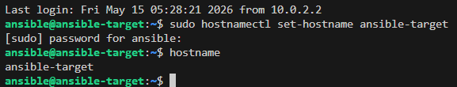
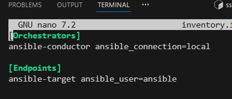
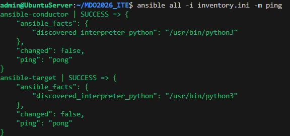
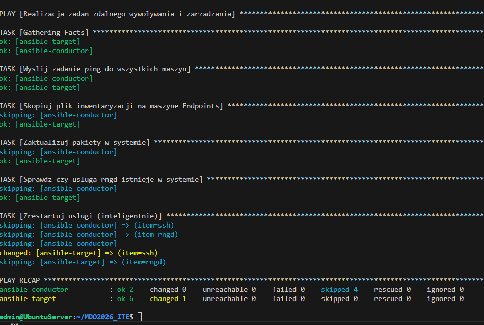

# Sprawozdanie Lab8, Tomasz Kamiński

## Uruchomienie/konfiguracja nowej maszyny 

* Utwórz drugą maszynę wirtualną o **jak najmniejszym** zbiorze zainstalowanego oprogramowania
  * Zastosuj najlepiej ten sam system operacyjny, co "główna" maszyna
  * Zapewnij obecność programu `tar` i serwera OpenSSH (`sshd`), tak, by działały narzędzia 
  
  
  
  * Nadaj maszynie *hostname* `ansible-target`
  * Utwórz w nowym systemie użytkownika `ansible`
  * Zrób migawkę maszyny (i/lub przeprowadź jej eksport)
  
  

* Na głównej maszynie wirtualnej (nie na tej nowej!), zainstaluj [oprogramowanie Ansible](https://docs.ansible.com/ansible/2.9/installation_guide/index.html), najlepiej z repozytorium dystrybucji

* Wymień klucze SSH między użytkownikiem w głównej maszynie wirtualnej, a użytkownikiem `ansible` z nowej tak, by logowanie `ssh ansible@ansible-target` nie wymagało podania hasła

## Inwentaryzacja

* 🌵 Dokonaj inwentaryzacji systemów
  * Ustal przewidywalne nazwy komputerów (maszyn wirtualnych) stosując `hostnamectl`, Unikaj `localhost`.

  

  

  * Wprowadź nazwy DNS dla maszyn wirtualnych, stosując `systemd-resolved` lub `resolv.conf` i `/etc/hosts` - tak, aby możliwe było wywoływanie komputerów za pomocą nazw, a nie tylko adresów IP

  

  * Zweryfikuj łączność
  * Stwórz [plik inwentaryzacji](https://docs.ansible.com/ansible/latest/getting_started/get_started_inventory.html)
  * Umieść w nim sekcje `Orchestrators` oraz `Endpoints`. Umieść
   nazwy maszyn wirtualnych w odpowiednich sekcjach   
  * 🌵 Wyślij żądanie `ping` do wszystkich maszyn
  * Zapewnij łączność między maszynami

  

Obie maszyny odpowiedziały statusem SUCCESS, co potwierdza gotowość środowiska do uruchamiania Playbooków
  
  * Użyj co najmniej dwóch maszyn wirtualnych (optymalnie: trzech)
  * Dokonaj wymiany kluczy między maszyną-dyrygentem, a końcówkami (`ssh-copy-id`)
  * Upewnij się, że łączność SSH między maszynami jest możliwa i nie potrzebuje haseł
  

## Playbook - Zdalne wywołanie procedur 

Zbudowano playbook, który automatyzuje zadania konfiguracyjne i zarządznie pakietami systemu,celem skryptu było wykonanie następnym kroków 

  * Sprawdzenie łączności - Ansible sprawdził, czy ma połączenie z serwerem i czy może na nim wykonywać komendy jako administrator.
  * Przesłanie pliku konfiguracyjnego - Wykorzystano moduł copy do przesłania pliku inwentaryzacji inventory.ini z maszyny sterującej do katalogu domowego użytkownika na węźle końcowym
  * Aktualizacja pakietów - Przy użyciu modułu apt przeprowadzono pełną aktualizację bazy pakietów oraz podniesienie wersji zainstalowanego oprogramowania dist-upgrade
  * Instalacja narzędzi - Playbook sprawdza, czy w systemie znajduje się pakiet rng-tools-debian. Jeśli go brakowało, został on automatycznie doinstalowany.
  * Restart usług sshd, rngd : Na koniec zrestartowano usługę z ssh oraz nowo zainstalowaną usługę rngd. Restart potwierdził, że wszystkie wprowadzone zmiany działają poprawnie, a usługi uruchomiły się z nowymi ustawieniami.
  

Dalsza część sprawozdania zostanie odesłana do końca dnia 