# Sprawozdanie Lab1, Tomasz Kamiński

## Narzędzia i konfiguracja 
Ćwiczenie wykonano w środowisku **Ubuntu Server 24.04.4 LTS** uruchomionym na **VirtualBox**.
* **Port hosta:** 2222 
* **Port klienta:** 22

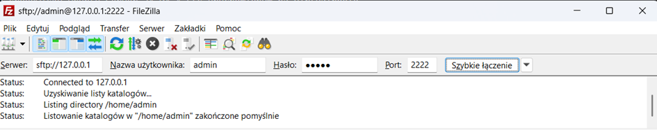

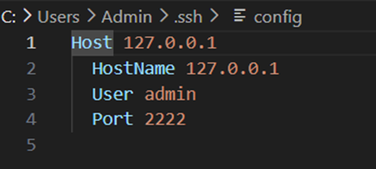

## SSH
Wygenerowano parę kluczy SSH (jeden zabezpieczony hasłem, drugi bez)

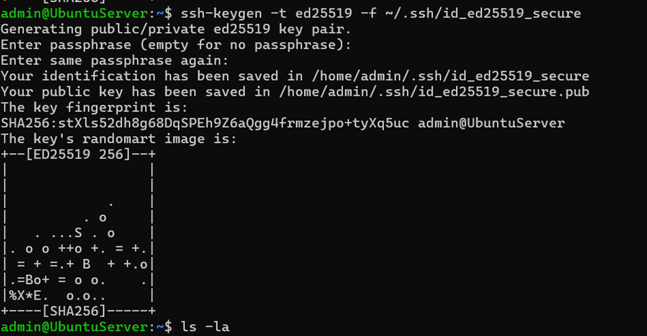
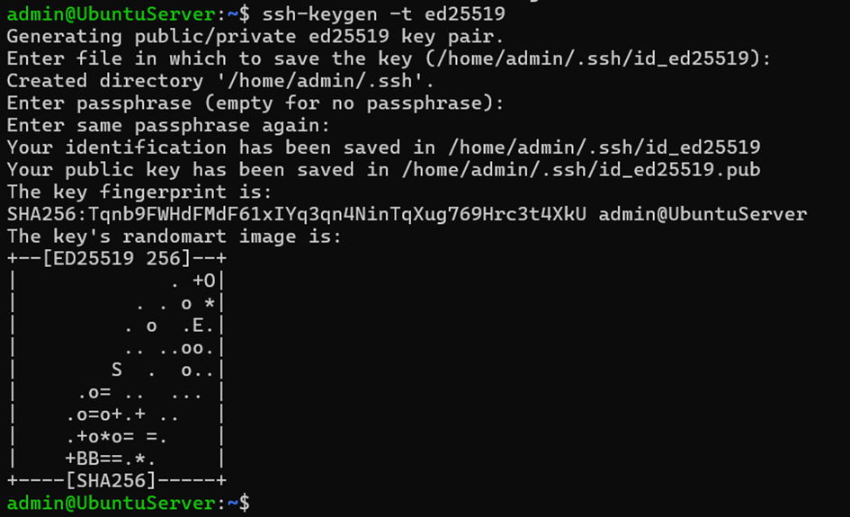
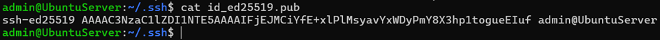

## Dodawanie klucza do GitHuba i autoryzacja

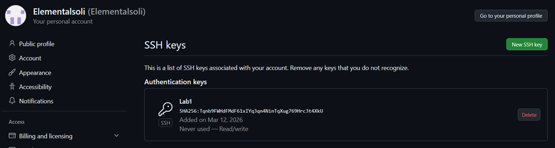
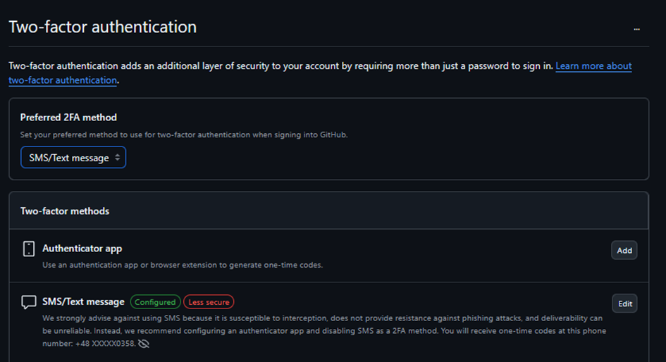

## Branch i praca z repozytorium
Sklonowano repozytorium przy użyciu protokołu SSH, a następnie utworzono nowy branch. Przy klonowaniu repo przez https:
git clone https://github.com/InzynieriaOprogramowaniaAGH/MDO2026_ITE.git  

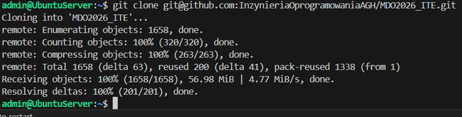 

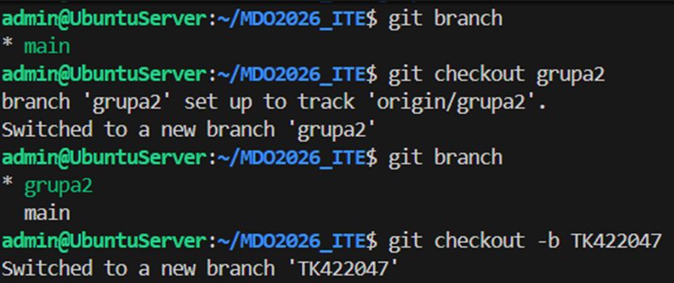

### Skrypt Git hook (commit-msg)
W ramach zadania utworzono skrypt weryfikujący, czy każda zwartość commita zaczyna się od prefixu `TK422047`.

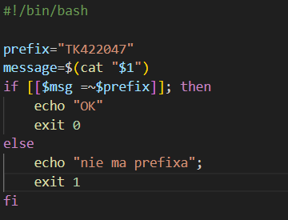

Skrypt skopiowana do odpowiedniego folderu i przetestwowano przykładowy commit 

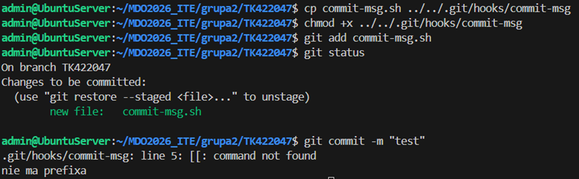

Poprawny commit

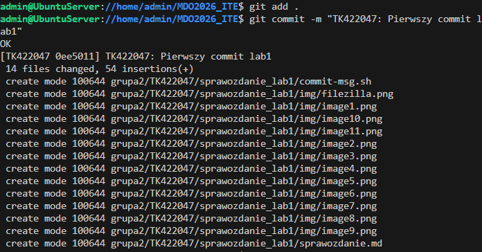

Przesłanie cwiczenia do zdalnego repo

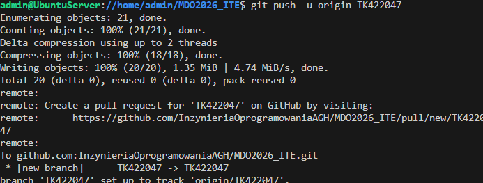

## Pull Request 

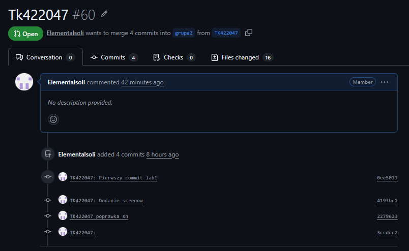

