# Sprawozdanie Lab2, Tomasz Kamiński

## Narzędzia i konfiguracja 
Ćwiczenie wykonano w środowisku **Ubuntu Server 24.04.4 LTS** uruchomionym na **VirtualBox**.

## Instalacja dockera

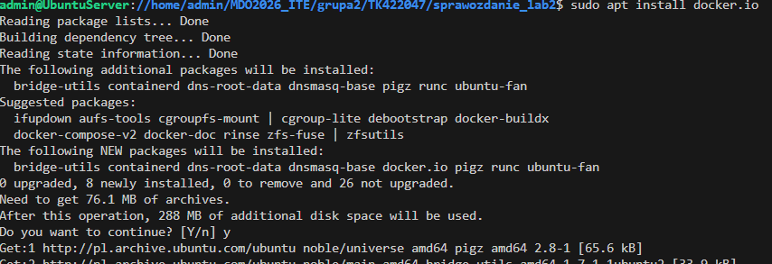

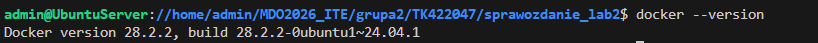

## Pobrane obrazy 

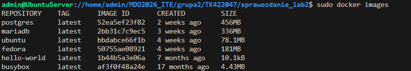

Zwracane statusy [docker ps -a]

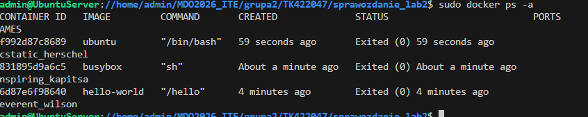

## Intearaktywne wejscie do kontenera busybox 

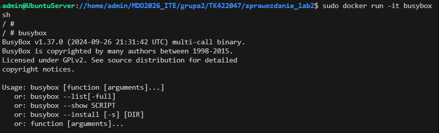

## System ubuntu w kontenerze 

sprawdzenie procesow: 

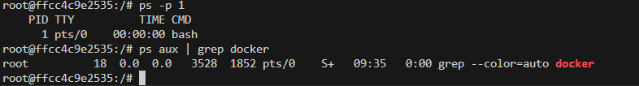

zaktualizowanie pakietow

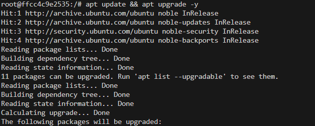

## DockerFile

Zawartość pliku DockerFile:

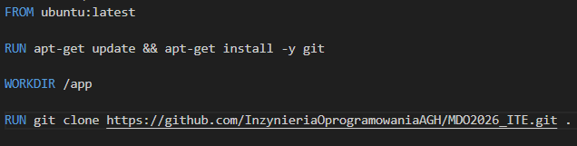

Utworzenie obrazu: 

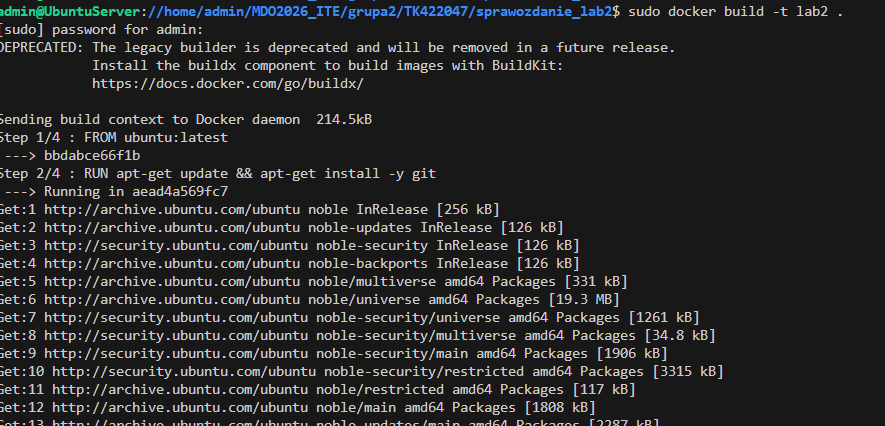

Uruchomienie kontenera: 

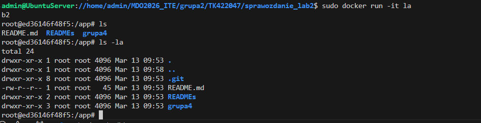

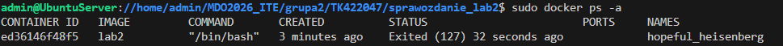

## Czyszenie 

usuniecie zakonczonych kontenerow:

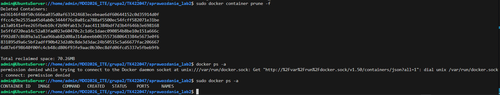

usuniecie obrazow:

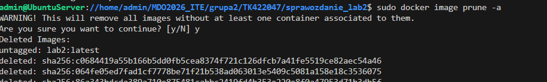

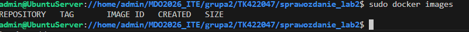
