# Sprawozdanie Lab3, Tomasz Kamiński

## Narzędzia i konfiguracja 
Ćwiczenie wykonano w środowisku **Ubuntu Server 24.04.4 LTS** uruchomionym na **VirtualBox**.

## Wybór oprogramowania
Do przeprowadzenia laboratorium wybrałem bibloteke C - **hiredis**, wykorzystuje ona Makefile oraz zawiera rozbudowany skrypt testowy test.sh wywoływany komendą make check.

https://github.com/redis/hiredis.git

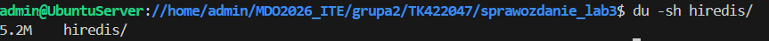

## Build
 
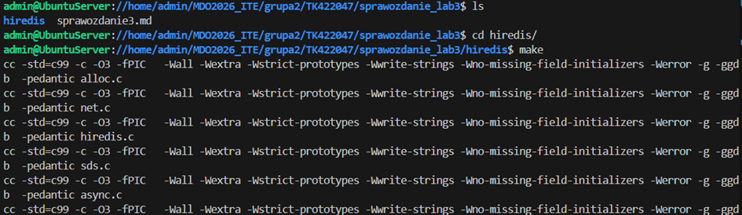

## Uruchomienie testow

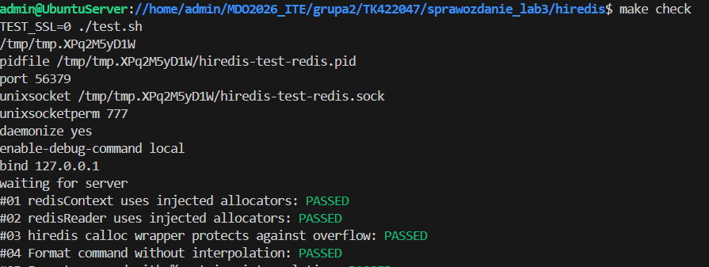

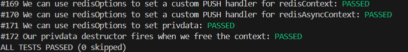

## Uruchomienie interaktywnie kontenera

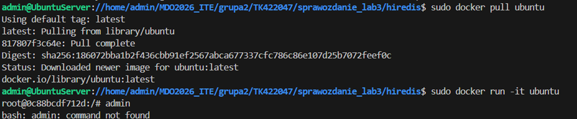

Pobranie potrzebnych zaleznosci 

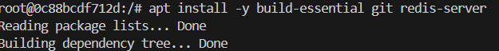

Sklonowanie repo/Build wewnątrz kontenera

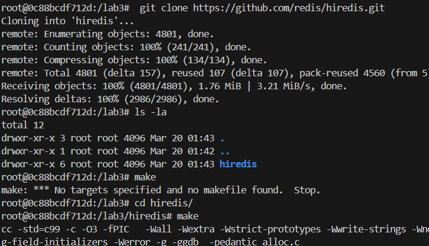

Testy wewnątrz kontenera

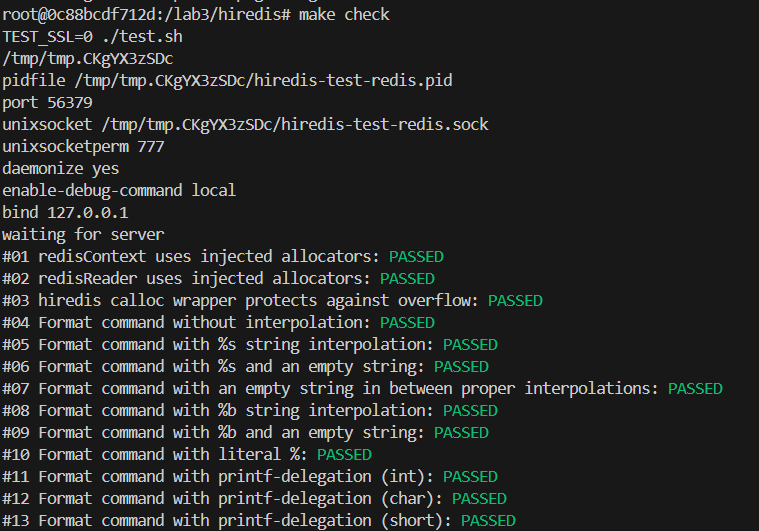

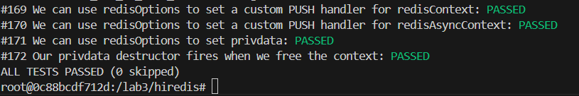

## DockerFile

Zawartość Docker build

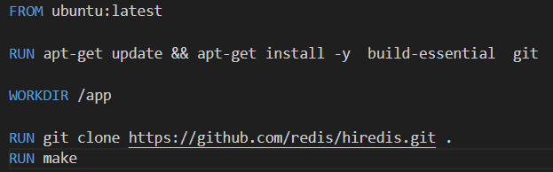

Zbudowanie Obrazu przy użyciu komendy 
sudo docker build -t hiredis-build -f Dockerfile.build .

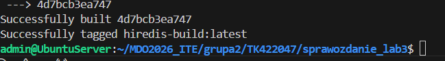

Zawartosc Docker test 

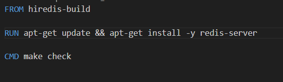

Zbudowanie Obrazu

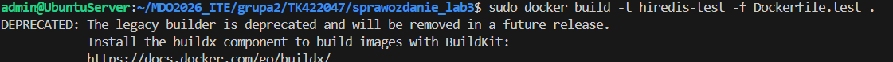

Uruchomienie testu w kontenerze

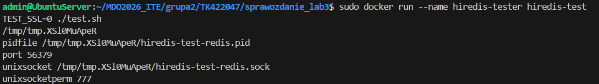

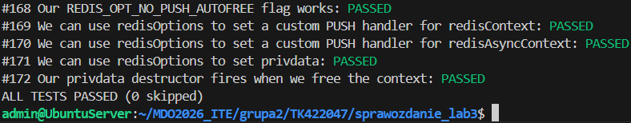

Status kontenera 

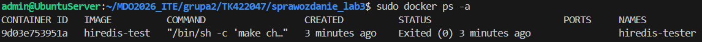

Kod wyjscia 0 potwierdza ze testy przeszły pomyślnie 