# Sprawozdanie Lab4, Tomasz Kamiński

## Narzędzia i konfiguracja 
Ćwiczenie wykonano w środowisku **Ubuntu Server 24.04.4 LTS** uruchomionym na **VirtualBox**.

## Utworzenie woluminów

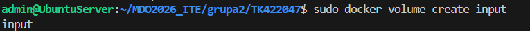

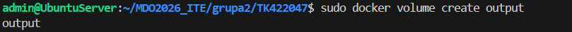

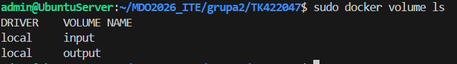

## Sklonowanie Repo 

Repozytorium zostało sklonowane przy użyciu kontenera pomocniczego opartego na obrazie alpine/git. Pozwoliło to uniknąć instalowania narzędzia Git w kontenerze bazowym.

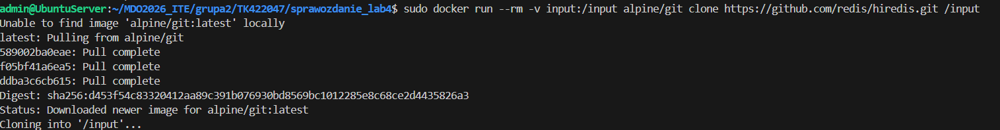

## Uruchomienienie kontenera budującego 

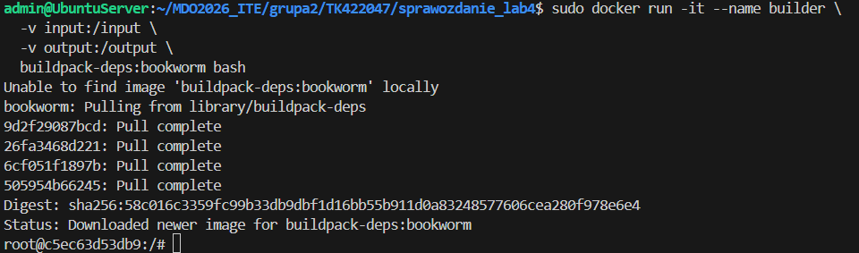

## Build projektu i skopiowanie wynikow do woluminu

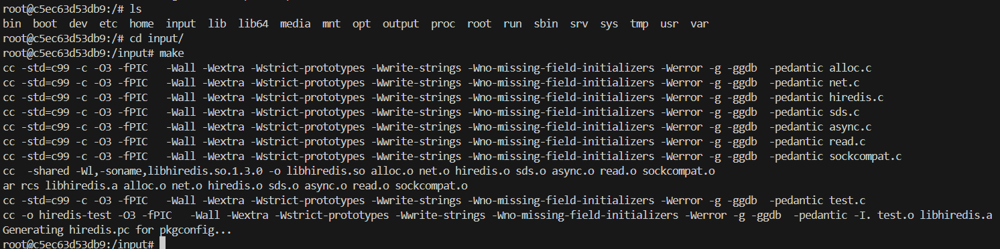

## Klonowanie wewnątrz kontenera

W drugim podejściu repozytorium zostało sklonowane bezpośrednio w kontenerze bazowym po zainstalowaniu narzędzia Git.

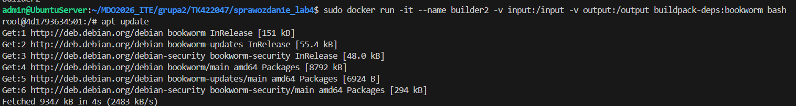

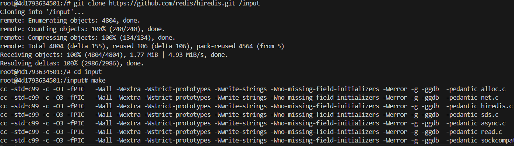

Sprawdzenie czy się pliki skopiowały

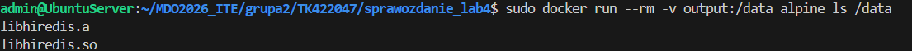

## Eksponowanie portu i łączność między kontenerami
Utworzenie sieci my-network 

Uruchomienie kontenera iperf w trybie serwera 

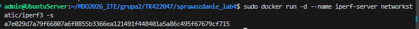

Sprawdzenie ip komenda docker inspect iperf-server

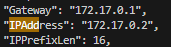

Test kontenera w trybie klienta 

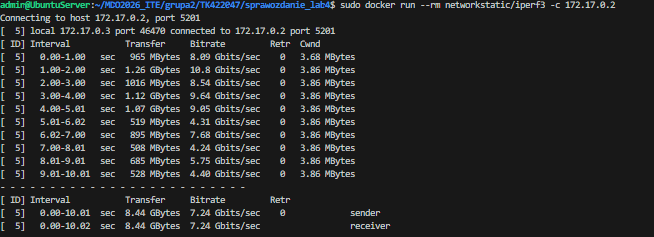

Utworzonie nowego serwera przyłączonego do sieci my-network

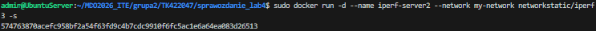

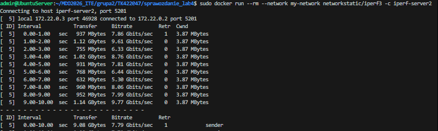

Sprawdzenie łącznosci z hostem 

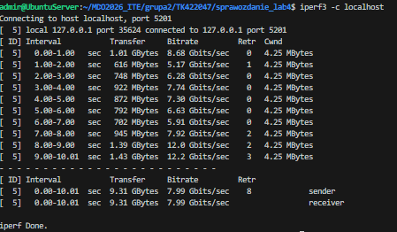

Z poza hosta:

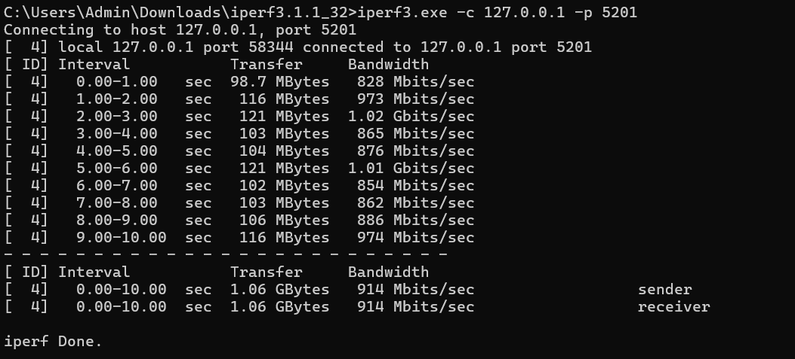

## Usługa SSH w kontenerze

sudo docker run -dit --name ssh_container -p 2222:22 ubuntu bash

Instalacja w ssh w kontenerze
apt install -y openssh-server

Zmiana konfiguracji 

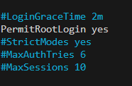
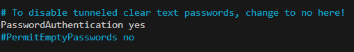

Na hoście:

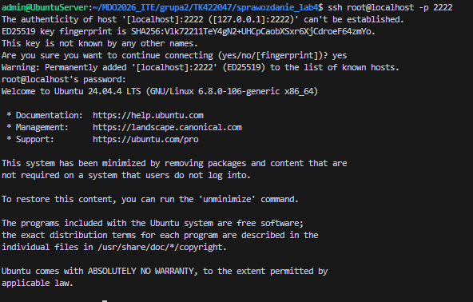

Zalety: 
możliwość debugowania kontenera, zdalny dostęp jak do normalnego serwera, integracja ze starszymi systemami

Wady:
większe zużycie zasobów, możliwe problemy z bezpieczeństwem, konieczność zarządzania użytkownikami i hasłami

## Jenkins

Stworzenie sieci dla Jenkinsa i woluminów

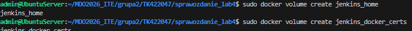

Uruchomienie kontenera DIND

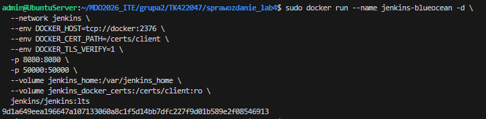

Uruchomienie Kontenera Jenkins

Aby uzyskać dostęp do Jenkins z przeglądarki, konieczne było dodanie nowej reguły przekierowania portów w ustawieniach VM, port hosta, gościa 8080

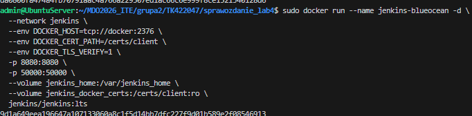

docker ps 

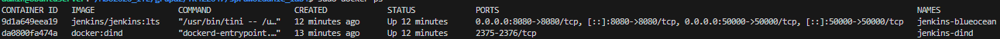

odczytanie hasła komendą: sudo docker exec jenkins-blueocean cat /var/jenkins_home/secrets/initialAdminPassword
0e83f355ede04ed59e3f24886be1eba5

Apliakcja uruchomiona pod adresem:http://localhost:8080

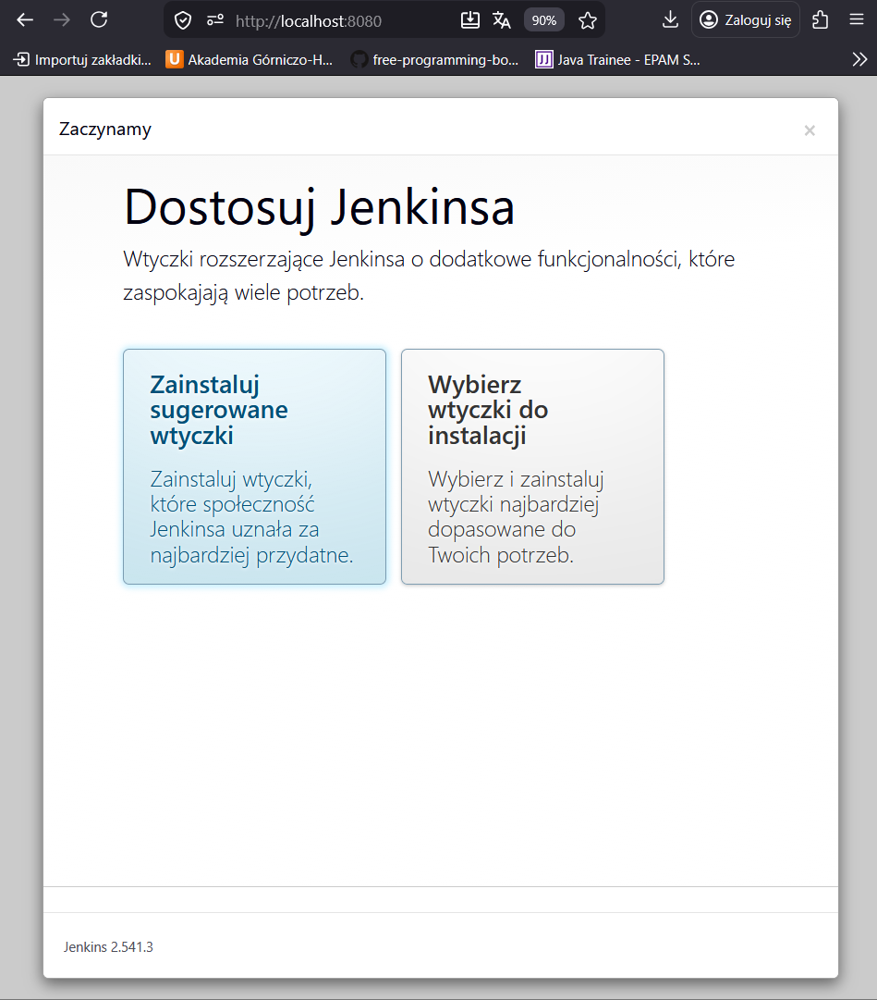

Zakończona konfiguracja: 

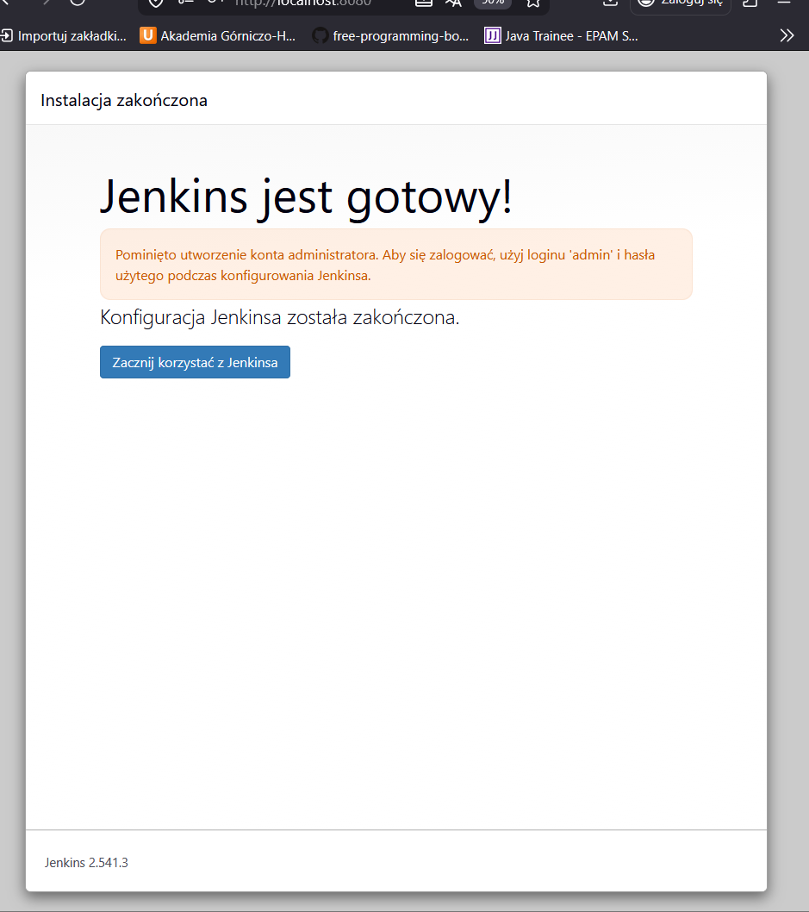

