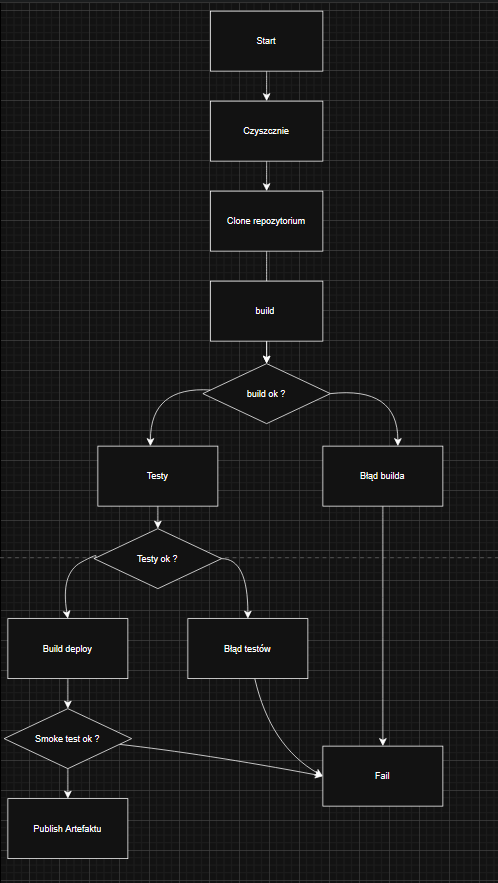
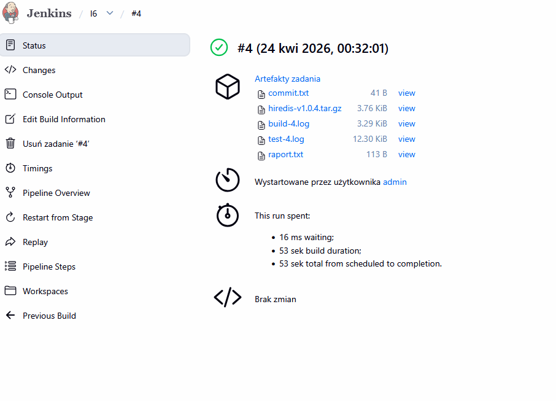
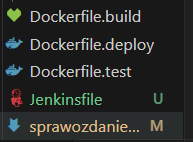
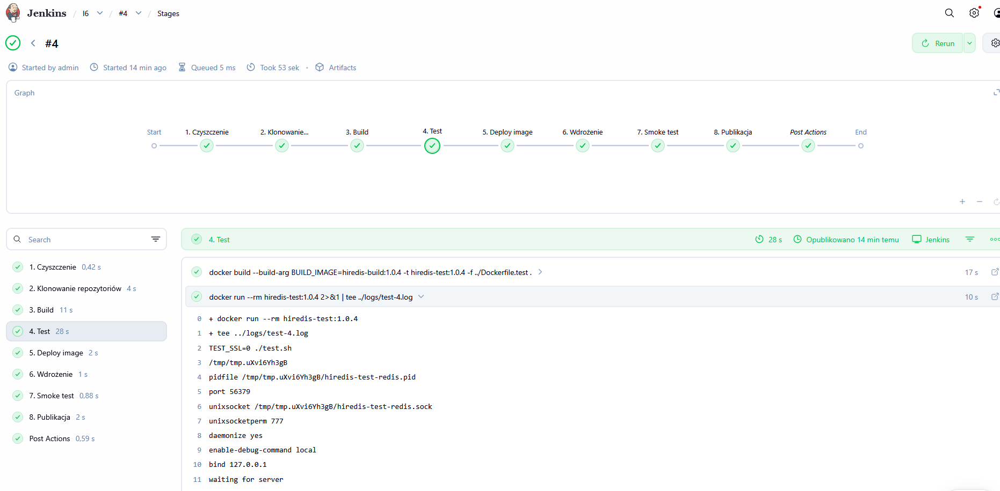

# Sprawozdanie Lab5, Tomasz Kamiński

## Wybor aplikacji

Wybrano biblioteke hiredis, która była wykorzystana podczas lab3, projekt jest na licencji BSD-3-Clause co potwierdza możliwość swobodnego obrotu kodem.

- [X] Aplikacja została wybrana
- [X] Licencja potwierdza możliwość swobodnego,obrotu kodem napotrzeby zadania
- [X] Wybrany program buduje się 
- [X] Przechodzą dołączone do niego testy

- Projekt Był uruchamiany i testowany podczas lab3

## Diagram UML

- [X] Stworzono diagram UML zawierający planowany pomysł na proces CI/CD



## Opis działania pipline'u
#### 1) Czyszenie środowiska 
* Usunięcie starego kontenera hiredis-produkcja i wyczyszczenie workspace Jenkinsa.
#### 2) Klonowanie repozytorium zajęciowego
* Jenkins pobiera repozytorium MDO2026_ITE z gałęzi TK422047 i klonuje repozytorium hiredis.
#### 3) Build
* Budowany jest obraz hiredis-build, zawierający zbudowaną bibliotekę hiredis.
#### 4) Test
* Budowany jest obraz hiredis-test, oparty o obraz build. Następnie uruchamiane są testy.
#### 5) Deploy image
* Budowany jest obraz hiredis-deploy, oparty o obraz build.
#### 6) Wdrożenie
* Jenkins uruchamia kontener hiredis-produkcja na podstawie obrazu deploy.
#### 7) Smoke test
* Sprawdzane jest, czy kontener działa oraz czy zawiera plik libhiredis.so.
#### 8) Publikacja artefaktu
* Tworzony jest artefakt .tar.gz zawierający raport, commit oraz logi. Artefakt jest publikowany w Jenkinsie.


- [X] Zdecydowano, czy jest potrzebny fork własnej kopii repozytorium

W projekcie nie zdecydowano się na tworzenie forka repozytorium aplikacji. Repozytorium hiredis jest klonowane bezpośrednio z oficjalnego źródła, ponieważ pipeline nie wymaga wprowadzania zmian w kodzie aplikacji.


## Użyte kontenery

Dockerfile.build
```
FROM ubuntu:24.04

RUN apt-get update && apt-get install -y \
    build-essential \
    git \
    make \
    && rm -rf /var/lib/apt/lists/*

WORKDIR /app

COPY . .

RUN make
```

Dockerfile.test
```
ARG BUILD_IMAGE
FROM ${BUILD_IMAGE}

RUN apt-get update && apt-get install -y \
    redis-server \
    && rm -rf /var/lib/apt/lists/*

CMD ["make", "check"]
```

Dockerfile.deploy
```
ARG BUILD_IMAGE
FROM ${BUILD_IMAGE}

WORKDIR /app

CMD ["sleep", "3600"]
```

- [X] Wybrano kontener bazowy lub stworzono odpowiedni kontener wstepny (runtime dependencies)
- [X] *Build* został wykonany wewnątrz kontenera
- [X] Testy zostały wykonane wewnątrz kontenera (kolejnego)
- [X] Kontener testowy jest oparty o kontener build

Jako kontener bazowy wybrano obraz ubuntu:24.04, W kontenerze zainstalowano niezbędne zależności (build-essential, make, git), umożliwiające kompilację projektu hiredis.

Proces budowania aplikacji został wykonany wewnątrz kontenera hiredis-build, Testy projektu zostały uruchomione w osobnym kontenerze hiredis-test, co pozwala na oddzielenie etapu budowania od testowania.

Utworzono osobny kontener deploy w celu oddzielenia środowiska budowania od środowiska uruchomieniowego. Kontener build zawiera narzędzia kompilacyjne, które nie są potrzebne w środowisku docelowym. Dzięki temu rozwiązaniu pipeline jest bardziej czytelny, a wdrożenie lepiej odzwierciedla rzeczywiste warunki produkcyjne. Kontener deploy umożliwia również wykonanie smoke testu po wdrożeniu

- [X] Zdefiniowano kontener typu 'deploy' pełniący rolę kontenera, w którym zostanie uruchomiona aplikacja (niekoniecznie docelowo - może być tylko integracyjnie)
- [X] Uzasadniono czy kontener buildowy nadaje się do tej roli/opisano proces stworzenia nowego, specjalnie do tego przeznaczenia
- [X] Wersjonowany kontener 'deploy' ze zbudowaną aplikacją jest wdrażany na instancję Dockera
- [X] Następuje weryfikacja, że aplikacja pracuje poprawnie (*smoke test*) poprzez uruchomienie kontenera 'deploy'

## Artefakt



- [X] Zdefiniowano, jaki element ma być publikowany jako artefakt
- [X] Uzasadniono wybór: kontener z programem, plik binarny, flatpak, archiwum tar.gz, pakiet RPM/DEB
- [X] Opisano proces wersjonowania artefaktu (można użyć *semantic versioning*)

Zastosowano Wersjonowanie w schemacie 1.0.<BUILD_NUMBER>

Artefakt jest publikowany jako rezultat builda w Jenkinsie przy użyciu mechanizmu archiveArtifacts. Dzięki temu możliwe jest jego pobranie bezpośrednio z interfejsu użytkownika.

jako artefakt wybrano archiwum w formacie tar.gz, ponieważ jest to prosty i uniwersalny sposób pakowania plików w systemach Linux.

Zawiera on w sobie 
* raport.txt - informacje o przebiegu builda
* commit.txt - identyfikaro commitu repozytorium hiredis
* logi z build i test

[X] Dostępność artefaktu: publikacja do Rejestru online, artefakt załączony jako rezultat builda w Jenkinsie

Artefakt jest publikowany jako rezultat builda w Jenkinsie przy użyciu mechanizmu archiveArtifacts. Dzięki temu możliwe jest jego pobranie bezpośrednio z interfejsu użytkowni


[X] Pliki Dockerfile i Jenkinsfile dostępne w sprawozdaniu w kopiowalnej postaci oraz obok sprawozdania, jako osobne pliki




##Pipline overview



```
pipeline {
    agent any

    environment {
        VERSION = "1.0.${BUILD_NUMBER}"
        BUILD_IMAGE = "hiredis-build:${VERSION}"
        TEST_IMAGE = "hiredis-test:${VERSION}"
        DEPLOY_IMAGE = "hiredis-deploy:${VERSION}"
    }

    stages {
        stage('1. Czyszczenie') {
            steps {
                sh 'docker rm -f hiredis-produkcja || true'
                deleteDir()
            }
        }

        stage('2. Klonowanie repozytoriów') {
            steps {
                sh 'git clone --depth 1 --branch TK422047 https://github.com/InzynieriaOprogramowaniaAGH/MDO2026_ITE.git .'

                dir('grupa2/TK422047/sprawozdanie_lab6') {
                    sh 'rm -rf hiredis'
                    sh 'git clone https://github.com/redis/hiredis.git'
                }
            }
        }

        stage('3. Build') {
            steps {
                dir('grupa2/TK422047/sprawozdanie_lab6/hiredis') {
                    sh 'mkdir -p ../logs'
                    sh 'git rev-parse HEAD > ../commit.txt'

                    sh """
                        docker build \
                        -t ${BUILD_IMAGE} \
                        -f ../Dockerfile.build \
                        . 2>&1 | tee ../logs/build-${BUILD_NUMBER}.log
                    """
                }
            }
        }

        stage('4. Test') {
            steps {
                dir('grupa2/TK422047/sprawozdanie_lab6/hiredis') {
                    sh """
                        docker build \
                        --build-arg BUILD_IMAGE=${BUILD_IMAGE} \
                        -t ${TEST_IMAGE} \
                        -f ../Dockerfile.test \
                        .
                    """

                    sh """
                        docker run --rm ${TEST_IMAGE} \
                        2>&1 | tee ../logs/test-${BUILD_NUMBER}.log
                    """
                }
            }
        }

        stage('5. Deploy image') {
            steps {
                dir('grupa2/TK422047/sprawozdanie_lab6/hiredis') {
                    sh """
                        docker build \
                        --build-arg BUILD_IMAGE=${BUILD_IMAGE} \
                        -t ${DEPLOY_IMAGE} \
                        -f ../Dockerfile.deploy \
                        .
                    """
                }
            }
        }

        stage('6. Wdrożenie') {
            steps {
                sh 'docker rm -f hiredis-produkcja || true'
                sh "docker run -d --name hiredis-produkcja ${DEPLOY_IMAGE}"
            }
        }

        stage('7. Smoke test') {
            steps {
                sh 'docker ps | grep hiredis-produkcja'
                sh 'docker exec hiredis-produkcja test -f /app/libhiredis.so'
            }
        }

        stage('8. Publikacja') {
            steps {
                dir('grupa2/TK422047/sprawozdanie_lab6') {
                    sh "echo 'Build #${BUILD_NUMBER} OK' > raport.txt"
                    sh "echo 'Version: ${VERSION}' >> raport.txt"
                    sh "echo 'Commit hiredis:' >> raport.txt"
                    sh "cat commit.txt >> raport.txt"
                    sh "date >> raport.txt"

                    sh "tar -czvf hiredis-v${VERSION}.tar.gz raport.txt commit.txt logs/"

                    archiveArtifacts artifacts: "hiredis-v${VERSION}.tar.gz, logs/*.log, raport.txt, commit.txt",
                                     onlyIfSuccessful: true
                }
            }
        }
    }

    post {
        always {
            sh 'docker rm -f hiredis-produkcja || true'
        }
    }
}
```