## Wdrażanie na zarządzalne kontenery: Kubernetes
Artur Niemiec

### Przygotowanie środowiska i uruchomienie klastra Minikube

W ramach zadania przygotowano lokalne środowisko Kubernetes z użyciem narzędzia Minikube. Praca została wykonana na maszynie wirtualnej `ansible-master`, do której połączono się przez SSH. Do obsługi klastra wykorzystano wariant `kubectl` dostarczany przez Minikube, uruchamiany poleceniem `minikube kubectl --`.

Klaster został uruchomiony z użyciem sterownika Docker oraz ograniczeniem pamięci do 2048 MB:

```shell
minikube start --memory=2048mb
```

Podczas startu Minikube automatycznie wybrał sterownik Docker, pobrał wymagane obrazy oraz utworzył lokalny klaster Kubernetes z pojedynczym węzłem typu control-plane.

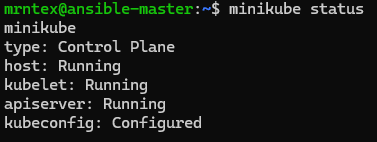

Po uruchomieniu sprawdzono status klastra:

```shell
minikube status
```

Host, kubelet oraz apiserver działają poprawnie, a konfiguracja `kubeconfig` została utworzona.

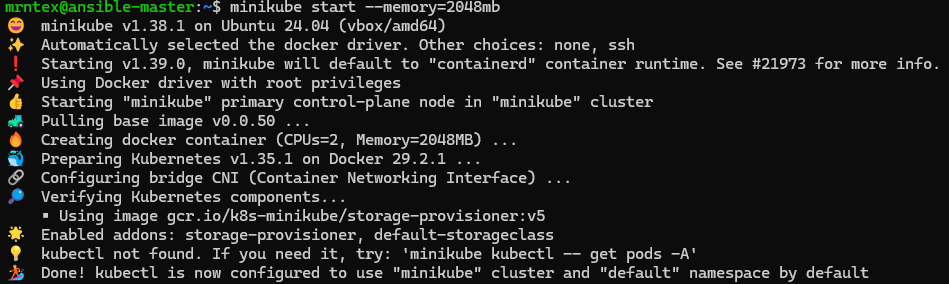

Następnie sprawdzono dostępność nodów Kubernetes:

```shell
minikube kubectl -- get nodes
```

Polecenie wykazało pojedynczy node `minikube` w stanie `Ready`, pełniący rolę `control-plane`.

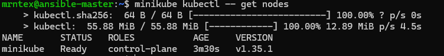

### Uwagi dotyczące bezpieczeństwa i wymagań sprzętowych

Środowisko zostało uruchomione lokalnie w Minikube, dlatego nie jest to konfiguracja produkcyjna. Dostęp do klastra odbywa się z poziomu użytkownika maszyny wirtualnej, a komunikacja z Dashboardem oraz aplikacją została wykonana przez lokalny port-forwarding lub tunel SSH. Dzięki temu usługi nie były wystawiane bezpośrednio do sieci lokalnej jako publicznie dostępne endpointy.

Problemy wynikające z wymagań sprzętowych VM zostały naprawione przez ograniczenie pamięci klastra:

```shell
minikube start --memory=2048mb
```

### Uruchomienie Kubernetes Dashboard

Uruchomiono Dashboard Kubernetes poleceniem:

```shell
minikube dashboard
```

Dashboard został uruchomiony przez lokalny proxy. Ponieważ Minikube działał na maszynie wirtualnej, dostęp z systemu gospodarza wymagał przekierowania portu przez tunel SSH. Pozwoliło to otworzyć interfejs Dashboardu w przeglądarce bez bezpośredniego wystawiania go w sieci.

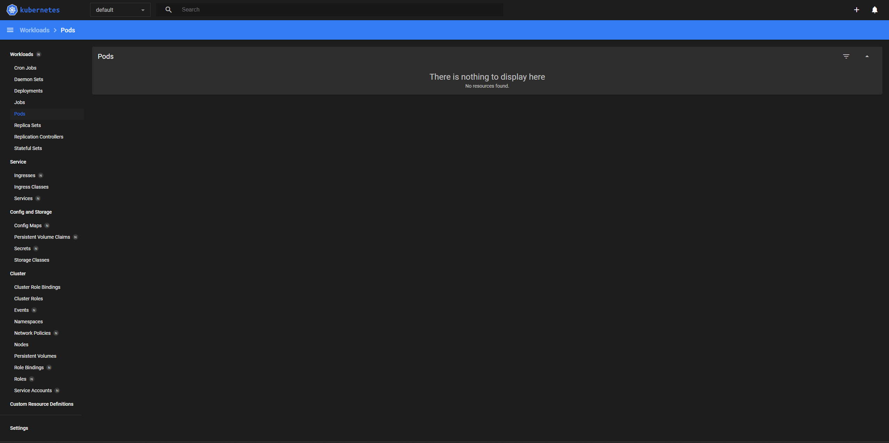

### Przygotowanie obrazu Docker

Na potrzeby zadania przygotowano prostą aplikację HTTP opartą na obrazie `nginx:alpine`. Aplikacja zawiera własny plik `index.html`, który jest kopiowany do katalogu serwowanego przez nginx.

Struktura katalogu projektu:

```text
k8s-lab/
├── app/
│   └── index.html
├── Dockerfile
└── deployment.yml
```

Plik `Dockerfile` zawierał definicję obrazu:

```dockerfile
FROM nginx:alpine
COPY app/index.html /usr/share/nginx/html/index.html
EXPOSE 80
```

Obraz został zbudowany poleceniem:

```shell
docker build -t k8s-lab-app:1.0 .
```

Następnie sprawdzono lokalnie, czy kontener uruchamia się poprawnie i nie kończy działania natychmiast po starcie. Kontener został uruchomiony z mapowaniem portu 8080 na port 80 kontenera:

```shell
docker run --rm -p 8080:80 k8s-lab-app:1.0
```

```shell
curl http://localhost:8080
```

W odpowiedzi zwrócona została strona HTML z komunikatem informującym, że aplikacja działa w Kubernetes.

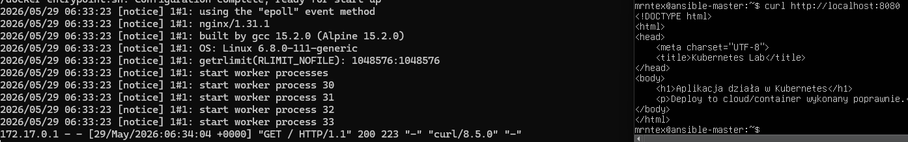

### Załadowanie obrazu do Minikube

Ponieważ obraz został zbudowany lokalnie na maszynie wirtualnej, załadowano go do środowiska Minikube:

```shell
minikube image load k8s-lab-app:1.0
```

Następnie sprawdzono, czy obraz znajduje się w repozytorium obrazów widocznym dla Minikube:

```shell
minikube image ls | grep k8s-lab-app
```


---

## Manualne uruchomienie aplikacji jako Pod

Aplikacja została najpierw uruchomiona manualnie `kubectl run`:

```shell
kubectl run k8s-lab-app --image=k8s-lab-app:1.0 --port=80 --labels app=k8s-lab-app --image-pull-policy=Never
```

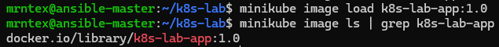

Stan Poda sprawdzono poleceniem:

```shell
kubectl get pods -o wide
```

Wynik pokazał, że Pod `k8s-lab-app` znajduje się w stanie `Running`, ma status gotowości `1/1` i działa na węźle `minikube`.

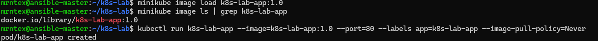

### Przekierowanie portu do Poda

Aby uzyskać dostęp do aplikacji działającej w Podzie, wykonano port-forwarding:

```shell
kubectl port-forward pod/k8s-lab-app 8080:80
```

Następnie w drugim terminalu sprawdzono komunikację:

```shell
curl http://localhost:8080
```

Odpowiedź zawierała stronę HTML aplikacji.

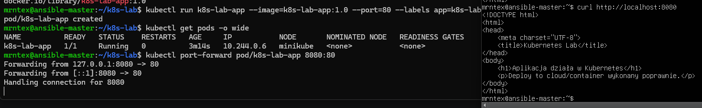

---

## Przekucie manualnego wdrożenia w plik YAML

Po potwierdzeniu działania manualnego Poda przygotowano deklaratywny plik wdrożenia `deployment.yml`. Plik opisuje Deployment aplikacji oraz ustawia liczbę replik na 4.

Zawartość pliku `deployment.yml`:

```yaml
apiVersion: apps/v1
kind: Deployment
metadata:
  name: k8s-lab-app
spec:
  replicas: 4
  selector:
    matchLabels:
      app: k8s-lab-app
  template:
    metadata:
      labels:
        app: k8s-lab-app
    spec:
      containers:
        - name: k8s-lab-app
          image: k8s-lab-app:1.0
          imagePullPolicy: Never
          ports:
            - containerPort: 80
```

Wdrożenie wykonano poleceniem:

```shell
kubectl apply -f deployment.yml
```

Następnie sprawdzono stan rolloutu:

```shell
kubectl rollout status deployment/k8s-lab-app
```
Deployment został poprawnie wdrożony.

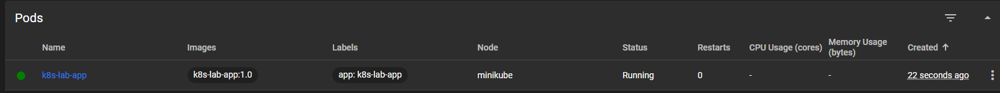

Sprawdzono również stan Deploymentu oraz Podów:

```shell
kubectl get deployment
kubectl get pods -o wide
```

Deployment `k8s-lab-app` osiągnął stan `READY 4/4`, a wszystkie cztery Pody były uruchomione w stanie `Running`.

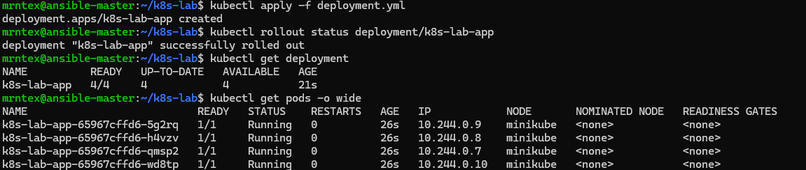

Dashboard Kubernetes również pokazywał działające Pody powiązane z aplikacją `k8s-lab-app`.

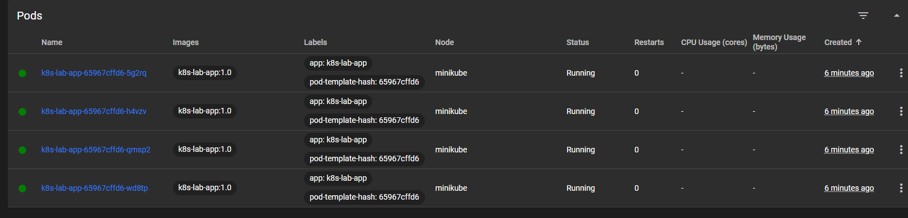

---

## Wyeksponowanie wdrożenia jako Service

Aby zapewnić stabilny punkt dostępu do aplikacji, Deployment został wyeksponowany jako Service typu `ClusterIP`:

```shell
kubectl expose deployment k8s-lab-app --type=ClusterIP --port=80 --target-port=80
```

Następnie sprawdzono utworzone usługi:

```shell
kubectl get svc
```

Na liście usług pojawił się Service `k8s-lab-app`, działający na porcie 80/TCP.

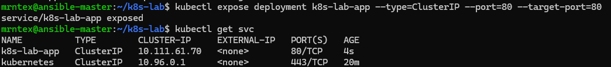


### Przekierowanie portu do Service

Na końcu wykonano port-forwarding do Service:

```shell
kubectl port-forward service/k8s-lab-app 8080:80
```

```shell
curl http://localhost:8080
```


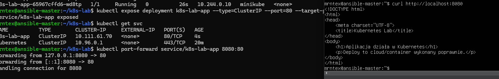
