# Sprawozdanie Zajęcia 11  
## Wdrażanie na zarządzalne kontenery: Kubernetes (2)
Artur Niemiec  


## 1. Cel ćwiczenia

Celem ćwiczenia było przeprowadzenie procesu aktualizacji i kontroli wdrożenia aplikacji kontenerowej w Kubernetesie. W ramach zadania przygotowano kilka wersji obrazu aplikacji, wykonano skalowanie replik, aktualizacje wersji obrazu, celowe wdrożenie wadliwej wersji, rollback oraz porównano strategie wdrożeń: `Recreate`, `RollingUpdate` i prosty wariant `Canary Deployment`.

Wykorzystano lokalny klaster Minikube oraz obrazy kontenerów zbudowane lokalnie wewnątrz środowiska Minikube.

## 2. Stan początkowy klastra

Po uruchomieniu Minikube sprawdzono stan klastra:

```bash
kubectl get nodes
kubectl get pods -A
```

Klaster był uruchomiony poprawnie. Węzeł `minikube` miał status `Ready`, a systemowe komponenty Kubernetesa działały w namespace `kube-system`.

Ponieważ w środowisku użyto aliasu:

```bash
alias kubectl="minikube kubectl --"
```

polecenia `kubectl` były wykonywane przez Minikube.

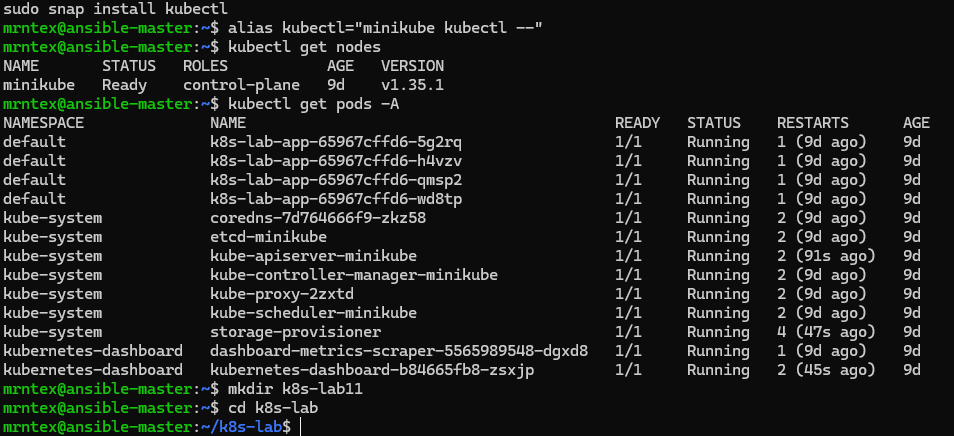

## 3. Przygotowanie obrazów aplikacji

Na potrzeby ćwiczenia przygotowano prostą aplikację HTTP opartą o obraz `httpd:2.4`. Utworzono trzy wersje obrazu:

- `lab11-app:v1` - wersja stabilna,
- `lab11-app:v2` - wersja zaktualizowana,
- `lab11-app:broken` - wersja celowo wadliwa, która kończy działanie błędem.

Obrazy zostały zbudowane lokalnie w Minikube przy użyciu polecenia:

```bash
minikube image build -t lab11-app:<tag> <folder>
```

Po zbudowaniu obrazów sprawdzono ich obecność:

```bash
minikube image ls | grep lab11-app
```

### 3.1. Obraz `v1`

Plik `index.html`:

```html
<h1>Lab 11 App - VERSION v1</h1>
<p>Stable old version</p>
```

Plik `Dockerfile`:

```dockerfile
FROM httpd:2.4
COPY index.html /usr/local/apache2/htdocs/index.html
```

Budowanie obrazu:

```bash
minikube image build -t lab11-app:v1 ./v1
```

### 3.2. Obraz `v2`

Plik `index.html`:

```html
<h1>Lab 11 App - VERSION v2</h1>
<p>New updated version</p>
```

Plik `Dockerfile`:

```dockerfile
FROM httpd:2.4
COPY index.html /usr/local/apache2/htdocs/index.html
```

Budowanie obrazu:

```bash
minikube image build -t lab11-app:v2 ./v2
```

### 3.3. Obraz wadliwy `broken`

Plik `Dockerfile`:

```dockerfile
FROM httpd:2.4
CMD ["sh", "-c", "echo 'This image is intentionally broken'; exit 1"]
```

Budowanie obrazu:

```bash
minikube image build -t lab11-app:broken ./broken
```

Wadliwy obraz został przygotowany po to, aby sprawdzić reakcję Kubernetesa na błędne wdrożenie oraz wykonać rollback.

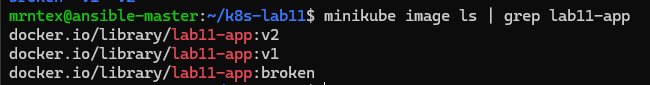

## 4. Główne wdrożenie aplikacji

Przygotowano plik `deployment.yaml` dla głównej aplikacji `lab11-app`.

```yaml
apiVersion: apps/v1
kind: Deployment
metadata:
  name: lab11-app
  labels:
    app: lab11-app
spec:
  replicas: 4
  revisionHistoryLimit: 10
  selector:
    matchLabels:
      app: lab11-app
  strategy:
    type: RollingUpdate
    rollingUpdate:
      maxUnavailable: 2
      maxSurge: 50%
  template:
    metadata:
      labels:
        app: lab11-app
        version: v1
    spec:
      containers:
        - name: lab11-app
          image: lab11-app:v1
          imagePullPolicy: Never
          ports:
            - containerPort: 80
```

Ważnym elementem konfiguracji jest:

```yaml
imagePullPolicy: Never
```

Zostało ono użyte, ponieważ obrazy były budowane lokalnie w Minikube, a nie pobierane z Docker Hub.

Wdrożenie wykonano poleceniem:

```bash
kubectl apply -f manifests/deployment.yaml
kubectl rollout status deployment/lab11-app
kubectl get deployment lab11-app
kubectl get pods -l app=lab11-app --show-labels
```

Po wdrożeniu działały 4 repliki aplikacji.

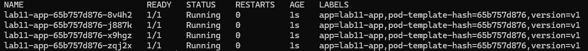


## 5. Service dla aplikacji

Aby umożliwić dostęp do aplikacji przez stabilny punkt wejścia, utworzono Service.

Plik `service.yaml`:

```yaml
apiVersion: v1
kind: Service
metadata:
  name: lab11-app-service
spec:
  selector:
    app: lab11-app
  ports:
    - protocol: TCP
      port: 8080
      targetPort: 80
```

Zastosowanie konfiguracji:

```bash
kubectl apply -f manifests/service.yaml
kubectl get svc lab11-app-service
```

Service wybiera Pody z etykietą:

```yaml
app: lab11-app
```

 

## 6. Test komunikacji z aplikacją

Port został przekierowany poleceniem:

```bash
kubectl port-forward service/lab11-app-service 8080:8080
```

Następnie wykonano test HTTP:

```bash
curl http://localhost:8080
```

Odpowiedź aplikacji:

```html
<h1>Lab 11 App - VERSION v1</h1>
<p>Stable old version</p>
```

Ponieważ Minikube działał wewnątrz maszyny wirtualnej, test komunikacji wykonano z poziomu VM przez `localhost` po użyciu `kubectl port-forward`.

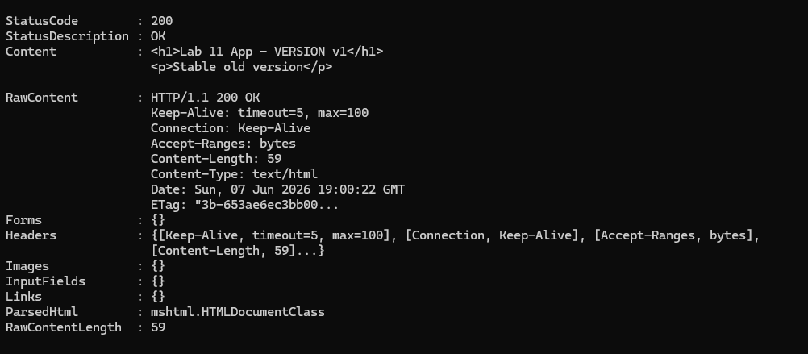

 

## 7. Skalowanie deploymentu

Następnie modyfikowano liczbę replik w pliku `deployment.yaml` i każdorazowo stosowano zmianę przez `kubectl apply`.

 

### 7.1. Skalowanie do 8 replik

Zmieniono:

```yaml
replicas: 8
```

Polecenia:

```bash
kubectl apply -f manifests/deployment.yaml
kubectl rollout status deployment/lab11-app
kubectl get deployment lab11-app
kubectl get pods -l app=lab11-app
```

Po zmianie Kubernetes uruchomił 8 replik aplikacji.

 

### 7.2. Skalowanie do 1 repliki

Zmieniono:

```yaml
replicas: 1
```

Polecenia:

```bash
kubectl apply -f manifests/deployment.yaml
kubectl rollout status deployment/lab11-app
kubectl get deployment lab11-app
kubectl get pods -l app=lab11-app
```

Kubernetes usunął nadmiarowe Pody i pozostawił jedną replikę aplikacji.

 

### 7.3. Skalowanie do 0 replik

Zmieniono:

```yaml
replicas: 0
```

Polecenia:

```bash
kubectl apply -f manifests/deployment.yaml
kubectl get deployment lab11-app
kubectl get pods -l app=lab11-app
```

Po ustawieniu `replicas: 0` aplikacja nie miała aktywnych Podów.

 

### 7.4. Ponowne skalowanie do 4 replik

Zmieniono:

```yaml
replicas: 4
```

Polecenia:

```bash
kubectl apply -f manifests/deployment.yaml
kubectl rollout status deployment/lab11-app
kubectl get deployment lab11-app
kubectl get pods -l app=lab11-app
```

Po ponownym przeskalowaniu Kubernetes uruchomił 4 repliki aplikacji.

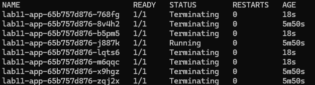

## 8. Aktualizacja wersji obrazu

### 8.1. Aktualizacja z `v1` do `v2`

W pliku `deployment.yaml` zmieniono obraz:

```yaml
image: lab11-app:v2
```

oraz etykietę wersji:

```yaml
version: v2
```

Następnie wykonano:

```bash
kubectl apply -f manifests/deployment.yaml
kubectl rollout status deployment/lab11-app
kubectl get pods -l app=lab11-app --show-labels
```

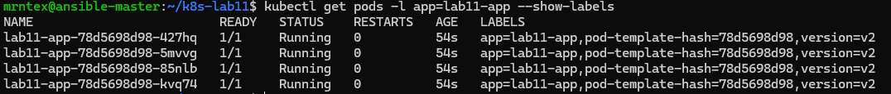


Po zakończeniu rolloutu sprawdzono odpowiedź aplikacji:

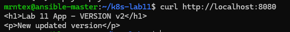

Aktualizacja została wykonana z wykorzystaniem strategii `RollingUpdate`, dzięki czemu Pody były zastępowane stopniowo.


### 8.2. Powrót do starszej wersji obrazu

Następnie w pliku `deployment.yaml` przywrócono:

```yaml
image: lab11-app:v1
```

oraz:

```yaml
version: v1
```

Polecenia:

```bash
kubectl apply -f manifests/deployment.yaml
kubectl rollout status deployment/lab11-app
kubectl get pods -l app=lab11-app --show-labels
```

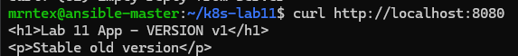

## 9. Wdrożenie wadliwego obrazu

Następnie celowo zastosowano wadliwy obraz:

```yaml
image: lab11-app:broken
```

oraz etykietę:

```yaml
version: broken
```

Polecenia:

```bash
kubectl apply -f manifests/deployment.yaml
kubectl rollout status deployment/lab11-app --timeout=60s
```

Wdrożenie zakonczyło się błedem, ponieważ kontener natychmiast kończył pracę.

Stan Podów sprawdzono poleceniami:

```bash
kubectl get pods -l app=lab11-app
kubectl describe deployment lab11-app
```

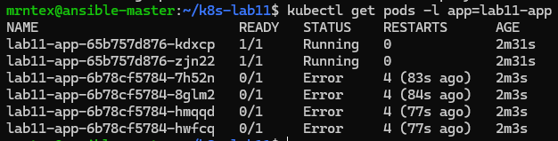

Logi wadliwego Poda:

```bash
kubectl logs <nazwa_poda>
```

W logach widoczny był komunikat:

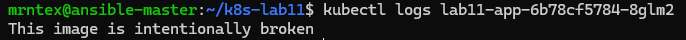

Oznacza to, że Kubernetes próbował uruchomić nową wersję, ale kontener kończył się błędem.

## 10. Historia rolloutów i rollback

Historię wdrożeń sprawdzono poleceniem:

```bash
kubectl rollout history deployment/lab11-app
```

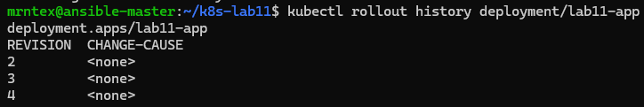

Następnie wykonano rollback do poprzedniej działającej wersji:

```bash
kubectl rollout undo deployment/lab11-app
kubectl rollout status deployment/lab11-app
kubectl get pods -l app=lab11-app --show-labels
```

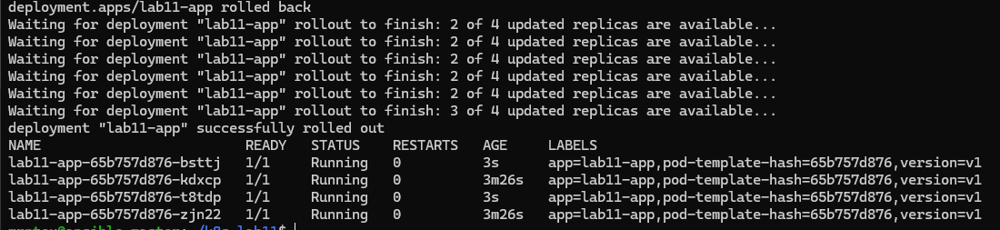

Po rollbacku aplikacja ponownie działała poprawnie.

Test HTTP:

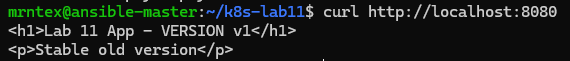

## 11. Skrypt weryfikujący rollout w 60 sekund

Przygotowano skrypt `verify-deploy.sh`, który sprawdza, czy deployment zakończy rollout w czasie 60 sekund.

Ponieważ w środowisku `kubectl` był aliasem do `minikube kubectl --`, w skrypcie zastosowano funkcję `k()`, która opakowuje wywołanie Minikube.

Plik `verify-deploy.sh`:

```bash
#!/bin/bash

DEPLOYMENT_NAME="lab11-app"
TIMEOUT="60s"

k() {
  minikube kubectl -- "$@"
}

echo "Checking rollout status for deployment: $DEPLOYMENT_NAME"

k rollout status deployment/$DEPLOYMENT_NAME --timeout=$TIMEOUT

if [ $? -eq 0 ]; then
  echo "SUCCESS: Deployment finished within $TIMEOUT"
  exit 0
else
  echo "FAILURE: Deployment did not finish within $TIMEOUT"
  echo "Current pods:"
  k get pods -l app=$DEPLOYMENT_NAME
  echo "Deployment details:"
  k describe deployment $DEPLOYMENT_NAME
  exit 1
fi
```

Wynik działania skryptu:

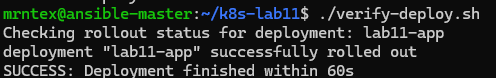

Skrypt zakończył się sukcesem, co oznacza, że poprawna wersja deploymentu została wdrożona w czasie krótszym niż 60 sekund.

## 12. Strategia wdrożenia: Recreate

Strategia `Recreate` polega na usunięciu starych Podów przed utworzeniem nowych. Jest prosta, ale może powodować chwilową niedostępność aplikacji.

Plik `deployment-recreate.yaml`:

```yaml
apiVersion: apps/v1
kind: Deployment
metadata:
  name: lab11-recreate
  labels:
    app: lab11-recreate
spec:
  replicas: 4
  selector:
    matchLabels:
      app: lab11-recreate
  strategy:
    type: Recreate
  template:
    metadata:
      labels:
        app: lab11-recreate
        version: v1
    spec:
      containers:
        - name: lab11-recreate
          image: lab11-app:v1
          imagePullPolicy: Never
          ports:
            - containerPort: 80
```

Service:

```yaml
apiVersion: v1
kind: Service
metadata:
  name: lab11-recreate-service
spec:
  selector:
    app: lab11-recreate
  ports:
    - protocol: TCP
      port: 8082
      targetPort: 80
```

Zastosowanie:

```bash
kubectl apply -f manifests/deployment-recreate.yaml
kubectl apply -f manifests/service-recreate.yaml
kubectl rollout status deployment/lab11-recreate
kubectl get pods -l app=lab11-recreate --show-labels
```

Następnie wykonano aktualizację obrazu z `v1` do `v2`:

```yaml
image: lab11-app:v2
version: v2
```

Obserwacja Podów:

```bash
kubectl get pods -l app=lab11-recreate -w
```

Zaobserwowano, że stare Pody zostały zakończone, a następnie utworzono nowe Pody z wersją `v2`.
`Recreate` jest prostą strategią, ale powoduje przerwę między usunięciem starej wersji a uruchomieniem nowej.

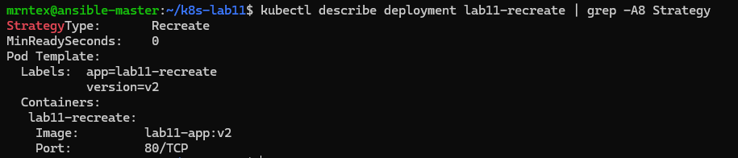

## 13. Strategia wdrożenia: RollingUpdate

Strategia `RollingUpdate` stopniowo zastępuje stare Pody nowymi, ograniczając niedostępność usługi.

Plik `deployment-rolling.yaml`:

```yaml
apiVersion: apps/v1
kind: Deployment
metadata:
  name: lab11-rolling
  labels:
    app: lab11-rolling
spec:
  replicas: 4
  selector:
    matchLabels:
      app: lab11-rolling
  strategy:
    type: RollingUpdate
    rollingUpdate:
      maxUnavailable: 2
      maxSurge: 50%
  template:
    metadata:
      labels:
        app: lab11-rolling
        version: v1
    spec:
      containers:
        - name: lab11-rolling
          image: lab11-app:v1
          imagePullPolicy: Never
          ports:
            - containerPort: 80
```

Service:

```yaml
apiVersion: v1
kind: Service
metadata:
  name: lab11-rolling-service
spec:
  selector:
    app: lab11-rolling
  ports:
    - protocol: TCP
      port: 8083
      targetPort: 80
```

Zastosowanie:

```bash
kubectl apply -f manifests/deployment-rolling.yaml
kubectl apply -f manifests/service-rolling.yaml
kubectl rollout status deployment/lab11-rolling
kubectl get pods -l app=lab11-rolling --show-labels
```

Następnie wykonano aktualizację z `v1` do `v2`:

```yaml
image: lab11-app:v2
version: v2
```

Obserwacja:

```bash
kubectl get pods -l app=lab11-rolling -w
```

Dodatkowo sprawdzono strategię:

```bash
kubectl describe deployment lab11-rolling
```

W konfiguracji użyto:

```yaml
maxUnavailable: 2
maxSurge: 50%
```

Oznacza to, że Kubernetes mógł dopuścić do niedostępności maksymalnie dwóch Podów podczas aktualizacji oraz tymczasowo uruchomić dodatkowe Pody ponad docelową liczbę replik.
`RollingUpdate` pozwala na bardziej płynne wdrożenie niż `Recreate`, ponieważ nie wymaga całkowitego zatrzymania aplikacji przed uruchomieniem nowej wersji.

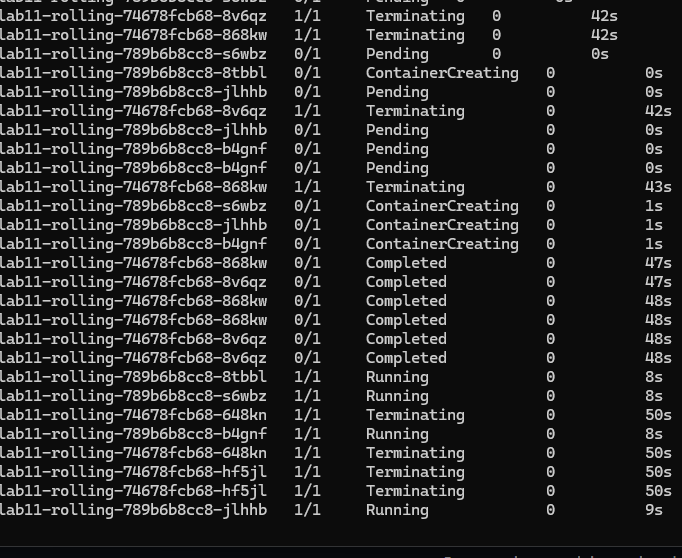

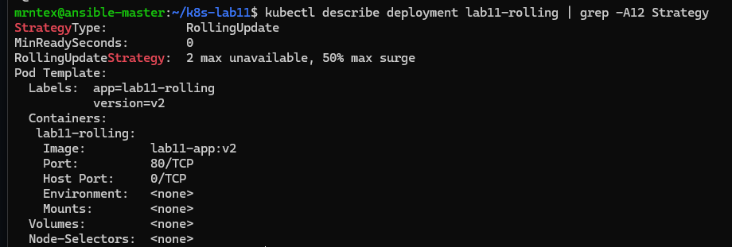

## 14. Canary Deployment

Wariant Canary Deployment zrealizowano przez dwa osobne Deploymenty oraz jeden wspólny Service.

Utworzono:

- `lab11-canary-stable` - wersja stabilna `v1`, 3 repliki,
- `lab11-canary-new` - wersja canary `v2`, 1 replika,
- `lab11-canary-service` - Service kierujący ruch do obu deploymentów.

Oba deploymenty miały wspólną etykietę:

```yaml
app: lab11-canary
```

Dzięki temu jeden Service mógł kierować ruch do Podów obu wersji.


### 14.1. Stable deployment

Plik `canary-stable.yaml`:

```yaml
apiVersion: apps/v1
kind: Deployment
metadata:
  name: lab11-canary-stable
spec:
  replicas: 3
  selector:
    matchLabels:
      app: lab11-canary
      version: stable
  template:
    metadata:
      labels:
        app: lab11-canary
        version: stable
    spec:
      containers:
        - name: lab11-canary-stable
          image: lab11-app:v1
          imagePullPolicy: Never
          ports:
            - containerPort: 80
```

### 14.2. Canary deployment

Plik `canary-new.yaml`:

```yaml
apiVersion: apps/v1
kind: Deployment
metadata:
  name: lab11-canary-new
spec:
  replicas: 1
  selector:
    matchLabels:
      app: lab11-canary
      version: canary
  template:
    metadata:
      labels:
        app: lab11-canary
        version: canary
    spec:
      containers:
        - name: lab11-canary-new
          image: lab11-app:v2
          imagePullPolicy: Never
          ports:
            - containerPort: 80
```


### 14.3. Service dla Canary

Plik `service-canary.yaml`:

```yaml
apiVersion: v1
kind: Service
metadata:
  name: lab11-canary-service
spec:
  selector:
    app: lab11-canary
  ports:
    - protocol: TCP
      port: 8084
      targetPort: 80
```

Zastosowanie:

```bash
kubectl apply -f manifests/canary-stable.yaml
kubectl apply -f manifests/canary-new.yaml
kubectl apply -f manifests/service-canary.yaml

kubectl get deployments | grep canary
kubectl get pods -l app=lab11-canary --show-labels
kubectl get svc lab11-canary-service
```

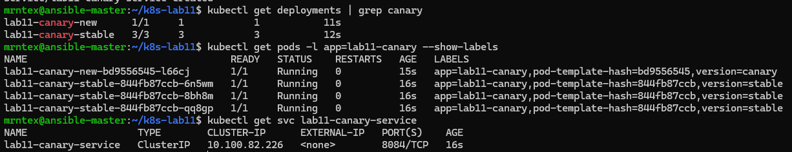

### 14.4. Obserwacja Canary

Początkowo test przez `kubectl port-forward service/lab11-canary-service` zwracał tylko wersję `v1`. Jest to związane z tym, że `port-forward` do Service nie musi zachowywać się jak pełny test równoważenia ruchu po wszystkich endpointach.

Aby zweryfikować Canary poprawniej, można sprawdzić endpointy i etykiety Podów:

```bash
kubectl get endpoints lab11-canary-service -o wide
kubectl get pods -l app=lab11-canary --show-labels
```

Można również przetestować bezpośrednio Pod canary:

```bash
CANARY_POD=$(kubectl get pod -l app=lab11-canary,version=canary -o jsonpath='{.items[0].metadata.name}')
kubectl port-forward pod/$CANARY_POD 8090:80
curl http://localhost:8090
```
Canary Deployment został zrealizowany przez dwa deploymenty z różnymi wersjami aplikacji oraz wspólnym Service wybierającym Pody po etykiecie `app=lab11-canary`. Wersja stabilna miała 3 repliki, a wersja canary 1 replikę.


## 15. Porównanie strategii wdrożenia

| Strategia | Zachowanie | Zalety | Wady |
|---|---|---|---|
| `Recreate` | Usuwa stare Pody, następnie tworzy nowe | Prosta konfiguracja | Możliwa chwilowa niedostępność |
| `RollingUpdate` | Stopniowo zastępuje stare Pody nowymi | Mniejsza niedostępność, kontrola przez `maxUnavailable` i `maxSurge` | Bardziej złożona obserwacja |
| `Canary` | Uruchamia nową wersję tylko jako część workloadu | Pozwala testować nową wersję na części ruchu | Wymaga etykiet, Service i kontroli proporcji replik |
