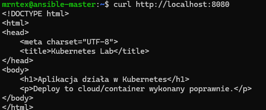
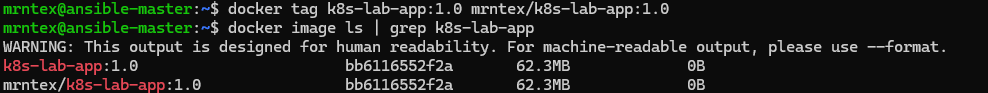
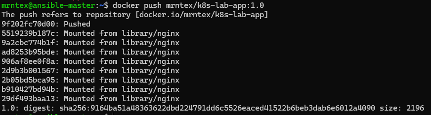
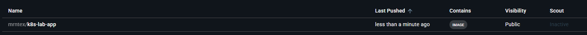
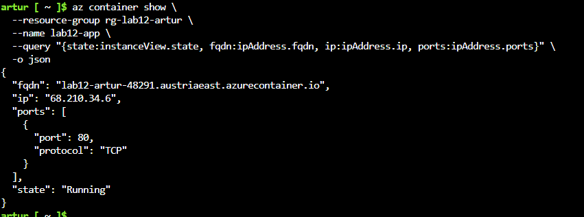
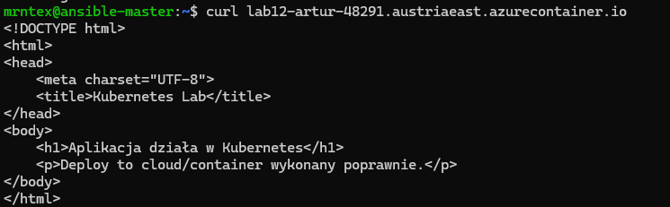
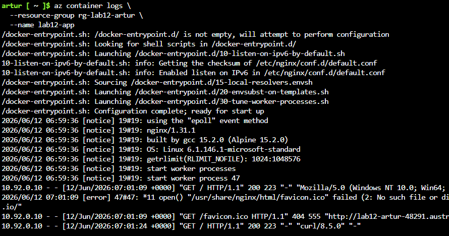
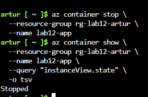
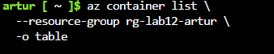
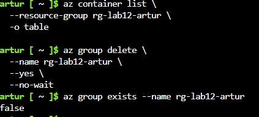

# Sprawozdanie – Zajęcia 12  
## Wdrażanie na zarządzalne kontenery w chmurze Azure

**Autor:** Artur Niemiec  
**Temat:** Wdrożenie własnego kontenera z Docker Hub do Azure Container Instances  
**Obraz Docker Hub:** `mrntex/k8s-lab-app:1.0`  
**Nazwa kontenera w Azure:** `lab12-app`  
**Resource group:** `rg-lab12-artur`  
**Publiczny adres usługi:** `lab12-artur-48291.austriaeast.azurecontainer.io`  
**Port:** `80`

---

## 1. Przygotowanie i lokalna weryfikacja kontenera

Do wdrożenia użyto obrazu `k8s-lab-app:1.0`. Przed publikacją sprawdzono lokalnie, czy kontener poprawnie serwuje stronę HTTP. Kontener został uruchomiony lokalnie z mapowaniem portów, a następnie przetestowany za pomocą `curl`.

```bash
curl http://localhost:8080
```

W odpowiedzi zwrócona została strona HTML aplikacji, co potwierdza poprawne działanie usługi HTTP.



---

## 2. Otagowanie obrazu pod Docker Hub

Lokalny obraz został otagowany nazwą zgodną z repozytorium Docker Hub:

```bash
docker tag k8s-lab-app:1.0 mrntex/k8s-lab-app:1.0
```

Następnie sprawdzono listę obrazów:

```bash
docker image ls | grep k8s-lab-app
```

Widoczne były dwa tagi wskazujące na ten sam obraz: lokalny `k8s-lab-app:1.0` oraz `mrntex/k8s-lab-app:1.0`.



---

## 3. Publikacja obrazu na Docker Hub

Obraz został wypchnięty do Docker Hub poleceniem:

```bash
docker push mrntex/k8s-lab-app:1.0
```

Push zakończył się poprawnie, a Docker zwrócił digest obrazu.



Po publikacji sprawdzono repozytorium w Docker Hub. Obraz `mrntex/k8s-lab-app` był widoczny jako publiczny.



---

## 4. Utworzenie zasobów w Azure i wdrożenie kontenera

W Azure utworzono resource group:

```bash
az group create   --name rg-lab12-artur   --location austriaeast
```

Następnie wdrożono kontener z publicznego obrazu Docker Hub do Azure Container Instances:

```bash
az container create   --resource-group rg-lab12-artur   --location austriaeast   --name lab12-app   --image mrntex/k8s-lab-app:1.0   --dns-name-label lab12-artur-48291   --ports 80   --ip-address Public   --os-type Linux   --cpu 1   --memory 1
```

Po wdrożeniu sprawdzono stan kontenera:

```bash
az container show   --resource-group rg-lab12-artur   --name lab12-app   --query "{state:instanceView.state, fqdn:ipAddress.fqdn, ip:ipAddress.ip, ports:ipAddress.ports}"   -o json
```

Kontener znajdował się w stanie `Running`. Azure przydzielił publiczny adres IP oraz nazwę DNS:

```text
lab12-artur-48291.austriaeast.azurecontainer.io
```



---

## 5. Test dostępu HTTP do usługi w Azure

Dostęp do aplikacji sprawdzono za pomocą polecenia:

```bash
curl lab12-artur-48291.austriaeast.azurecontainer.io
```

Aplikacja zwróciła poprawną stronę HTML, co potwierdza, że kontener działa w Azure i serwuje usługę HTTP publicznie.



---

## 6. Pobranie logów kontenera

Logi kontenera pobrano poleceniem:

```bash
az container logs   --resource-group rg-lab12-artur   --name lab12-app
```

Logi wskazują, że serwer nginx uruchomił się poprawnie i obsłużył zapytania HTTP, m.in. `GET / HTTP/1.1` ze statusem `200`.



---

## 7. Zatrzymanie kontenera

Kontener zatrzymano poleceniem:

```bash
az container stop   --resource-group rg-lab12-artur   --name lab12-app
```

Następnie sprawdzono jego stan:

```bash
az container show   --resource-group rg-lab12-artur   --name lab12-app   --query "instanceView.state"   -o tsv
```

Stan kontenera został zmieniony na `Stopped`.



---

## 8. Usunięcie kontenera

Po zakończeniu testów kontener został usunięty z resource group:

```bash
az container delete   --resource-group rg-lab12-artur   --name lab12-app   --yes
```

Następnie sprawdzono listę kontenerów w grupie zasobów:

```bash
az container list   --resource-group rg-lab12-artur   -o table
```

Brak wpisów na liście potwierdza usunięcie kontenera.



---

## 9. Usunięcie resource group

Na końcu usunięto całą resource group, aby nie pozostawić aktywnych zasobów w Azure:

```bash
az group delete   --name rg-lab12-artur   --yes   --no-wait
```

Poprawność usunięcia sprawdzono poleceniem:

```bash
az group exists --name rg-lab12-artur
```

Polecenie zwróciło:

```text
false
```

co oznacza, że resource group została usunięta.



---

## 10. Wnioski

W ramach ćwiczenia przygotowano i zweryfikowano lokalnie kontener z aplikacją HTTP, opublikowano obraz w Docker Hub, a następnie wdrożono go w Azure Container Instances. Po wdrożeniu potwierdzono stan `Running`, sprawdzono publiczny dostęp HTTP do aplikacji oraz pobrano logi działania kontenera.

Po zakończeniu ćwiczenia kontener został zatrzymany i usunięty, a następnie usunięto całą resource group `rg-lab12-artur`, aby nie generować dalszych kosztów w Azure.
